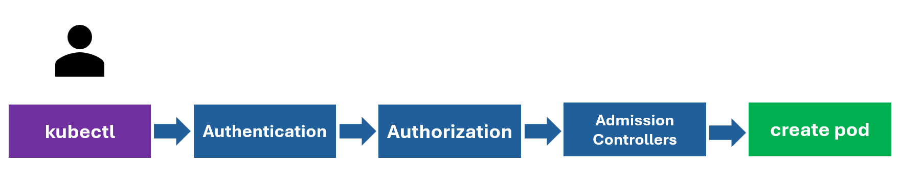

## Security: Authentication, Authorization and Admission Control

1.  Authentication - KubeConfig
    **OLD!!!**
    Setup basic authentication on Kubernetes (Deprecated in 1.19)
    Create a file with user details locally at /tmp/users/user-details.csv
        
        # User File Contents
        password123,user1,u0001
        password123,user2,u0002
        password123,user3,u0003
        password123,user4,u0004
        password123,user5,u0005
    
    Edit the kube-apiserver static pod configured by kubeadm to pass in the user details. The file is located at

        apiVersion: v1
        kind: Pod
        metadata:
        name: kube-apiserver
        namespace: kube-system
        spec:
        containers:
        - command:
            - kube-apiserver
            <content-hidden>
            image: k8s.gcr.io/kube-apiserver-amd64:v1.11.3
            name: kube-apiserver
            volumeMounts:
            - mountPath: /tmp/users
            name: usr-details
            readOnly: true
        volumes:
        - hostPath:
            path: /tmp/users
            type: DirectoryOrCreate
            name: usr-details

    
    Modify the kube-apiserver startup options to include the basic-auth file

        apiVersion: v1
        kind: Pod
        metadata:
        creationTimestamp: null
        name: kube-apiserver
        namespace: kube-system
        spec:
        containers:
        - command:
            - kube-apiserver
            - --authorization-mode=Node,RBAC
            <content-hidden>
            - --basic-auth-file=/tmp/users/user-details.csv
    
    Create the necessary roles and role bindings for these users:

        ---
        kind: Role
        apiVersion: rbac.authorization.k8s.io/v1
        metadata:
        namespace: default
        name: pod-reader
        rules:
        - apiGroups: [""] # "" indicates the core API group
        resources: ["pods"]
        verbs: ["get", "watch", "list"]
        
        ---
        # This role binding allows "jane" to read pods in the "default" namespace.
        kind: RoleBinding
        apiVersion: rbac.authorization.k8s.io/v1
        metadata:
        name: read-pods
        namespace: default
        subjects:
        - kind: User
        name: user1 # Name is case sensitive
        apiGroup: rbac.authorization.k8s.io
        roleRef:
        kind: Role #this must be Role or ClusterRole
        name: pod-reader # this must match the name of the Role or ClusterRole you wish to bind to
        apiGroup: rbac.authorization.k8s.io

    Once created, you may authenticate into the kube-api server using the users credentials

        curl -v -k https://localhost:6443/api/v1/pods -u "user1:password123"
    

    **Note**:
    How to generate certificates for different Kubernetes components and for a user and use them in the Kubernetes cluster is not in the scope of the official CKAD exam.
    These are part of the official CKA exam.


    
    **NEW/RECOMMENDED!!**
    KubeConfig:
        
        (補充)

        apiVersion: v1
        kind: Config

        clusters:
        - name: production
        cluster:
            certificate-authority: /etc/kubernetes/pki/ca.crt # paste the certificate file path 
            certificate-authority-data: LS0tLS1CRUd..............
                        SUB54lfaleDlie93keVe.....................
                        ......................................... # paste the certificate data directly using "certificate-authority-data" field
                        .........................................
                        .............
        

        To decode the file certificate data:

        echo "Ls0......" | base64 --decode


    1)  Where is the default kubeconfig file located in the current environment?
        Find the current home directory by looking at the HOME environment variable.
            option1: /root/kubeconfig
            option2: /root/.kube/config

        Hint: Use the command ls -a and look for the kube config file under /root/.kube.

        controlplane ~ ✖ ls -a .kube/
        .  ..  cache  config

        controlplane ~ ➜  ls -a .kube/config 
        .kube/config


        Answer: option2 /root/.kube/config


        How many clusters are defined in the default kubeconfig file?

            k config view

        controlplane ~ ➜  k config view 
        apiVersion: v1
        clusters:
        - **cluster**:
            certificate-authority-data: DATA+OMITTED
            server: https://controlplane:6443
        name: kubernetes
        contexts:
        - context:
            cluster: kubernetes
            user: kubernetes-admin
        name: kubernetes-admin@kubernetes
        current-context: kubernetes-admin@kubernetes
        kind: Config
        preferences: {}
        users:
        - name: kubernetes-admin
        user:
            client-certificate-data: DATA+OMITTED
            client-key-data: DATA+OMITTED

        Answer: 1 cluster


        How many Users are defined in the default kubeconfig file?
        Carry On:
        
            users:
            - name: kubernetes-admin
            user:
                client-certificate-data: DATA+OMITTED
                client-key-data: DATA+OMITTED


        Answer: 1 user


        How many contexts are defined in the default kubeconfig file?
        Carry On:

            contexts:
            - context:
                cluster: kubernetes
                user: kubernetes-admin
            name: kubernetes-admin@kubernetes


        Answer: 1 context


        What is the user configured in the current context?
        Carry On:

            current-context: kubernetes-admin@kubernetes
        
        Answer: kubernetes-admin


        What is the name of the cluster configured in the default kubeconfig file?
        Carry On:
        
            clusters:
            - cluster:
                certificate-authority-data: DATA+OMITTED
                server: https://controlplane:6443
            name: kubernetes

        Answer: kubernetes

    2)  A new kubeconfig file named my-kube-config is created. It is placed in the /root directory. How many clusters are defined in that kubeconfig file? 
        
        controlplane ~ ✖ ls -a 
        .bash_profile   .cache/         .config/        my-kube-config  sample.yaml     .terminal_logs/ .vimrc
        .bashrc         CKA/            .kube/          .profile        .ssh/           .vim/           .wget-hsts

        controlplane ~ ✖ ls -a my-kube-config 
        my-kube-config

        controlplane ~ ➜  cat my-kube-config 
        
            apiVersion: v1
            kind: Config

            clusters:
            - name: production
            cluster:
                certificate-authority: /etc/kubernetes/pki/ca.crt
                server: https://controlplane:6443

            - name: development
            cluster:
                certificate-authority: /etc/kubernetes/pki/ca.crt
                server: https://controlplane:6443

            - name: kubernetes-on-aws
            cluster:
                certificate-authority: /etc/kubernetes/pki/ca.crt
                server: https://controlplane:6443

            - name: test-cluster-1
            cluster:
                certificate-authority: /etc/kubernetes/pki/ca.crt
                server: https://controlplane:6443

            contexts:
            - name: test-user@development
            context:
                cluster: development
                user: test-user

            - name: aws-user@kubernetes-on-aws
            context:
                cluster: kubernetes-on-aws
                user: aws-user

            - name: test-user@production
            context:
                cluster: production
                user: test-user

            - name: research
            context:
                cluster: test-cluster-1
                user: dev-user

            users:
            - name: test-user
            user:
                client-certificate: /etc/kubernetes/pki/users/test-user/test-user.crt
                client-key: /etc/kubernetes/pki/users/test-user/test-user.key
            - name: dev-user
            user:
                client-certificate: /etc/kubernetes/pki/users/dev-user/developer-user.crt
                client-key: /etc/kubernetes/pki/users/dev-user/dev-user.key
            - name: aws-user
            user:
                client-certificate: /etc/kubernetes/pki/users/aws-user/aws-user.crt
                client-key: /etc/kubernetes/pki/users/aws-user/aws-user.key

            current-context: test-user@development
            preferences: {}


        Answer: 4 clusters

        How many contexts are configured in the my-kube-config file?
        Answer: 4 contexts


        What user is configured in the research context?
              - name: research
              context:
                  cluster: test-cluster-1
                  user: dev-user
        
        Answer: dev-user


        What is the current context set to in the my-kube-config file?

        Carry On,

            ...
            current-context: test-user@development
            preferences: {}


        Answer: test-user@development


    3)  I would like to use the dev-user to access test-cluster-1. Set the current context to the right one so I can do that.
        Once the right context is identified, use the kubectl config use-context command.

        Hint: 
        To use that context, run the command: 
            
            kubectl config --kubeconfig=/root/my-kube-config use-context research
        
        To know the current context, run the command: 
            
            kubectl config --kubeconfig=/root/my-kube-config current-context

        controlplane ~ ➜  cat my-kube-config 
        
            apiVersion: v1
            kind: Config

            clusters:
            - name: production
            cluster:
                certificate-authority: /etc/kubernetes/pki/ca.crt
                server: https://controlplane:6443

            - name: development
            cluster:
                certificate-authority: /etc/kubernetes/pki/ca.crt
                server: https://controlplane:6443

            - name: kubernetes-on-aws
            cluster:
                certificate-authority: /etc/kubernetes/pki/ca.crt
                server: https://controlplane:6443

            - name: test-cluster-1
            cluster:
                certificate-authority: /etc/kubernetes/pki/ca.crt
                server: https://controlplane:6443

            contexts:
            - name: test-user@development
            context:
                cluster: development
                user: test-user

            - name: aws-user@kubernetes-on-aws
            context:
                cluster: kubernetes-on-aws
                user: aws-user

            - name: test-user@production
            context:
                cluster: production
                user: test-user

            - name: research
            context:
                cluster: test-cluster-1 (使用research context 來訪問test-cluster-1 cluster)
                user: dev-user

            users:
            - name: test-user
            user:
                client-certificate: /etc/kubernetes/pki/users/test-user/test-user.crt
                client-key: /etc/kubernetes/pki/users/test-user/test-user.key
            - name: dev-user
            user:
                client-certificate: /etc/kubernetes/pki/users/dev-user/developer-user.crt
                client-key: /etc/kubernetes/pki/users/dev-user/dev-user.key
            - name: aws-user
            user:
                client-certificate: /etc/kubernetes/pki/users/aws-user/aws-user.crt
                client-key: /etc/kubernetes/pki/users/aws-user/aws-user.key

            current-context: test-user@development
            preferences: {}


        controlplane ~ ➜  k config --
        --as-group                  (Group to impersonate for the operation, this flag can be repeated to specify multiple…)
        --as-uid                    (UID to impersonate for the operation.)
        --as                        (Username to impersonate for the operation. User could be a regular user or a service …)
        --cache-dir                 (Default cache directory)
        --certificate-authority     (Path to a cert file for the certificate authority)
        --client-certificate        (Path to a client certificate file for TLS)
        --client-key                (Path to a client key file for TLS)
        --cluster                   (The name of the kubeconfig cluster to use)
        --context                   (The name of the kubeconfig context to use)
        --disable-compression       (If true, opt-out of response compression for all requests to the server)
        --help                      (help for config)
        --insecure-skip-tls-verify  (If true, the server's certificate will not be checked for validity. This will make yo…)
        --kubeconfig                (use a particular kubeconfig file)
        --log-flush-frequency       (Maximum number of seconds between log flushes)
        --match-server-version      (Require server version to match client version)
        --namespace                 (If present, the namespace scope for this CLI request)
        --password                  (Password for basic authentication to the API server)
        --profile                   (Name of profile to capture. One of (none|cpu|heap|goroutine|threadcreate|block|mutex))
        --profile-output            (Name of the file to write the profile to)
        --request-timeout           (The length of time to wait before giving up on a single server request. Non-zero valu…)
        --server                    (The address and port of the Kubernetes API server)
        --tls-server-name           (Server name to use for server certificate validation. If it is not provided, the host…)
        --token                     (Bearer token for authentication to the API server)
        --username                  (Username for basic authentication to the API server)
        --user                      (The name of the kubeconfig user to use)
        --vmodule                   (comma-separated list of pattern=N settings for file-filtered logging (only works for …)
        --v                         (number for the log level verbosity)
        --warnings-as-errors        (Treat warnings received from the server as errors and exit with a non-zero exit code)

        controlplane ~ ➜  k config --kubeconfig -h
        Modify kubeconfig files using subcommands like "kubectl config set current-context my-context".

        The loading order follows these rules:

        1.  If the --kubeconfig flag is set, then only that file is loaded. The flag may only be set once
        and no merging takes place.
        2.  If $KUBECONFIG environment variable is set, then it is used as a list of paths (normal path
        delimiting rules for your system). These paths are merged. When a value is modified, it is modified
        in the file that defines the stanza. When a value is created, it is created in the first file that
        exists. If no files in the chain exist, then it creates the last file in the list.
        3.  Otherwise, ${HOME}/.kube/config is used and no merging takes place.

        Available Commands:
        current-context   Display the current-context
        delete-cluster    Delete the specified cluster from the kubeconfig
        delete-context    Delete the specified context from the kubeconfig
        delete-user       Delete the specified user from the kubeconfig
        get-clusters      Display clusters defined in the kubeconfig
        get-contexts      Describe one or many contexts
        get-users         Display users defined in the kubeconfig
        rename-context    Rename a context from the kubeconfig file
        set               Set an individual value in a kubeconfig file
        set-cluster       Set a cluster entry in kubeconfig
        set-context       Set a context entry in kubeconfig
        set-credentials   Set a user entry in kubeconfig
        unset             Unset an individual value in a kubeconfig file
        use-context       Set the current-context in a kubeconfig file
        view              Display merged kubeconfig settings or a specified kubeconfig file

        Usage:
        kubectl config SUBCOMMAND [options]

        Use "kubectl config <command> --help" for more information about a given command.
        Use "kubectl options" for a list of global command-line options (applies to all commands).

        controlplane ~ ✖ k config --kubeconfig=/root/my-kube-config  current-context 
        test-user@development


        已知:
        - name: research
            context:
                cluster: test-cluster-1 (使用research context 來訪問test-cluster-1 cluster)
                user: dev-user


        故 k config --kubeconfig=/root/my-kube-config 指令應設置context為research context:


            k config --kubeconfig=/root/my-kube-config use-context research

        controlplane ~ ➜  k config --kubeconfig=/root/my-kube-config  use-context research
        Switched to context "research".

        controlplane ~ ➜  k config --kubeconfig=/root/my-kube-config  current-context 
        research


        set-context vs. use-context:

        set-context（設定一個 context）
            作用：用於創建或修改 Kubernetes context，context 是用來組合 cluster（叢集）、user（用戶）和 namespace（命名空間） 的配置。
            命令格式：
                kubectl config set-context <context-name> --cluster=<cluster-name> --user=<user-name> --namespace=<namespace>
            範例：
                kubectl config set-context my-context --cluster=my-cluster --user=my-user --namespace=development
        這個命令會創建（或更新）一個名為 my-context 的 context，它關聯了 my-cluster 這個 Kubernetes 叢集、my-user 這個使用者，以及 development 這個命名空間。
        
        use-context（切換到某個 context）
            作用：用於切換當前 context，即決定當前 kubectl 命令作用在哪個 Kubernetes 叢集、使用哪個用戶、預設命名空間是什麼。
            命令格式：
                kubectl config use-context <context-name>
            範例：
                kubectl config use-context my-context
        這個命令會讓 kubectl 之後執行的命令都以 my-context 的設定運行（即連接到 my-cluster，使用 my-user，並預設 namespace 為 development）。
        
        總結        
            指令	                               作用	                                                  影響範圍
            set-context	       設定或修改一個 context（組合 cluster、user、namespace）	          不影響當前使用的 context，只是定義或修改
            use-context	       切換當前 kubectl 使用的 context	                                 影響 kubectl 之後的操作
        
        所以，set-context 是創建或修改一個 context，而 use-context 是切換到某個已存在的 context。


    4)  We don't want to specify the kubeconfig file option on each kubectl command.
        Set the my-kube-config file as the default kubeconfig file and make it persistent across all sessions without overwriting the existing ~/.kube/config. Ensure any configuration changes persist across reboots and new shell sessions.
        Note: Don't forget to source the configuration file to take effect in the existing session. Example:

            source ~/.bashrc

        Solution:

        Add the my-kube-config file to the KUBECONFIG environment variable.

        i. Open your shell configuration file:
        
            vi ~/.bashrc
        
        ii. Add the following line to export the variable:

                export KUBECONFIG=/root/my-kube-config

        iii. Apply the Changes: Reload the shell configuration to apply the changes in the current session:

            source ~/.bashrc


        controlplane ~ ➜  vim ~/
        .bash_profile   .cache/         .config/        my-kube-config  sample.yaml     .terminal_logs/ .vimrc
        .bashrc         CKA/            .kube/          .profile        .ssh/           .vim/           .wget-hsts

        controlplane ~ ➜  vim ~/.bashrc        
            ...

            export KUBECONFIG=/root/my-kube-config  (將export 放置文件尾端，source 指令之前)

            eval "$(starship init bash)"
            cd /root
            source /etc/profile.d/bash_completion.sh
            source <(kubectl completion bash)
            alias k=kubectl
            complete -F __start_kubectl k

        controlplane ~ ➜  source ~/.bashrc

        a. 環境變數的持久性
        ```bash
        export KUBECONFIG=/root/my-kube-config
        ```
        - **這條命令將 `KUBECONFIG` 環境變數設置為 `/root/my-kube-config`**，使 `kubectl` 預設讀取這個文件。
        - **因為這行被寫入 `~/.bashrc`，所以每次打開新的 shell，這個變數都會被自動加載**，確保配置的持久性（persistent across all sessions）。
        - **`source ~/.bashrc` 只是讓當前 shell 立即生效**，新開的 shell 會自動生效，不需要再手動執行。

        b. 為何不會覆蓋 `~/.kube/config`？
        - **KUBECONFIG 變數只是改變 `kubectl` 預設讀取的配置文件，不會影響 `~/.kube/config` 本身。**
        - `~/.kube/config` 仍然存在，只是 `kubectl` 不會再預設讀取它，除非 `KUBECONFIG` 變數沒有被設置或被修改。

        ✅ **舉例**
        ```bash
        echo $KUBECONFIG
        ```
        輸出：
        ```
        /root/my-kube-config
        ```
        表示 `kubectl` 只會讀取 `/root/my-kube-config`，而不會影響 `~/.kube/config`。

        如果想要讓 `kubectl` 同時讀取 **多個 kubeconfig 文件**，可以這樣做：
        ```bash
        export KUBECONFIG=/root/my-kube-config:~/.kube/config
        ```
        這樣 `kubectl` 會合併兩個文件的配置，而不影響 `~/.kube/config` 的內容。


        c. 讓配置在整個系統（所有用戶）內部生效的方法**
        - `~/.bashrc` 只適用於當前用戶，其他用戶不會受影響。
        - 如果想讓 **所有用戶** 都能使用這個 `KUBECONFIG`，可以修改 `/etc/profile`：
        ```bash
        echo 'export KUBECONFIG=/root/my-kube-config' >> /etc/profile
        source /etc/profile
        ```
        這樣 **所有用戶在登錄時都會自動獲取這個環境變數**。

        這樣就實現了 **"persistent across all sessions without overwriting the existing ~/.kube/config"**

    5)  With the current-context set to research, we are trying to access the cluster. However something seems to be wrong. Identify and fix the issue.
        Try running the kubectl get pods command and look for the error. All users certificates are stored at /etc/kubernetes/pki/users.

        controlplane ~ ➜  k get pods
        error: unable to read client-cert /etc/kubernetes/pki/users/dev-user/developer-user.crt for dev-user due to open /etc/kubernetes/pki/users/dev-user/developer-user.crt: no such file or directory

        controlplane ~ ✖ k config view
        apiVersion: v1
        clusters:
        - cluster:
            certificate-authority: /etc/kubernetes/pki/ca.crt
            server: https://controlplane:6443
        name: development
        - cluster:
            certificate-authority: /etc/kubernetes/pki/ca.crt
            server: https://controlplane:6443
        name: kubernetes-on-aws
        - cluster:
            certificate-authority: /etc/kubernetes/pki/ca.crt
            server: https://controlplane:6443
        name: production
        - cluster:
            certificate-authority: /etc/kubernetes/pki/ca.crt
            server: https://controlplane:6443
        name: test-cluster-1
        contexts:
        - context:
            cluster: kubernetes-on-aws
            user: aws-user
        name: aws-user@kubernetes-on-aws
        - context:
            cluster: test-cluster-1
            user: **dev-user**
        name: research
        - context:
            cluster: development
            user: test-user
        name: test-user@development
        - context:
            cluster: production
            user: test-user
        name: test-user@production
        current-context: research
        kind: Config
        preferences: {}
        users:
        - name: aws-user
        user:
            client-certificate: /etc/kubernetes/pki/users/aws-user/aws-user.crt
            client-key: /etc/kubernetes/pki/users/aws-user/aws-user.key
        - name: **dev-user**
        user:
            client-certificate: /etc/kubernetes/pki/users/dev-user/developer-user.crt (需檢查路徑是否正確)
            client-key: /etc/kubernetes/pki/users/dev-user/dev-user.key
        - name: test-user
        user:
            client-certificate: /etc/kubernetes/pki/users/test-user/test-user.crt
            client-key: /etc/kubernetes/pki/users/test-user/test-user.key


        Hint: The path to certificate is incorrect in the kubeconfig file. Correct the certificate name which is available at /etc/kubernetes/pki/users/.

        controlplane ~ ➜  cat /etc/kubernetes/pki/users/dev-user/dev-user.
        dev-user.crt  dev-user.csr  dev-user.key  

        文件名為: dev-user.crt

        故將: developer-user.crt 改為: dev-user.crt


        controlplane ~ ➜  vim 
        .bash_profile   CKA/            my-kube-config  .ssh/           .viminfo        
        .bashrc         .config/        .profile        .terminal_logs/ .vimrc          
        .cache/         .kube/          sample.yaml     .vim/           .wget-hsts      

        controlplane ~ ➜  vim my-kube-config 
            
            ...
            users:
            - name: aws-user
            user:
                client-certificate: /etc/kubernetes/pki/users/aws-user/aws-user.crt
                client-key: /etc/kubernetes/pki/users/aws-user/aws-user.key
            - name: dev-user
            user:
                client-certificate: /etc/kubernetes/pki/users/dev-user/dev-user.crt
                client-key: /etc/kubernetes/pki/users/dev-user/dev-user.key
            - name: test-user
            user:
                client-certificate: /etc/kubernetes/pki/users/test-user/test-user.crt
                client-key: /etc/kubernetes/pki/users/test-user/test-user.key

        重新運行k get pod, 便沒有再看到error訊息:
        
        controlplane ~ ➜  k get pod
        No resources found in default namespace.
        


2.  Authroization: Role Based Access Controls (RBAC) and Cluster Roles 

    - 4 Types of Authorization Mechanisms:
      - Node (Node Authorization): 專門用於 Kubernetes 節點（Node） 之間的授權機制，允許節點（kubelet）對某些 API 資源執行操作，例如讀取 pod 資訊、綁定 pod 到自己等。
      - ABAC (Attribute-Based Access Control): 基於使用者的屬性來決定是否允許操作，類似傳統的存取控制列表（ACL）
      - RBAC (Role Base Access Control): 透過 角色（Role） 和 角色綁定（RoleBinding） 來授權存取權限，是 Kubernetes 預設推薦的授權機制。
      - Webhook: 允許 Kubernetes 向外部 HTTP 伺服器發送請求，透過 自訂的 Webhook API 來決定授權。

    create a Role object to define the apiGroup rules, then create a RoleBinding object to bind the user to the role.
    
    use k get role, k get rolebinding command to check the authorization.

    use k auth can-i command to check whether you(the user) can create or delete resources

        k auth can-i create deployments
        yes

        k auth can-i delete nodes
        no

    as an administrator, you can also use k auth can-i command to verify whether a user can access the resources

        k auth can-i create deployments --as dev-user
        no 

        k auth can-i create pods --as dev-user
        yes

    and also test a user in a specified namespace:

        k auth can-i create pods --as dev-user --namespace test
    
    see more on: 
    https://kubernetes.io/docs/reference/kubectl/generated/kubectl_auth/kubectl_auth_can-i/
    https://kubernetes.io/docs/reference/access-authn-authz/authorization/


    1)  Inspect the environment and identify the authorization modes configured on the cluster.
        Check the kube-apiserver settings.

        Hint: Use the command kubectl describe pod kube-apiserver-controlplane -n kube-system and look for --authorization-mode.

        controlplane ~ ➜  k describe pod kube-apiserver-controlplane -n kube-system
        Name:                 kube-apiserver-controlplane
        Namespace:            kube-system
        Priority:             2000001000
        ...
        Containers:
        kube-apiserver:
            Container ID:  containerd://b97eca5b5f285c31196a9756ba3e55919598d8cd547b7d28ac4cb9acc3c2cd79
            Image:         registry.k8s.io/kube-apiserver:v1.31.0
            Image ID:      registry.k8s.io/kube-apiserver@sha256:470179274deb9dc3a81df55cfc24823ce153147d4ebf2ed649a4f271f51eaddf
            Port:          <none>
            Host Port:     <none>
            Command:
            kube-apiserver
            --advertise-address=192.168.28.26
            --allow-privileged=true
            **--authorization-mode=Node,RBAC**
            --client-ca-file=/etc/kubernetes/pki/ca.crt
            --enable-admission-plugins=NodeRestriction
            --enable-bootstrap-token-auth=true
            --etcd-cafile=/etc/kubernetes/pki/etcd/ca.crt
            --etcd-certfile=/etc/kubernetes/pki/apiserver-etcd-client.crt
            --etcd-keyfile=/etc/kubernetes/pki/apiserver-etcd-client.key
            ...

        controlplane ~ ✖ k describe pod kube-apiserver-controlplane -n kube-system | grep -i  "authorization"
      --authorization-mode=Node,RBAC

        Answer: Node & RBAC

        
        
        How many roles exist in the default namespace?

        controlplane ~ ➜  k get role
        No resources found in default namespace.

        Answer: 0


        How many roles exist in all namespaces together?

        controlplane ~ ➜  k get role -A
        NAMESPACE     NAME                                             CREATED AT
        blue          developer                                        2025-01-30T16:38:45Z
        kube-public   kubeadm:bootstrap-signer-clusterinfo             2025-01-30T16:38:16Z
        kube-public   system:controller:bootstrap-signer               2025-01-30T16:38:16Z
        kube-system   extension-apiserver-authentication-reader        2025-01-30T16:38:16Z
        kube-system   kube-proxy                                       2025-01-30T16:38:17Z
        kube-system   kubeadm:kubelet-config                           2025-01-30T16:38:16Z
        kube-system   kubeadm:nodes-kubeadm-config                     2025-01-30T16:38:16Z
        kube-system   system::leader-locking-kube-controller-manager   2025-01-30T16:38:16Z
        kube-system   system::leader-locking-kube-scheduler            2025-01-30T16:38:16Z
        kube-system   system:controller:bootstrap-signer               2025-01-30T16:38:16Z
        kube-system   system:controller:cloud-provider                 2025-01-30T16:38:16Z
        kube-system   system:controller:token-cleaner                  2025-01-30T16:38:16Z

        Answer: 12 roles


    2)  What are the resources the kube-proxy role in the kube-system namespace is given access to?

        controlplane ~ ➜  k get role kube-proxy -n kube-system
        NAME         CREATED AT
        kube-proxy   2025-01-30T16:38:17Z

        controlplane ~ ➜  k describe role kube-proxy -n kube-system
        Name:         kube-proxy
        Labels:       <none>
        Annotations:  <none>
        PolicyRule:
        Resources   Non-Resource URLs  Resource Names  Verbs
        ---------   -----------------  --------------  -----
        **configmaps**  []                 [kube-proxy]    [get]


        Answer: configmaps

        
        What actions can the kube-proxy role perform on configmaps?
        Answer: Get


        Which of the following statements are true?
            option1: kube-proxy role can get details of all configmap objects in the default namespce
            option2: kube-proxy role can get details of all configmap objects in the cluster
            option3: kube-proxy role can get details of configmap objects by the name kube-proxy only
            option4: kube-proxy role can view and update configmap object by the name kube-proxy


        Answer: option3 kube-proxy role can get details of configmap objects by the name kube-proxy only


        Which account is the kube-proxy role assigned to?

        Hint: Run the command: kubectl describe rolebinding kube-proxy -n kube-system

        controlplane ~ ➜  k describe rolebindings -n kube-system kube-proxy 
        Name:         kube-proxy
        Labels:       <none>
        Annotations:  <none>
        Role:
        Kind:  Role
        Name:  kube-proxy
        **Subjects**: (subjects 欄位 定義了哪些「User、Group) 或ServiceAccount」擁有這個角色的權限)
        Kind   Name                                             Namespace
        ----   ----                                             ---------
        Group  **system:bootstrappers:kubeadm:default-node-token** 

        kube-proxy 這個 RoleBinding，將 "kube-proxy" 這個角色（Role） 綁定給 "system:bootstrappers:kubeadm:default-node-token" 這個群組（Group）。
        這個群組的成員 就是 擁有節點 (Node) 啟動 Token 的帳號。

        Answer: system:bootstrappers:kubeadm:default-node-token  


    3)  A user dev-user is created. User's details have been added to the kubeconfig file. Inspect the permissions granted to the user. Check if the user can list pods in the default namespace.
        Use the --as dev-user option with kubectl to run commands as the dev-user.      

        controlplane ~ ➜  k auth -h
        Inspect authorization.

        Available Commands:
        can-i         Check whether an action is allowed
        reconcile     Reconciles rules for RBAC role, role binding, cluster role, and cluster role binding
        objects
        whoami        Experimental: Check self subject attributes

        Usage:
        kubectl auth [flags] [options]

        Use "kubectl auth <command> --help" for more information about a given command.
        Use "kubectl options" for a list of global command-line options (applies to all commands).

        controlplane ~ ➜  k auth can-i get pods --as dev-user
        no


        Answer: dev-user does not have permissions to list pods


        Create the necessary roles and role bindings required for the dev-user to create, list and delete pods in the default namespace.
        Use the given spec:

        Role: developer
        Role Resources: pods
        Role Actions: list
        Role Actions: create
        Role Actions: delete
        RoleBinding: dev-user-binding
        RoleBinding: Bound to dev-user

            k create role developer --verb=list,create,delete --resource=pods
            k create rolebinding dev-user-binding --role=developer --user=dev-user

        controlplane ~ ➜  k create role developer --verb=list,create,delete --resource=pods
        role.rbac.authorization.k8s.io/developer created

        controlplane ~ ➜  k get role
        NAME        CREATED AT
        developer   2025-01-30T16:59:04Z

        controlplane ~ ➜  k create rolebinding -h
        Create a role binding for a particular role or cluster role.

        Examples:
        Create a role binding for user1, user2, and group1 using the admin cluster role
        kubectl create rolebinding admin --clusterrole=admin --user=user1 --user=user2 --group=group1
        ....


        controlplane ~ ➜  k create rolebinding dev-user-binding --role=developer --user=dev-user
        rolebinding.rbac.authorization.k8s.io/dev-user-binding created

        controlplane ~ ➜  k get rolebinding
        NAME               ROLE             AGE
        dev-user-binding   Role/developer   4s

        controlplane ~ ➜  k get rolebinding dev-user-binding -o yaml (檢查yaml 文件)

            apiVersion: rbac.authorization.k8s.io/v1
            kind: RoleBinding
            metadata:
            creationTimestamp: "2025-01-30T17:03:12Z"
            name: dev-user-binding
            namespace: default
            resourceVersion: "2457"
            uid: 2db47d19-6e44-4730-ba24-3b2575b9e429
            roleRef:
            apiGroup: rbac.authorization.k8s.io
            kind: Role
            name: developer
            subjects:
            - apiGroup: rbac.authorization.k8s.io
            kind: User
            name: dev-user


    4)  A set of new roles and role-bindings are created in the blue namespace for the dev-user. However, the dev-user is unable to get details of the dark-blue-app pod in the blue namespace. Investigate and fix the issue.
        We have created the required roles and rolebindings, but something seems to be wrong.

        controlplane ~ ➜  k auth can-i get pod -n blue --as dev-user
        no

        controlplane ~ ➜  k get role -n blue
        NAME        CREATED AT
        developer   2025-01-30T16:38:45Z

        controlplane ~ ➜  k describe role developer -n blue
        Name:         developer
        Labels:       <none>
        Annotations:  <none>
        PolicyRule:
        Resources  Non-Resource URLs  Resource Names  Verbs
        ---------  -----------------  --------------  -----
        pods       []                 [blue-app]      [get watch create delete]

        controlplane ~ ➜  k get rolebinding -n blue
        NAME               ROLE             AGE
        dev-user-binding   Role/developer   30m

        controlplane ~ ➜  k describe rolebinding -n blue
        Name:         dev-user-binding
        Labels:       <none>
        Annotations:  <none>
        Role:
        Kind:  Role
        Name:  developer
        Subjects:
        Kind  Name      Namespace
        ----  ----      ---------
        User  dev-user  
        
        
        Hint: New roles and role bindings are created in the blue namespace.
        Check out the resourceNames configured on the role.

        controlplane ~ ➜  k describe pod dark-blue-app -n blue 
        Name:             dark-blue-app
        Namespace:        blue
        Priority:         0
        Service Account:  default
        Node:             controlplane/192.168.28.26
        Start Time:       Thu, 30 Jan 2025 16:38:45 +0000
        Labels:           <none>
        Annotations:      <none>
        Status:           Running
        IP:               172.17.0.7
        IPs:
        IP:  172.17.0.7
        Containers:
        ...

         controlplane ~ ➜  k describe pod dark-blue-app -n blue | grep -i "blue-app"
        Name:             dark-blue-app
        Normal  Scheduled  36m   default-scheduler  Successfully assigned blue/dark-blue-app to controlplane

        controlplane ~ ➜  k get role developer -n blue -o yaml > role.yaml

        controlplane ~ ➜  vim role.yaml 

            apiVersion: rbac.authorization.k8s.io/v1
            kind: Role
            metadata:
            creationTimestamp: "2025-01-30T16:38:45Z"
            name: developer
            namespace: blue
            resourceVersion: "512"
            uid: 331c8eca-eee9-4168-86ec-496ae68c0169
            rules:
            - apiGroups:
            - ""
            resourceNames:
            - dark-blue-app # 原為: blue-app
            resources:
            - pods
            verbs:
            - get
            - watch
            - create
            - delete
                    
       
        controlplane ~ ➜  k delete role developer -n blue --force (直接k edit role 即可，無須刪除)
        Warning: Immediate deletion does not wait for confirmation that the running resource has been terminated. The resource may continue to run on the cluster indefinitely.
        role.rbac.authorization.k8s.io "developer" force deleted

        controlplane ~ ➜  k create -f role.yaml 
        role.rbac.authorization.k8s.io/developer created

        controlplane ~ ➜  k auth can-i **get pod** -n blue --as dev-user
        no

        由於已經在Role 限制了 resourceNames: ["dark-blue-app"]，這意味著 dev-user 只能存取這個特定 pod，但不能查詢整個 pod 資源。

        kubectl auth can-i get pod/dark-blue-app -n blue --as dev-user
        yes


        OR

        方法二: 直接刪除resource name測試: 
        controlplane ~ ➜  kubectl edit role developer -n blue
        role.rbac.authorization.k8s.io/developer edited

        controlplane ~ ➜  k auth can-i get pod -n blue --as dev-user
        yes


        Add a new rule in the existing role developer to grant the dev-user permissions to create deployments in the blue namespace.
        Remember to add api group "apps".

        controlplane ~ ➜  kubectl edit role developer -n blue

            apiVersion: rbac.authorization.k8s.io/v1
            kind: Role
            metadata:
            creationTimestamp: "2025-01-30T17:17:25Z"
            name: developer
            namespace: blue
            resourceVersion: "4699"
            uid: cb0d6827-71cf-40ec-a3d3-c818b266078e
            rules:
            - apiGroups:
            - ""
            resources:
            - pods
            verbs:
            - get
            - watch
            - create
            - delete
            
            - apiGroups: (添加以下區塊)
            - apps  (判斷deployment隸屬於哪一個apiGoup: apps，故此處填apps)
            resources:
            - deployments
            verbs:
            - create

        role.rbac.authorization.k8s.io/developer edited

        controlplane ~ ✖ k auth can-i create deployment -n blue --as dev-user
        yes
            
    

    **IMPORTANT!!!!!!!!!!!!**:
    為何要設置 apiGroups: ["apps"]？
    在 Kubernetes RBAC（Role-Based Access Control）中，不同的 API 資源（如 pods、deployments、services）隸屬於不同的 API Group。
    deployments 屬於 apps API Group，而不是傳統的 core（即 "" 空字串）。

    Kubernetes API 結構
    Kubernetes 將 API 分為不同的 API Groups，常見的包括：

    API Group       	                       資源 (Resources)	               API Version 範例
    "" (core)	                   pods, services, configmaps, secrets	             v1
    apps	                      deployments, statefulsets, daemonsets	             v1
    batch	                                   jobs, cronjobs	                     v1
    rbac.authorization.k8s.io	              roles, rolebindings	                 v1
    networking.k8s.io	                 networkpolicies, ingresses	                 v1

    controlplane ~ ✦ ➜  k api-resources 
    NAME                                SHORTNAMES   **APIVERSION**                        NAMESPACED   KIND
    bindings                                         **v1**                                true         Binding
    configmaps                          cm           **v1**                                true         ConfigMap
    ...
    bindings                                         v1                                true         Binding
    componentstatuses                   cs           v1                                false        ComponentStatus
    configmaps                          cm           v1                                true         ConfigMap
    endpoints                           ep           v1                                true         Endpoints
    ...
    cronjobs                            cj           **batch/v1**                          true         CronJob
    jobs                                             **batch/v1**                          true         Job
    ...
    clusterrolebindings                              **rbac.authorization.k8s.io/v1**      false        ClusterRoleBinding
    clusterroles                                     **rbac.authorization.k8s.io/v1**      false        ClusterRole
    rolebindings                                     **rbac.authorization.k8s.io/v1**      true         RoleBinding
    roles                                            **rbac.authorization.k8s.io/v1**      true         Role


    [查詢正確的 API 版本 ](#tips)


    - Cluster Roles 
        命名空間 (Namespace) 與叢集範圍 (Cluster Scope)
        Kubernetes 資源可以分為兩種類型：

        - 命名空間資源 (Namespaced Resources)：存在於特定命名空間，例如：
            Pods、Deployments、Services、Secrets、Jobs、ReplicaSets、PVC、ConfigMaps、Jobs等
            Roles 和Role Bindings
        這些資源需要指定命名空間，否則會被預設建立在 default 命名空間內。
        
        - 叢集範圍資源 (Cluster-scoped Resources)：**不屬於特定命名空間**，例如：
            Nodes、PV (Persistent Volume)、Certificate Signing Requests (CSR)、Namespaces等
            Cluster Roles和Cluster Role Bindings
        命名空間僅適用於某些 Kubernetes 資源，但像 Nodes 這類資源是全叢集範圍的，無法隸屬於特定命名空間。
        但它們**也可以用於命名空間內的資源**。這時，被授權的使用者將**擁有跨所有命名空間的權限**。
        例如，若 ClusterRole 授予對 Pods 的存取權限，則該使用者可在所有命名空間中管理 Pods，而不是僅限於單一命名空間。


        若要查看所有 Kubernetes 資源是否屬於命名空間，請執行：

            kubectl api-resources --namespaced=true  # 顯示命名空間內的資源
            kubectl api-resources --namespaced=false # 顯示叢集範圍的資源

        叢集角色 (Cluster Roles) 與一般角色 (Roles) 的概念類似，但適用於叢集範圍的資源。例如：

        Cluster Admin Role：授予管理員管理整個叢集中所有節點 (Nodes) 的權限。
        Storage Admin Role：授予儲存管理員建立持久化磁碟 (Persistent Volumes, PV) 的權限。

    
    1)  For the first few questions of this lab, you would have to inspect the existing ClusterRoles and ClusterRoleBindings that have been created in this cluster.
        controlplane ~ ➜  k get clusterrole
        NAME                                                                   CREATED AT
        admin                                                                  2025-01-31T10:12:17Z
        cluster-admin                                                          2025-01-31T10:12:17Z
        clustercidrs-node                                                      2025-01-31T10:12:23Z
        edit                                                                   2025-01-31T10:12:17Z
        k3s-cloud-controller-manager                                           2025-01-31T10:12:21Z
        local-path-provisioner-role                                            2025-01-31T10:12:21Z
        system:aggregate-to-admin                                              2025-01-31T10:12:17Z
        ...
        system:service-account-issuer-discovery                                2025-01-31T10:12:17Z
        system:volume-scheduler                                                2025-01-31T10:12:17Z
        traefik-kube-system                                                    2025-01-31T10:12:38Z
        view                                                                   2025-01-31T10:12:17Z

        controlplane ~ ➜  k get clusterrolebindings
        NAME                                                            ROLE                                                                        AGE
        cluster-admin                                                   ClusterRole/cluster-admin                                                   4m1s
        clustercidrs-node                                               ClusterRole/clustercidrs-node                                               3m55s
        helm-kube-system-traefik                                        ClusterRole/cluster-admin                                                   3m54s
        helm-kube-system-traefik-crd                                    ClusterRole/cluster-admin                                                   3m54s
        k3s-cloud-controller-manager                                    ClusterRole/k3s-cloud-controller-manager                                    3m57s
        k3s-cloud-controller-manager-auth-delegator                     ClusterRole/system:auth-delegator                                           3m57s
        kube-apiserver-kubelet-admin                                    ClusterRole/system:kubelet-api-admin                                        3m55s
        local-path-provisioner-bind                                     ClusterRole/local-path-provisioner-role                                     3m57s
        metrics-server:system:auth-delegator                            ClusterRole/system:auth-delegator                                           3m57s
        system:basic-user                                               ClusterRole/system:basic-user                                               4m1s
        system:controller:attachdetach-controller                       ClusterRole/system:controller:attachdetach-controller                       4m1s
        ...
        system:service-account-issuer-discovery                         ClusterRole/system:service-account-issuer-discovery                         4m1s
        system:volume-scheduler                                         ClusterRole/system:volume-scheduler                                         4m1s
        traefik-kube-system                                             ClusterRole/traefik-kube-system                                             3m40s
                            
        How many ClusterRoles do you see defined in the cluster?
        controlplane ~ ➜  k get clusterrole >> clusterrole.txt
        controlplane ~ ➜  vim clusterrole.txt 
        1 NAME                                                                   CREATED AT
        ...
        71 system:volume-scheduler                                                2025-01-31T10:12:17Z
        72 traefik-kube-system                                                    2025-01-31T10:12:38Z
        73 view  
        Answer: 72

        How many ClusterRoleBindings exist on the cluster?
        controlplane ~ ➜  k get clusterrolebindings >> clusterrolebindings.txt
        controlplane ~ ➜  vim clusterrolebindings.txt 

        1 NAME    
        ...                                                        ROLE                                                                        AGE
        57 system:volume-scheduler                                         ClusterRole/system:volume-scheduler                                         7m32s
        58 traefik-kube-system  
        Answer: 57


    2)  What namespace is the cluster-admin **clusterrole** part of?
            option1: Cluster Roles are cluster wide and not part of any namespace 
            option2: default
        
        Hint: ClusterRole is a non-namespaced resource. 
        You can check via the command:
            
            kubectl api-resources --namespaced=false
        
        So the correct answer would be Cluster Roles are cluster wide and not part of any namespace.

        使用: kubectl api-resources --namespaced=false 來篩選出所有「不屬於任何命名空間」的 Kubernetes 資源，也就是Cluster-scoped (叢集範圍) 的資源。
        這些資源的作用範圍是整個 Kubernetes 叢集，而不是特定的命名空間。

        controlplane ~ ➜  k api-resources --namespaced=false
        NAME                                SHORTNAMES   APIVERSION                        NAMESPACED   KIND
        componentstatuses                   cs           v1                                false        ComponentStatus
        namespaces                          ns           v1                                false        Namespace
        nodes                               no           v1                                false        Node
        persistentvolumes                   pv           v1                                false        PersistentVolume
        ...
        runtimeclasses                                   node.k8s.io/v1                    false        RuntimeClass
        clusterrolebindings                              rbac.authorization.k8s.io/v1      false        ClusterRoleBinding
        **clusterroles**                                     rbac.authorization.k8s.io/v1      false        ClusterRole
        priorityclasses                     pc           scheduling.k8s.io/v1              false        PriorityClass
        csidrivers                                       storage.k8s.io/v1                 false        CSIDriver
        csinodes                                         storage.k8s.io/v1                 false        CSINode
        storageclasses                      sc           storage.k8s.io/v1                 false        StorageClass
        volumeattachments                                storage.k8s.io/v1                 false        VolumeAttachment

        本題詢問"clusterrole" resource, 故查詢api-resources指令。

        Answer: option1 Cluster Roles are cluster wide and not part of any namespace 


        What user/groups are the cluster-admin role bound to?
        The ClusterRoleBinding for the role is with the same name.

        
        controlplane ~ ✖ k describe clusterrole cluster-admin 
        Name:         cluster-admin
        Labels:       kubernetes.io/bootstrapping=rbac-defaults
        Annotations:  rbac.authorization.kubernetes.io/autoupdate: true
        PolicyRule:
        Resources  Non-Resource URLs  Resource Names  Verbs
        ---------  -----------------  --------------  -----
        *.*         []                 []              [*]
                    [*]                []              [*]


        controlplane ~ ➜  k describe clusterrolebinding cluster-admin 
        Name:         cluster-admin
        Labels:       kubernetes.io/bootstrapping=rbac-defaults
        Annotations:  rbac.authorization.kubernetes.io/autoupdate: true
        Role:
        Kind:  ClusterRole
        Name:  cluster-admin
        Subjects:
        Kind   Name            Namespace
        ----   ----            ---------
        Group  system:masters  

        Answer: system:masters


        What level of permission does the cluster-admin role grant?
        Inspect the cluster-admin role's privileges.

        option1: Perform any action on any resource in the cluster
        option2: Pod level tasks only

        Answer: option1 Perform any action on any resource in the cluster


    3)  A new user michelle joined the team. She will be focusing on the nodes in the cluster. 
        Create the required ClusterRoles and ClusterRoleBindings so she gets access to the nodes.

            k create clusterrole -h
            k create clusterrolebinding -h
        
        controlplane ~ ➜  k create clusterrole michelle --verb=get --resource=nodes
        clusterrole.rbac.authorization.k8s.io/michelle created

        controlplane ~ ➜  kubectl create clusterrolebinding michelle --clusterrole=michelle --user=michelle
        clusterrolebinding.rbac.authorization.k8s.io/michelle created

        controlplane ~ ✖ k get clusterrole | grep michelle
        michelle                                                               2025-01-31T10:38:54Z

        controlplane ~ ➜  k get clusterrolebinding | grep michelle
        michelle                                                        ClusterRole/michelle                                                        20s

        controlplane ~ ➜  k describe clusterrole michelle
        Name:         michelle
        Labels:       <none>
        Annotations:  <none>
        PolicyRule:
        Resources  Non-Resource URLs  Resource Names  Verbs
        ---------  -----------------  --------------  -----
        nodes      []                 []              [get]

        controlplane ~ ➜  k describe clusterrolebinding michelle
        Name:         michelle
        Labels:       <none>
        Annotations:  <none>
        Role:
        Kind:  ClusterRole
        Name:  michelle
        Subjects:
        Kind  Name      Namespace
        ----  ----      ---------
        User  michelle  

        controlplane ~ ➜  k auth can-i get nodes --as michelle
        Warning: resource 'nodes' is not namespace scoped

        yes


        (get access to the nodes-> 建議除了get, 也添加list, watch, create跟delete的權限)

        controlplane ~ ➜  k edit clusterrole michelle 

            apiVersion: rbac.authorization.k8s.io/v1
            kind: ClusterRole
            metadata:
            creationTimestamp: "2025-01-31T10:38:54Z"
            name: michelle
            resourceVersion: "1141"
            uid: 27fcc7d5-4588-40b4-a45c-8b071f59eca1
            rules:
            - apiGroups:
            - ""
            resources:
            - nodes
            verbs: ["get", "watch", "list","create","delete"]

        clusterrole.rbac.authorization.k8s.io/michelle edited

        controlplane ~ ➜  k auth can-i watch nodes --as michelle
        Warning: resource 'nodes' is not namespace scoped

        yes

        controlplane ~ ➜  k auth can-i delete nodes --as michelle
        Warning: resource 'nodes' is not namespace scoped

        yes


        
        michelle's responsibilities are growing and now she will be responsible for storage as well. Create the required ClusterRoles and ClusterRoleBindings to allow her access to Storage.
        Get the API groups and resource names from command kubectl api-resources. Use the given spec:

        controlplane ~ ✖ k api-resources |grep storage
        csidrivers                                       storage.k8s.io/v1                 false        CSIDriver
        csinodes                                         storage.k8s.io/v1                 false        CSINode
        csistoragecapacities                             storage.k8s.io/v1                 true         CSIStorageCapacity
        **storageclasses                  sc**           storage.k8s.io/v1                 false        StorageClass
        volumeattachments                                storage.k8s.io/v1                 false        VolumeAttachment

        controlplane ~ ➜  k api-resources |grep persistent
        persistentvolumeclaims              pvc          v1                                true         PersistentVolumeClaim
        **persistentvolumes                   pv**       v1                                false        PersistentVolume


        controlplane ~ ➜  k create clusterrole -h
        Create a cluster role.

        Examples:
        #### Create a cluster role named "pod-reader" that allows user to perform "get", "watch" and "list" on pods
        kubectl create clusterrole pod-reader --verb=get,list,watch --resource=pods

        controlplane ~ ➜  k create clusterrolebinding michelle-storage-admin -h

        Create a cluster role binding for a particular cluster role.

        Examples:
        #### Create a cluster role binding for user1, user2, and group1 using the cluster-admin cluster role
        kubectl create clusterrolebinding cluster-admin --clusterrole=cluster-admin --user=user1 --user=user2 --group=group1

        controlplane ~ ➜  k auth can-i list sc --as michelle
        Warning: resource 'storageclasses' is not namespace scoped in group 'storage.k8s.io'

        yes

        controlplane ~ ➜  k auth can-i create pv --as michelle
        Warning: resource 'persistentvolumes' is not namespace scoped

        yes


3.  Admission Controllers & Validating and Mutating Admission Controllers
    # Admission Controllers
    - Kubernetes API 請求處理流程
        在 Kubernetes 叢集中，我們通常使用 kubectl 來執行各種操作，例如建立 Pod。當我們發送請求（例如 kubectl create pod），該請求會進入 Kubernetes API Server，並按照以下流程處理：

        - 身份驗證（Authentication）：
            確保請求的使用者是合法的，例如使用憑證進行身份驗證。
            kubeconfig 文件內含有憑證資訊，可用於身份驗證。
        
        - 授權（Authorization）：
            確認該使用者是否有權執行該操作。
            Kubernetes 透過 RBAC（Role-Based Access Control，基於角色的存取控制） 來限制使用者的權限。
            例如，若使用者具有 Developer 角色，則可能擁有 list、get、create、update 或 delete Pods 的權限。
            
        - Admission Controllers（准入控制）：
            RBAC 只控制 誰 可以存取 哪些 API 操作，但它無法細緻地檢查 請求內容。
            Admission Controllers 允許對請求進行額外的檢查、修改或拒絕，以強化安全性與管理規則。
            例如：
            - 禁止使用外部公開的 Docker Hub 容器映像，僅允許使用內部映像庫。
            - 強制規定映像版本不可使用 latest 標籤。
            - 阻止使用 Root 權限運行容器。
            - 強制要求 Pod 內含指定的 metadata（如 labels）。

    - Admission Controllers（准入控制器）的功能
        Admission Controllers 主要負責：
        - 驗證請求內容（Validation）：例如確保 Pod 不能以 Root 身份執行。
        - 修改請求（Mutation）：自動添加預設值，例如為 PVC（PersistentVolumeClaim）指定預設存儲類別。
        - 執行額外的操作（Enforcement）：在 Pod 建立前後執行額外邏輯，如設定資源配額或限制請求速率。
    (Admission Contor 可以用來增強kubernetes的安全性與策略控制)


    - Kubernetes 內建多種 Admission Controllers，例如：
        AlwaysPullImages：確保每次啟動 Pod 時，映像檔都會重新下載，避免使用快取。
        DefaultStorageClass：當 PVC 未指定 StorageClass 時，系統會自動附加預設的存儲類別。
        EventRateLimit：限制 API Server 處理事件的速率，防止 API Server 被大量請求淹沒。
        NamespaceLifecycle：確保請求只能操作已存在的命名空間，並防止刪除系統預設命名空間（如 default、kube-system、kube-public）。


    1)  What is not a function of admission controller?
            option1: help us implement better security measures
            option2: perform additional operations before the pod gets created
            option3: validate configuration
            option4: authenticate user

        Answer: option4 authenticate user


        Which admission controller is not enabled by default?
        Hint: Check enable-admission-plugins in kube-apiserver help options

        Solution: Run the below command:

            kubectl exec -it kube-apiserver-controlplane -n kube-system -- kube-apiserver -h | grep 'enable-admission-plugins'

        controlplane ~ ✖ k exec -it kube-apiserver-controlplane -n kube-system -- kube-apiserver -h | grep 'enable-admission-plugins'
      
        --admission-control strings              Admission is divided into two phases. In the first phase, only mutating admission plugins run. In the second phase, only validating admission plugins run. The names in the below list may represent a validating plugin, a mutating plugin, or both. The order of plugins in which they are passed to this flag does not matter. Comma-delimited list of: AlwaysAdmit, AlwaysDeny, AlwaysPullImages, CertificateApproval, CertificateSigning, CertificateSubjectRestriction, ClusterTrustBundleAttest, DefaultIngressClass, DefaultStorageClass, DefaultTolerationSeconds, DenyServiceExternalIPs, EventRateLimit, ExtendedResourceToleration, ImagePolicyWebhook, LimitPodHardAntiAffinityTopology, LimitRanger, MutatingAdmissionWebhook, NamespaceAutoProvision, NamespaceExists, NamespaceLifecycle, NodeRestriction, OwnerReferencesPermissionEnforcement, PersistentVolumeClaimResize, PodNodeSelector, PodSecurity, PodTolerationRestriction, Priority, ResourceQuota, RuntimeClass, ServiceAccount, StorageObjectInUseProtection, TaintNodesByCondition, ValidatingAdmissionPolicy, ValidatingAdmissionWebhook. (DEPRECATED: Use --enable-admission-plugins or --disable-admission-plugins instead. Will be removed in a future version.)
        --enable-admission-plugins strings       admission plugins that should be enabled in addition to default enabled ones (NamespaceLifecycle, LimitRanger, ServiceAccount, TaintNodesByCondition, PodSecurity, Priority, DefaultTolerationSeconds, DefaultStorageClass, StorageObjectInUseProtection, PersistentVolumeClaimResize, RuntimeClass, CertificateApproval, CertificateSigning, ClusterTrustBundleAttest, CertificateSubjectRestriction, DefaultIngressClass, MutatingAdmissionWebhook, ValidatingAdmissionPolicy, ValidatingAdmissionWebhook, ResourceQuota). Comma-delimited list of admission plugins: AlwaysAdmit, AlwaysDeny, AlwaysPullImages, CertificateApproval, CertificateSigning, CertificateSubjectRestriction, ClusterTrustBundleAttest, DefaultIngressClass, DefaultStorageClass, DefaultTolerationSeconds, DenyServiceExternalIPs, EventRateLimit, ExtendedResourceToleration, ImagePolicyWebhook, LimitPodHardAntiAffinityTopology, LimitRanger, MutatingAdmissionWebhook, NamespaceAutoProvision, NamespaceExists, NamespaceLifecycle, NodeRestriction, OwnerReferencesPermissionEnforcement, PersistentVolumeClaimResize, PodNodeSelector, PodSecurity, PodTolerationRestriction, Priority, ResourceQuota, RuntimeClass, ServiceAccount, StorageObjectInUseProtection, TaintNodesByCondition, ValidatingAdmissionPolicy, ValidatingAdmissionWebhook. The order of plugins in this flag does not matter.


        從以上段落，看到:
        NamespaceLifecycle, LimitRanger, ServiceAccount, TaintNodesByCondition, PodSecurity, Priority, DefaultTolerationSeconds, DefaultStorageClass, StorageObjectInUseProtection, PersistentVolumeClaimResize, RuntimeClass, CertificateApproval, CertificateSigning, ClusterTrustBundleAttest, CertificateSubjectRestriction, DefaultIngressClass, MutatingAdmissionWebhook, ValidatingAdmissionPolicy, ValidatingAdmissionWebhook, ResourceQuota
        未預設啟用，因此正確答案是： ✅ Option 1: NamespaceAutoProvision

        Answer: option1 NamespaceAutoProvision


        Which admission controller is enabled in this cluster which is normally disabled?
            option1: DenyDscalatingExec
            option2: DenyExecOnPrivileged
            option3: NamespaceAutoProvision
            option4: NodeRestriction

        Hint: Check enable-admission-plugins in /etc/kubernetes/manifests/kube-apiserver.yaml

        controlplane ~ ➜  cat /etc/kubernetes/manifests/kube-apiserver.yaml 
            
            apiVersion: v1
            kind: Pod
            metadata:
            annotations:
                kubeadm.kubernetes.io/kube-apiserver.advertise-address.endpoint: 192.168.28.26:6443
            creationTimestamp: null
            labels:
                component: kube-apiserver
                tier: control-plane
            name: kube-apiserver
            namespace: kube-system
            spec:
            containers:
            - command:
                - kube-apiserver
                - --advertise-address=192.168.28.26
                - --allow-privileged=true
                - --authorization-mode=Node,RBAC
                - --client-ca-file=/etc/kubernetes/pki/ca.crt
                - --enable-admission-plugins=NodeRestriction
                - --enable-bootstrap-token-auth=true
                - --etcd-cafile=/etc/kubernetes/pki/etcd/ca.crt
                - --etcd-certfile=/etc/kubernetes/pki/apiserver-etcd-client.crt
                - --etcd-keyfile=/etc/kubernetes/pki/apiserver-etcd-client.key
                - --etcd-servers=https://127.0.0.1:2379
                - --kubelet-client-certificate=/etc/kubernetes/pki/apiserver-kubelet-client.crt
                - --kubelet-client-key=/etc/kubernetes/pki/apiserver-kubelet-client.key
                - --kubelet-preferred-address-types=InternalIP,ExternalIP,Hostname
                - --proxy-client-cert-file=/etc/kubernetes/pki/front-proxy-client.crt
                - --proxy-client-key-file=/etc/kubernetes/pki/front-proxy-client.key
                - --requestheader-allowed-names=front-proxy-client
                - --requestheader-client-ca-file=/etc/kubernetes/pki/front-proxy-ca.crt
                - --requestheader-extra-headers-prefix=X-Remote-Extra-
                - --requestheader-group-headers=X-Remote-Group
                - --requestheader-username-headers=X-Remote-User
                - --secure-port=6443
                - --service-account-issuer=https://kubernetes.default.svc.cluster.local
                - --service-account-key-file=/etc/kubernetes/pki/sa.pub
                - --service-account-signing-key-file=/etc/kubernetes/pki/sa.key
                - --service-cluster-ip-range=172.20.0.0/16
                - --tls-cert-file=/etc/kubernetes/pki/apiserver.crt
                - --tls-private-key-file=/etc/kubernetes/pki/apiserver.key
                image: registry.k8s.io/kube-apiserver:v1.31.0
                imagePullPolicy: IfNotPresent
            ....


        Solution: Run grep enable-admission-plugins /etc/kubernetes/manifests/kube-apiserver.yaml

        controlplane ~ ➜  grep enable-admission-plugins /etc/kubernetes/manifests/kube-apiserver.yaml
         --enable-admission-plugins=NodeRestriction
        

        Answer: option4 NodeRestriction


    2)  Try to create nginx pod in the blue namespace. The blue namespace does not already exist. Dont create the blue namespace yet.

        Run below command to deploy a pod with the nginx image in the blue namespace

            kubectl run nginx --image nginx -n blue

        controlplane ~ ➜  kubectl run nginx --image nginx -n blue
        Error from server (NotFound): namespaces "blue" not found


        The previous step failed because kubernetes have NamespaceExists admission controller enabled which rejects requests to namespaces that do not exist. So, to create a namespace that does not exist automatically, we could enable the NamespaceAutoProvision admission controller


        Enable the NamespaceAutoProvision admission controller

        Note: Once you update kube-apiserver yaml file, please wait for a few minutes for the kube-apiserver to restart completely.

        controlplane ~ ➜  vim /etc/kubernetes/manifests/kube-apiserver.yaml

            apiVersion: v1
            kind: Pod
            metadata:
            annotations:
                kubeadm.kubernetes.io/kube-apiserver.advertise-address.endpoint: 192.168.28.26:6443
            creationTimestamp: null
            labels:
                component: kube-apiserver
                tier: control-plane
            name: kube-apiserver
            namespace: kube-system
            spec:
            containers:
            - command:
                - kube-apiserver
                - --advertise-address=192.168.28.26
                - --allow-privileged=true
                - --authorization-mode=Node,RBAC
                - --client-ca-file=/etc/kubernetes/pki/ca.crt
                - --enable-admission-plugins=NodeRestriction,NamespaceAutoProvision (新增此筆)
                - --enable-bootstrap-token-auth=true


        **API server will automatically restart and pickup this configuration**.


        Now, let's run the nginx pod in blue namespace and check if it succeeds.
        Pod image: nginx

        controlplane ~ ➜  kubectl run nginx --image nginx -n blue
        pod/nginx created

        (Succeeds)


    2)  Note that the NamespaceExists and NamespaceAutoProvision admission controllers are deprecated and now replaced by NamespaceLifecycle admission controller.

        The NamespaceLifecycle admission controller will make sure that requests
        to a non-existent namespace is rejected and that the default namespaces such as
        default, kube-system and kube-public cannot be deleted.

        (這樣的設計可以確保 Kubernetes 叢集的穩定性與安全性，避免不小心刪除關鍵命名空間，影響系統正常運行。)


    3)  Disable DefaultStorageClass admission controller

        This admission controller observes creation of PersistentVolumeClaim objects that do not request any specific storage class and automatically adds a default storage class to them. This way, users that do not request any special storage class do not need to care about them at all and they will get the default one.

        Note: Once you update kube-apiserver yaml file then please wait few mins for the kube-apiserver to restart completely.


        Hint: Add DefaultStorageClass to disable-admission-plugins in /etc/kubernetes/manifests/kube-apiserver.yaml


        Solution: Update /etc/kubernetes/manifests/kube-apiserver.yaml as below

               - --disable-admission-plugins=DefaultStorageClass

        controlplane ~ ➜  vim /etc/kubernetes/manifests/kube-apiserver.yaml 
          ....
          containers:
          - command:
            - kube-apiserver
            - --advertise-address=192.168.28.26
            - --allow-privileged=true
            - --authorization-mode=Node,RBAC
            - --client-ca-file=/etc/kubernetes/pki/ca.crt
            - --enable-admission-plugins=NodeRestriction,NamespaceAutoProvision
            - --disable-admission-plugins=DefaultStorageClass (新增此筆)
            ....

    4) Since the kube-apiserver is running as pod you can check the process to see enabled and disabled plugins.

            檢查 kube-apiserver 進程中啟用 (--enable-admission-plugins) 和停用 (--disable-admission-plugins) 的 Admission Controllers

            ps -ef | grep kube-apiserver | grep admission-plugins 

            ps（process status）：用來顯示目前系統中的運行進程
            -e（every process）：列出系統中所有的進程

            -f（full format）：以完整格式顯示進程資訊（包含 UID、PID、父進程 ID、啟動時間、命令等）

            grep kube-apiserver: 過濾出與 kube-apiserver 相關的進程

            grep admission-plugins: 進一步篩選 kube-apiserver 進程中與 Admission Plugins 相關的參數，確保我們只關注啟用 (--enable-admission-plugins) 和停用 (--disable-admission-plugins) 的部分。            

        controlplane ~ ➜  ps -ef | grep kube-apiserver | grep admission-plugins
        root       20144   20015  0 12:10 ?        00:00:03 kube-apiserver --advertise-address=192.168.28.26 --allow-privileged=true --authorization-mode=Node,RBAC --client-ca-file=/etc/kubernetes/pki/ca.crt **--enable-admission-plugins=NodeRestriction,NamespaceAutoProvision --disable-admission-plugins=DefaultStorageClass --enable-bootstrap-token-auth=true** --etcd-cafile=/etc/kubernetes/pki/etcd/ca.crt --etcd-certfile=/etc/kubernetes/pki/apiserver-etcd-client.crt --etcd-keyfile=/etc/kubernetes/pki/apiserver-etcd-client.key --etcd-servers=https://127.0.0.1:2379 --kubelet-client-certificate=/etc/kubernetes/pki/apiserver-kubelet-client.crt --kubelet-client-key=/etc/kubernetes/pki/apiserver-kubelet-client.key --kubelet-preferred-address-types=InternalIP,ExternalIP,Hostname --proxy-client-cert-file=/etc/kubernetes/pki/front-proxy-client.crt --proxy-client-key-file=/etc/kubernetes/pki/front-proxy-client.key --requestheader-allowed-names=front-proxy-client --requestheader-client-ca-file=/etc/kubernetes/pki/front-proxy-ca.crt --requestheader-extra-headers-prefix=X-Remote-Extra- --requestheader-group-headers=X-Remote-Group --requestheader-username-headers=X-Remote-User --secure-port=6443 --service-account-issuer=https://kubernetes.default.svc.cluster.local --service-account-key-file=/etc/kubernetes/pki/sa.pub --service-account-signing-key-file=/etc/kubernetes/pki/sa.key --service-cluster-ip-range=172.20.0.0/16 --tls-cert-file=/etc/kubernetes/pki/apiserver.crt --tls-private-key-file=/etc/kubernetes/pki/apiserver.key

    
    # Validating and Mutating Admission Controllers

    3.1 Admission Controllers（准入控制器）概述
    Kubernetes Admission Controllers 用於攔截、驗證或修改 API Server 接收的請求，確保集群內的資源創建符合安全與管理規範。

    3.1.1 兩種類型的 Admission Controllers
       - Validating Admission Controllers（驗證型准入控制器）
           主要用來**檢查請求是否合法**，如果請求不符合條件，就會拒絕該請求。
           範例：NamespaceLifecycle 檢查命名空間是否存在，若不存在則拒絕請求。
       
       - Mutating Admission Controllers（變更型准入控制器）
           這種類型的控制器可以**修改請求**，在資源被建立之前對其內容進行更改。
           範例：DefaultStorageClass 檢查 PVC 是否指定 StorageClass，如果沒有，則自動添加預設 StorageClass。
       
    3.1.2 Admission Controllers 運行順序
        一般來說：
        **Mutating Admission Controllers 先運行**（進行請求修改）。
        **Validating Admission Controllers 再運行**（進行請求驗證）。
        這樣可以確保經過 Mutating Admission Controller 修改的請求，在驗證時不會因為格式不符而被拒絕。例如：
        NamespaceAutoProvision（Mutating）可在 Namespace 不存在時自動創建 Namespace。
        NamespaceExists（Validating）驗證 Namespace 是否存在，如果 NamespaceAutoProvision 尚未運行，請求會被拒絕。
    
    3.1.2 自訂 Admission Controller：Admission Webhook
        除了內建的 Admission Controllers，Kubernetes 允許使用者自訂 Admission Controllers，這就是 Admission Webhook。
        兩種 Webhook
      - MutatingAdmissionWebhook
          允許修改請求，例如自動添加標籤（Labels）、限制容器使用 Root 權限等。
      - ValidatingAdmissionWebhook
          允許驗證請求，例如檢查 image 是否來自內部 Docker Registry，或拒絕 latest 標籤的容器映像。
          設置自訂 Webhook
    

    3.1.3 建立 Webhook 伺服器
        Webhook 伺服器可以使用任何程式語言開發，只要能夠：
        接收 Kubernetes 發送的 JSON 請求（AdmissionReview）。
        回應 JSON 格式的結果，決定是否允許請求（allowed: true/false）。
        
    Webhook 伺服器的兩種 API：
    - validate()：驗證請求內容是否符合規則（Validating Webhook）。
    - mutate()：修改請求內容，例如自動添加標籤（Mutating Webhook）。    
        範例：Webhook 伺服器邏輯
        validate()：檢查 Pod 名稱是否與使用者名稱相同，若相同則拒絕請求。
        mutate()：自動為 Pod 添加 user 標籤，記錄請求者名稱。
        (pseudo code)

            def validate(request):
                if request['user'] == request['object']['name']:
                    return {"allowed": False, "message": "Pod name cannot be the same as username"}
                return {"allowed": True}

            def mutate(request):
                patch = [{"op": "add", "path": "/metadata/labels/user", "value": request["user"]}]
                return {"allowed": True, "patch": patch}

        **在 Kubernetes 認證考試中，不會要求編寫 Webhook 伺服器代碼，但需要理解 Webhook 的作用。**

    ------
    3.2 部署 Webhook 伺服器
        Webhook 伺服器可以：
        作為獨立應用運行（例如 REST API）。
        作為 Kubernetes Deployment 運行，並透過 Service 暴露。
        如果 Webhook 伺服器部署在 Kubernetes 內部，則需要：

        建立 Kubernetes Deployment
        建立 Service
        確保 API Server 可以透過 HTTPS 訪問 Webhook 伺服器
    ------

    3.3 配置 Webhook 到 Kubernetes
    Webhook 伺服器準備好後，需要讓 Kubernetes 知道如何調用它，這是透過 Webhook 設定對象 完成的。

    建立 Webhook 設定
        API 版本：admissionregistration.k8s.io/v1
    兩種 Webhook：
        ValidatingWebhookConfiguration
        MutatingWebhookConfiguration
    範例：Validating Webhook 設定

        apiVersion: admissionregistration.k8s.io/v1
        kind: ValidatingWebhookConfiguration
        metadata:
        name: pod-validation-webhook
        webhooks:
        - name: podpolicy.example.com
        clientConfig:
            service:
            name: webhook-service
            namespace: default
            path: "/validate"
        rules:
        - apiGroups: [""]
            apiVersions: ["v1"]
            operations: ["CREATE"]
            resources: ["pods"]

    說明:
    a. 當 **Pod 被創建 (operations: ["CREATE"]) 時，Kubernetes 會呼叫 webhook-service 進行驗證。
    clientConfig 指定 Webhook 伺服器的位置，可為：
    外部 URL（url: "https://my-external-webhook.com/validate"）。
    內部 Service（service: {name: webhook-service, namespace: default}）。
    
    b. TLS 安全性
    Webhook 伺服器與 API Server 必須使用 TLS 通訊，因此需要：
    為 Webhook 伺服器設定憑證（Cert）。
    在 ValidatingWebhookConfiguration 或 MutatingWebhookConfiguration 中配置 caBundle。

    ---

    3.4. Webhook 的工作流程
        使用者發送 kubectl create pod my-pod 請求。
        API Server 先執行 內建 Admission Controllers（如 PodSecurityPolicy）。
        API Server 調用 Webhook 伺服器：
            發送 JSON 格式的 AdmissionReview。
            Webhook 伺服器驗證或修改請求。
            Webhook 伺服器返回 JSON 允許（allowed: true）或拒絕（allowed: false）請求。
        如果 Webhook 拒絕請求，API Server 會返回錯誤信息給使用者。
        如果 Webhook 允許請求，Pod 會被正常創建。


    1)  Which of the below combination is correct for Mutating and validating admission controllers ?
        option1: NamespaceAutoProvision- Validating, Namespace Exixsts- Validating
        option2: NamespaceAutoProvision- Mutating, Namespace Exixsts- Validating
        option3: NamespaceAutoProvision- Mutating, Namespace Exixsts- Mutating
        option4: NamespaceAutoProvision- Validating, Namespace Exixsts- Mutating

        Answer: option2 NamespaceAutoProvision- Mutating, Namespace Exixsts- Validating
        (See more on: https://kubernetes.io/docs/reference/access-authn-authz/admission-controllers/)


        What is the flow of invocation of admission controllers?
            option1: First Validating then Mutating
            option2: Mutating and Validating at same time
            option3: First Mutating then Validating
            option4: Mutating and Validating can run in any order

        Answer: option3 First Mutating then Validating
        (CKAD 考試可能出現選擇題或場景題，要求你理解 Admission Controllers 的順序與作用。)

    2)  Create namespace webhook-demo where we will deploy webhook components
        controlplane ~ ➜  k create namespace webhook-demo
        namespace/webhook-demo created

        controlplane ~ ➜  k get namespace -A
        NAME              STATUS   AGE
        default           Active   13m
        kube-flannel      Active   13m
        kube-node-lease   Active   13m
        kube-public       Active   13m
        kube-system       Active   13m
        webhook-demo      Active   5s
        (CKAD 可能會要求你在不同的 Namespace 內部署應用，因此 Namespace 的操作是必要的。)

        Create TLS secret webhook-server-tls for secure webhook communication in webhook-demo namespace.

        We have already created below cert and key for webhook server which should be used to create secret.

        Certificate : /root/keys/webhook-server-tls.crt
        Key : /root/keys/webhook-server-tls.key

        Hint: Create tls secret type in kubernetes with --cert and --key options

        controlplane ~ ➜  k create secret 
        docker-registry  (Create a secret for use with a Docker registry)
        generic          (Create a secret from a local file, directory, or literal value)
        tls              (Create a TLS secret)
        

        controlplane ~ ➜  k create secret tls -h
        Create a TLS secret from the given public/private key pair.

        The public/private key pair must exist beforehand. The public key certificate must be .PEM encoded
        and match the given private key.

        Examples:
        ////# Create a new TLS secret named tls-secret with the given key pair
        **kubectl create secret tls tls-secret --cert=path/to/tls.crt --key=path/to/tls.key**

        controlplane ~ ➜  kubectl create secret tls webhook-server-tls --cert=/root/keys/webhook-server-tls.crt --key=/root/keys/webhook-server-tls.key -n webhook-demo
        secret/webhook-server-tls created

        controlplane ~ ✖ k get secrets -n webhook-demo 
        NAME                 TYPE                DATA   AGE
        webhook-server-tls   kubernetes.io/tls   2      50s
        (CKAD 不會要求你管理 TLS 憑證，但你應該了解如何為 Webhook 服務設置 TLS Secret（可以用 Kubernetes Secret 來存儲憑證）。)


        Create webhook deployment now.
        We have already added sample deployment definition under /root/webhook-deployment.yaml so just create deployment with that definition.

        controlplane ~ ➜  ls
        keys                    pod-with-defaults.yaml  webhook-configuration.yaml  webhook-service.yaml
        pod-with-conflict.yaml  pod-with-override.yaml  webhook-deployment.yaml

        controlplane ~ ➜  cat webhook-deployment.yaml 

            apiVersion: apps/v1
            kind: Deployment
            metadata:
            name: webhook-server
            namespace: webhook-demo
            labels:
                app: webhook-server
            spec:
            replicas: 1
            selector:
                matchLabels:
                app: webhook-server
            template:
                metadata:
                labels:
                    app: webhook-server
                spec:
                securityContext:
                    runAsNonRoot: true
                    runAsUser: 1234
                containers:
                - name: server
                    image: stackrox/admission-controller-webhook-demo:latest
                    imagePullPolicy: Always
                    ports:
                    - containerPort: 8443
                    name: webhook-api
                    volumeMounts:
                    - name: webhook-tls-certs
                    mountPath: /run/secrets/tls
                    readOnly: true
                volumes:
                - name: webhook-tls-certs
                    secret:
                    secretName: webhook-server-tls


        controlplane ~ ➜  k create -f webhook-deployment.yaml 
        deployment.apps/webhook-server created

        controlplane ~ ➜  k get deployment -n webhook-demo 
        NAME             READY   UP-TO-DATE   AVAILABLE   AGE
        webhook-server   1/1     1            1           2m9s
        (CKAD 可能會要求你使用 Deployment 來部署 Webhook 應用，因此你應該熟悉 kubectl create -f 的基本操作。)

        Create webhook service now so that admission controller can communicate with webhook.
        We have already added sample service definition under /root/webhook-service.yaml so just create service with that definition.

        controlplane ~ ➜  cat webhook-service.yaml 

            apiVersion: v1
            kind: Service
            metadata:
            name: webhook-server
            namespace: webhook-demo
            spec:
            selector:
                app: webhook-server
            ports:
                - port: 443
                targetPort: webhook-api

        controlplane ~ ➜  k get service -n webhook-demo 
        NAME             TYPE        CLUSTER-IP       EXTERNAL-IP   PORT(S)   AGE
        webhook-server   ClusterIP   172.20.224.240   <none>        443/TCP   23s
        (CKAD 可能要求你創建與 Webhook 相關的 Service，因此這部分也需要熟悉。)


        We have added MutatingWebhookConfiguration under /root/webhook-configuration.yaml.
        If we apply this configuration which resource and actions it will affect?
            option1: Pod with CREATE operations
            option2: Deployment with CREATE operations
            option3: Deployment with DELETE operations
            option4: Pod with DELETE operations


        controlplane ~ ➜  cat webhook-configuration.yaml 

            apiVersion: admissionregistration.k8s.io/v1
            kind: MutatingWebhookConfiguration
            metadata:
            name: demo-webhook
            webhooks:
            - name: webhook-server.webhook-demo.svc
                clientConfig:
                service:
                    name: webhook-server
                    namespace: webhook-demo
                    path: "/mutate"
                caBundle: LS0tLS1CRUdJTiBDRVJUSUZJQ0FURS0tLS0tCk1JSURQekNDQWllZ0F3SUJBZ0lVQjNaSWtyRXJIOG8rS0x1REtTT1ZNbmdQWC9nd0RRWUpLb1pJaHZjTkFRRUwKQlFBd0x6RXRNQ3NHQTFVRUF3d2tRV1J0YVhOemFXOXVJRU52Ym5SeWIyeHNaWElnVjJWaWFHOXZheUJFWlcxdgpJRU5CTUI0WERUSTFNREl3TVRBNE16VXlNRm9YRFRJMU1ETXdNekE0TXpVeU1Gb3dMekV0TUNzR0ExVUVBd3drClFXUnRhWE56YVc5dUlFTnZiblJ5YjJ4c1pYSWdWMlZpYUc5dmF5QkVaVzF2SUVOQk1JSUJJakFOQmdrcWhraUcKOXcwQkFRRUZBQU9DQVE4QU1JSUJDZ0tDQVFFQW9mWXFBdEhDS1gxV3FHWmhiUmpKNzRVMndySzNVR1ozV2NUMQpaeDhMUVVXa3FTY29BajhEaUVPdDdoV2J5NFNvd1puOW1JdHVVcUc3VlZDeElQT01PYWdnRnRaY0xOcUE0MVVwCkY4ajA2b0ZPbG5keW9ZYzdUMVdJZ29WdFExNzRTS2lLTFR0aDhRUE03Y3lha2hqeEcwN2hjUUYyREd4aDN4UG8KWGtVTWZkeTBSN3doZ1dnODBBWkJMdVJuNHJBSUg2cU5GTTd5V2YxUnEzeXhsVVlCejVBdXE0UDR2Q0xPN1V3dAo4T3BpcytFcWhld3MwaG1qVFYxWnpvU2Q2SDE5elNnVU1uS1F3Zlpwa3VWS1U5UzVLakdJWHpBaG01eFBaczY5Ck1YNzgzNFJDSUtlc3hTWU91emw5QkhpbzZwMk1BYm1tbDIyQjJxNE9RNStHclllbDBRSURBUUFCbzFNd1VUQWQKQmdOVkhRNEVGZ1FVdmlVNTVXRGtCc0dBakZ6TGdMVEhZenA1Ukg4d0h3WURWUjBqQkJnd0ZvQVV2aVU1NVdEawpCc0dBakZ6TGdMVEhZenA1Ukg4d0R3WURWUjBUQVFIL0JBVXdBd0VCL3pBTkJna3Foa2lHOXcwQkFRc0ZBQU9DCkFRRUFXM2JsNXUrN2tUTVRCVVlhZHBHVUR4NGpjRjBNL1ZCd00vMFlCM0lPaFVNOWJiMk9UQUlKY2lUUGdkSEUKYzFaQW9DT2xZcmIzV0tBVnZWZDc1WGdaeCtLQTloSEI2dmc5ckhoNVZ0d0xjR2ZwbExtZVdVVDJNZk9kY2c0RAo4U2lLSzZCdlVlQW9vbWJ0Rmw5QmlYeEczVksybmhraXpiRlZpaThoTWNlZ2pCYmtFb2FkUVNGek9zZW1pUExUCjlyaHRWckxzSy82YitCVkpKejZuRnpMamp3dHJQSUt4ZFl3VG1mQ1c3emQxeDVTWnRIeHVnREx6SlpDWDlYTWQKR2RZZnhvb05nTlYrNXk3dG5WNTdWczRNcklIOTJhdzFHMGNoU0NnQzVJVURGVUF1QmFWSXVPTWtwSjBVMTYxeQp1WlVMeE5TUlIzV2hNOW5nd1FRWCs2cnRVUT09Ci0tLS0tRU5EIENFUlRJRklDQVRFLS0tLS0K
                rules:
                - operations: [ "CREATE" ]
                    apiGroups: [""]
                    apiVersions: ["v1"]
                    resources: ["pods"]
                admissionReviewVersions: ["v1beta1"]
                sideEffects: None

        Answer: option1 Pod with CREATE operations
        (KAD 可能會要求你查看或修改 Webhook 設置，這部分需要理解 YAML 配置，但通常不會要求你從頭寫一份 MutatingWebhookConfiguration。)


        Now lets deploy MutatingWebhookConfiguration in /root/webhook-configuration.yaml

        controlplane ~ ➜  k create -f webhook-configuration.yaml 
        mutatingwebhookconfiguration.admissionregistration.k8s.io/demo-webhook created

        controlplane ~ ➜  k get mutatingwebhookconfiguration -n webhook-demo 
        NAME           WEBHOOKS   AGE
        demo-webhook   1          12s


        In previous steps we have deployed demo webhook which does below

        - Denies all request for pod to run as root in container if no securityContext is provided.

        - If no value is set for runAsNonRoot, a default of true is applied, and the user ID defaults to 1234

        - Allow to run containers as root if runAsNonRoot set explicitly to false in the securityContext

        In next steps we have added some pod definitions file for each scenario. Deploy those pods with existing definitions file and validate the behaviour of our webhook


    3)  Deploy a pod with no securityContext specified.
        We have added pod definition file under /root/pod-with-defaults.yaml

        controlplane ~ ➜  cat pod-with-defaults.yaml 
        //# A pod with no securityContext specified.
        //# Without the webhook, it would run as user root (0). The webhook mutates it
        //# to run as the non-root user with uid 1234.

            apiVersion: v1
            kind: Pod
            metadata:
            name: pod-with-defaults
            labels:
                app: pod-with-defaults
            spec:
            restartPolicy: OnFailure
            containers:
                - name: busybox
                image: busybox
                command: ["sh", "-c", "echo I am running as user $(id -u)"]

        controlplane ~ ➜  k create -f pod-with-defaults.yaml 
        pod/pod-with-defaults created

        controlplane ~ ➜  k get pod
        NAME                READY   STATUS      RESTARTS   AGE
        pod-with-defaults   0/1     Completed   0          14s
        simple-webapp-1     1/1     Running     0          16m


        What are runAsNonRoot and runAsUser values for previously created pods securityContext?

        We did not specify any securityContext values in pod definition so check out the changes done by mutation webhook in pod
            option1: runAsNonRoot: false, runAsUser:1234
            option2: runAsNonRoot: true, runAsUser: 1234
            option3: runAsRoot: false, runAsUser: 0


        Hint: Check securityContext fields in created pod yaml.

        controlplane ~ ✖ k get pod pod-with-defaults | grep -A2 "securityContext:"

        controlplane ~ ✖ k get pod pod-with-defaults -o yaml | grep -A2 "securityContext:"
        securityContext:
            runAsNonRoot: true
            runAsUser: 1234


        Answer: option2 runAsNonRoot: true, runAsUser: 1234
        (CKAD 可能要求你檢查 Pod 內部的 securityContext 是否符合預期，因此這部分屬於考試範圍。)


        Deploy pod with a securityContext explicitly allowing it to run as root

        We have added pod definition file under /root/pod-with-override.yaml

        Validate securityContext after you deploy this pod

        controlplane ~ ➜  k create -f pod-with-override.yaml 
        pod/pod-with-override created

        controlplane ~ ➜  k get pod
        NAME                READY   STATUS      RESTARTS   AGE
        pod-with-defaults   0/1     Completed   0          5m45s
        pod-with-override   0/1     Completed   0          9s
        simple-webapp-1     1/1     Running     0          22m

        controlplane ~ ➜  k get pod pod-with-override -o yaml | grep -A2 "securityContext:"
        securityContext:
            runAsNonRoot: false
        serviceAccount: default


        Deploy a pod with a conflicting securityContext i.e. pod running with a user id of 0 (root)

        We have added pod definition file under /root/pod-with-conflict.yaml

        Mutating webhook should reject the request as its asking to run as root user without setting runAsNonRoot: false

        controlplane ~ ✖ k apply -f pod-with-conflict.yaml 
        Warning: resource pods/pod-with-conflict is missing the kubectl.kubernetes.io/last-applied-configuration annotation which is required by kubectl apply. kubectl apply should only be used on resources created declaratively by either kubectl create --save-config or kubectl apply. The missing annotation will be patched automatically.
        The Pod "pod-with-conflict" is invalid: spec: Forbidden: pod updates may not change fields other than `spec.containers[*].image`,`spec.initContainers[*].image`,`spec.activeDeadlineSeconds`,`spec.tolerations` (only additions to existing tolerations),`spec.terminationGracePeriodSeconds` (allow it to be set to 1 if it was previously negative)
        core.PodSpec{
                ... // 10 identical fields
                AutomountServiceAccountToken: nil,
                NodeName:                     "controlplane",
                SecurityContext: &core.PodSecurityContext{
                        ... // 7 identical fields
                        RunAsUser:                &0,
                        RunAsGroup:               nil,
        -               RunAsNonRoot:             &false,
        +               RunAsNonRoot:             &true,
                        SupplementalGroups:       nil,
                        SupplementalGroupsPolicy: nil,
                        ... // 5 identical fields
                },
                ImagePullSecrets: nil,
                Hostname:         "",
                ... // 18 identical fields
        }

        controlplane ~ ✖ cat pod-with-conflict.yaml 

            // # A pod with a conflicting securityContext setting: it has to run as a non-root
            // # user, but we explicitly request a user id of 0 (root).
            // # Without the webhook, the pod could be created, but would be unable to launch
            // # due to an unenforceable security context leading to it being stuck in a
            // # 'CreateContainerConfigError' status. With the webhook, the creation of
            // # the pod is outright rejected.
            apiVersion: v1
            kind: Pod
            metadata:
            name: pod-with-conflict
            labels:
                app: pod-with-conflict
            spec:
            restartPolicy: OnFailure
            securityContext:
                runAsNonRoot: true (因為此處已設置為true)
                runAsUser: 0
            containers:
                - name: busybox
                image: busybox
                command: ["sh", "-c", "echo I am running as user $(id -u)"]

        controlplane ~ ➜  vim pod-with-conflict.yaml 

        controlplane ~ ➜  k create -f pod-with-conflict.yaml 
        pod/pod-with-conflict created

        controlplane ~ ➜  k get pod
        NAME                READY   STATUS      RESTARTS   AGE
        pod-with-conflict   0/1     Completed   0          3s
        pod-with-defaults   0/1     Completed   0          8m20s
        pod-with-override   0/1     Completed   0          2m44s
        simple-webapp-1     1/1     Running     0          24m
        
        (CKAD 可能考察你如何使用 Webhook 或 PodSecurityContext 來控制安全性，因此這部分概念很重要。)

##  
4.  API Versions & Deprecations
    See more on: 
    https://kubernetes.io/docs/reference/using-api/
    https://kubernetes.io/docs/reference/using-api/deprecation-policy/
    Setting Preferred Version: https://kubernetes.io/docs/concepts/overview/kubernetes-api/ (此為CKA範圍)

    # TIPS
    確認resource版本:
    kubectl explain <resource>

    查詢可用的 API 資源:
    kubectl api-resources

    確保使用的是正確的 API 版本：
    kubectl api-versions
    
    1) Identify the short names of the deployments, replicasets, cronjobs and customresourcedefinitions.
        controlplane ~ ➜  k api-resources |grep deployment
        deployments                         deploy       apps/v1                           true         Deployment

        controlplane ~ ➜  k api-resources |grep replicasets
        replicasets                         rs           apps/v1                           true         ReplicaSet

        controlplane ~ ➜  k api-resources |grep cronjobs
        cronjobs                            cj           batch/v1                          true         CronJob

        controlplane ~ ✖ k api-resources |grep customresourcedefinitions
        customresourcedefinitions           crd,crds     apiextensions.k8s.io/v1           false        CustomResourceDefinition

        Answer: deploy,rs,cj,crds

        
    2)  What is the patch version in the given Kubernetes API version?
        Kubernetes API version - 1.22.2

        Hint: In Kubernetes versions : X.Y.Z
        Where X stands for major, Y stands for minor and Z stands for patch version.


        Answer: patch version-2

        Patch Version（補丁版本） 是針對 錯誤修復（bug fixes）、安全性修復（security patches）和小型改進 而發布的版本，不包含重大變更或新功能。

        More Example:
        v1.22.5
        - 1 ➜ Major 版本（Kubernetes 主要架構版本）
        - 22 ➜ Minor 版本（該版本引入的新功能，例如 API 變更）
        - 5 ➜ Patch 版本（該版本修復了 v1.22.4 的錯誤）

        使用k version指令查看當前的Kubernetes 叢集版本

        controlplane ~ ➜  k version
        Client Version: v1.31.0
        Kustomize Version: v5.4.2
        Server Version: v1.31.0


    3)  Identify which API group a resource called job is part of?
            option1: batch
            option2: core

        controlplane ~ ➜  k api-resources |grep job
        cronjobs                            cj           batch/v1                          true         CronJob
        jobs                                             batch/v1                          true         Job

        Answer: option1 batch


    4)  What is the preferred version for authorization.k8s.io api group?
            option1: v2
            option2: v1
            option3: v1beta1            

        Hint: To identify the preferred version, run the following commands as follows :-

            netstat -tulnp | grep kubectl (Check which port the kubectl proxy is using)
            kubectl proxy 8001&
            curl localhost:8001/apis/authorization.k8s.io
            &: runs the command in the background
            kubectl proxy command starts the proxy to the kubernetes API server.

        controlplane ~ ✦ ➜  netstat -tulnp | grep kubectl
        tcp        0      0 127.0.0.1:8001          0.0.0.0:*               LISTEN      10885/kubectl       
        tcp6       0      0 :::8888                 :::*                    LISTEN      5034/kubectl   
                
        
        controlplane ~ ➜  k proxy 8001&
        [1] 10885

        controlplane ~ ✦ ➜  Starting to serve on 127.0.0.1:8001
        curl localhost:8001/aurl localhost:8001/apis/authorization.k8s.io
        {
        "kind": "APIGroup",
        "apiVersion": "v1",
        "name": "authorization.k8s.io",
        "versions": [
            {
            "groupVersion": "authorization.k8s.io/v1",
            "version": "v1"
            }
        ],
        "preferredVersion": {
            "groupVersion": "authorization.k8s.io/v1",
            "version": "v1"
        }
        }

    5)  Enable the v1alpha1 version for rbac.authorization.k8s.io API group on the controlplane node.
        Note: If you made a mistake in the config file could result in the API server being unavailable and can break the cluster.

        Hint: Add the --runtime-config=rbac.authorization.k8s.io/v1alpha1 option to the kube-apiserver.yaml file.

        Solution: Take a backup of that apiserver manifest file before going to make any changes. In case, if anything happens due to misconfiguration you can replace it with the backup file.
        After the kube-api.yaml file updated, kubelet will detect the new changes and will recreate the apiserver pod.
        It may take some time.
        root@controlplane:~# kubectl get po -n kube-system
        Check the status of the apiserver pod. It should be in running condition.


        controlplane ~ ✦ ✖ cp /etc/kubernetes/manifests/kube-apiserver.yaml /etc/kubernetes/manifests/kube-apiserver.yaml.backup

        controlplane ~ ✦ ➜  vim /etc/kubernetes/manifests/kube-apiserver.yaml
        Add:

                - --runtime-config=rbac.authorization.k8s.io/v1alpha1

        controlplane ~ ✦ ✖ k get pod -n kube-system
        NAME                                   READY   STATUS    RESTARTS      AGE
        coredns-77d6fd4654-7p6n4               1/1     Running   0             20m
        coredns-77d6fd4654-mfkwg               1/1     Running   0             20m
        etcd-controlplane                      1/1     Running   0             20m
        kube-apiserver-controlplane            1/1     Running   0             60s
        kube-controller-manager-controlplane   1/1     Running   1 (94s ago)   20m
        kube-proxy-ptqgk                       1/1     Running   0             20m
        kube-scheduler-controlplane            1/1     Running   1 (94s ago)   20m

        (這不會在CKAD考試中出現)

    6)  Install the kubectl convert plugin on the controlplane node. (這不會在CKAD考試中出現)
        If unsure how to install then refer to the official k8s documentation page which is available at the top right panel.

        Solution: 
        Download the latest release version from the curl command :

            curl -LO https://dl.k8s.io/release/$(curl -L -s https://dl.k8s.io/release/stable.txt)/bin/linux/amd64/kubectl-convert
        
        then check the availability by ls command

        Change the permission of the file and move to the /usr/local/bin/ directory.
            
            chmod +x kubectl-conver
            mv kubectl-convert /usr/local/bin/kubectl-convert

        Use the --help option to see more option.

            kubectl-convert --help
        
        If it'll show more options that means it's configured correctly if it'll give an error that means we haven't set up properly.

        controlplane ~ ✦ ➜  curl -LO https://dl.k8s.io/release/$(curl -L -s https://dl.k8s.io/release/stable.txt)/bin/linux/amd64/kubectl-convert
        % Total    % Received % Xferd  Average Speed   Time    Time     Time  Current
                                        Dload  Upload   Total   Spent    Left  Speed
        100   138  100   138    0     0   1754      0 --:--:-- --:--:-- --:--:--  1769
        100 53.6M  100 53.6M    0     0  47.7M      0  0:00:01  0:00:01 --:--:-- 62.8M

        controlplane ~ ✦ ➜  pwd
        /root

        controlplane ~ ✦ ➜  ls
        ingress-old.yaml  kubectl-convert

        controlplane ~ ✦ ➜  chmod +x kubectl-convert 

        controlplane ~ ✦ ➜  mv kubectl-convert /usr/local/bin/kubectl-convert

        controlplane ~ ✦ ➜  kubectl-convert --help
        Convert config files between different API versions. Both YAML and JSON formats are accepted.
        ...

    7)  Ingress manifest file is already given under the /root/ directory called ingress-old.yaml. (這不會在CKAD考試中出現)

        With help of the kubectl convert command, change the deprecated API version to the networking.k8s.io/v1 and create the resource.


        controlplane ~ ✦ ➜  ls
        ingress-old.yaml

        controlplane ~ ✦ ➜  kubectl-convert -f ingress-old.yaml --output-version networking.k8s.io/v1 | kubectl apply -f -
        ingress.networking.k8s.io/ingress-space created

        controlplane ~ ✦ ➜  kubectl get ing ingress-space -oyaml | grep apiVersion
        apiVersion: networking.k8s.io/v1
            {"apiVersion":"networking.k8s.io/v1","kind":"Ingress","metadata":{"annotations":{"nginx.ingress.kubernetes.io/rewrite-target":"/"},"creationTimestamp":null,"name":"ingress-space","namespace":"default"},"spec":{"rules":[{"http":{"paths":[{"backend":{"service":{"name":"ingress-svc","port":{"number":80}}},"path":"/video-service","pathType":"Prefix"}]}}]},"status":{"loadBalancer":{}}}


5. Custom Resource Definition 

    CKAD 會考的相關內容
    ✅ 1️⃣ 瞭解 Custom Resource Definition（CRD）

    CKAD 可能會問你如何使用 CRD，例如：
    - 如何創建一個 CRD
    - 如何使用 kubectl get crds 列出 CRD
    - 如何使用 kubectl apply 創建自訂資源
    
    範例題目（可能出現在 CKAD）：

        kubectl create -f my-crd.yaml
        kubectl get crds
        kubectl get flighttickets

    ✅ 2️⃣ 知道如何管理 CRD 物件

    你可能需要透過 YAML 檔案 來定義 CRD。
    你應該知道 CRD 會創建新的 API 類型，例如 flights.com/v1。
    ✅ 3️⃣ 使用 kubectl 操作 Custom Resource

    CKAD 可能會要求你使用 kubectl 查詢或管理 CRD 資源：

        kubectl get flighttickets
        kubectl describe flightticket my-ticket
        kubectl delete flightticket my-ticket
    
    CKAD 不會考 Custom Controller
    以下內容不屬於 CKAD 考試範圍： ❌ 開發 Custom Controller（這需要使用 Go 編寫程式）
    ❌ 監控 CR 物件的變更（這是 client-go 和 Informer 的範圍）
    ❌ 管理 Kubernetes API Server 內部機制
    ❌ 建立 Operators（這屬於 Kubernetes 進階管理範疇，如 CKA 或 CKS）

    💡 Custom Controller 涵蓋在 CKA（Certified Kubernetes Administrator）考試
            
    5.1 內建的資源（如 Deployment、Pod、Service 等）透過 API Server 管理，並存儲於 ETCD 中。我們可以使用 kubectl create 來建立資源，kubectl get 來查詢資源，或 kubectl delete 來刪除資源。

    但如果 Kubernetes 內建的資源無法滿足需求，開發者可以透過 自訂資源定義（CRD, Custom Resource Definition） 來擴展 Kubernetes，建立自己的資源類型，並透過 自訂控制器（Custom Controller） 來管理這些資源。

    Controller是 Kubernetes 內部的一個進程，負責持續監視資源的狀態，並根據定義的規則進行調整。例如：
    Deployment 控制器 會確保 ReplicaSet 內的 Pod 數量與 replicas 參數相符。
    HPA（Horizontal Pod Autoscaler）控制器 會根據 CPU 使用率自動擴展 Pod 數量。
    這些控制器內建於 Kubernetes，當我們創建、修改或刪除一個資源時，對應的控制器會自動執行相應的動作。

    5.2 創建自訂資源（Custom Resource, CR）
    假設我們想要在 Kubernetes 中管理機票預訂系統，我們可以建立一個新的資源類型 FlightTicket，類似於 Deployment 或 Pod，但它是一個自訂資源（CR, Custom Resource）。

    我們希望這個資源：

    API 版本：flights.com/v1
    類型（kind）：FlightTicket
    名稱：my-flight-ticket

        apiVersion: flights.com/v1
        kind: FlightTicket
        metadata:
        name: my-flight-ticket
        spec:
        from: Mumbai
        to: London
        number: 2
    
    行為：
    建立 FlightTicket 物件時，應該自動預訂機票
    刪除 FlightTicket 物件時，應該自動取消機票預訂
    
    但當我們嘗試使用 kubectl create 創建 FlightTicket 時，會發生錯誤：
    Error from server (NotFound): no matches for kind "FlightTicket" in version "flights.com/v1"

    這是因為 Kubernetes 並不知道 FlightTicket 這個資源，我們必須先透過 CRD 告訴 Kubernetes，我們希望支援這種類型的資源。

    5.3 創建 CRD（Custom Resource Definition）
    CRD 是一種特殊的 Kubernetes 資源，讓 Kubernetes 知道可以支援自訂資源（Custom Resource）
        apiVersion: apiextensions.k8s.io/v1
        kind: CustomResourceDefinition
        metadata:
        name: flighttickets.flights.com
        spec:
        **scope**: Namespaced  # 該資源是否作用於特定命名空間
        **group**: flights.com # 定義 API 群組
        **names**:
            kind: FlightTicket
            singular: flightticket
            plural: flighttickets
            **shortNames**:
            - ft # 簡寫，允許使用 `kubectl get ft` 來查詢
        **versions**:
            - name: v1
            **served**: true  # 是否可透過 API 伺服器提供
            **storage**: true # 是否作為主要存儲版本
            **schema**:
                openAPIV3Schema:
                type: object
                properties:
                    spec:
                    type: object
                    properties:
                        from:
                        type: string
                        to:
                        type: string
                        number:
                        type: integer
                        minimum: 1
        
    1)  CRD Object can be either namespaced or cluster scoped.
        Is this statement true or false?
        Answer: True


        What is a custom resource?
        It is an extension of the Kubernetes API that is not necessarily available in a default Kubernetes installation.


    2)  We have provided an incomplete CRDs manifest file called crd.yaml under the /root directory. Let’s complete it and create a custom resource definition from it.
        Let’s create a custom resource definition called internals.datasets.kodekloud.com. Assign the group to datasets.kodekloud.com and the resource is accessible only from a specific namespace. (這不會在CKAD考試中出現)

        Make sure the version should be v1 and needed to enable the version so it’s being served via REST API.
        So finally create a custom resource from a given manifest file called custom.yaml.

        Note :- Make sure resources should be created successfully from the custom.yaml file.


        The solution file for crd.yaml is pasted below:
        controlplane ~ ➜  ls
        crd.yaml  custom.yaml

        controlplane ~ ➜  vim custom.yaml 

            ---
            apiVersion: apiextensions.k8s.io/v1
            kind: CustomResourceDefinition
            metadata:
            name: internals.datasets.kodekloud.com 
            spec:
            group: datasets.kodekloud.com
            versions:
                - name: v1
                served: true
                storage: true
                schema:
                    openAPIV3Schema:
                    type: object
                    properties:
                        spec:
                        type: object
                        properties:
                            internalLoad:
                            type: string
                            range:
                            type: integer
                            percentage:
                            type: string
            scope: Namespaced 
            names:
                plural: internals
                singular: internal
                kind: Internal
                shortNames:
                - int


        controlplane ~ ➜  k create -f custom.yaml 
        customresourcedefinition.apiextensions.k8s.io/internals.datasets.kodekloud.com created

        controlplane ~ ➜  k get customresourcedefinitions
        NAME                               CREATED AT
        collectors.monitoring.controller   2025-02-01T15:13:14Z
        globals.traffic.controller         2025-02-01T15:13:14Z
        internals.datasets.kodekloud.com   2025-02-01T15:16:20Z

        controlplane ~ ✖ k get crd
        NAME                               CREATED AT
        collectors.monitoring.controller   2025-02-01T15:13:14Z
        globals.traffic.controller         2025-02-01T15:13:14Z
        internals.datasets.kodekloud.com   2025-02-01T15:16:20Z


    3)  What are the properties given to the CRD’s called collectors.monitoring.controller?
        option1: version, name, image
        option2: image, replicas, name

        Hint: Run the commad: kubectl describe crd collectors.monitoring.controller and inspect the given CRD.


        controlplane ~ ➜  k describe crd collectors.monitoring.controller 
        Name:         collectors.monitoring.controller
        Namespace:    
        Labels:       <none>
        Annotations:  <none>
        API Version:  apiextensions.k8s.io/v1
        Kind:         CustomResourceDefinition
        Metadata:
        Creation Timestamp:  2025-02-01T15:13:14Z
        Generation:          1
        Resource Version:    415
        UID:                 dce042ef-779c-43ff-b804-7c8a5ac5a2e3
        Spec:
        Conversion:
            Strategy:  None
        Group:       monitoring.controller
        Names:
            Kind:       Collector
            List Kind:  CollectorList
            Plural:     collectors
            Short Names:
            collect
            Singular:  collector
        Scope:       Namespaced
        Versions:
            Name:  v1
            Schema:
            openAPIV3Schema:
                Properties:
                **Spec**:
                    Properties:
                    **Image**:
                        Type:  string
                    **Name**:
                        Type:  string
                    **Replicas:**
                        Type:  integer
                    Type:      object
                Type:          object
            Served:            true
            Storage:           true
        Status:
        Accepted Names:
            Kind:       Collector
            List Kind:  CollectorList
            Plural:     collectors
            Short Names:
            collect
            Singular:  collector
        Conditions:
            Last Transition Time:  2025-02-01T15:13:14Z
            Message:               no conflicts found
            Reason:                NoConflicts
            Status:                True
            Type:                  NamesAccepted
            Last Transition Time:  2025-02-01T15:13:14Z
            Message:               the initial names have been accepted
            Reason:                InitialNamesAccepted
            Status:                True
            Type:                  Established
        Stored Versions:
            v1
        Events:  <none>

        Answer: option2 image, replicas, name


        To find the properties (fields) of the CRD collectors.monitoring.controller, you should look under:

        Spec:
        Versions:
            Name: v1
            Schema:
            openAPIV3Schema:
                Properties:
                Spec:
                    Properties:


        Answer: option2 image, replicas, name

    4)  Create a custom resource called datacenter and the apiVersion should be traffic.controller/v1. (這不會在CKAD考試中出現)
        Set the dataField length to 2 and access permission should be true.

        Solution:
        To create a custom resource called datacenter :-

            kind: Global
            apiVersion: traffic.controller/v1
            metadata:
            name: datacenter
            spec:
            dataField: 2
            access: true

        controlplane ~ ➜  vim datacenter.yaml

        controlplane ~ ➜  k create -f datacenter.yaml 
        global.traffic.controller/datacenter created

        controlplane ~ ➜  k get globals.traffic.controller 
        NAME         AGE
        datacenter   12s


        What is the short name given to the CRD globals.traffic.controller ?
        controlplane ~ ➜  kubectl describe crd globals.traffic.controller
        Name:         globals.traffic.controller
        Namespace:    
        Labels:       <none>
        Annotations:  <none>
        API Version:  apiextensions.k8s.io/v1
        Kind:         CustomResourceDefinition
        Metadata:
        Creation Timestamp:  2025-02-01T15:13:14Z
        Generation:          1
        Resource Version:    419
        UID:                 c9e6bf2e-7068-47dd-8c86-1006c6b2fe84
        Spec:
        Conversion:
            Strategy:  None
        Group:       traffic.controller
        Names:
            Kind:       Global
            List Kind:  GlobalList
            Plural:     globals
            **Short Names**:
            gb
            Singular:  global
        Scope:       Namespaced
        Versions:
            Name:  v1
            Schema:
            openAPIV3Schema:
                Properties:
                Spec:
                    Properties:
                    Access:
                        Type:  boolean
                    Data Field:
                        Type:  integer
                    Type:      object
                Type:          object
            Served:            true
            Storage:           true
        Status:
        Accepted Names:
            Kind:       Global
            List Kind:  GlobalList
            Plural:     globals
            Short Names:
            gb
            Singular:  global
        Conditions:
            Last Transition Time:  2025-02-01T15:13:14Z
            Message:               no conflicts found
            Reason:                NoConflicts
            Status:                True
            Type:                  NamesAccepted
            Last Transition Time:  2025-02-01T15:13:14Z
            Message:               the initial names have been accepted
            Reason:                InitialNamesAccepted
            Status:                True
            Type:                  Established
        Stored Versions:
            v1
        Events:  <none>

        Answer: gb


    (以下內容不會出現在CKAD 中)
    在前面的內容中，我們已經建立了 Custom Resource Definition（CRD），並成功創建了 Flight Ticket（機票） 資源。這些數據已存儲在 ETCD 中，但目前 Kubernetes 並不會自動執行任何行為，例如預訂機票或取消訂單。為了解決這個問題，我們需要建立 自訂控制器（Custom Controller） 來監控這些資源並執行相應的操作。

    為什麼需要 Custom Controller？
    控制器（Controller）是一個持續運行的程式，會監視 Kubernetes 內特定的資源（如 Flight Ticket）。
    當資源發生變化（新增、刪除、更新）時，控制器可以執行相應的操作：
        當 Flight Ticket 被創建 → 呼叫 API 來預訂機票。
        當 Flight Ticket 被刪除 → 呼叫 API 來取消機票。
    
    🔹 沒有 Controller，CRD 只是儲存數據，並不會自動執行任何動作！

    如何開發 Custom Controller？
    我們可以用不同的程式語言來開發 Kubernetes 控制器，例如：

    Python：可以使用 kubectl 或 Kubernetes Python Client 查詢 API，但效能較差，因為需要手動處理快取（caching）與佇列（queuing）。
    Go（官方推薦）：Kubernetes 提供 Go Client Library，內建 Shared Informers（共享監聽器），可以有效率地監控 Kubernetes 資源。

    Operator Framework？ (不會出現在CKAD中)
    Operator Framework 允許我們打包 CRD 和 Custom Controller，讓 Kubernetes 自動管理應用程式的生命週期。

    📌 Operator 主要作用
    自動創建 CRD
    自動部署 Custom Controller
    監視應用狀態，並執行維護操作
    例如，管理 etcd 叢集 的 Operator 可以：
    自動 部署 etcd
    自動 備份和還原 etcd
    監測 etcd 錯誤並自動修復
    📌 運作方式
    當我們部署一個 Operator（如 Flight Operator），它會： 1️⃣ 自動建立 CRD（FlightTicket）
    2️⃣ 自動建立 Custom Controller（負責監視 FlightTicket）
    3️⃣ 當 FlightTicket 被創建時，自動執行業務邏輯（如預訂機票）

    這樣，整個過程變得自動化，不需要手動管理 CRD 和 Controller！


    | 內容                                     | CKAD 會考嗎？ |
    |:----------------------------------------|:-------------|
    | 如何查詢 CRD（kubectl get crds）        | ✅ 會考       |
    | 如何使用 CRD 創建自訂資源（kubectl apply -f） | ✅ 會考       |
    | 如何開發 Custom Controller（寫 Go 程式） | ❌ 不會考     |
    | 如何將 Controller 部署到 Kubernetes     | ❌ 不會考     |


