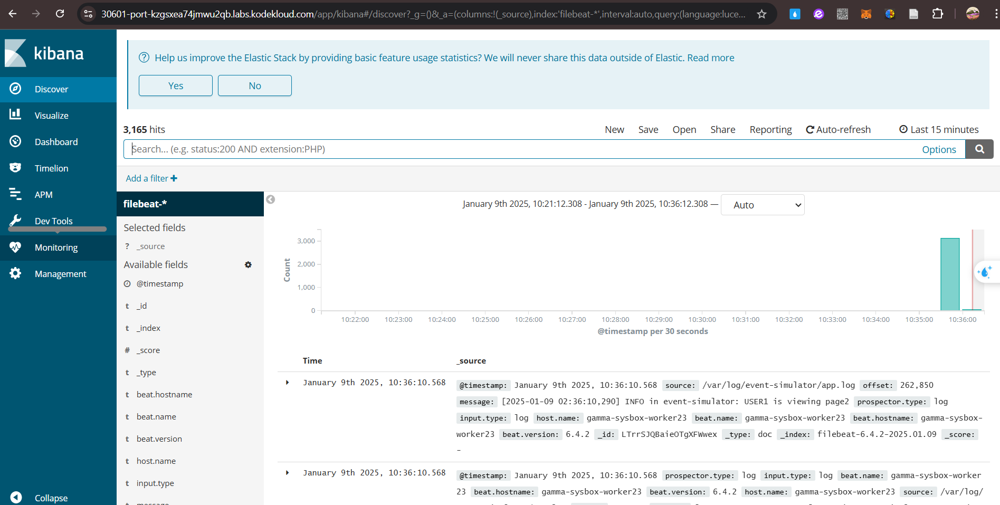
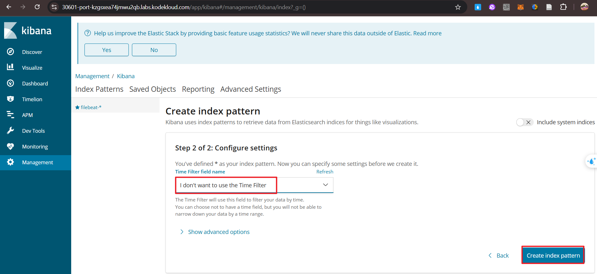
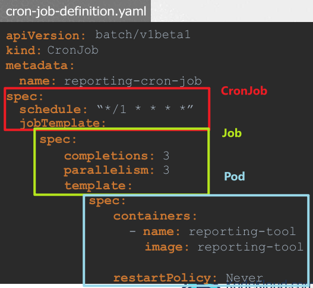

## Multiple Container Pods

1.  Multi-Container Pods
    Features of multi-container Pods
        - Shared life cycle:
            - Containers inside the same Pod are created and reasoned about at the same time.
        - Shared network space:
            - Containers can communicate directly through localhost.
        - Shared storage volume:
            - Containers can directly access the same storage resources.
        - 3 design patterns: 
            - Sidecar(側車模式), Adapter(適配器模式) and Ambassador(大使模式)

    Implement Multi-Container Pods:
        - Pod definition file:
            The **containers field in spec** is an **array**, allowing multiple containers to be defined.
            Example: Add a container named log agent to an existing Pod.
            step: 
                Add new container information to containers.
                Each container has its own configuration such as name and image.
    
    Design pattern:
        - Sidecar Pattern
            Run accessibility features **alongside the main app**.
            Example: Deploy a log agent container to collect and forward web server logs.
        - Adapter Pattern
            Convert data into a standard format for easy **processing or forwarding**.
            Example: The adapter container converts logs in different formats generated by multiple applications into a unified format and then sends them to the central log server.
        - Ambassador Pattern
            As a proxy container, it manages the **interaction between applications and external services**.
            Example: The proxy econtainer handles the application's requests to different databases (such as development, test, and production environments), and the application always accesses the database through localhost.
    
    1) Identify the number of containers created in the red pod.

            k describe pod red             

        controlplane ~ ➜  k describe pod red 
        Name:             red
        Namespace:        default
        Priority:         0
        Service Account:  default
        Node:             controlplane/192.168.28.48
        Start Time:       Wed, 08 Jan 2025 05:12:26 +0000
        Labels:           <none>
        Annotations:      <none>
        Status:           Pending
        IP:               
        IPs:              <none>
        Containers:
        apple:
            Container ID:  
            Image:         busybox
            Image ID:      
            Port:          <none>
            Host Port:     <none>
            Command:
            sleep
            4500
            State:          Waiting
            Reason:       ContainerCreating
            Ready:          False
            Restart Count:  0
            Environment:    <none>
            Mounts:
            /var/run/secrets/kubernetes.io/serviceaccount from kube-api-access-tbhcj (ro)
        wine:
            Container ID:  
            Image:         busybox
            Image ID:      
            Port:          <none>
            Host Port:     <none>
            Command:
            sleep
            4500
            State:          Waiting
            Reason:       ContainerCreating
            Ready:          False
            Restart Count:  0
            Environment:    <none>
            Mounts:
            /var/run/secrets/kubernetes.io/serviceaccount from kube-api-access-tbhcj (ro)
        scarlet:
            Container ID:  
            Image:         busybox
            Image ID:      
            Port:          <none>
            Host Port:     <none>
            Command:
            sleep
            4500
            State:          Waiting
            Reason:       ContainerCreating
            Ready:          False
            Restart Count:  0
            Environment:    <none>
            Mounts:
            /var/run/secrets/kubernetes.io/serviceaccount from kube-api-access-tbhcj (ro)
        Conditions:
        ...

        Answer: 3 containers (apple, wine and scarlet)

        Identify the name of the containers running in the blue pod.

            k describe pod blue 

        controlplane ~ ➜  k describe pod blue 
        Name:             blue
        Namespace:        default
        Priority:         0
        Service Account:  default
        Node:             controlplane/192.168.28.48
        Start Time:       Wed, 08 Jan 2025 05:15:13 +0000
        Labels:           <none>
        Annotations:      <none>
        Status:           Running
        IP:               172.17.0.10
        IPs:
        IP:  172.17.0.10
        Containers:
        teal:
            Container ID:  containerd://56709e70b9b44dd1e77cd770830ed440bbc8f375db946e8825c14b07b9a6bc05
            Image:         busybox
            Image ID:      docker.io/library/busybox@sha256:2919d0172f7524b2d8df9e50066a682669e6d170ac0f6a49676d54358fe970b5
            Port:          <none>
            Host Port:     <none>
            Command:
            sleep
            4500
            State:          Running
            Started:      Wed, 08 Jan 2025 05:15:14 +0000
            Ready:          True
            Restart Count:  0
            Environment:    <none>
            Mounts:
            /var/run/secrets/kubernetes.io/serviceaccount from kube-api-access-swlv2 (ro)
        navy:
            Container ID:  containerd://eaee616d7d629ab2a35b7d4fd0a9e1c81b9daf5dd8ef15c3942aba1ae7d292f8
            Image:         busybox
            Image ID:      docker.io/library/busybox@sha256:2919d0172f7524b2d8df9e50066a682669e6d170ac0f6a49676d54358fe970b5
            Port:          <none>
            Host Port:     <none>
            Command:
            sleep
            4500
            State:          Running
            Started:      Wed, 08 Jan 2025 05:15:15 +0000
            Ready:          True
            Restart Count:  0
            Environment:    <none>
            Mounts:
            /var/run/secrets/kubernetes.io/serviceaccount from kube-api-access-swlv2 (ro)
        
        Answer: teal & navy
        
    2)  Create a multi-container pod with 2 containers.
        Use the spec given below:
            Name: yellow
            Container 1 Name: lemon
            Container 1 Image: busybox
            Container 2 Name: gold

        If the pod goes into the crashloopbackoff then add the command sleep 1000 in the lemon container.
            Name: yellow
            Container 1 Name: lemon
            Container 1 Image: busybox
            Container 2 Name: gold
            Container 2 Image: redis

        Hint: Use the command kubectl run to create a pod definition file and add 2nd container.

            k run yellow --image=nginx
            k get pod yellow -o yaml > yellow.yaml
            vim yellow.yaml
            (please follow the doc for settings of 2 containers)
            k delete pod yellow
            k create/apply -f yellow.yaml 

        controlplane ~ ➜  k run yellow --image=nginx
        pod/yellow created

        controlplane ~ ➜  k get pod yellow -o yaml > yellow.yaml

        controlplane ~ ➜  vim yellow.yaml

            apiVersion: v1
            kind: Pod
            metadata:
            name: yellow
            spec:
            containers:
            - name: lemon
                image: busybox
                command:
                - "sleep"
                - "1000"
            - name: gold
                image: redis

            此處也可以寫為: (image or name 其中一項作為大項即可) 
            - image: lemon
                name: busybox
                command: ["sleep", "1000"]
            - image: gold
                name: redis
            
        controlplane ~ ➜  k delete pod yellow 
        pod "yellow" deleted

        controlplane ~ ➜  k create -f yellow.yaml 
        pod/yellow created

        controlplane ~ ➜  k get pods
        NAME        READY   STATUS    RESTARTS   AGE
        app         1/1     Running   0          13m
        blue        2/2     Running   0          10m
        fluent-ui   1/1     Running   0          13m
        red         3/3     Running   0          13m
        yellow      1/2     Error     0          3s (Ignore the Error first)

    1)  We have deployed an application logging stack in the elastic-stack namespace. Inspect it.

        Before proceeding with the next set of questions, please wait for all the pods in the elastic-stack namespace to be ready. This can take a few minutes.
        

        Once the pod is in a ready state, inspect the Kibana UI using the link above your terminal. There shouldn't be any logs for now.
        We will configure a sidecar container for the application to send logs to Elastic Search.
        (Elastic Search 提供集中化的存儲空間，可以彙集來自不同應用或容器的日誌，統一管理。故在kibana pod 裡面建立sidecar容器來運行log蒐集)

        NOTE: It can take a couple of minutes for the Kibana UI to be ready after the Kibana pod is ready.

        You can inspect the Kibana logs by running:

            kubectl -n elastic-stack logs kibana
            (k + press Tab 可以看到logs選項)
            k logs -h
            由於指令前面為: k -n elastic-stack 已指定了namespace
            故選擇: kubectl logs nginx
            最終指令為: kubectl -n <namespace> logs <pod>

        controlplane ~ ✖ kubectl get pods --all-namespaces
        NAMESPACE       NAME                                   READY   STATUS             RESTARTS        AGE
        default         app                                    1/1     Running            0               28m
        default         blue                                   2/2     Running            0               25m
        default         fluent-ui                              1/1     Running            0               28m
        default         red                                    3/3     Running            0               28m
        default         yellow                                 1/2     CrashLoopBackOff   7 (3m58s ago)   14m
        elastic-stack   app                                    1/1     Running            0               28m
        elastic-stack   elastic-search                         1/1     Running            0               28m
        elastic-stack   kibana                                 1/1     Running            0               28m
        kube-flannel    kube-flannel-ds-mzbjp                  1/1     Running            0               30m
        kube-system     coredns-77d6fd4654-6gtlt               1/1     Running            0               30m
        kube-system     coredns-77d6fd4654-txxgw               1/1     Running            0               30m
        kube-system     etcd-controlplane                      1/1     Running            0               30m
        kube-system     kube-apiserver-controlplane            1/1     Running            0               30m
        kube-system     kube-controller-manager-controlplane   1/1     Running            0               30m
        kube-system     kube-proxy-qmgvd                       1/1     Running            0               30m
        kube-system     kube-scheduler-controlplane            1/1     Running            0               30m

        controlplane ~ ➜  kubectl -n elastic-stack logs kibana
        {"type":"log","@timestamp":"2025-01-08T05:13:12Z","tags":["status","plugin:kibana@6.4.2","info"],"pid":1,"state":"green","message":"Status changed from uninitialized to green - Ready","prevState":"uninitialized","prevMsg":"uninitialized"}
        {"type":"log","@timestamp":"2025-01-08T05:13:12Z","tags":["status","plugin:elasticsearch@6.4.2","info"],"pid":1,"state":"yellow","message":"Status changed from uninitialized to yellow - Waiting for Elasticsearch","prevState":"uninitialized","prevMsg":"uninitialized"}
        ...

        Inspect the app pod and identify the number of containers in it.
        It is deployed in the elastic-stack namespace.

            ~~k describe pod app~~
                應為: controlplane ~ ✖ k -n elastic-stack describe pod app 

            k -n elastic-stack describe pod app

        controlplane ~ ➜  k describe pod app |grep "Containers"
        ...
        Containers:
        app:
            Container ID:   containerd://286f7a9a36265c97a3c5a5105d99c528a7b3d59e06d26f08bfca5203802bb691
            Image:          kodekloud/event-simulator
            Image ID:       docker.io/kodekloud/event-simulator@sha256:1e3e9c72136bbc76c96dd98f29c04f298c3ae241c7d44e2bf70bcc209b030bf9
            Port:           <none>
            Host Port:      <none>
            State:          Running
            Started:      Wed, 08 Jan 2025 05:12:59 +0000
            Ready:          True
            Restart Count:  0
            Environment:    <none>
            Mounts:
            /log from log-volume (rw)
            /var/run/secrets/kubernetes.io/serviceaccount from kube-api-access-6nmhr (ro)
        Conditions:
        Type                        Status
        PodReadyToStartContainers   True 
        ...

        Answer: 1 containers

    2)  The application outputs logs to the file /log/app.log. View the logs and try to identify the user having issues with Login.
        Inspect the log file inside the pod.
        

            kubectl -n <elastic-stack> exec -it app -- cat /log/app.log
            -n : namespace
            -it: -i -t 
            --cat /log/app.log: command
            
            k exec Usage:
            kubectl exec (POD | TYPE/NAME) [-c CONTAINER] [flags] -- COMMAND [args...] [options]
        

        **!!!!!IMPORTANT!!!!!!**: 
            為何使用k -h 或是k exec -h 都沒有看到-n 參數? 
            controlplane ~ ➜  kubectl -h
            controlplane ~ ➜  kubectl -h|grep namesapce 
            controlplane ~ ➜  k exec -h (-n 為全域option, 非exec option)
            用 exec 指令對pod 裡面的container 進行操作!!
        
            因為欲查詢kubectl 全局指令有哪些選項，應使用: k options
            
            controlplane ~ ➜  kubectl options | grep namespace
            Username to impersonate for the operation. User could be a regular user or a service account in a namespace.
            -n, --namespace='':
                If present, the namespace scope for this CLI request
            
            故組織為: k -n <namespace>
            
            k exec -h 裡面具有-i 跟 -t 的選項，相同選項順序的話，可以放在一起寫成: -it

            -i, --stdin=false:
            Pass stdin to the container

            -t, --tty=false:
                Stdin is a TTY
            
            故組織為: k -n <namespace> exec <pod> -it 

            接著加上: -c CONTAINER] [flags] -- COMMAND [args...] [options]
            倘若不指定是哪一個container, 則不需要 -c

            根據題目，我們的command 為: cat /log/app.log 

            故組織為: k -n <namespace> exec <pod> -it -- cat /log/app.log 

        controlplane ~ ➜  k -n elastic-stack exec -it app -- cat /log/app.log
        輸出日誌內容如下:
            [2025-01-08 10:51:39,195] WARNING in event-simulator: USER7 Order failed as the item is OUT OF STOCK.
            [2025-01-08 10:51:39,196] INFO in event-simulator: USER4 logged out
            [2025-01-08 10:51:39,464] INFO in event-simulator: USER3 logged out
            [2025-01-08 10:51:40,197] INFO in event-simulator: USER2 logged out
            [2025-01-08 10:51:40,466] INFO in event-simulator: USER2 is viewing page2
            [2025-01-08 10:51:41,198] WARNING in event-simulator: USER5 Failed to Login as the account is locked due to MANY FAILED ATTEMPTS.
            [2025-01-08 10:51:41,198] INFO in event-simulator: USER4 logged out
            [2025-01-08 10:51:41,467] INFO in event-simulator: USER4 is viewing page1
            [2025-01-08 10:51:42,199] INFO in event-simulator: USER1 is viewing page3
            [2025-01-08 10:51:42,468] WARNING in event-simulator: USER5 Failed to Login as the account is locked due to MANY FAILED ATTEMPTS.
            [2025-01-08 10:51:42,468] INFO in event-simulator: USER2 is viewing page2
            [2025-01-08 10:51:43,200] INFO in event-simulator: USER3 logged in
            [2025-01-08 10:51:43,469] INFO in event-simulator: USER4 is viewing page3
            [2025-01-08 10:51:44,201] INFO in event-simulator: USER2 is viewing page1
            [2025-01-08 10:51:44,470] INFO in event-simulator: USER1 logged in
            [2025-01-08 10:51:45,202] INFO in event-simulator: USER2 is viewing page2
            [2025-01-08 10:51:45,472] INFO in event-simulator: USER3 is viewing page2
            [2025-01-08 10:51:46,203] WARNING in event-simulator: USER5 Failed to Login as the account is locked due to MANY FAILED ATTEMPTS.
            [2025-01-08 10:51:46,203] INFO in event-simulator: USER2 is viewing page3
            [2025-01-08 10:51:46,473] WARNING in event-simulator: USER7 Order failed as the item is OUT OF STOCK.

        可以看到user5 is having issues with Login

        Answer: user5
        
                        
    3)  Edit the pod in the elastic-stack namespace to add a sidecar container to send logs to Elastic Search. 
        Mount the log volume to the sidecar container.

        Only add a new container. Do not modify anything else. Use the spec provided below.
        
        Name: app
        Container Name: sidecar
        Container Image: kodekloud/filebeat-configured
        Volume Mount: log-volume
        Mount Path: /var/log/event-simulator/
        Existing Container Name: app
        Existing Container Image: kodekloud/event-simulator

        Note: State persistence concepts are discussed in detail later in this course. For now please make use of the below documentation link for updating the concerning pod.
        https://kubernetes.io/docs/tasks/access-application-cluster/communicate-containers-same-pod-shared-volume/

            ~~ k get pod app -o yaml > app.yaml ~~ (WRONG!!)
               應為: vim app.yaml

            k delete pod app --force (WRONG!!)
               應為: k -n elastic-stack delete pod app

            k create -f app.yaml 
            k get pods

        controlplane ~ ➜  k get pods --namespace/-n elastic-stack 
        NAME             READY   STATUS    RESTARTS   AGE
        app              1/1     Running   0          25m
        elastic-search   1/1     Running   0          25m
        kibana           1/1     Running   0          25m

            apiVersion: v1
            kind: Pod
            metadata:
                creationTimestamp: "2025-01-08T11:46:02Z"
                labels:
                    name: app
                name: app
               ** namespace: elastic-stack** 更改文件時，務必檢查是否在對應的namespace裡!!!
                resourceVersion: "676"
                uid: f686efa5-3a42-461f-9a52-9a12c57eca49
            spec:
            containers:
            - image: kodekloud/event-simulator
                imagePullPolicy: Always
                name: app
                resources: {}
                terminationMessagePath: /dev/termination-log
                terminationMessagePolicy: File
                volumeMounts:
                - mountPath: /log
                name: log-volume
                - mountPath: /var/run/secrets/kubernetes.io/serviceaccount
                name: kube-api-access-5g9lb
                readOnly: true
            - name: sidecar (新增一container, 命名為sidecar)
                image: kodekloud/filebeat-configured
                volumeMounts:
                   volumeMounts:
                  - mountPath: /var/log/event-simulator/
                    name: log-volume
                dnsPolicy: ClusterFirst
                ...
                (其餘不用更動)
                  tolerationSeconds: 300
                volumes:
                - hostPath:
                    path: /var/log/webapp
                    type: DirectoryOrCreate
                                                         

        controlplane ~ ✖ k get pods --namespace elastic-stack 
        NAME             READY   STATUS    RESTARTS   AGE
        app              1/1     Running   0          49m
        elastic-search   1/1     Running   0          49m
        kibana           1/1     Running   0          49m

        controlplane ~ ✖ k -n elastic-stack delete pod app 
        pod "app" deleted

        controlplane ~ ➜  k -n elastic-stack get pod app -o yaml > app.yaml

        controlplane ~ ➜  vim app.yaml 
        (配置同上，唯獨需確認namespace欄位為elastic-stack!) 

        controlplane ~ ✖ k -n elastic-stack create -f app.yaml 
        pod/app created

        **IMPORTANT!!!!!**
        因為題目要求我們的app pod 是在elastic-stack namespace底下，但是當我們在k get pod app -o yaml 的時候，他提取的是在default
        底下的app pod，而非elastic-stack 底下的app

        當有要求在特定namespace底下的時候，任何kubectl 動作都需要加上-n <namespace> !! 

        Inspect the Kibana UI. You should now see logs appearing in the Discover section.
        

        You might have to wait for a couple of minutes for the logs to populate. You might have to create an index pattern to list the logs. If not sure check this video: https://bit.ly/2EXYdHf

        
        
        
        
        

        

2.  Init Containers
    
    - Key Characteristics:
      - Always run to completion(不会中途停止或退出).
      - Execute sequentially, each completing successfully before the next one starts.
    
    - If an init container fails:
      - The kubelet retries until it succeeds.
      - For Pods with restartPolicy: Never, the Pod is marked as failed if an init container fails.
      - Defined under the initContainers field in the Pod specification.
      - Status is tracked in .status.initContainerStatuses.
    
    - Differences from Regular Containers
      - Init containers:
            Do not support lifecycle, livenessProbe, readinessProbe, or startupProbe.
            Must run to completion before the Pod is ready.
            Resource requests and limits are handled differently compared to app containers.
            Support all other features of app containers, such as:
                Resource limits, Volumes, Security settings.
    
    - Differences from Sidecar Containers
      - Init containers:
        - Run to completion before the main containers start.
        - Execute sequentially, blocking app container startup until finished.
        - Do not support lifecycle probes (livenessProbe, readinessProbe, etc.).
        - Share resources (CPU, memory, network) with app containers but do not run alongside them.
    
      - Sidecar containers:
        - Run continuously alongside main containers during the Pod's lifetime.
        - Support lifecycle probes to manage their behavior.
        
    Read more on: https://kubernetes.io/docs/concepts/workloads/pods/init-containers/

    1)  Identify the pod that has an initContainer configured.

            k describe pod <pod-name> | grep -i "Init Container" (or "init" or "Init")

        controlplane ~ ➜  k describe pod blue | grep -i "Init"
        Init Containers:
        init-myservice:
        Initialized                 True 
        Normal  Created    4m55s  kubelet            Created container init-myservice
        Normal  Started    4m55s  kubelet            Started container init-myservice

        controlplane ~ ➜  k describe pod blue | grep -i "init"
        Init Containers:
        init-myservice:
        Initialized                 True 
        Normal  Created    5m1s   kubelet            Created container init-myservice
        Normal  Started    5m1s   kubelet            Started container init-myservice

        controlplane ~ ✖ k describe pod pink | grep -i "initContainer"
        Error from server (NotFound): pods "pink" not found
        controlplane ~ ✖ k describe po^Cpink | grep -i "initContainer"
        controlplane ~ ✖ k describe pod green | grep -i "initContainer"
        controlplane ~ ✖ k describe pod red | grep -i "initContainer"

        Answer: blue

        What is the image used by the initContainer on the blue pod?

        controlplane ~ ➜  k describe pod blue | grep -i "Init"
        Init Containers:
        init-myservice:
        Initialized                 True 
        Normal  Created    4m55s  kubelet            Created container init-myservice
        Normal  Started    4m55s  kubelet            Started container init-myservice

        controlplane ~ ➜  k describe pod blue | grep -i "init"
        Init Containers:
        init-myservice:
        Initialized                 True 
        Normal  Created    5m1s   kubelet            Created container init-myservice
        Normal  Started    5m1s   kubelet            Started container init-myservice

        Answer: busybox

        option1: Alive
        option2: Completed (!!! **注意 Completed 跟Terminated 的差別**!!! )
        option3: Terminated

            k describe pod blue | grep -A10 "init-myservice" | grep -i "state"

        controlplane ~ ✖ k describe pod blue | grep -A10 "Init"
        Init Containers:
        init-myservice:
            Container ID:  containerd://bf6c91f1d09e13a773a3b9e6d1f391c577e1a69e3ae54949f460bdcb21bc6eec
            Image:         busybox
            Image ID:      docker.io/library/busybox@sha256:2919d0172f7524b2d8df9e50066a682669e6d170ac0f6a49676d54358fe970b5
            Port:          <none>
            Host Port:     <none>
            Command:
            sh
            -c
            sleep 5
        --
        Initialized                 True: **所有的 Init Containers 已經成功完成**
        **Ready**                   True:  (WRONG!!! 應該要看的是container 的state!!!) 整個 Pod 已經準備好處理請求
        ContainersReady             True: **Pod 中的所有普通容器都已通過健康檢查並準備好**
        PodScheduled                True: **Pod 已經成功被排程到某個 Node 上**
        Volumes:
        kube-api-access-fx9nn:
            Type:                    Projected (a volume that contains injected data from multiple sources)
            TokenExpirationSeconds:  3607
            ConfigMapName:           kube-root-ca.crt
            ConfigMapOptional:       <nil>
            DownwardAPI:             true

        controlplane ~ ➜  k describe pod blue | grep -i "init-myservice" | grep -i "state"
        (None: -i 打印出的內容不多，故使用-A10: 列出10行)
        controlplane ~ ➜  k describe pod blue | grep -A10 "init-myservice" | grep -i "state"
        State:          Terminated

        Answer: option3  Terminated

    2)  Why is the initContainer terminated? What is the reason?
        option1: The proces cannot start 
        option2: The process crashed
        option3: The process completed sucessfully

            k describe pod blue | grep -A30 "Init" |grep -i "Reason"
            (-A 行數太少將不會打印出東西)

        controlplane ~ ➜  k describe pod blue | grep -A30 "Init"|grep -A10 "State" |grep -i "Reason"
        Reason:       Completed

        controlplane ~ ➜  k describe pod blue | grep -A30 "Init" |grep -i "Reason"
        Reason:       Completed
        Type    Reason     Age   From               Message     

        Answer: option3 The process completed sucessfully

    3)  We just created a new app named purple. How many initContainers does it have?
        
        controlplane ~ ➜  k describe pod purple
        ...
        Init Containers:
        warm-up-1:
            Container ID:  containerd://eecd4eb61c559f8902d207a5213cacffa0d0a41ffb134738716f95c5daa77d51
            Image:         busybox:1.28
            Image ID:      docker.io/library/busybox@sha256:141c253bc4c3fd0a201d32dc1f493bcf3fff003b6df416dea4f41046e0f37d47
            Port:          <none>
            Host Port:     <none>
            Command:
            sh
            -c
            sleep 600
            State:          Running
            Started:      Thu, 09 Jan 2025 04:26:09 +0000
            Ready:          False
            Restart Count:  0
            Environment:    <none>
            Mounts:
            /var/run/secrets/kubernetes.io/serviceaccount from kube-api-access-lbgnh (ro)
        warm-up-2:
            Container ID:  
            Image:         busybox:1.28
            Image ID:      
            Port:          <none>
            Host Port:     <none>
            Command:
            sh
            -c
            sleep 1200
            State:          Waiting
            Reason:       PodInitializing
            Ready:          False
            Restart Count:  0
            Environment:    <none>
            Mounts:
            /var/run/secrets/kubernetes.io/serviceaccount from kube-api-access-lbgnh (ro)
        Containers:
            purple-container:
        ...

        Answer: 2 containers

        What is the state of the POD?
            option1: Terminated
            option2: Pending
            option3: Running

            k describe pod purple

        controlplane ~ ➜  k describe pod purple
        
        Directly check the global status: (Quicker)
            controlplane ~ ➜  k describe pod purple
            Name:             purple
            Namespace:        default
            Priority:         0
            Service Account:  default
            Node:             controlplane/192.168.187.99
            Start Time:       Thu, 09 Jan 2025 05:01:27 +0000
            Labels:           <none>
            Annotations:      <none>
            **Status:           Pending**
            IP:               10.42.0.12
        
        Or check each status of the pod:
            Init Containers:
            warm-up-1:
                Container ID:  containerd://eecd4eb61c559f8902d207a5213cacffa0d0a41ffb134738716f95c5daa77d51
                Image:         busybox:1.28
                Image ID:      docker.io/library/busybox@sha256:141c253bc4c3fd0a201d32dc1f493bcf3fff003b6df416dea4f41046e0f37d47
                Port:          <none>
                Host Port:     <none>
                Command:
                sh
                -c
                sleep 600
                **State:          Running**
                Started:      Thu, 09 Jan 2025 04:26:09 +0000
                **Ready:          False**
                Restart Count:  0
                Environment:    <none>
                Mounts:
                /var/run/secrets/kubernetes.io/serviceaccount from kube-api-access-lbgnh (ro)
            warm-up-2:
                Container ID:  
                Image:         busybox:1.28
                Image ID:      
                Port:          <none>
                Host Port:     <none>
                Command:
                sh
                -c
                sleep 1200
                **State:          Waiting**
                **Reason:       PodInitializing**
                Ready:          False
                Restart Count:  0
                Environment:    <none>
                Mounts:
                /var/run/secrets/kubernetes.io/serviceaccount from kube-api-access-lbgnh (ro)
            Containers:
            purple-container:
                Container ID:  
                Image:         busybox:1.28
                Image ID:      
                Port:          <none>
                Host Port:     <none>
                Command:
                sh
                -c
                echo The app is running! && sleep 3600
                **State:          Waiting**
                **Reason:       PodInitializing**
                Ready:          False
                Restart Count:  0
                Environment:    <none>
                Mounts:
                /var/run/secrets/kubernetes.io/serviceaccount from kube-api-access-lbgnh (ro)
            Conditions:
            Type                        Status
            PodReadyToStartContainers   True 
            Initialized                 False 
            Ready                       False 
            ContainersReady             False 
            PodScheduled                True 
            Volumes:
            kube-api-access-lbgnh:
                Type:                    Projected (a volume that contains injected data from multiple sources)
                TokenExpirationSeconds:  3607
                ConfigMapName:           kube-root-ca.crt
                ConfigMapOptional:       <nil>
                DownwardAPI:             true
            QoS Class:                   BestEffort
            Node-Selectors:              <none>
            Tolerations:                 node.kubernetes.io/not-ready:NoExecute op=Exists for 300s
                                        node.kubernetes.io/unreachable:NoExecute op=Exists for 300s
            Events:
            Type    Reason     Age    From               Message
            ----    ------     ----   ----               -------
            Normal  Scheduled  9m13s  default-scheduler  Successfully assigned default/purple to controlplane
            Normal  Pulled     9m13s  kubelet            Container image "busybox:1.28" already present on machine
            Normal  Created    9m13s  kubelet            Created container warm-up-1
            Normal  Started    9m13s  kubelet            Started container warm-up-1

        Look at the State & Reason column of all containers:
        Initial Container: waiting & PodInitializing
        Regular Container: waiting & PodInitializing

        Answer: option2 Pending

    3)  How long after the creation of the POD will the application come up and be available to users?

        Carry On.
        
        controlplane ~ ➜  k describe pod purple
        ...
        Init Containers:
        warm-up-1:
            Container ID:  containerd://eecd4eb61c559f8902d207a5213cacffa0d0a41ffb134738716f95c5daa77d51
            Image:         busybox:1.28
            Image ID:      docker.io/library/busybox@sha256:141c253bc4c3fd0a201d32dc1f493bcf3fff003b6df416dea4f41046e0f37d47
            Port:          <none>
            Host Port:     <none>
            Command:
            sh
            -c
            **sleep 600**
            State:          Running
            Started:      Thu, 09 Jan 2025 04:26:09 +0000
            Ready:          False
            Restart Count:  0
            Environment:    <none>
            Mounts:
            /var/run/secrets/kubernetes.io/serviceaccount from kube-api-access-lbgnh (ro)
        warm-up-2:
            Container ID:  
            Image:         busybox:1.28
            Image ID:      
            Port:          <none>
            Host Port:     <none>
            Command:
            sh
            -c
            **sleep 1200**
            State:          Waiting
            Reason:       PodInitializing
            Ready:          False
            Restart Count:  0
            Environment:    <none>
            Mounts:
            /var/run/secrets/kubernetes.io/serviceaccount from kube-api-access-lbgnh (ro)

        ...

        Check init container warm-up-1 & warm-up-2: 600 sec + 1200 sec = 1800 sec = 30 min
    
    4)  Update the pod red to use an initContainer that uses the busybox image and sleeps for 20 seconds
        Delete and re-create the pod if necessary. But make sure no other configurations change.

        Pod: red
        initContainer Configured Correctly

        controlplane ~ ✖ k get pod red -o yaml > red.yaml

        controlplane ~ ➜  vim red.yaml 
            
            apiVersion: v1
            kind: Pod
            metadata:
            creationTimestamp: "2025-01-09T03:57:19Z"
            name: red
            namespace: default
            resourceVersion: "805"
            uid: fb660109-2616-43c1-9cf1-ed207924506a
            spec:
            initContainers: (Add the initContainers block)
            - name: init-myservice
                image: busybox
                command: ['sleep', '20']

            containers:
            - command:

        controlplane ~ ➜  k apply -f red.yaml --dry-run=client 
        pod/red configured (dry run)

        controlplane ~ ➜  k delete pod red --force
        Warning: Immediate deletion does not wait for confirmation that the running resource has been terminated. The resource may continue to run on the cluster indefinitely.
        pod "red" force deleted

        controlplane ~ ➜  k apply -f red.yaml  
        pod/red created

    5)  A new application orange is deployed. There is something wrong with it. Identify and fix the issue.
        Once fixed, wait for the application to run before checking solution.

        controlplane ~ ✖ k get pod orange -o yaml > orange.yaml
        (有時候使用dry run 嘗試debug 未必會見效)
        controlplane ~ ➜  k apply -f orange.yaml --dry-run=client
        pod/orange configured (dry run)

        逐一檢查:
        controlplane ~ ➜  k describe pod orange 
        Name:             orange
        Namespace:        default
        Priority:         0
        Service Account:  default
        Node:             controlplane/192.168.187.109
        Start Time:       Thu, 09 Jan 2025 04:51:33 +0000
        Labels:           <none>
        Annotations:      <none>
        Status:           Pending
        IP:               10.42.0.14
        IPs:
        IP:  10.42.0.14
        Init Containers:
        init-myservice:
            Container ID:  containerd://6179ad15da6dc1e58e9739d3a8c81b8a5bb72fcfda8c210b64ba63356edb9ef6
            Image:         busybox
            Image ID:      docker.io/library/busybox@sha256:2919d0172f7524b2d8df9e50066a682669e6d170ac0f6a49676d54358fe970b5
            Port:          <none>
            Host Port:     <none>
            Command:
            sh
            -c
            **sleeeep 2**; 有錯字
            State:          Waiting
            Reason:       CrashLoopBackOff
            Last State:     Terminated
            Reason:       Error
            Exit Code:    127
            Started:      Thu, 09 Jan 2025 04:52:21 +0000
            Finished:     Thu, 09 Jan 2025 04:52:21 +0000
            Ready:          False
            Restart Count:  3
            Environment:    <none>
            Mounts:
            /var/run/secrets/kubernetes.io/serviceaccount from kube-api-access-q9ntk (ro)
        Containers:
        orange-container:
            Container ID:  
            Image:         busybox:1.28
            Image ID:      
            Port:          <none>
            Host Port:     <none>
            Command:
            sh
            -c
            echo The app is running! && sleep 3600
            State:          Waiting
            Reason:       PodInitializing
            Ready:          False
            Restart Count:  0
            Environment:    <none>
            Mounts:
            /var/run/secrets/kubernetes.io/serviceaccount from kube-api-access-q9ntk (ro)
        Conditions:
        Type                        Status
        PodReadyToStartContainers   True 
        Initialized                 False 
        Ready                       False 
        ContainersReady             False 
        PodScheduled                True 
        Volumes:
        kube-api-access-q9ntk:
            Type:                    Projected (a volume that contains injected data from multiple sources)
            TokenExpirationSeconds:  3607
            ConfigMapName:           kube-root-ca.crt
            ConfigMapOptional:       <nil>
            DownwardAPI:             true
        QoS Class:                   BestEffort
        Node-Selectors:              <none>
        Tolerations:                 node.kubernetes.io/not-ready:NoExecute op=Exists for 300s
                                    node.kubernetes.io/unreachable:NoExecute op=Exists for 300s
        Events:
        Type     Reason     Age                From               Message
        ----     ------     ----               ----               -------
        Normal   Scheduled  82s                default-scheduler  Successfully assigned default/orange to controlplane
        Normal   Pulled     82s                kubelet            Successfully pulled image "busybox" in 152ms (152ms including waiting). Image size: 2167089 bytes.
        Normal   Pulled     65s                kubelet            Successfully pulled image "busybox" in 142ms (142ms including waiting). Image size: 2167089 bytes.
        Normal   Pulling    36s (x4 over 82s)  kubelet            Pulling image "busybox"
        Normal   Created    36s (x4 over 82s)  kubelet            Created container init-myservice
        Normal   Pulled     36s (x2 over 81s)  kubelet            Successfully pulled image "busybox" in 154ms (154ms including waiting). Image size: 2167089 bytes.
        Normal   Started    35s (x4 over 81s)  kubelet            Started container init-myservice
        Warning  BackOff    11s (x6 over 80s)  kubelet            Back-off restarting failed container init-myservice in pod orange_default(b9402300-1c33-4612-ac94-60134864926f)

        controlplane ~ ✖ vim orange.yaml 
        (更改錯字)

        controlplane ~ ➜  k delete pod orange --force
        Warning: Immediate deletion does not wait for confirmation that the running resource has been terminated. The resource may continue to run on the cluster indefinitely.
        pod "orange" force deleted

        controlplane ~ ➜  k apply -f orange.yaml
        pod/orange created

        controlplane ~ ➜  k get pod orange 
        NAME     READY   STATUS    RESTARTS   AGE
        orange   1/1     Running   0          6s

## Pod Design

1. Labels,Selectors and Annotations

## Rolling Updates
1. Rolling Updates & Rollbacks in Deployments
    
        k rollout undo deployment/myapp-deployment
        k rollout status deployment/myapp-deployment
        k rollout history deployment/myapp-deployment: View the history of revisions
    
    2 Deployment Stragegy: 
    
    - Rolloing Updaates
        - Old versions are gradually replaced by new ones, and the app is always available
        - k set command can use on:  Image/labels/replicas 
        - k describe deploymnet <deployment>的Events將會看到: 舊 Replica Set 和新 Replica Set 同步進行縮減和擴增
            
                k apply -f deplyment-definition.yaml (Use the definition file to update changes)
            OR
    
               k set image deployment/myapp-deployment\ (Use set image to update changes)
                        nginx-container=nginx:1.9.1
    
    - Recreate Strategy:
        - Delete all old versions before deploying the new version.
        - The app will be unavailable during this time.
        - k describe deploymnet <deployment>的Events將會看到: Replica Set 先縮減至 0，再新增新的 Replica Set
    
    

    1)  We have deployed a simple web application. Inspect the PODs and the Services

        Wait for the application to fully deploy and view the application using the link called Webapp Portal above your terminal.

        

        What is the current color of the web application?
        Access the Webapp Portal.

        Answer: Blue

        Run the script named curl-test.sh to send multiple requests to test the web application. Take a note of the output.

        Execute the script at /root/curl-test.sh.

        controlplane ~ ➜  /root/curl-test.sh
        Hello, Application Version: v1 ; Color: blue OK
        Hello, Application Version: v1 ; Color: blue OK
        Hello, Application Version: v1 ; Color: blue OK
        Hello, Application Version: v1 ; Color: blue OK
        ...

        
        Inspect the deployment and identify the number of PODs deployed by it.

        Hint: Run the command kubectl describe deployment and look at Desired Replicas

            k describe deploy frontend

        controlplane ~ ➜  k describe deployments.apps frontend 
        Name:                   frontend
        Namespace:              default
        CreationTimestamp:      Mon, 20 Jan 2025 22:17:46 +0000
        Labels:                 <none>
        Annotations:            deployment.kubernetes.io/revision: 1
        Selector:               name=webapp
        **Replicas:               4 desired** | 4 updated | 4 total | 4 available | 0 unavailable
        StrategyType:           RollingUpdate
        MinReadySeconds:        20
        RollingUpdateStrategy:  25% max unavailable, 25% max surge
        Pod Template:
        Labels:  name=webapp
        Containers:
        simple-webapp:
            Image:         kodekloud/webapp-color:v1
            Port:          8080/TCP
            Host Port:     0/TCP
            Environment:   <none>
            Mounts:        <none>
        Volumes:         <none>
        Node-Selectors:  <none>
        Tolerations:     <none>
        ...

        Answer: 4 pods
        The desired replicas value represents the number of pods that the deployment is configured to maintain. 

        
        What container image is used to deploy the applications?
        
        Carry On,  From the Image colunm.
        Answer:  kodekloud/webapp-color:v1

    2)  Inspect the deployment and identify the current strategy
        Carry On, from the StrategyType column:

        StrategyType:           RollingUpdate

        Answer: RollingUpdate

        
        If you were to upgrade the application now what would happen?
        option1: Pods are upgraded few at a time
        option2: All Pods are taken down before upgrading any

        From the doc: https://kubernetes.io/docs/tutorials/kubernetes-basics/update/update-intro/

        "The new Pods are scheduled on Nodes with available resources, and Kubernetes waits for those new Pods to start before removing the old Pods."

        Answer: option1  Pods are upgraded few at a time

        
        Let us try that. Upgrade the application by setting the image on the deployment to kodekloud/webapp-color:v2
            Deployment Name: frontend
            Deployment Image: kodekloud/webapp-color:v2

        Do not delete and re-create the deployment. Only set the new image name for the existing deployment.

            k edit deployment frontend 

        controlplane ~ ➜  k edit deployments.apps frontend 
        ...
        template:
            metadata:
            annotations:
                kubectl.kubernetes.io/restartedAt: "2025-01-20T22:34:39Z"
            creationTimestamp: null
            labels:
                name: webapp
            spec:
            containers:
            - image: kodekloud/webapp-color:**v2**
        ...

        deployment.apps/frontend edited

        controlplane ~ ➜  k get pods
        NAME                        READY   STATUS        RESTARTS   AGE
        frontend-5666d6b9c7-bmf7w   1/1     Running       0          12s
        frontend-5666d6b9c7-mg7ss   1/1     Running       0          12s
        frontend-5d56485c9d-4cmvl   1/1     Running       0          95s
        frontend-5d56485c9d-kth2p   1/1     Running       0          74s
        frontend-5d56485c9d-lj9mr   1/1     Running       0          95s
        frontend-5d56485c9d-rlldh   1/1     Terminating   0          74s

        controlplane ~ ➜  k get pods
        NAME                        READY   STATUS        RESTARTS   AGE
        frontend-5666d6b9c7-bmf7w   1/1     Running       0          27s
        frontend-5666d6b9c7-mg7ss   1/1     Running       0          27s
        frontend-5666d6b9c7-wvlrp   1/1     Running       0          5s
        frontend-5666d6b9c7-xtjrd   1/1     Running       0          5s
        frontend-5d56485c9d-4cmvl   1/1     Terminating   0          110s
        frontend-5d56485c9d-kth2p   1/1     Running       0          89s
        frontend-5d56485c9d-lj9mr   1/1     Terminating   0          110s
        frontend-5d56485c9d-rlldh   1/1     Terminating   0          89s

        ...

        controlplane ~ ➜  k get pods
        NAME                        READY   STATUS    RESTARTS   AGE
        frontend-5666d6b9c7-bmf7w   1/1     Running   0          82s
        frontend-5666d6b9c7-mg7ss   1/1     Running   0          82s
        frontend-5666d6b9c7-wvlrp   1/1     Running   0          60s
        frontend-5666d6b9c7-xtjrd   1/1     Running   0          60s

        Run the script curl-test.sh again. Notice the requests now hit both the old and newer versions. However none of them fail.

        Execute the script at /root/curl-test.sh.

        controlplane ~ ✖ /root/curl-test.sh
        Hello, Application Version: v2 ; Color: green OK
        Hello, Application Version: v2 ; Color: green OK
        Hello, Application Version: v2 ; Color: green OK
        Hello, Application Version: v2 ; Color: green OK
        ...

    3)  Up to how many PODs can be down for upgrade at a time
        Consider the current strategy settings and number of PODs - 4

        Hint: Look at the Max Unavailable value under RollingUpdateStrategy in deployment details.

        controlplane ~ ➜  k describe deployments.apps frontend 
        Name:                   frontend
        Namespace:              default
        CreationTimestamp:      Mon, 20 Jan 2025 22:17:46 +0000
        Labels:                 <none>
        Annotations:            deployment.kubernetes.io/revision: 3
        Selector:               name=webapp
        Replicas:               4 desired | 4 updated | 4 total | 4 available | 0 unavailable
        StrategyType:           RollingUpdate
        MinReadySeconds:        20
        **RollingUpdateStrategy:  25% max unavailable, 25% max surge**
        ...

        4 desired pod * 25% = 1 (Up to 1 pod can be unavailable )

        Answer: 1 pod

    4)  Change the deployment strategy to Recreate
        Delete and re-create the deployment if necessary. Only update the strategy type for the existing deployment.
        
        Deployment Name: frontend
        Deployment Image: kodekloud/webapp-color:v2
        Strategy: Recreate

            k edit deploy frontend

        controlplane ~ ➜  k edit deployments.apps frontend 
        deployment.apps/frontend edited

        controlplane ~ ✖ k delete pod frontend-5666d6b9c7-bmf7w frontend-5666d6b9c7-mg7ss frontend-5666d6b9c7-wvlrp 
        ...
        spec:
            minReadySeconds: 20
            progressDeadlineSeconds: 600
            replicas: 4
            revisionHistoryLimit: 10
            selector:
                matchLabels:
                name: webapp
            strategy:
                **type: Recreate**
                #type: RollingUpdate
                #    rollingUpdate:
                #        maxUnavailable: 25%
                #        maxSurge: 25%
            template:
                metadata:
        ...

        According to the definition of Recreate Strategy in doc: https://kubernetes.io/docs/concepts/workloads/controllers/deployment/

        "This will only guarantee Pod termination previous to creation for upgrades. If you upgrade a Deployment, all Pods of the old revision will be terminated immediately. " 故無需定義max unavailable 跟max surge 的值

        當使用 k edit 指令修改 Deployment 時，是否會導致 Pod 重啟取決於您所修改的字段是否影響 Pod 的模板（Pod Template）。Pod 不會因為所有修改而重啟，只有當變更影響到 Pod 模板的配置時，Deployment 才會觸發滾動更新並導致 Pod 重啟。

        由於此處修改的字段是 strategy，這屬於 Deployment 的元數據配置，而不是 Pod 模板的一部分。因此，不會觸發 Pod 的重啟。 => 需手動重啟
        
        controlplane ~ ➜  k get pods
        NAME                        READY   STATUS    RESTARTS   AGE
        frontend-5666d6b9c7-bmf7w   1/1     Running   0          16m
        frontend-5666d6b9c7-mg7ss   1/1     Running   0          16m
        frontend-5666d6b9c7-wvlrp   1/1     Running   0          16m
        frontend-5666d6b9c7-xtjrd   1/1     Running   0          16m

        controlplane ~ ✖ k delete pod frontend-5666d6b9c7-bmf7w frontend-5666d6b9c7-mg7ss frontend-5666d6b9c7-wvlrp frontend-5666d6b9c7-xtjrd --force
        Warning: Immediate deletion does not wait for confirmation that the running resource has been terminated. The resource may continue to run on the cluster indefinitely.
        pod "frontend-5666d6b9c7-bmf7w" force deleted
        pod "frontend-5666d6b9c7-mg7ss" force deleted
        pod "frontend-5666d6b9c7-wvlrp" force deleted
        pod "frontend-5666d6b9c7-xtjrd" force deleted

    5)  Upgrade the application by setting the image on the deployment to kodekloud/webapp-color:v3
            Deployment Name: frontend
            Deployment Image: kodekloud/webapp-color:v3
        Do not delete and re-create the deployment. Only set the new image name for the existing deployment.

        controlplane ~ ➜  k edit deployments.apps frontend
        ...
          template:
            metadata:
            annotations:
                kubectl.kubernetes.io/restartedAt: "2025-01-20T22:34:39Z"
            creationTimestamp: null
            labels:
                name: webapp
            spec:
            containers:
            - image: kodekloud/webapp-color:**v3** 
        ...
        deployment.apps/frontend edited

        controlplane ~ ➜  k get pods
        NAME                        READY   STATUS        RESTARTS   AGE
        frontend-5666d6b9c7-dw9n8   1/1     Terminating   0          12m
        frontend-5666d6b9c7-g9ljm   1/1     Terminating   0          12m
        frontend-5666d6b9c7-hgmm9   1/1     Terminating   0          12m
        frontend-5666d6b9c7-qfk9n   1/1     Terminating   0          12m

        controlplane ~ ➜  k delete pod frontend-59595fc98d-
        frontend-59595fc98d-j5qn9  frontend-59595fc98d-rphgn  frontend-59595fc98d-x7hkb  frontend-59595fc98d-xdjn5

        controlplane ~ ✖ k delete pod frontend-59595fc98d-j5qn9 frontend-59595fc98d-rphgn frontend-59595fc98d-x7hkb frontend-59595fc98d-xdjn5  --force
        Warning: Immediate deletion does not wait for confirmation that the running resource has been terminated. The resource may continue to run on the cluster indefinitely.
        pod "frontend-59595fc98d-j5qn9" force deleted
        pod "frontend-59595fc98d-rphgn" force deleted
        pod "frontend-59595fc98d-x7hkb" force deleted
        pod "frontend-59595fc98d-xdjn5" force deleted

        controlplane ~ ➜  k get pods
        NAME                        READY   STATUS    RESTARTS   AGE
        frontend-59595fc98d-7s5mw   1/1     Running   0          8s
        frontend-59595fc98d-dmptt   1/1     Running   0          9s
        frontend-59595fc98d-ptfwp   1/1     Running   0          9s
        frontend-59595fc98d-z55ws   1/1     Running   0          8s

        Run the script curl-test.sh again. Notice the failures. Wait for the new application to be ready. Notice that the requests now do not hit both the versions

        Execute the script at /root/curl-test.sh.

        controlplane ~ ➜  /root/curl-test.sh
        Hello, Application Version: v3 ; Color: red OK
        Hello, Application Version: v3 ; Color: red OK
        Hello, Application Version: v3 ; Color: red OK
        Hello, Application Version: v3 ; Color: red OK

        

    Usage of Deployment Stategy: combine selector & deployment strategy
    (We will see more about how to specify the percentage of each traffic on the master and canary nodes in the later service mesh Istio chapter.)

    1)  A deployment has been created in the default namespace. What is the deployment strategy used for this deployment?
        controlplane ~ ➜  k describe deploy frontend 
        Name:                   frontend
        Namespace:              default
        CreationTimestamp:      Mon, 20 Jan 2025 23:23:08 +0000
        Labels:                 app=myapp
                                tier=frontend
        Annotations:            deployment.kubernetes.io/revision: 1
        Selector:               app=frontend
        Replicas:               5 desired | 5 updated | 5 total | 5 available | 0 unavailable
        StrategyType:           RollingUpdate

        Answer: RollingUpdate

        The deployment called frontend app is exposed on the NodePort via a service.
        Identify the name of this service.

        controlplane ~ ➜  k get service
        NAME               TYPE        CLUSTER-IP       EXTERNAL-IP   PORT(S)          AGE
        frontend-service   NodePort    172.20.247.200   <none>        8080:30080/TCP   2m35s
        kubernetes         ClusterIP   172.20.0.1       <none>        443/TCP          6m54s

        controlplane ~ ➜  k describe service frontend-service 
        Name:                     frontend-service
        Namespace:                default
        Labels:                   app=myapp
        Annotations:              <none>
        **Selector:                 app=frontend**  Service 是 Kubernetes 中的一個網絡抽象層，用於將網絡流量路由到匹配的 Pod。
                                                    selector: 選擇擁有特定 Label 的 Pod，並將流量轉發到它們的 IP 和端口
                                                    Selector: app=frontend 表示這個 Service 的流量會路由到所有帶有 Label app=frontend 的 Pod。
        Type:                     NodePort
        IP Family Policy:         SingleStack
        IP Families:              IPv4
        IP:                       172.20.247.200
        IPs:                      172.20.247.200
        Port:                     <unset>  8080/TCP
        TargetPort:               8080/TCP
        NodePort:                 <unset>  30080/TCP
        Endpoints:                172.17.0.6:8080,172.17.0.7:8080,172.17.0.8:8080 + 2 more...
        Session Affinity:         None
        External Traffic Policy:  Cluster
        Internal Traffic Policy:  Cluster
        Events:                   <none>

        Answer: frontend-service

       
        What is the selector used by this service?
        Inspect the service called frontend-service.

        Answer: app:frontend

        Check out the web application using the Webapp link above your terminal.
        

    2)  A new deployment called frontend-v2 has been created in the default namespace using the image kodekloud/webapp-color:v2. This deployment will be used to test a newer version of the same app.

        Configure the deployment in such a way that the service called frontend-service routes less than 20% of traffic to the new deployment.
        Do not increase the replicas of the frontend deployment.

        Hint: The frontend-v2 deployment currently has 2 replicas. The frontend service now routes traffic to 7 pods in total ( 5 replicas on the frontend deployment and 2 replicas from frontend-v2 deployment).

        controlplane ~ ➜  k get pods
        NAME                           READY   STATUS    RESTARTS   AGE
        frontend-79484f5948-4jjmw      1/1     Running   0          16m
        frontend-79484f5948-5klwl      1/1     Running   0          16m
        frontend-79484f5948-l9tl2      1/1     Running   0          16m
        frontend-79484f5948-qnw9z      1/1     Running   0          16m
        frontend-79484f5948-tk98t      1/1     Running   0          16m (5 pods on frontend deployment)
        frontend-v2-5cc7f8c5bb-lkx6s   1/1     Running   0          6m27s
        frontend-v2-5cc7f8c5bb-zgkfb   1/1     Running   0          6m27s (2 pods on frontend deployment)
        (7 pods in total; frontend: 5/7 *100%; frontend-v2: 2/7 * 100% = 28.5..% )

        controlplane ~ ➜  k describe deploy frontend-v2 
        Name:                   frontend-v2
        Namespace:              default
        CreationTimestamp:      Mon, 20 Jan 2025 23:33:40 +0000
        Labels:                 app=myapp
        Annotations:            deployment.kubernetes.io/revision: 1
        Selector:               app=frontend
        **Replicas:               2 desired** | 2 updated | 2 total | 2 available | 0 unavailable
        StrategyType:           RollingUpdate
        MinReadySeconds:        0
        RollingUpdateStrategy:  25% max unavailable, 25% max surge
        Pod Template:
        Labels:  app=frontend
                version=v2
        Containers:
        ...

        route less than 20% of traffic to the new deployment: 7 * 20% = 1.4 pod = route less than 1 pod to frontend-v2
        To reduce this below 20%, **scale down the pods on the v2 version to the minimum possible replicas = 1**

        (Since the service distributes traffic to all pods equally, in this case, approximately 29% of the traffic will go to frontend-v2 deployment.)

        Run: kubectl scale deployment --replicas=1 frontend-v2
        Once this is done, only ~17% of traffic should go to the v2 version.

            kubectl scale deployment --replicas=1 frontend-v2
        
        controlplane ~ ➜  kubectl scale deployment --replicas=1 frontend-v2
        deployment.apps/frontend-v2 scaled

        controlplane ~ ➜  k get pods
        NAME                           READY   STATUS        RESTARTS   AGE
        frontend-79484f5948-4jjmw      1/1     Running       0          24m
        frontend-79484f5948-5klwl      1/1     Running       0          24m
        frontend-79484f5948-l9tl2      1/1     Running       0          24m
        frontend-79484f5948-qnw9z      1/1     Running       0          24m
        frontend-79484f5948-tk98t      1/1     Running       0          24m
        frontend-v2-5cc7f8c5bb-lkx6s   1/1     Running       0          14m
        frontend-v2-5cc7f8c5bb-zgkfb   1/1     Terminating   0          14m

        controlplane ~ ➜  k get pods
        NAME                           READY   STATUS    RESTARTS   AGE
        frontend-79484f5948-4jjmw      1/1     Running   0          25m
        frontend-79484f5948-5klwl      1/1     Running   0          25m
        frontend-79484f5948-l9tl2      1/1     Running   0          25m
        frontend-79484f5948-qnw9z      1/1     Running   0          25m
        frontend-79484f5948-tk98t      1/1     Running   0          25m
        frontend-v2-5cc7f8c5bb-lkx6s   1/1     Running   0          14m

        Check out the new version of the web application using the Webapp link above your terminal.

        You may need to refresh it multiple times to see the new version.
        

    3)  We have now established that the new version v2 of the application is working as expected.
        We can now safely redirect all users to the v2 version.

        Scale down the v1 version of the apps to 0 replicas and scale up the new(v2) version to 5 replicas.

            kubectl scale deployment --replicas=0 frontend (quicker)
            OR Change the yaml file

        controlplane ~ ➜  kubectl scale deployment --replicas=0 frontend
        deployment.apps/frontend scaled

        controlplane ~ ➜  kubectl scale deployment --replicas=5 frontend-v2 
        deployment.apps/frontend-v2 scaled

        controlplane ~ ✖ k get pods
        NAME                           READY   STATUS        RESTARTS   AGE
        frontend-79484f5948-4jjmw      1/1     Terminating   0          30m
        frontend-79484f5948-5klwl      1/1     Terminating   0          30m
        frontend-79484f5948-l9tl2      1/1     Terminating   0          30m
        frontend-79484f5948-qnw9z      1/1     Terminating   0          30m
        frontend-79484f5948-tk98t      1/1     Terminating   0          30m
        frontend-v2-5cc7f8c5bb-6sxr8   1/1     Running       0          13s
        frontend-v2-5cc7f8c5bb-kjtzp   1/1     Running       0          13s
        frontend-v2-5cc7f8c5bb-lkx6s   1/1     Running       0          20m
        frontend-v2-5cc7f8c5bb-wkscv   1/1     Running       0          13s
        frontend-v2-5cc7f8c5bb-xz9nq   1/1     Running       0          13s

        controlplane ~ ➜  k get pods
        NAME                           READY   STATUS    RESTARTS   AGE
        frontend-v2-5cc7f8c5bb-6sxr8   1/1     Running   0          31s
        frontend-v2-5cc7f8c5bb-kjtzp   1/1     Running   0          31s
        frontend-v2-5cc7f8c5bb-lkx6s   1/1     Running   0          20m
        frontend-v2-5cc7f8c5bb-wkscv   1/1     Running   0          31s
        frontend-v2-5cc7f8c5bb-xz9nq   1/1     Running   0          31s

        Now delete the deployment called frontend completely.

        controlplane ~ ✖ k get deploy frontend -o yaml > frontend.yaml
        controlplane ~ ➜  k delete deploy frontend
        deployment.apps "frontend" deleted

        You can now reload the Webapp tab to validate that all user traffic now uses the v2 version of the app.
        

## Job & CronJob
1. Job & CronJob
    a replicaSet is used to make sure a specified number of pods are running at all times, 
    while a job is used to run a set of pods to perform a given task to completion.

    
    

    1) A pod definition file named throw-dice-pod.yaml is given. The image throw-dice randomly returns a value between 1 and 6. 6 is considered success and all others are failure. Try deploying the POD and view the POD logs for the generated number.

        Pod Name: throw-dice-pod
        Image Name: kodekloud/throw-dice

        File is located at /root/throw-dice-pod.yaml

        controlplane ~ ✖ k create -f throw-dice-pod.yaml 
        pod/throw-dice-pod created

        controlplane ~ ➜  k get pods
        NAME             READY   STATUS   RESTARTS   AGE
        throw-dice-pod   0/1     Error    0          5s

        **WRONG!!!** 
        controlplane ~ ✖ k exec throw-dice-pod -- docker logs
        error: cannot exec into a container in a completed pod; current phase is Failed
         直接通過 kubectl exec 執行命令來檢視容器的 Docker logs 是不可行的，因為 Kubernetes 的容器日志管理與 Docker 的原生日志管理方式不同
        在 Kubernetes 中，直接通過 kubectl exec 執行命令來檢視容器的 Docker logs 是不可行的，因為 Kubernetes 的容器日志管理與 Docker 的原生日志管理方式不同。以下是詳細解釋和替代方案：

        為什麼不能直接用 kubectl exec 查看 Docker logs？
        - Pod 的生命週期：
            如果 Pod 處於 Failed 狀態或已完成（Completed），您無法通過 kubectl exec 進行交互，因為容器已停止運行。
        
        - Kubernetes 日志管理機制：
            Kubernetes 提供了一個統一的接口 (kubectl logs) 來查看容器的日志，而不是依賴於容器執行時（如 Docker）直接訪問日志文件。
        
        - 容器隔離：
            當您進入 Pod 時（使用 kubectl exec），執行的命令是在容器內部的應用環境中，並沒有直接訪問底層 Docker 容器日志的能力。

        We should use:

            k logs <pod name>
        
        controlplane ~ ➜  k logs  throw-dice-pod
        2

        Create a Job using this POD definition file or from the imperative command and look at how many attempts does it take to get a '6'.
        Use the specification given on the below.

        Job Name: throw-dice-job
        Image Name: kodekloud/throw-dice
        
        controlplane ~ ✖ k create job -h
        Create a job with the specified name.

        Examples:
        ### Create a job
        kubectl create job my-job --image=busybox
        ...

        controlplane ~ ➜  k create job throw-dice-job --image=kodekloud/throw-dice
        job.batch/throw-dice-job created

        controlplane ~ ➜  k get job
        NAME             STATUS    COMPLETIONS   DURATION   AGE
        throw-dice-job   Running   0/1           3s         3s

        controlplane ~ ➜  k get job throw-dice-job -o yaml > throw-dice-job.yaml 

        controlplane ~ ➜  vim throw-dice-job.yaml 
        ...
        spec:
            **backoffLimit: 6** # This is so the job does not quit before it succeeds.
            completionMode: NonIndexed
            completions: 1
            manualSelector: false
            parallelism: 1
            podReplacementPolicy: TerminatingOrFailed
            selector:
                matchLabels:
                batch.kubernetes.io/controller-uid: 8918cdcf-9d65-4135-b036-87b327d27c31
            suspend: false
            template:
                metadata:
        ...

        Check out the documentation page about the BackOffLimit property.
        doc: https://kubernetes.io/docs/concepts/workloads/controllers/job/

        How many attempts did it take to complete the job?
        Hint: Run the command kubectl describe job throw-dice-job and look at the Succeeded and Failed counts.

        controlplane ~ ➜  k describe job throw-dice-job 
        Name:             throw-dice-job
        Namespace:        default
        Selector:         batch.kubernetes.io/controller-uid=8918cdcf-9d65-4135-b036-87b327d27c31
        Labels:           batch.kubernetes.io/controller-uid=8918cdcf-9d65-4135-b036-87b327d27c31
                        batch.kubernetes.io/job-name=throw-dice-job
                        controller-uid=8918cdcf-9d65-4135-b036-87b327d27c31
                        job-name=throw-dice-job
        Annotations:      <none>
        Parallelism:      1
        Completions:      1
        Completion Mode:  NonIndexed
        Suspend:          false
        Backoff Limit:    6
        Start Time:       Tue, 21 Jan 2025 00:32:05 +0000
        Completed At:     Tue, 21 Jan 2025 00:32:40 +0000
        Duration:         35s
        Pods Statuses:    0 Active (0 Ready) / **1 Succeeded / 2 Failed**
        Pod Template:
        Labels:  batch.kubernetes.io/controller-uid=8918cdcf-9d65-4135-b036-87b327d27c31
                batch.kubernetes.io/job-name=throw-dice-job
                controller-uid=8918cdcf-9d65-4135-b036-87b327d27c31
                job-name=throw-dice-job
        Containers:

        Answer: 3
        
    2)  Update the job definition to run as many times as required to get 2 successful 6's.
        Delete existing job and create a new one with the given spec. Monitor and wait for the job to succeed.
        
        Job Name: throw-dice-job
        Image Name: kodekloud/throw-dice
        Completions: 2
        Job Succeeded: True

        How many attempts did it take to complete the job this time?

        That took a while. Let us try to speed it up, by running upto 3 jobs in parallel.

        Update the job definition to run 3 jobs in parallel.

        Job Name: throw-dice-job
        Image Name: kodekloud/throw-dice
        Completions: 3
        Parallelism: 3

        Notice how quickly that finished.

    3)  Let us now schedule that job to run at 21:30 hours every day.

        Create a CronJob for this.

        CronJob Name: throw-dice-cron-job
        Image Name: kodekloud/throw-dice
        Schedule: 30 21 * * *

        