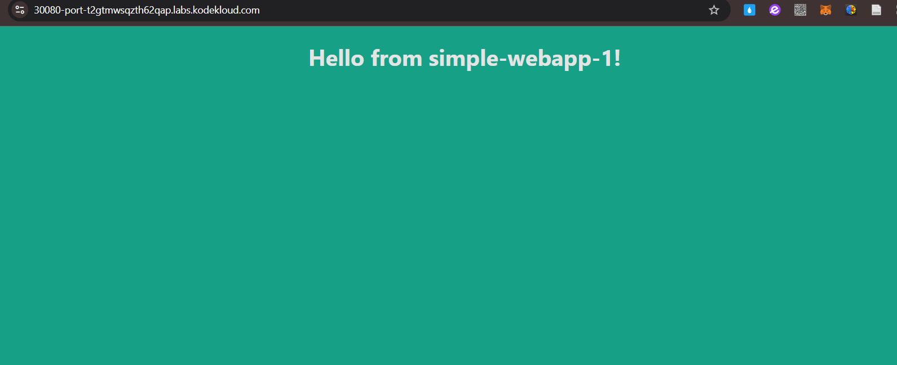

1.  Readliness and Liveness Probes 
    View the application by clicking on the 'Web Portal' link above your terminal.
    It may take a minute or two for the web app to come up. Monitor the status of the POD until it is ready.

        https://kubernetes.io/docs/concepts/configuration/liveness-readiness-startup-probes/

        - Liveness Probes:
            - Purpose: Detect when a container needs to be restarted.
            - Example: Catch deadlocks where the application is running but unable to make progress.
            - Behavior:
                - If the probe fails repeatedly, the kubelet restarts the container.
                - Does not wait for readiness probes to succeed before running.
            - Configuration:
                - Use initialDelaySeconds or a startup probe to delay execution for slow-starting containers.
            
        - Readiness Probes:
            - Purpose: Determine when a container is ready to accept traffic.
              - Useful for applications that perform time-consuming startup tasks (e.g., loading files, warming caches).
            - Behavior:
                - If the probe fails, Kubernetes removes the pod from all matching service endpoints.
                - Runs throughout the container's lifecycle.
            
        - Startup Probes:
            - Purpose: Verify whether the application has started successfully.
                - Designed for slow-starting containers to prevent premature failure by the kubelet.
            - Behavior:
                - Disables liveness and readiness checks until it succeeds.
                - Runs only during the startup phase, unlike liveness and readiness probes, which are periodic.
                
        

    1) A test script is provided that sends multiple requests to access the web application.
        Execute the script at /root/curl-test.sh. Run the command './curl-test.sh'

        controlplane ~ ➜  /root/curl-test.sh 
            Message from simple-webapp-1 : I am ready! OK
            Message from simple-webapp-1 : I am ready! OK
            Message from simple-webapp-1 : I am ready! OK

        We just created a new POD to scale the application. View the pods. Run the script again and view the results.
        The application takes 80 seconds to warm up.

        controlplane ~ ➜  './curl-test.sh'
            Message from simple-webapp-1 : I am ready! OK
            Message from simple-webapp-1 : I am ready! OK
            Failed
            Failed
            Message from simple-webapp-1 : I am ready! OK
            Failed
            Message from simple-webapp-1 : I am ready! OK
            Failed

        Notice the errors in the output of the script.

    2)  Update the newly created pod 'simple-webapp-2' with a readinessProbe using the given spec
        Spec is given on the below. Do not modify any other properties of the pod.
            Pod Name: simple-webapp-2
            Image Name: kodekloud/webapp-delayed-start
            Readiness Probe: httpGet
            Http Probe: /ready
            Http Port: 8080

            k get pod simple-webapp-2 -o yaml > simple-webapp-2.yaml
            vim simple-webapp-2.yaml
            k delete pod simple-webapp-2 --force 

        controlplane ~ ➜  k get pod simple-webapp-2 -o yaml > simple-webapp-2.yaml

        controlplane ~ ➜  vim simple-webapp-2.yaml 
                
                spec:
                    containers:
                    - env:
                        - name: APP_START_DELAY
                        value: "80"
                        image: kodekloud/webapp-delayed-start
                        imagePullPolicy: Always
                        name: simple-webapp
                        ports:
                        - containerPort: 8080 #Checked
                        protocol: TCP #Checked
                        resources: {}
                        terminationMessagePath: /dev/termination-log
                        terminationMessagePolicy: File
                        volumeMounts:
                        - mountPath: /var/run/secrets/kubernetes.io/serviceaccount
                        name: kube-api-access-crkxg
                             readOnly: true
                        #livenessProbe:
                        readinessProbe:
                        httpGet:
                            #httpHeaders:
                            #- name: Accept
                            # value: application/json
                            path: /ready
                            port: 8080
        (liveness probe, readiness probe & startup probe, See: https://kubernetes.io/docs/concepts/configuration/liveness-readiness-startup-probes/)

        在文件中似乎沒有看到對應的readiness範例，不過有:
        
            ports:
            - name: liveness-port
            containerPort: 8080

            livenessProbe:
                httpGet:
                    path: /healthz  (httpGet/ports/containerPort 等的參數，也可以設置在readinessProbe內)
                    port: liveness-port

        controlplane ~ ➜  k delete pod simple-webapp-2 --force
        Warning: Immediate deletion does not wait for confirmation that the running resource has been terminated. The resource may continue to run on the cluster indefinitely.
        pod "simple-webapp-2" force deleted

        controlplane ~ ➜  k create -f simple-webapp-2.yaml 
        pod/simple-webapp-2 created

        controlplane ~ ➜  k get pods
        NAME              READY   STATUS    RESTARTS   AGE
        simple-webapp-1   1/1     Running   0          33m
        simple-webapp-2   0/1     Running   0          3s

        
        Run the script again to test the web application. Notice that none of the requests fail now. Though all the requests hit the same POD.
        Execute the script at /root/curl-test.sh.

        controlplane ~ ➜  ./root/curl-test.sh

        OR:

        controlplane ~ ➜  bash /root/curl-test.sh
        Message from simple-webapp-2 : I am ready! OK

        Message from simple-webapp-2 : I am ready! OK

        Message from simple-webapp-2 : I am ready! OK

        Message from simple-webapp-1 : I am ready! OK

        
        Wait for the new POD to be ready and run the test again to see traffic distributed between both the PODs.

        Execute the script at /root/curl-test.sh.
        Once the simple-webapp-2 pod is ready, the traffic will be distributed to it as well.

        controlplane ~ ✖ ./curl-test.sh
        Message from simple-webapp-2 : I am ready! OK
        Message from simple-webapp-1 : I am ready! OK
        Message from simple-webapp-1 : I am ready! OK
        Message from simple-webapp-2 : I am ready! OK
        Message from simple-webapp-2 : I am ready! OK

    3)  What would happen if the application inside container on one of the PODs crashes?

        Try it by accessing url /crash of the application in your browser or run the crash-app.sh script. Then check the status of POD. Run the curl-test to see if users are impacted.

        option1: The pod is terminated 
        option2: New users are impacted
        option3: The container inside the pod is restarted

        controlplane ~ ➜  cat crash-app.sh 
        kubectl exec --namespace=kube-public curl -- wget -qO- http://webapp-service.default.svc.cluster.local:8080/crash

        controlplane ~ ➜  ./crash-app.sh 
        Message from simple-webapp-1 : Mayday! Mayday! Going to crash!
        controlplane ~ ➜  ./root/curl-test.sh
        -bash: ./root/curl-test.sh: No such file or directory

        controlplane ~ ✖ /root/curl-test.sh
        Message from simple-webapp-1 : I am ready! OK

        Message from simple-webapp-1 : I am ready! OK

        Message from simple-webapp-1 : I am ready! OK

        Message from simple-webapp-1 : I am ready! OK

        Message from simple-webapp-2 : I am ready! OK

        Message from simple-webapp-1 : I am ready! OK

        When the application crashes, the container is restarted. During this period the service directs users to the available POD, since the POD status is not READY.

        Answer: option3 The container inside the pod is restarted

        
        **WHY?????**
        What would happen if the application inside container on one of the PODs freezes?

        Try it by accessing url /freeze of the application in your browser or run the freeze-app.sh script. Then check the status of POD. Run the curl-test to see if users are impacted.

        option1: The pod is terminated 
        option2: users are not impacted  
        option3: The container inside the pod is restart 
        option4: New users are impacted 

        controlplane ~ ➜  './freeze-app.sh'
        nohup: appending output to 'nohup.out'

        controlplane ~ ➜  './curl-test.sh'
        Failed
        Failed
        Failed
        Failed
        Failed

        Liveness Probe 的作用：

        如果配置了 livenessProbe，Kubernetes 會定期檢查容器是否健康。
        當應用凍結時，livenessProbe 會失敗，Kubernetes 判定容器無法恢復，並重新啟動容器。
        curl-test.sh 測試輸出 "Failed"：

        表示應用未響應請求，這與應用程序凍結的狀態一致。
        Kubernetes 在檢測到容器健康狀態異常後，會重啟容器

        controlplane ~ ✖ k get pods
        NAME              READY   STATUS    RESTARTS   AGE
        simple-webapp-1   1/1     Running   0          15m
        simple-webapp-2   0/1     Running   0          4m36s

        Answer: option4 New users are impacted

    4)  Update both the pods with a livenessProbe using the given spec
        Delete and recreate the PODs.

        Pod Name: simple-webapp-1
        Image Name: kodekloud/webapp-delayed-start
        Liveness Probe: httpGet
        Http Probe: /live
        Http Port: 8080
        Period Seconds: 1
        Initial Delay: 80
        Pod Name: simple-webapp-2
        Image Name: kodekloud/webapp-delayed-start
        Liveness Probe: httpGet
        Http Probe: /live
        Http Port: 8080
        Initial Delay: 80
        Period Seconds: 1

        controlplane ~ ➜  vim simple-webapp-2.yaml 

        controlplane ~ ➜  k delete pod simple-webapp-2 --force
        Warning: Immediate deletion does not wait for confirmation that the running resource has been terminated. The resource may continue to run on the cluster indefinitely.
        pod "simple-webapp-2" force deleted

        controlplane ~ ✖ vim simple-webapp-2.yaml 

                apiVersion: v1
                kind: Pod
                metadata:
                creationTimestamp: "2025-01-09T14:07:24Z"
                labels:
                    name: simple-webapp
                name: simple-webapp-1
                namespace: default
                resourceVersion: "905"
                uid: 59eb5575-b9f1-430a-ae4c-a34b85ac4364
                spec:
                containers:
                - env:
                - name: APP_START_DELAY
                value: "80"
                image: kodekloud/webapp-delayed-start
                imagePullPolicy: Always
                name: simple-webapp
                ports:
                - containerPort: 8080 (Checked)
                protocol: TCP
                resources: {}
                terminationMessagePath: /dev/termination-log
                terminationMessagePolicy: File
                volumeMounts:
                - mountPath: /var/run/secrets/kubernetes.io/serviceaccount
                name: kube-api-access-mdqmm
                readOnly: true

                readinessProbe: (上一題已建立)
                httpGet:
                    path: /ready
                    port: 8080
                livenessProbe: (僅需新增livenssProb欄位)
                httpGet:
                    path: /live
                    port: 8080
                initialDelaySeconds: 80
                periodSeconds: 1
            dnsPolicy: ClusterFirst
            ...

        controlplane ~ ➜  k apply -f simple-webapp-2.yaml
        pod/simple-webapp-2 created

        controlplane ~ ✖ k get pods
        NAME              READY   STATUS    RESTARTS   AGE
        simple-webapp-1   1/1     Running   0          37m
        simple-webapp-2   0/1     Running   0          12s

        controlplane ~ ➜  touch simple-webapp-1.yaml

        controlplane ~ ➜  cat simple-webapp-2.yaml > simple-webapp-1.yaml 

        controlplane ~ ➜  vim simple-webapp-1.yaml 

        controlplane ~ ➜  k delete pod simple-webapp-1 --force
        Warning: Immediate deletion does not wait for confirmation that the running resource has been terminated. The resource may continue to run on the cluster indefinitely.
        pod "simple-webapp-1" force deleted

        controlplane ~ ➜  k apply -f simple-webapp-1.yaml
        pod/simple-webapp-1 created

        controlplane ~ ➜  k get pods
        NAME              READY   STATUS    RESTARTS      AGE
        simple-webapp-1   0/1     Running   0             3s
        simple-webapp-2   0/1     Running   1 (49s ago)   99s

        
        Freeze the application again and notice what happens. When a POD freezes, it would be restarted automatically.

        Try it by accessing url /freeze of the application in your browser. Then check the status of POD. Run the curl-test to see if users are impacted.

        controlplane ~ ➜  ./freeze-app.sh 
        nohup: appending output to 'nohup.out'

        controlplane ~ ➜  k get pods
        NAME              READY   STATUS    RESTARTS   AGE
        simple-webapp-1   0/1     Running   0          71s
        simple-webapp-2   0/1     Running   0          68s

        controlplane ~ ➜  ./curl-test.sh 
        Failed
        Failed
        Failed (第一次運行看到並非立即使流量可以正常訪問)
        Failed
        Message from simple-webapp-1 : I am ready! OK
        Message from simple-webapp-1 : I am ready! OK
        Message from simple-webapp-1 : I am ready! OK
        Message from simple-webapp-1 : I am ready! OK
        ^C
        Message from simple-webapp-1 : I am ready! OK
        Message from simple-webapp-1 : I am ready! OK

        controlplane ~ ➜  ./curl-test.sh  (第二次運行發現已完全可以使流量訪問webapp1 跟webapp2)
        Message from simple-webapp-1 : I am ready! OK
        Message from simple-webapp-1 : I am ready! OK
        Message from simple-webapp-1 : I am ready! OK
        Message from simple-webapp-2 : I am ready! OK
        Message from simple-webapp-2 : I am ready! OK
                        

2.  Container Logging

        k create -f event-simulator.yaml
        k logs -f event-simulator.yaml (view the logs in the console)
    
    1)  A user - USER5 - has expressed concerns accessing the application. Identify the cause of the issue.

        Inspect the logs of the POD

        option1: Accont does not exist
        option2: Account locked due to Many Failed Attempts
        option3: Application Crashed
        option4: Item Out of Stock

        controlplane ~ ➜  k logs -h
        Print the logs for a container in a pod or specified resource. If the pod has
        only one container, the container name is optional.

        Examples:
        # Return snapshot logs from pod nginx with only one container
        kubectl logs nginx

        controlplane ~ ➜  k logs webapp-1 
        [2025-01-09 14:55:00,099] INFO in event-simulator: USER3 is viewing page1
        [2025-01-09 14:55:01,100] INFO in event-simulator: USER1 logged out
        [2025-01-09 14:55:02,101] INFO in event-simulator: USER4 logged in
        [2025-01-09 14:55:03,102] INFO in event-simulator: USER3 logged in
        [2025-01-09 14:55:04,103] INFO in event-simulator: USER2 is viewing page2
        [2025-01-09 14:55:05,104] WARNING in event-simulator: USER5 Failed to Login as the account is locked due to MANY FAILED ATTEMPTS.
        [2025-01-09 14:55:05,104] INFO in event-simulator: USER2 logged out
        [2025-01-09 14:55:06,106] INFO in event-simulator: USER2 is viewing page3
        [2025-01-09 14:55:07,107] INFO in event-simulator: USER1 is viewing page3
        [2025-01-09 14:55:08,108] WARNING in event-simulator: USER7 Order failed as the item is OUT OF STOCK.
        [2025-01-09 14:55:08,108] INFO in event-simulator: USER3 logged out
        [2025-01-09 14:55:09,109] INFO in event-simulator: USER3 is viewing page1
        [2025-01-09 14:55:10,110] WARNING in event-simulator: USER5 Failed to Login as the account is locked due to MANY FAILED ATTEMPTS.
        [2025-01-09 14:55:10,111] INFO in event-simulator: USER4 logged out
        [2025-01-09 14:55:11,111] INFO in event-simulator: USER2 is viewing page3
        [2025-01-09 14:55:12,111] INFO in event-simulator: USER1 logged out
        [2025-01-09 14:55:13,113] INFO in event-simulator: USER3 logged out
        [2025-01-09 14:55:14,114] INFO in event-simulator: USER1 is viewing page3
        [2025-01-09 14:55:15,115] WARNING in event-simulator: USER5 Failed to Login as the account is locked due to MANY FAILED ATTEMPTS.
        [2025-01-09 14:55:15,115] INFO in event-simulator: USER1 logged out
        [2025-01-09 14:55:16,115] WARNING in event-simulator: USER7 Order failed as the item is OUT OF STOCK.

        Answer: option2 Account locked due to Many Failed Attempts
    
    2)  We have deployed a new POD - webapp-2 - hosting an application. Inspect it. Wait for it to start.
           
        A user is reporting issues while trying to purchase an item. Identify the user and the cause of the issue.
        Inspect the logs of the webapp in the POD

            kubectl logs webapp-2 -c simple-webapp

        k logs -h
        ... 
        Usage:
        kubectl logs [-f] [-p] (POD | TYPE/NAME) [-c CONTAINER] [options]

        Use "kubectl options" for a list of global command-line options (applies to all
        commands).
        ...

        controlplane ~ ➜  k describe pod webapp-2 
        Name:             webapp-2
        Namespace:        default
        Priority:         0
        Service Account:  default
        Node:             controlplane/192.168.187.70
        Start Time:       Thu, 09 Jan 2025 15:04:59 +0000
        Labels:           name=webapp-2
        Annotations:      <none>
        Status:           Running
        IP:               10.42.0.10
        IPs:
        IP:  10.42.0.10
        Containers:
        **simple-webapp**:
        ...

        controlplane ~ ✖ k logs webapp-2 -c simple-webapp
        (-c: In a multiple container scenario, indicate specific container would be easier to track in the logs)

        controlplane ~ ➜  kubectl logs webapp-2 -c simple-webapp
        [2025-01-09 14:59:44,709] INFO in event-simulator: USER1 is viewing page2
        [2025-01-09 14:59:45,710] INFO in event-simulator: USER4 is viewing page1
        [2025-01-09 14:59:46,711] INFO in event-simulator: USER2 is viewing page3
        [2025-01-09 14:59:47,712] INFO in event-simulator: USER3 is viewing page3
        [2025-01-09 14:59:48,713] INFO in event-simulator: USER2 is viewing page3
        [2025-01-09 14:59:49,714] WARNING in event-simulator: USER5 Failed to Login as the account is locked due to MANY FAILED ATTEMPTS.
        [2025-01-09 14:59:49,714] INFO in event-simulator: USER2 is viewing page2
        [2025-01-09 14:59:50,715] INFO in event-simulator: USER2 is viewing page1
        [2025-01-09 14:59:51,716] INFO in event-simulator: USER3 is viewing page3
        [2025-01-09 14:59:52,716] WARNING in event-simulator: USER30 Order failed as the item is OUT OF STOCK.

        Answer: User 30
            

3.  Monitor and Debug Application

    To show the CPU and memory conception of each of the nodes:

        k top node

    To view the performance metrics of pod in Kubernetes:
    
        k top pod

    1)  Let us deploy the Metrics Server to enable monitoring of the PODs and Nodes in the cluster.
        Deploy the Metrics Server in your Kubernetes cluster by applying the latest release components.yaml manifest using the following command:

        Run the kubectl apply -f https://github.com/kubernetes-sigs/metrics-server/releases/latest/download/components.yaml

        controlplane ~ ➜  kubectl apply -f https://github.com/kubernetes-sigs/metrics-server/releases/latest/download/components.yaml
        serviceaccount/metrics-server created
        clusterrole.rbac.authorization.k8s.io/system:aggregated-metrics-reader created
        clusterrole.rbac.authorization.k8s.io/system:metrics-server created
        rolebinding.rbac.authorization.k8s.io/metrics-server-auth-reader created
        clusterrolebinding.rbac.authorization.k8s.io/metrics-server:system:auth-delegator created
        clusterrolebinding.rbac.authorization.k8s.io/system:metrics-server created
        service/metrics-server created
        deployment.apps/metrics-server created
        apiservice.apiregistration.k8s.io/v1beta1.metrics.k8s.io created

    2)  It takes a few minutes for the metrics server to start gathering data.
        Run the kubectl top node command and wait for a valid output.

        controlplane ~ ➜  k top node
        NAME           CPU(cores)   CPU%   MEMORY(bytes)   MEMORY%   
        controlplane   203m         1%     894Mi           1%        
        node01         32m          0%     182Mi           0%        

        Identify the node that consumes the most CPU(cores).

        Answer: controlplane

        controlplane ~ ➜  k top node
        NAME           CPU(cores)   CPU%   MEMORY(bytes)   MEMORY%   
        controlplane   219m         1%     892Mi           1%        
        node01         33m          0%     185Mi           0%    

        Answer: controplane

        
        Identify the POD that consumes the most Memory(bytes) in default namespace.

        controlplane ~ ➜  k top pod
        NAME       CPU(cores)   MEMORY(bytes)   
        elephant   14m          30Mi            
        lion       1m           16Mi            
        rabbit     103m         250Mi           

        Answer: rabbit

        Identify the POD that consumes the least CPU(cores) in default namespace.

        Answer: lion

