1. Services
    4 Types of Services:
    ClusterIP
    NodePort
    LoadBalancer
    ExternalName
    https://kubernetes.io/docs/concepts/services-networking/service/

    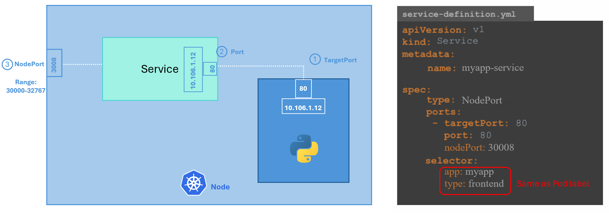
    
    Use ClusterIP for internal communication between services within the cluster.
    Use NodePort when external access to the service is needed, especially for testing or development, but note that it's less flexible and robust compared to other options like LoadBalancer or Ingress for production environments.

    

    1)  How many Services exist on the system?
        In the current(default) namespace

        controlplane ~ ➜  k get service
        NAME         TYPE        CLUSTER-IP   EXTERNAL-IP   PORT(S)   AGE
        kubernetes   ClusterIP   10.43.0.1    <none>        443/TCP   2m59s

        What is the type of the default kubernetes service?
        Answer: ClusterIP

        What is the targetPort configured on the kubernetes service?

        controlplane ~ ➜  k describe service kubernetes 
        Name:                     kubernetes
        Namespace:                default
        Labels:                   component=apiserver
                                provider=kubernetes
        Annotations:              <none>
        Selector:                 <none>
        Type:                     ClusterIP
        IP Family Policy:         SingleStack
        IP Families:              IPv4
        IP:                       10.43.0.1
        IPs:                      10.43.0.1
        Port:                     https  443/TCP
        **TargetPort:               6443/TCP**
        Endpoints:                192.168.202.22:6443
        Session Affinity:         None
        Internal Traffic Policy:  Cluster
        Events:                   <none>

        Answer: 6443

        How many labels are configured on the kubernetes service?
        Answer: 2

        How many Endpoints are attached on the kubernetes service?
        Endpoints:   192.168.202.22:6443

        Answer: 1

    2)  How many Deployments exist on the system now?
        In the current(default) namespace

        controlplane ~ ➜  k get deploy
        NAME                       READY   UP-TO-DATE   AVAILABLE   AGE
        simple-webapp-deployment   4/4     4            4           4m17s

        Answer: 1

        What is the image used to create the pods in the deployment?

        controlplane ~ ➜  k describe deploy simple-webapp-deployment 
        Name:                   simple-webapp-deployment
        Namespace:              default
        CreationTimestamp:      Wed, 22 Jan 2025 10:54:09 +0000
        Labels:                 <none>
        Annotations:            deployment.kubernetes.io/revision: 1
        Selector:               name=simple-webapp
        Replicas:               4 desired | 4 updated | 4 total | 4 available | 0 unavailable
        StrategyType:           RollingUpdate
        MinReadySeconds:        0
        RollingUpdateStrategy:  25% max unavailable, 25% max surge
        Pod Template:
        Labels:  name=simple-webapp
        Containers:
        simple-webapp:
            Image:         **kodekloud/simple-webapp:red**
            Port:          8080/TCP
            Host Port:     0/TCP
            Environment:   <none>
            Mounts:        <none>
        Volumes:         <none>
        Node-Selectors:  <none>
        Tolerations:     <none>
        ...

        Answer: kodekloud/simple-webapp:red

        Are you able to accesss the Web App UI?
        Try to access the Web Application UI using the tab simple-webapp-ui above the terminal.

        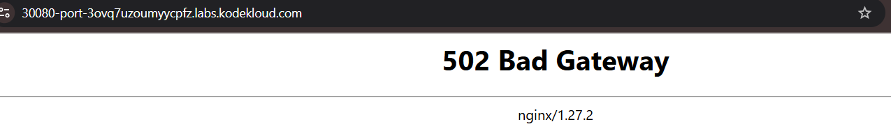

        Answer: No access

        Create a new service to access the web application using the service-definition-1.yaml file.
            Name: webapp-service
            Type: NodePort
            targetPort: 8080
            port: 8080
            nodePort: 30080
            selector:
            name: simple-webapp

        controlplane ~ ➜  ls
        service-definition-1.yaml

        controlplane ~ ➜  vim service-definition-1.yaml 

        controlplane ~ ➜  k create -f service-definition-1.yaml 
        The Service "" is invalid: metadata.name: Required value: name or generateName is required

        controlplane ~ ✖ vim service-definition-1.yaml 

        controlplane ~ ➜  k create -f service-definition-1.yaml 
        service/webapp-service created

        controlplane ~ ✖ k get svc
        NAME             TYPE        CLUSTER-IP      EXTERNAL-IP   PORT(S)          AGE
        kubernetes       ClusterIP   10.43.0.1       <none>        443/TCP          18m
        webapp-service   NodePort    10.43.251.207   <none>        8080:30080/TCP   6s

        Access the web application using the tab simple-webapp-ui above the terminal window.
        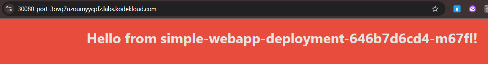

        

        

2.  Ingress Networking
    
    Introduction to Ingress:
    - Ingress: Manages external HTTP/HTTPS traffic and routes it to Kubernetes services within the cluster.
    - Eliminates the need for multiple NodePort or LoadBalancer services by providing centralized routing.

    When to Use Ingress:
    - Consolidate traffic for multiple services under a single external URL.
    - Simplify SSL/HTTPS management for all services.
    - Implement rules for routing traffic based on:
        - URL paths (e.g., /wear for one app, /watch for another).
        - Hostnames (e.g., wear.example.com, watch.example.com).
    - Avoid multiple load balancers to save cost and configuration effort.

    Ingress Controller:
    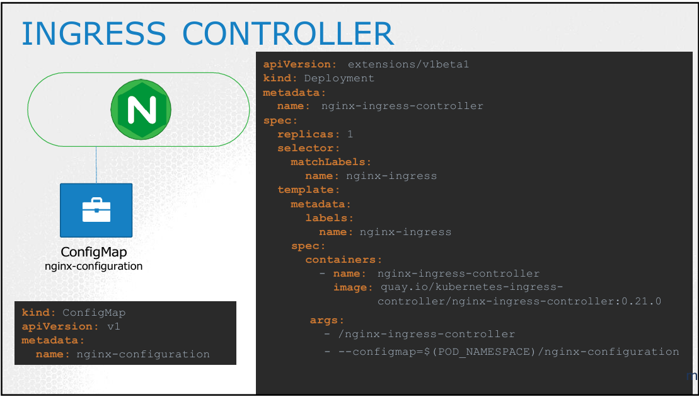
    - Acts as a Layer 7 load balancer.
    - Needs to be deployed explicitly (not included by default).
    - Popular options:
        - NGINX (widely used and maintained by Kubernetes).
        - Others: GCE, Traefik, HAProxy, Istio.
    - Handles:
        - Monitoring Kubernetes for Ingress resources.
        - Configuring routing rules dynamically.
    Ingress Resources
    Describes how external requests are routed to services within the Kubernetes cluster.

    Usage:
    a. Path-based Routing:
      - Routes traffic based on the URL path.
        - Examples:
          - /wear -> wear-service
          - /watch -> watch-service
    b. Host-based Routing:
      - Routes traffic based on the requested domain name.
        - Examples:
          - wear.my-online-store.com -> wear-service
          - watch.my-online-store.com -> watch-service
    c. Default Backend:
      - Handles requests that do not match any specified path or hostname.
      - Typically used to display a "404 Not Found" page.

    
    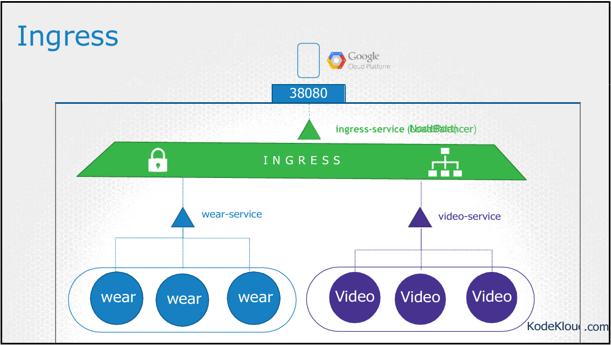

    Users: External traffic arriving from users.
    Ingress Controller: Handles incoming traffic, routes it based on rules (e.g., URL paths).
    Services: Backend services (e.g., Wear and Watch services) targeted by the routing rules.
    Pods: The actual application pods behind each service.

    Create Ingress in Imperative Way:
    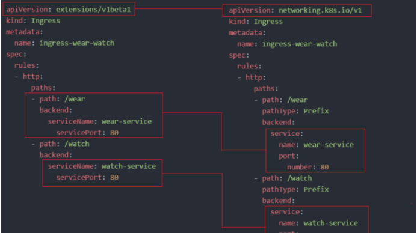

        kubectl create ingress <ingress-name> --rule="host/path=service:port"
        Eg. kubectl create ingress ingress-test --rule="wear.my-online-store.com/wear*=wear-service:80"

    LAB 1: 

    1)  We have deployed Ingress Controller, resources and applications. Explore the setup.
        Note: They are in different namespaces.

        controlplane ~ ➜  k get ingress --all-namespaces 
        NAMESPACE   NAME                 CLASS    HOSTS   ADDRESS          PORTS   AGE
        app-space   ingress-wear-watch   <none>   *       172.20.204.195   80      46s

        
        Which namespace is the Ingress Controller deployed in?
        Use the command kubectl get all -A and identify the namespace of Ingress Controller.

            k get all -A (--all-namespace) (List All Resources)

        controlplane ~ ➜  k get all -A
        NAMESPACE       NAME                                            READY   STATUS      RESTARTS   AGE
        app-space       pod/default-backend-5cd488d85c-pbt4w            1/1     Running     0          102s
        app-space       pod/webapp-video-cb475db9c-xttz5                1/1     Running     0          102s
        app-space       pod/webapp-wear-6886df6554-4x2p2                1/1     Running     0          102s
        ingress-nginx   pod/ingress-nginx-admission-create-84cqg        0/1     Completed   0          100s
        ingress-nginx   pod/ingress-nginx-admission-patch-k7v46         0/1     Completed   1          100s
        ingress-nginx   pod/ingress-nginx-controller-7f45764b55-w7gsn   1/1     Running     0          100s
        kube-flannel    pod/kube-flannel-ds-6w962                       1/1     Running     0          3m11s
        kube-system     pod/coredns-77d6fd4654-7chqd                    1/1     Running     0          3m11s
        kube-system     pod/coredns-77d6fd4654-nr7r9                    1/1     Running     0          3m11s
        kube-system     pod/etcd-controlplane                           1/1     Running     0          3m18s
        kube-system     pod/kube-apiserver-controlplane                 1/1     Running     0          3m18s
        kube-system     pod/kube-controller-manager-controlplane        1/1     Running     0          3m18s
        kube-system     pod/kube-proxy-bz95t                            1/1     Running     0          3m11s
        kube-system     pod/kube-scheduler-controlplane                 1/1     Running     0          3m18s

        NAMESPACE       NAME                                         TYPE        CLUSTER-IP       EXTERNAL-IP   PORT(S)                      AGE
        app-space       service/default-backend-service              ClusterIP   172.20.4.70      <none>        80/TCP                       101s
        app-space       service/video-service                        ClusterIP   172.20.223.59    <none>        8080/TCP                     102s
        app-space       service/wear-service                         ClusterIP   172.20.46.31     <none>        8080/TCP                     102s
        default         service/kubernetes                           ClusterIP   172.20.0.1       <none>        443/TCP                      3m19s
        ingress-nginx   service/**ingress-nginx-controller**             NodePort    172.20.204.195   <none>        80:30080/TCP,443:32103/TCP   100s
        ingress-nginx   service/ingress-nginx-controller-admission   ClusterIP   172.20.101.71    <none>        443/TCP                      100s
        kube-system     service/kube-dns                             ClusterIP   172.20.0.10      <none>        53/UDP,53/TCP,9153/TCP       3m18s

        NAMESPACE      NAME                             DESIRED   CURRENT   READY   UP-TO-DATE   AVAILABLE   NODE SELECTOR            AGE
        kube-flannel   daemonset.apps/kube-flannel-ds   1         1         1       1            1           <none>                   3m17s
        kube-system    daemonset.apps/kube-proxy        1         1         1       1            1           kubernetes.io/os=linux   3m18s

        NAMESPACE       NAME                                       READY   UP-TO-DATE   AVAILABLE   AGE
        app-space       deployment.apps/default-backend            1/1     1            1           102s
        app-space       deployment.apps/webapp-video               1/1     1            1           102s
        app-space       deployment.apps/webapp-wear                1/1     1            1           102s
        ingress-nginx   deployment.apps/ingress-nginx-controller   1/1     1            1           100s
        kube-system     deployment.apps/coredns                    2/2     2            2           3m18s

        NAMESPACE       NAME                                                  DESIRED   CURRENT   READY   AGE
        app-space       replicaset.apps/default-backend-5cd488d85c            1         1         1       102s
        app-space       replicaset.apps/webapp-video-cb475db9c                1         1         1       102s
        app-space       replicaset.apps/webapp-wear-6886df6554                1         1         1       102s
        ingress-nginx   replicaset.apps/ingress-nginx-controller-7f45764b55   1         1         1       100s
        kube-system     replicaset.apps/coredns-77d6fd4654                    2         2         2       3m11s

        NAMESPACE       NAME                                       STATUS     COMPLETIONS   DURATION   AGE
        ingress-nginx   job.batch/ingress-nginx-admission-create   Complete   1/1           7s         100s
        ingress-nginx   job.batch/ingress-nginx-admission-patch    Complete   1/1           8s         100s`

        By the above:
        ingress-nginx   service/ingress-nginx-controller             NodePort    172.20.204.195   <none>        80:30080/TCP,443:32103/TCP   100s

        Answer: ingress-nginx

        
        What is the name of the Ingress Controller Deployment?

        Answer: ingress-nginx-controller

        
        Which namespace are the applications deployed in?
        Also runs: 
            
            k get all -A

        NAMESPACE       NAME                                       READY   UP-TO-DATE   AVAILABLE   AGE
        app-space       deployment.apps/default-backend            1/1     1            1           102s
        app-space       deployment.apps/webapp-video               1/1     1            1           102s
        app-space       deployment.apps/webapp-wear                1/1     1            1           102s
        ingress-nginx   deployment.apps/ingress-nginx-controller   1/1     1            1           100s
        kube-system     deployment.apps/coredns                    2/2     2            2           3m18s

        As Above, there're mostly on app-space
        Answer: app-space
        
        How many applications are deployed in the app-space namespace?
        Count the number of deployments in this namespace.

        controlplane ~ ➜  k get all -n app-space | grep -i "deployment"
        deployment.apps/default-backend   1/1     1            1           12m
        deployment.apps/webapp-video      1/1     1            1           12m
        deployment.apps/webapp-wear       1/1     1            1           12m

        Answer: 3 (applications)

        Which namespace is the Ingress Resource deployed in?
        Hint: Run 
            
            kubectl get ingress --all-namespaces

        controlplane ~ ➜  k get ingress -A
        NAMESPACE   NAME                 CLASS    HOSTS   ADDRESS          PORTS   AGE
        app-space   ingress-wear-watch   <none>   *       172.20.204.195   80      14m

        controlplane ~ ➜  k get ingress --all-namespaces 
        NAMESPACE   NAME                 CLASS    HOSTS   ADDRESS          PORTS   AGE
        app-space   ingress-wear-watch   <none>   *       172.20.204.195   80      15m

        Answer: app-space

        
        What is the name of the Ingress Resource?
        Answer: ingress-wear-watch
        
        
    2)  What is the Host configured on the Ingress Resource?
        The host entry defines the domain name that users use to reach the application like www.google.com

        controlplane ~ ➜  k get ingress -A
        NAMESPACE   NAME                 CLASS    HOSTS   ADDRESS          PORTS   AGE
        app-space   ingress-wear-watch   <none>   *       172.20.204.195   80      14m

        Answer: All hosts (*)

        
        What backend is the /wear path on the Ingress configured with?
            option1: video-service
            option2: wear-service

        controlplane ~ ➜  k -n app-space describe ingress ingress-wear-watch 
        Name:             ingress-wear-watch
        Labels:           <none>
        Namespace:        app-space
        Address:          172.20.204.195
        Ingress Class:    <none>
        Default backend:  <default>
        Rules:
        Host        Path  Backends
        ----        ----  --------
        *           
                    /wear    wear-service:8080 (172.17.0.4:8080)
                    /watch   video-service:8080 (172.17.0.5:8080)
        Annotations:  nginx.ingress.kubernetes.io/rewrite-target: /
                    nginx.ingress.kubernetes.io/ssl-redirect: false
        Events:
        Type    Reason  Age                From                      Message
        ----    ------  ----               ----                      -------
        Normal  Sync    19m (x2 over 19m)  nginx-ingress-controller  Scheduled for sync

        From: /wear    wear-service:8080 (172.17.0.4:8080)
        Answer: option2 wear-service

        
        At what path is the video streaming application made available on the Ingress?

        From: /watch   video-service:8080 (172.17.0.5:8080)

        Answer:  /watch   
        
        
        If the requirement does not match any of the configured paths in the Ingress, to which service are the requests forwarded?  
            option1: No Service
            option2: default-backend
            option3: default-backend-service
            option4: The last service configured

            k -n app-space describe ingress ingress-wear-watch 
            k get deploy ingress-nginx-controller -o yaml -n ingress-nginx (檢查 Ingress Controller 的部署清單)

        controlplane ~ ➜  k -n app-space describe ingress ingress-wear-watch 
        Name:             ingress-wear-watch
        Labels:           <none>
        Namespace:        app-space
        Address:          172.20.204.195
        Ingress Class:    <none>
        Default backend:  <default>  => You Need to check the ingress controller's manifest

        Hint: Execute the command kubectl describe ingress --namespace app-space and examine the Default backend field. If it displays <default>, proceed to **inspect the ingress controller's manifest** by executing kubectl get deploy ingress-nginx-controller -n ingress-nginx -o yaml. In the manifest, search for the argument --default-backend-service

        Ingress 是用來管理外部流量進入服務的路由規則。如果一個請求沒有符合任何已配置的路徑規則 (即 Ingress Resources 中定義的 rules)，該請求會被轉發到 Default backend。

        在輸出中，Default backend: <default> 表示 Ingress 的預設行為尚未在 Ingress Resource 中直接定義，因此我們需要檢查 Ingress Controller 的配置，來了解預設的後端服務是什麼。

        為什麼需要檢查 Ingress Controller？
        Default backend 的實際定義可能位於 Ingress Controller 層級：

        當 Ingress Resources 中的 Default backend 顯示為 <default> 時，表示該行為由 Ingress Controller 本身的預設配置來決定。
        因此，您需要檢查 Ingress Controller（此處部署在 ingress-nginx namespace）的具體配置，來確認預設的後端服務。
        
        From 1), we noticed that the ingress controller is deployed on ingress-nginx, so:

            k get deploy ingress-nginx-controller -o yaml -n ingress-nginx

        在部署清單中，搜尋 --default-backend-service 參數。這個參數會明確指定預設的後端服務名稱（例如：default-backend-service）。
        如果未設置 --default-backend-service：

        Ingress Controller 可能會自動回退到其內建的 404 頁面或一個未指定的預設行為（取決於具體的 Ingress Controller 實現）。

        controlplane ~ ✖ k get deploy ingress-nginx-controller -o yaml -n ingress-nginx |grep -i "default"
                    - -**-default-backend-service**=app-space/default-backend-service
                  schedulerName: default-scheduler
                      defaultMode: 420

        Answer: option3 default-backend-service

        
        Now view the Ingress Service using the tab at the top of the terminal. Which page do you see?
        Click on the tab named Ingress.
        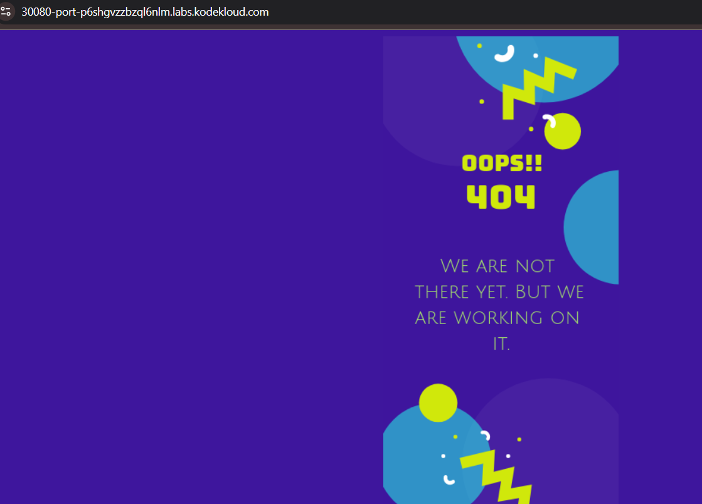

        Answer: a 404 file

    3)  View the applications by appending /wear and /watch to the URL you opened in the previous step.
        
        
        
        You are requested to change the URLs at which the applications are made available.
        Make the video application available at /stream.   
            Ingress: ingress-wear-watch
            Path: /stream
            Backend Service: video-service
            Backend Service Port: 8080  
        
        controlplane ~ ➜  k get ingress -A
        NAMESPACE   NAME                 CLASS    HOSTS   ADDRESS          PORTS   AGE
        app-space   ingress-wear-watch   <none>   *       172.20.204.195   80      44m

        controlplane ~ ➜  k edit ingress -n app-space ingress-wear-watch 
        ...

            spec:
                rules:
                - http:
                    paths:
                    - backend:
                        service:
                            name: wear-service
                            port:
                            number: 8080
                        path: /wear
                        pathType: Prefix
                    - backend:
                        service:
                            name: video-service
                            port:
                            number: 8080
                        path: #/watch  更改為: /stream
                        pathType: Prefix
                status:
                loadBalancer:
                    ingress:
                    - ip: 172.20.204.195
        
        ingress.networking.k8s.io/ingress-wear-watch edited
        
        View the Video application using the /stream URL in your browser.
        Click on the Ingress tab above your terminal, if its not open already, and append /stream to the URL in the browser.
        
        

        (Now the /watch path will return 404.)

        
        A user is trying to view the /eat URL on the Ingress Service. Which page would he see?
        If not open already, click on the Ingress tab above your terminal, and append /eat to the URL in the browser.

        Answer: 404 Error Page

    4)  Due to increased demand, your business decides to take on a new venture. You acquired a food delivery company. 
        Their applications have been migrated over to your cluster.

        Inspect the new deployments in the app-space namespace.

        controlplane ~ ➜  k get deploy -n app-space
        NAME              READY   UP-TO-DATE   AVAILABLE   AGE
        default-backend   1/1     1            1           52m
        webapp-food       1/1     1            1           44s
        webapp-video      1/1     1            1           52m
        webapp-wear       1/1     1            1           52m

        
        You are requested to add a new path to your ingress to make the food delivery application available to your customers.
        Make the new application available at /eat.
            Ingress: ingress-wear-watch
            Path: /eat
            Backend Service: food-service
            Backend Service Port: 8080

        controlplane ~ ➜  k edit ingress -n app-space ingress-wear-watch 
        ...

            spec:
                rules:
                - http:
                    paths:
                    - backend:
                        service:
                            name: wear-service
                            port:
                            number: 8080
                        path: /wear
                        pathType: Prefix
                    - backend:
                        service:
                            name: video-service
                            port:
                            number: 8080
                        path: /stream
                        pathType: Prefix
                    - backend: (添加此block)
                        service:
                            name: food-service
                            port: 
                            number: 8080
                        path: /eat
                        pathType: Prefix
            
        ingress.networking.k8s.io/ingress-wear-watch edited

        
        View the Food delivery application using the /eat URL in your browser.
        Click on the Ingress tab above your terminal, if its not open already, and append /eat to the URL in the browser.
        

    5)  A new payment service has been introduced. Since it is critical, the new application is deployed in its own namespace.
        Identify the namespace in which the new application is deployed.

        controlplane ~ ➜  k get deploy -A
        NAMESPACE        NAME                       READY   UP-TO-DATE   AVAILABLE   AGE
        app-space        default-backend            1/1     1            1           58m
        app-space        webapp-food                1/1     1            1           6m43s
        app-space        webapp-video               1/1     1            1           58m
        app-space        webapp-wear                1/1     1            1           58m
        critical-space   webapp-pay                 1/1     1            1           114s
        ingress-nginx    ingress-nginx-controller   1/1     1            1           58m
        kube-system      coredns                    2/2     2            2           59m

        Answer: critical-space

        
        What is the name of the deployment of the new application?
        Answer: webapp-pay 

        You are requested to make the new application available at /pay.
        Identify and implement the best approach to making this application available on the ingress controller and test to make sure its working. Look into annotations: rewrite-target as well.
            Ingress Created
            Path: /pay
            Configure correct backend service
            Configure correct backend port

        Hint: Create a new Ingress for the new pay application in the critical-space namespace.
        Use the command kubectl get svc -n critical-space to know the service and port details.

            k get service -n critical-space 

        controlplane ~ ✖ k get service -n critical-space 
        NAME          TYPE        CLUSTER-IP      EXTERNAL-IP           PORT(S)    AGE
        pay-service   ClusterIP   **172.20.15.149**   <none>        **8282/TCP**   4m22s

        controlplane ~ ✖ k get ingress -n app-space ingress-wear-watch -o yaml > ingress-pay-service.yaml

        controlplane ~ ➜  vim ingress-pay-service.yaml 

            apiVersion: networking.k8s.io/v1
            kind: Ingress
            metadata:
            annotations:
                nginx.ingress.kubernetes.io/rewrite-target: /
                nginx.ingress.kubernetes.io/ssl-redirect: "false"
            creationTimestamp: "2025-01-22T16:08:54Z"
            generation: 2
            name: ingress-pay-service (變更)
            namespace: critical-space
            resourceVersion: "2533"
            uid: a3c6fcd1-7f1b-493b-af7c-e45e15f3b349
            spec:
            rules:
            - http:
                paths:
                - backend:
                    service:
                        name: pay-service (變更)
                        port:
                        number: 8282 (變更為與critical-space Service相同的external port)
                    path: /pay (變更)
                    pathType: Prefix
            status:
            loadBalancer:
                ingress:
                - ip: 172.20.187.21 (變更為與critical-space Service相同的ClusterIP)

        controlplane ~ ➜  k create -f ingress-pay-service.yaml 
        ingress.networking.k8s.io/ingress-pay-service created

        controlplane ~ ➜  k get ingress -A
        NAMESPACE        NAME                  CLASS    HOSTS   ADDRESS         PORTS   AGE
        app-space        ingress-wear-watch    <none>   *       172.20.187.21   80      18m
        critical-space   ingress-pay-service   <none>   *       172.20.187.21   80      75s

        
        View the Payment application using the /pay URL in your browser.
        Click on the Ingress tab above your terminal, if its not open already, and append /pay to the URL in the browser.
        

    LAB 2: 

    1)  We have deployed two applications. Explore the setup.
        Note: They are in a different namespace.

        controlplane ~ ➜  k get deploy -A
        NAMESPACE     NAME              READY   UP-TO-DATE   AVAILABLE   AGE
        app-space     default-backend   1/1     1            1           87s
        app-space     webapp-video      1/1     1            1           87s
        app-space     webapp-wear       1/1     1            1           87s
        kube-system   coredns           2/2     2            2           2m49s

        Let us now deploy an Ingress Controller. First, create a namespace called ingress-nginx.
        We will isolate all ingress related objects into its own namespace.
        
        controlplane ~ ➜  k create ns ingress-nginx
        namespace/ingress-nginx created

        The NGINX Ingress Controller requires a ConfigMap object. Create a ConfigMap object with name ingress-nginx-controller in the ingress-nginx namespace.

        No data needs to be configured in the ConfigMap.

        controlplane ~ ➜  k create configmap ingress-nginx-controller -n ingress-nginx 
        configmap/ingress-nginx-controller created

        The NGINX Ingress Controller requires two ServiceAccounts. Create both ServiceAccount with name ingress-nginx and ingress-nginx-admission in the ingress-nginx namespace.
        Use the spec provided below.
            Name: ingress-nginx
            Name: ingress-nginx-admission
        
        controlplane ~ ➜  k create se
        secret          (Create a secret using a specified subcommand)
        serviceaccount  (Create a service account with the specified name)
        service         (Create a service using a specified subcommand)

        controlplane ~ ➜  k create sa ingress-nginx -n ingress-nginx 
        serviceaccount/ingress-nginx created

        controlplane ~ ➜  k create sa ingress-nginx-admission -n ingress-nginx 
        serviceaccount/ingress-nginx-admission created

        
    2)  We have created the Roles, RoleBindings, ClusterRoles, and ClusterRoleBindings for the ServiceAccount. Check it out!!
        (About Roles,RoleBindings,ClusterRoles..., see more information in Securtiy)
        
        controlplane ~ ✖ k get role -n ingress-nginx 
        NAME                      CREATED AT
        ingress-nginx             2025-01-23T07:20:49Z
        ingress-nginx-admission   2025-01-23T07:20:49Z

        controlplane ~ ➜  k get rolebindings -n ingress-nginx 
        NAME                      ROLE                           AGE
        ingress-nginx             Role/ingress-nginx             4m32s
        ingress-nginx-admission   Role/ingress-nginx-admission   4m32s

        controlplane ~ ➜  k get clusterrole -n ingress-nginx 
        NAME                                                                   CREATED AT
        admin                                                                  2025-01-23T07:11:55Z
        cluster-admin                                                          2025-01-23T07:11:55Z
        edit                                                                   2025-01-23T07:11:55Z
        flannel                                                                2025-01-23T07:11:58Z
        ingress-nginx                                                          2025-01-23T07:20:49Z
        ingress-nginx-admission                                                2025-01-23T07:20:49Z
        kubeadm:get-nodes                                                      2025-01-23T07:11:57Z
        system:aggregate-to-admin                                              2025-01-23T07:11:55Z
        system:aggregate-to-edit                                               2025-01-23T07:11:55Z
        system:aggregate-to-view                                               2025-01-23T07:11:55Z
        system:auth-delegator                                                  2025-01-23T07:11:55Z
        system:basic-user                                                      2025-01-23T07:11:55Z
        ...
        system:node-problem-detector                                           2025-01-23T07:11:55Z
        system:node-proxier                                                    2025-01-23T07:11:55Z
        system:persistent-volume-provisioner                                   2025-01-23T07:11:55Z
        system:public-info-viewer                                              2025-01-23T07:11:55Z
        system:service-account-issuer-discovery                                2025-01-23T07:11:55Z
        system:volume-scheduler                                                2025-01-23T07:11:55Z
        view                                                                   2025-01-23T07:11:55Z

        controlplane ~ ➜  k get clusterrolebindings -n ingress-nginx 
        NAME                                                            ROLE                                                                               AGE
        cluster-admin                                                   ClusterRole/cluster-admin                                                          14m
        flannel                                                         ClusterRole/flannel                                                                14m
        ingress-nginx                                                   ClusterRole/ingress-nginx                                                          5m12s
        ingress-nginx-admission                                         ClusterRole/ingress-nginx-admission                                                5m12s
        kubeadm:cluster-admins                                          ClusterRole/
        ...
        system:service-account-issuer-discovery                         ClusterRole/system:service-account-issuer-discovery                                14m
        system:volume-scheduler                                         ClusterRole/system:volume-scheduler    

        Let us now deploy the Ingress Controller. Create the Kubernetes objects using the given file.
        The Deployment and it's service configuration is given at /root/ingress-controller.yaml. There are several issues with it. Try to fix them.
            Deployed in the correct namespace.
            Replicas: 1
            Use the right image
            Namespace: ingress-nginx
            Service name: ingress-nginx-controller
            NodePort: 30080

        Note: Do not edit the default image provided in the given file. The image validation check passes when other issues are resolved.

        controlplane ~ ➜  k create -f ingress-controller.yaml 

            apiVersion: apps/v1
            kind: Deployment
            metadata:
            labels:
                app.kubernetes.io/component: controller
                app.kubernetes.io/instance: ingress-nginx
                app.kubernetes.io/managed-by: Helm
                app.kubernetes.io/name: ingress-nginx
                app.kubernetes.io/part-of: ingress-nginx
                app.kubernetes.io/version: 1.1.2
                helm.sh/chart: ingress-nginx-4.0.18
            name: ingress-nginx-controller
            namespace: ingress-nginx #ingress-   (變更)
            spec:
            minReadySeconds: 0
            revisionHistoryLimit: 10
            selector:
                matchLabels:
                app.kubernetes.io/component: controller
                app.kubernetes.io/instance: ingress-nginx
                app.kubernetes.io/name: ingress-nginx
            template:
                metadata:
                labels:
                    app.kubernetes.io/component: controller
                    app.kubernetes.io/instance: ingress-nginx
                    app.kubernetes.io/name: ingress-nginx
                spec:
                    containers:
                    - args:
                        - /nginx-ingress-controller
                        - --publish-service=$(POD_NAMESPACE)/ingress-nginx-controller
                        - --election-id=ingress-controller-leader
                        - --watch-ingress-without-class=true
                        - --default-backend-service=app-space/default-http-backend
                        - --controller-class=k8s.io/ingress-nginx
                        - --ingress-class=nginx
                        - --configmap=$(POD_NAMESPACE)/ingress-nginx-controller
                        - --validating-webhook=:8443
                        - --validating-webhook-certificate=/usr/local/certificates/cert
                        - --validating-webhook-key=/usr/local/certificates/key
                        env:
                        - name: POD_NAME
                        valueFrom:
                            fieldRef:
                            fieldPath: metadata.name
                        - name: POD_NAMESPACE
                        valueFrom:
                            fieldRef:
                            fieldPath: metadata.namespace
                        - name: LD_PRELOAD
                        value: /usr/local/lib/libmimalloc.so
                        image: registry.k8s.io/ingress-nginx/controller:v1.1.2@sha256:28b11ce69e57843de44e3db6413e98d09de0f6688e33d4bd384002a44f78405c
                        imagePullPolicy: IfNotPresent
                        lifecycle:
                            preStop:
                                exec:
                                command:
                                - /wait-shutdown
                            livenessProbe:
                            failureThreshold: 5
                            httpGet:
                                path: /healthz
                                port: 10254
                                scheme: HTTP
                            initialDelaySeconds: 10
                            periodSeconds: 10
                            successThreshold: 1
                            timeoutSeconds: 1
                            name: controller
                            ports:
                            - name: http   # (變更: 原本為: name: http )
                            containerPort: 80 (修正縮排問題)   (或是containerPort放第一行並添加: - ,name放第二行作為內容不加- )
                            protocol: TCP
                            - containerPort: 443
                            name: https
                            protocol: TCP
                            - containerPort: 8443
                            name: webhook
                            protocol: TCP
                            readinessProbe:
                            failureThreshold: 3
                                httpGet:
                                path: /healthz
                                port: 10254
                                scheme: HTTP
                            initialDelaySeconds: 10
                            periodSeconds: 10
                            successThreshold: 1
                            timeoutSeconds: 1
                            resources:
                            requests:
                                cpu: 100m
                                memory: 90Mi
                            securityContext:
                            allowPrivilegeEscalation: true
                            capabilities:
                                add:
                                - NET_BIND_SERVICE
                                drop:
                                - ALL
                            runAsUser: 101
                            volumeMounts:
                            - mountPath: /usr/local/certificates/
                            name: webhook-cert
                            readOnly: true
                        dnsPolicy: ClusterFirst
                        nodeSelector:
                            kubernetes.io/os: linux
                        serviceAccountName: ingress-nginx
                        terminationGracePeriodSeconds: 300
                        volumes:
                        - name: webhook-cert
                            secret:
                            secretName: ingress-nginx-admission

            (由於Deployment 的 spec區塊沒有定義replicas為多少, 默認replicas數量為1)

            ---
            apiVersion: v1
            kind: Service
            metadata:
            creationTimestamp: null
            labels:
                app.kubernetes.io/component: controller
                app.kubernetes.io/instance: ingress-nginx
                app.kubernetes.io/managed-by: Helm
                app.kubernetes.io/name: ingress-nginx
                app.kubernetes.io/part-of: ingress-nginx
                app.kubernetes.io/version: 1.1.2
                helm.sh/chart: ingress-nginx-4.0.18
            name: ingress-nginx-controller #ingress-controller (變更)
            namespace: ingress-nginx
            spec:
            ports:
            - port: 80
                protocol: TCP
                targetPort: 80
                nodePort: 30080  (變更: nodeport: 小寫導致報錯)
            selector:
                app.kubernetes.io/component: controller
                app.kubernetes.io/instance: ingress-nginx
                app.kubernetes.io/name: ingress-nginx
            type: NodePort
                                            

        service/ingress-nginx-controller created

        controlplane ~ ✖ k get deployment -n ingress-nginx ingress-nginx-controller 
        NAME                       READY   UP-TO-DATE   AVAILABLE   AGE
        ingress-nginx-controller   0/1     1            0           5m55s

    3)  Create the ingress resource to make the applications available at /wear and /watch on the Ingress service.
            Ingress Created
            Path: /wear
            Path: /watch
            Configure correct backend service for /wear
            Configure correct backend service for /watch
            Configure correct backend port for /wear service
            Configure correct backend port for /watch service

        Also, make use of rewrite-target annotation field: (See 3. What is the rewrite-target option)-

            nginx.ingress.kubernetes.io/rewrite-target: /
        
        Ingress resource comes under the namespace scoped, so don't forget to create the ingress in the app-space namespace.

        Check the configuation of app-space service: 
        controlplane ~ ➜  k get service -n app-space 
        NAME                   TYPE        CLUSTER-IP       EXTERNAL-IP   PORT(S)    AGE
        default-http-backend   ClusterIP   172.20.57.51     <none>        80/TCP     51m
        video-service          ClusterIP   172.20.150.199   <none>        8080/TCP   51m
        wear-service           ClusterIP   172.20.194.224   <none>        8080/TCP   51m

        Port: 8080

        Then create the ingress-resource.yaml file:

        controlplane ~ ➜  vim ingress-resource.yaml
        
            apiVersion: networking.k8s.io/v1
            kind: Ingress
            metadata:
            name: ingress-wear-watch (Name as you want)
            namespace: app-space  (Don't forget to specify the namespace!!!)
            annotations:
                nginx.ingress.kubernetes.io/rewrite-target: /
            spec:
            rules:
            - http:
                paths:
                - path: /wear
                    pathType: Prefix
                    backend:
                    service:
                        name: wear-service (Name as the service in app-space)
                        port:
                        number: 8080
                - path: /watch
                    pathType: Prefix
                    backend:
                    service:
                        name: video-service (Name as the service in app-space)
                        port:
                        number: 8080

        controlplane ~ ➜  k create -f ingress-resource.yaml 
        ingress.networking.k8s.io/ingress-wear-watch created

        controlplane ~ ➜  k delete ingress ingress-wear-watch   (DELETE the ingress create in default namespace)
        ingress.networking.k8s.io "ingress-wear-watch" deleted

        controlplane ~ ➜  k create -f ingress-resource.yaml   (RECREATE the ingress in app-space namespace)
        ingress.networking.k8s.io/ingress-wear-watch created

        controlplane ~ ➜  k get ingress -n app-space ingress-wear-watch 
        NAME                 CLASS    HOSTS   ADDRESS   PORTS   AGE
        ingress-wear-watch   <none>   *                 80      9s

        Access the application using the Ingress tab on top of your terminal.
        Make sure you can access the right applications at /wear and /watch paths.

        

 

3. What is the rewrite-target option?
    **IMPORTANT**: The Rewrite Option
    由以上lab, 有兩個應用服務：
        watch app：提供影片串流頁面，位於 http://<watch-service>:<port>/
        wear app：提供服飾頁面，位於 http://<wear-service>:<port>/

    需求：
        我們想透過 Ingress 來管理流量，讓使用者能用以下 URL 訪問應用：
        http://<ingress-service>:<ingress-port>/watch -> 對應到 http://<watch-service>:<port>/
        http://<ingress-service>:<ingress-port>/wear -> 對應到 http://<wear-service>:<port>/

    問題：
    如果沒有設定 rewrite-target，請求的 URL 會被原封不動地傳給後端服務。
    例如，使用者請求 http://<ingress-service>:<ingress-port>/watch，後端會收到 http://<watch-service>:<port>/watch。
    但後端的應用（watch 和 wear app）並沒有設定 /watch 或 /wear 路徑，因此會報 404 錯誤。

    解決方法:
        引入 rewrite-target：
            我們可以用 rewrite-target 來修改傳遞給後端的 URL。
            Rewrite 的效果就像「搜尋和取代」，把請求中的路徑 /watch 或 /wear 替換成 /。
        實際運作：
        設定 nginx.ingress.kubernetes.io/rewrite-target: /。
        當使用者請求 http://<ingress-service>:<ingress-port>/watch 時：
        實際傳遞給後端的 URL 會變成 http://<watch-service>:<port>/。
        同理，請求 /wear 時會被重寫成 /，成功匹配後端服務。

    
    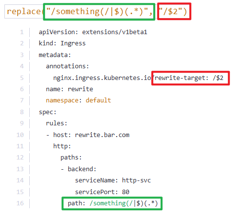

4.  Developing Network Policies
    1)  How many network policies do you see in the environment?
        We have deployed few web applications, services and network policies. Inspect the environment.
        

        controlplane ~ ➜  k get networkpolicies -A
        NAMESPACE   NAME             POD-SELECTOR   AGE
        default     payroll-policy   name=payroll   2m22s

        Answer: 1

        What is the name of the Network Policy?
        Answer: payroll-policy

        Which pod is the Network Policy applied on?
        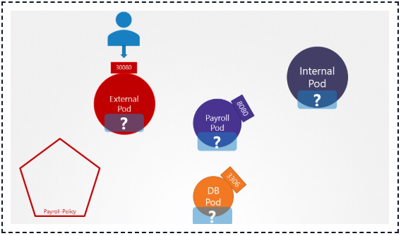

        Hint: Use the command kubectl get netpol and look under the Pod Selector column.

            k get netpol/networkpolicies

        controlplane ~ ➜  k get netpol
        NAME             POD-SELECTOR   AGE
        payroll-policy   **name=payroll**   5m52s  (僅顯示pod label 須為payroll)

        controlplane ~ ➜  k get networkpolicies
        NAME             POD-SELECTOR   AGE
        payroll-policy   name=payroll   7m48s

        controlplane ~ ➜  k get pod --show-
        --show-kind            (If present, list the resource type for the requested object(s).)
        --show-labels          (When printing, show all labels as the last column (default hide labels column))
        --show-managed-fields  (If true, keep the managedFields when printing objects in JSON or YAML format.)

        controlplane ~ ➜  k get pod --show-labels |grep name=payroll (使用--show-labels參數篩選出pod name為payroll的pod)
        payroll    1/1     Running   0          9m7s   name=payroll

        Answer: payroll

    2)  What type of traffic is this Network Policy configured to handle?
            option1: Ingress
            option2: Egress
            option3: Both Ingress and Egress

        controlplane ~ ➜  k describe netpol payroll-policy 
        Name:         payroll-policy
        Namespace:    default
        Created on:   2025-01-23 16:41:13 +0000 UTC
        Labels:       <none>
        Annotations:  <none>
        Spec:
        PodSelector:     name=payroll
        Allowing ingress traffic:
            To Port: 8080/TCP
            From:
            PodSelector: name=internal
        Not affecting egress traffic
        **Policy Types: Ingress**

        Answer: Ingress

        What is the impact of the rule configured on this Network Policy?
            option1: Traffic From Internal to Payroll Pod is blocked
            option2: Traffic From Internal to Payroll Pod is allowed
            option3: Traffic To and From Internal Pod is blocked
            option4: Traffic To and From Payroll Pod is blocked

        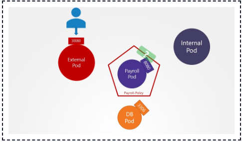

        Answer: option2 Traffic From Internal to Payroll Pod is allowed

        
        What is the impact of the rule configured on this Network Policy?
            option1: Internal Pod can ping Payroll Pod
            option2: External Pod can ping Payroll Pod
            option3: External Pod can access port 8080 on Payroll Pod
            option4: Internal Pod can access port 8080 on Payroll Pod

        Answer: option4 Internal Pod can access port 8080 on Payroll Pod
        
        
        Access the UI of these applications using the link given above the terminal.
        

    3)  Perform a connectivity test using the User Interface in these Applications to access the payroll-service at port 8080.
            option1: Only Internal application can access payroll service
            option2: Both Internal and External applications can access payroll service

        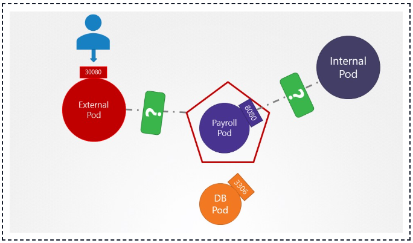

        controlplane ~ ➜  k get pod -A -o wide
        NAMESPACE     NAME                                   READY   STATUS    RESTARTS      AGE   IP             NODE           NOMINATED NODE   READINESS GATES
        default       external                               1/1     Running   0             26m   10.244.0.6     controlplane   <none>           <none>
        default       internal                               1/1     Running   0             26m   10.244.0.5     controlplane   <none>           <none>
        default       mysql                                  1/1     Running   0             26m   10.244.0.4     controlplane   <none>           <none>
        default       payroll                                1/1     Running   0             26m   10.244.0.7     controlplane   <none>           <none>
        ...

        OR: 
        controlplane ~ ➜  k get pod 
        external  internal  mysql     payroll   

        controlplane ~ ➜  k get pod payroll -o wide
        NAME      READY   STATUS    RESTARTS   AGE     IP           NODE           NOMINATED NODE   READINESS GATES
        payroll   1/1     Running   0          3m32s   10.244.0.4   controlplane   <none>           <none>

        controlplane ~ ➜  k get pod internal -o wide
        NAME       READY   STATUS    RESTARTS   AGE     IP           NODE           NOMINATED NODE   READINESS GATES
        internal   1/1     Running   0          3m46s   **10.244.0.7**   controlplane   <none>           <none>

        controlplane ~ ➜  k get pod external -o wide
        NAME       READY   STATUS    RESTARTS   AGE     IP           NODE           NOMINATED NODE   READINESS GATES
        external   1/1     Running   0          3m54s   **10.244.0.6**   controlplane   <none>           <none>

        So we use internal ip: 10.244.0.7 port 8080  & external ip: 10.244.0.6 port 8080 to request the webUI and check whether it can connect:

        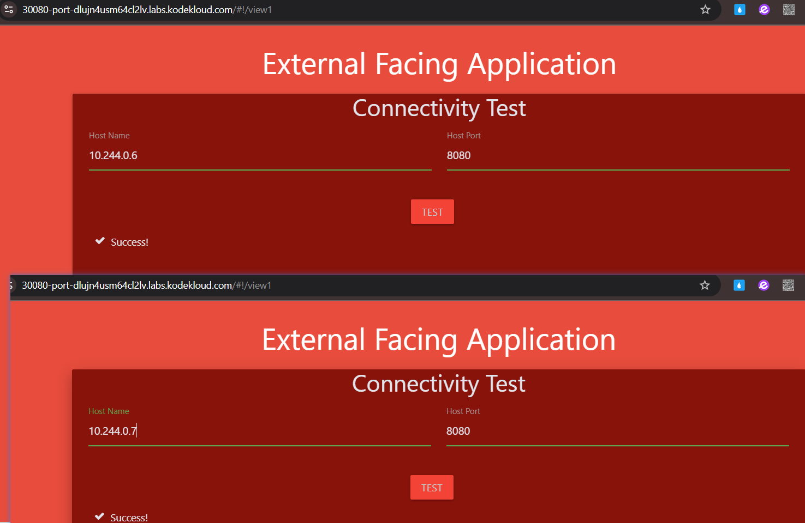

        發現似乎兩個ip 都返回Success ，但是!!! 此題答案為option1: Only Internal application can access payroll service
        (如果測試工具或 UI 不是真正的外部 Pod 請求，而是內部 ClusterIP 的代理，可能會繞過 NetworkPolicy 的限制。這種情況下，即使 NetworkPolicy 限制外部 Pod 的流量，測試仍會顯示成功。)

        需要檢查network policy的實際行為 來驗證: 
        controlplane ~ ➜  k describe networkpolicies payroll-policy 
        Name:         payroll-policy
        Namespace:    default
        Created on:   2025-01-23 17:56:59 +0000 UTC
        Labels:       <none>
        Annotations:  <none>
        Spec:
        PodSelector:     name=payroll
        Allowing ingress traffic:
            To Port: 8080/TCP
            From:
            PodSelector: name=internal
        Not affecting egress traffic
        Policy Types: Ingress
        
        故答案仍選option1

        Answer: option1:  Only Internal application can access payroll service

        Perform a connectivity test using the User Interface of the Internal Application to access the external-service at port 8080.
            option1: Failed
            option2: Successful

        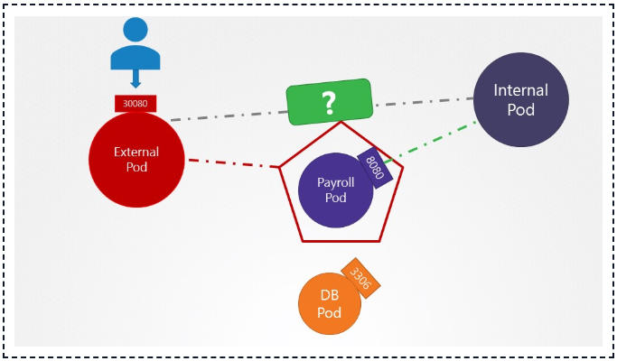

        controlplane ~ ➜  k get pod -A -o wide
        NAMESPACE     NAME                                   READY   STATUS    RESTARTS      AGE   IP             NODE           NOMINATED NODE   READINESS GATES
        default       external                               1/1     Running   0             26m   **10.244.0.6**     controlplane   <none>           <none>
        default       internal                               1/1     Running   0             26m   10.244.0.5     controlplane   <none>           <none>
        default       mysql                                  1/1     Running   0             26m   10.244.0.4     controlplane   <none>           <none>
        default       payroll                                1/1     Running   0             26m   10.244.0.7     controlplane   <none>           <none>
        ...
       
        We use the external ip: 10.244.0.6 and port 8080 to request the webUI and check whether it can connect:

        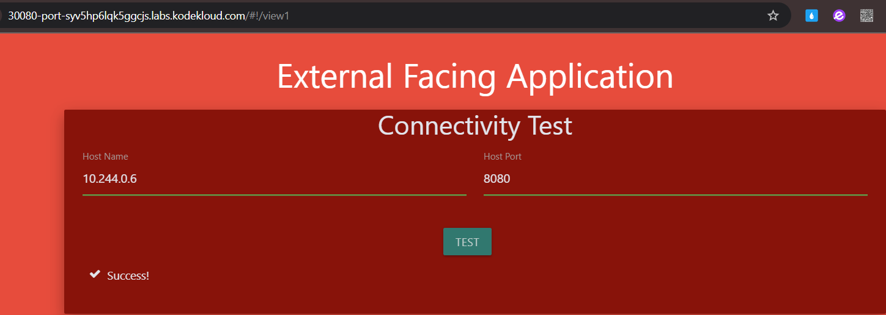

        Returns Success.

    
    4)  Create a network policy to allow traffic from the Internal application only to the payroll-service and db-service.
        
        Use the spec given below. You might want to enable ingress traffic to the pod to test your rules in the UI.
        Also, ensure that you allow egress traffic to DNS ports TCP and UDP (port 53) to enable DNS resolution from the internal pod.
            Policy Name: internal-policy
            Policy Type: Egress
            Egress Allow: payroll
            Payroll Port: 8080
            Egress Allow: mysql
            MySQL Port: 3306

        controlplane ~ ➜  vim networkpolicies.yaml

            apiVersion: networking.k8s.io/v1
            kind: NetworkPolicy
            metadata:
            name: internal-policy
            namespace: default
            spec:
            podSelector:
                matchLabels:
                name: internal
            policyTypes:
            - Egress
            - Ingress
            ingress:
                - {}  ingress內部部限制，均可互相訪問
            egress:
            - to:
                - podSelector:
                    matchLabels:
                    name: mysql
                ports:
                - protocol: TCP
                port: 3306

            - to:
                - podSelector:
                    matchLabels:
                    name: payroll
                ports:
                - protocol: TCP
                port: 8080

            - ports:
                - port: 53
                protocol: UDP
                - port: 53
                protocol: TCP
        
        controlplane ~ ➜  k create -f networkpolicies.yaml 
        networkpolicy.networking.k8s.io/internal-policy created

        controlplane ~ ➜  k get netpol
        NAME              POD-SELECTOR    AGE
        internal-policy   name=internal   5s
        payroll-policy    name=payroll    56m

        
        
        Note: We have also allowed Egress traffic to TCP and UDP port. This has been added to ensure that the internal DNS resolution works from the internal pod.

        在 Kubernetes 的 NetworkPolicy 中，如果設置了 Egress 限制（即出站流量限制），需要顯式允許 DNS 服務的流量，否則：
        - Pod 無法解析域名，例如服務名（如 payroll-service.default.svc.cluster.local）。
        - 無法訪問外部域名（如 google.com）。
        
        為了避免這些問題，NetworkPolicy 必須包含以下規則：
        允許 Egress 流量到 kube-dns 的 53/UDP 和 53/TCP 端口。
                
        Remember: The kube-dns service is exposed on port 53:
        root@controlplane:~> kubectl get svc -n kube-system 
        NAME       TYPE        CLUSTER-IP   EXTERNAL-IP   PORT(S)                  AGE
        kube-dns   ClusterIP   10.96.0.10   <none>        53/UDP,53/TCP,9153/TCP   18m

        root@controlplane:~>

