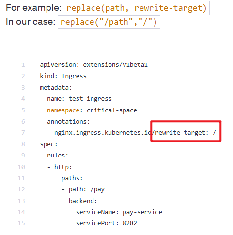

1. Services
    4 Types of Services:
    ClusterIP
    NodePort
    LoadBalancer
    ExternalName
    https://kubernetes.io/docs/concepts/services-networking/service/

    
    
    Use ClusterIP for internal communication between services within the cluster.
    Use NodePort when external access to the service is needed, especially for testing or development, but note that it's less flexible and robust compared to other options like LoadBalancer or Ingress for production environments.

    

    1)  How many Services exist on the system?
        In the current(default) namespace

        controlplane ~ ➜  k get service
        NAME         TYPE        CLUSTER-IP   EXTERNAL-IP   PORT(S)   AGE
        kubernetes   ClusterIP   10.43.0.1    <none>        443/TCP   2m59s

        What is the type of the default kubernetes service?
        Answer: ClusterIP

        What is the targetPort configured on the kubernetes service?

        controlplane ~ ➜  k describe service kubernetes 
        Name:                     kubernetes
        Namespace:                default
        Labels:                   component=apiserver
                                provider=kubernetes
        Annotations:              <none>
        Selector:                 <none>
        Type:                     ClusterIP
        IP Family Policy:         SingleStack
        IP Families:              IPv4
        IP:                       10.43.0.1
        IPs:                      10.43.0.1
        Port:                     https  443/TCP
        **TargetPort:               6443/TCP**
        Endpoints:                192.168.202.22:6443
        Session Affinity:         None
        Internal Traffic Policy:  Cluster
        Events:                   <none>

        Answer: 6443

        How many labels are configured on the kubernetes service?
        Answer: 2

        How many Endpoints are attached on the kubernetes service?
        Endpoints:   192.168.202.22:6443

        Answer: 1

    2)  How many Deployments exist on the system now?
        In the current(default) namespace

        controlplane ~ ➜  k get deploy
        NAME                       READY   UP-TO-DATE   AVAILABLE   AGE
        simple-webapp-deployment   4/4     4            4           4m17s

        Answer: 1

        What is the image used to create the pods in the deployment?

        controlplane ~ ➜  k describe deploy simple-webapp-deployment 
        Name:                   simple-webapp-deployment
        Namespace:              default
        CreationTimestamp:      Wed, 22 Jan 2025 10:54:09 +0000
        Labels:                 <none>
        Annotations:            deployment.kubernetes.io/revision: 1
        Selector:               name=simple-webapp
        Replicas:               4 desired | 4 updated | 4 total | 4 available | 0 unavailable
        StrategyType:           RollingUpdate
        MinReadySeconds:        0
        RollingUpdateStrategy:  25% max unavailable, 25% max surge
        Pod Template:
        Labels:  name=simple-webapp
        Containers:
        simple-webapp:
            Image:         **kodekloud/simple-webapp:red**
            Port:          8080/TCP
            Host Port:     0/TCP
            Environment:   <none>
            Mounts:        <none>
        Volumes:         <none>
        Node-Selectors:  <none>
        Tolerations:     <none>
        ...

        Answer: kodekloud/simple-webapp:red

        Are you able to accesss the Web App UI?
        Try to access the Web Application UI using the tab simple-webapp-ui above the terminal.

        

        Answer: No access

        Create a new service to access the web application using the service-definition-1.yaml file.
            Name: webapp-service
            Type: NodePort
            targetPort: 8080
            port: 8080
            nodePort: 30080
            selector:
            name: simple-webapp

        controlplane ~ ➜  ls
        service-definition-1.yaml

        controlplane ~ ➜  vim service-definition-1.yaml 

        controlplane ~ ➜  k create -f service-definition-1.yaml 
        The Service "" is invalid: metadata.name: Required value: name or generateName is required

        controlplane ~ ✖ vim service-definition-1.yaml 

        controlplane ~ ➜  k create -f service-definition-1.yaml 
        service/webapp-service created

        controlplane ~ ✖ k get svc
        NAME             TYPE        CLUSTER-IP      EXTERNAL-IP   PORT(S)          AGE
        kubernetes       ClusterIP   10.43.0.1       <none>        443/TCP          18m
        webapp-service   NodePort    10.43.251.207   <none>        8080:30080/TCP   6s

        Access the web application using the tab simple-webapp-ui above the terminal window.
        

        

        

2.  Ingress Networking
    
    Introduction to Ingress:
    - Ingress: Manages external HTTP/HTTPS traffic and routes it to Kubernetes services within the cluster.
    - Eliminates the need for multiple NodePort or LoadBalancer services by providing centralized routing.

    When to Use Ingress:
    - Consolidate traffic for multiple services under a single external URL.
    - Simplify SSL/HTTPS management for all services.
    - Implement rules for routing traffic based on:
        - URL paths (e.g., /wear for one app, /watch for another).
        - Hostnames (e.g., wear.example.com, watch.example.com).
    - Avoid multiple load balancers to save cost and configuration effort.

    Ingress Controller:
    
    - Acts as a Layer 7 load balancer.
    - Needs to be deployed explicitly (not included by default).
    - Popular options:
        - NGINX (widely used and maintained by Kubernetes).
        - Others: GCE, Traefik, HAProxy, Istio.
    - Handles:
        - Monitoring Kubernetes for Ingress resources.
        - Configuring routing rules dynamically.
    Ingress Resources
    Describes how external requests are routed to services within the Kubernetes cluster.

    Usage:
    a. Path-based Routing:
      - Routes traffic based on the URL path.
        - Examples:
          - /wear -> wear-service
          - /watch -> watch-service
    b. Host-based Routing:
      - Routes traffic based on the requested domain name.
        - Examples:
          - wear.my-online-store.com -> wear-service
          - watch.my-online-store.com -> watch-service
    c. Default Backend:
      - Handles requests that do not match any specified path or hostname.
      - Typically used to display a "404 Not Found" page.

    
    

    Users: External traffic arriving from users.
    Ingress Controller: Handles incoming traffic, routes it based on rules (e.g., URL paths).
    Services: Backend services (e.g., Wear and Watch services) targeted by the routing rules.
    Pods: The actual application pods behind each service.

    Create Ingress in Imperative Way:
    

        kubectl create ingress <ingress-name> --rule="host/path=service:port"
        Eg. kubectl create ingress ingress-test --rule="wear.my-online-store.com/wear*=wear-service:80"

    
    1)  We have deployed Ingress Controller, resources and applications. Explore the setup.
        Note: They are in different namespaces.

        controlplane ~ ➜  k get ingress --all-namespaces 
        NAMESPACE   NAME                 CLASS    HOSTS   ADDRESS          PORTS   AGE
        app-space   ingress-wear-watch   <none>   *       172.20.204.195   80      46s

        
        Which namespace is the Ingress Controller deployed in?
        Use the command kubectl get all -A and identify the namespace of Ingress Controller.

            k get all -A (--all-namespace) (List All Resources)

        controlplane ~ ➜  k get all -A
        NAMESPACE       NAME                                            READY   STATUS      RESTARTS   AGE
        app-space       pod/default-backend-5cd488d85c-pbt4w            1/1     Running     0          102s
        app-space       pod/webapp-video-cb475db9c-xttz5                1/1     Running     0          102s
        app-space       pod/webapp-wear-6886df6554-4x2p2                1/1     Running     0          102s
        ingress-nginx   pod/ingress-nginx-admission-create-84cqg        0/1     Completed   0          100s
        ingress-nginx   pod/ingress-nginx-admission-patch-k7v46         0/1     Completed   1          100s
        ingress-nginx   pod/ingress-nginx-controller-7f45764b55-w7gsn   1/1     Running     0          100s
        kube-flannel    pod/kube-flannel-ds-6w962                       1/1     Running     0          3m11s
        kube-system     pod/coredns-77d6fd4654-7chqd                    1/1     Running     0          3m11s
        kube-system     pod/coredns-77d6fd4654-nr7r9                    1/1     Running     0          3m11s
        kube-system     pod/etcd-controlplane                           1/1     Running     0          3m18s
        kube-system     pod/kube-apiserver-controlplane                 1/1     Running     0          3m18s
        kube-system     pod/kube-controller-manager-controlplane        1/1     Running     0          3m18s
        kube-system     pod/kube-proxy-bz95t                            1/1     Running     0          3m11s
        kube-system     pod/kube-scheduler-controlplane                 1/1     Running     0          3m18s

        NAMESPACE       NAME                                         TYPE        CLUSTER-IP       EXTERNAL-IP   PORT(S)                      AGE
        app-space       service/default-backend-service              ClusterIP   172.20.4.70      <none>        80/TCP                       101s
        app-space       service/video-service                        ClusterIP   172.20.223.59    <none>        8080/TCP                     102s
        app-space       service/wear-service                         ClusterIP   172.20.46.31     <none>        8080/TCP                     102s
        default         service/kubernetes                           ClusterIP   172.20.0.1       <none>        443/TCP                      3m19s
        ingress-nginx   service/**ingress-nginx-controller**             NodePort    172.20.204.195   <none>        80:30080/TCP,443:32103/TCP   100s
        ingress-nginx   service/ingress-nginx-controller-admission   ClusterIP   172.20.101.71    <none>        443/TCP                      100s
        kube-system     service/kube-dns                             ClusterIP   172.20.0.10      <none>        53/UDP,53/TCP,9153/TCP       3m18s

        NAMESPACE      NAME                             DESIRED   CURRENT   READY   UP-TO-DATE   AVAILABLE   NODE SELECTOR            AGE
        kube-flannel   daemonset.apps/kube-flannel-ds   1         1         1       1            1           <none>                   3m17s
        kube-system    daemonset.apps/kube-proxy        1         1         1       1            1           kubernetes.io/os=linux   3m18s

        NAMESPACE       NAME                                       READY   UP-TO-DATE   AVAILABLE   AGE
        app-space       deployment.apps/default-backend            1/1     1            1           102s
        app-space       deployment.apps/webapp-video               1/1     1            1           102s
        app-space       deployment.apps/webapp-wear                1/1     1            1           102s
        ingress-nginx   deployment.apps/ingress-nginx-controller   1/1     1            1           100s
        kube-system     deployment.apps/coredns                    2/2     2            2           3m18s

        NAMESPACE       NAME                                                  DESIRED   CURRENT   READY   AGE
        app-space       replicaset.apps/default-backend-5cd488d85c            1         1         1       102s
        app-space       replicaset.apps/webapp-video-cb475db9c                1         1         1       102s
        app-space       replicaset.apps/webapp-wear-6886df6554                1         1         1       102s
        ingress-nginx   replicaset.apps/ingress-nginx-controller-7f45764b55   1         1         1       100s
        kube-system     replicaset.apps/coredns-77d6fd4654                    2         2         2       3m11s

        NAMESPACE       NAME                                       STATUS     COMPLETIONS   DURATION   AGE
        ingress-nginx   job.batch/ingress-nginx-admission-create   Complete   1/1           7s         100s
        ingress-nginx   job.batch/ingress-nginx-admission-patch    Complete   1/1           8s         100s`

        By the above:
        ingress-nginx   service/ingress-nginx-controller             NodePort    172.20.204.195   <none>        80:30080/TCP,443:32103/TCP   100s

        Answer: ingress-nginx

        
        What is the name of the Ingress Controller Deployment?

        Answer: ingress-nginx-controller

        
        Which namespace are the applications deployed in?
        Also runs: 
            
            k get all -A

        NAMESPACE       NAME                                       READY   UP-TO-DATE   AVAILABLE   AGE
        app-space       deployment.apps/default-backend            1/1     1            1           102s
        app-space       deployment.apps/webapp-video               1/1     1            1           102s
        app-space       deployment.apps/webapp-wear                1/1     1            1           102s
        ingress-nginx   deployment.apps/ingress-nginx-controller   1/1     1            1           100s
        kube-system     deployment.apps/coredns                    2/2     2            2           3m18s

        As Above, there're mostly on app-space
        Answer: app-space
        
        How many applications are deployed in the app-space namespace?
        Count the number of deployments in this namespace.

        controlplane ~ ➜  k get all -n app-space | grep -i "deployment"
        deployment.apps/default-backend   1/1     1            1           12m
        deployment.apps/webapp-video      1/1     1            1           12m
        deployment.apps/webapp-wear       1/1     1            1           12m

        Answer: 3 (applications)

        Which namespace is the Ingress Resource deployed in?
        Hint: Run 
            
            kubectl get ingress --all-namespaces

        controlplane ~ ➜  k get ingress -A
        NAMESPACE   NAME                 CLASS    HOSTS   ADDRESS          PORTS   AGE
        app-space   ingress-wear-watch   <none>   *       172.20.204.195   80      14m

        controlplane ~ ➜  k get ingress --all-namespaces 
        NAMESPACE   NAME                 CLASS    HOSTS   ADDRESS          PORTS   AGE
        app-space   ingress-wear-watch   <none>   *       172.20.204.195   80      15m

        Answer: app-space

        
        What is the name of the Ingress Resource?
        Answer: ingress-wear-watch
        
        
    2)  What is the Host configured on the Ingress Resource?
        The host entry defines the domain name that users use to reach the application like www.google.com

        controlplane ~ ➜  k get ingress -A
        NAMESPACE   NAME                 CLASS    HOSTS   ADDRESS          PORTS   AGE
        app-space   ingress-wear-watch   <none>   *       172.20.204.195   80      14m

        Answer: All hosts (*)

        
        What backend is the /wear path on the Ingress configured with?
            option1: video-service
            option2: wear-service

        controlplane ~ ➜  k -n app-space describe ingress ingress-wear-watch 
        Name:             ingress-wear-watch
        Labels:           <none>
        Namespace:        app-space
        Address:          172.20.204.195
        Ingress Class:    <none>
        Default backend:  <default>
        Rules:
        Host        Path  Backends
        ----        ----  --------
        *           
                    /wear    wear-service:8080 (172.17.0.4:8080)
                    /watch   video-service:8080 (172.17.0.5:8080)
        Annotations:  nginx.ingress.kubernetes.io/rewrite-target: /
                    nginx.ingress.kubernetes.io/ssl-redirect: false
        Events:
        Type    Reason  Age                From                      Message
        ----    ------  ----               ----                      -------
        Normal  Sync    19m (x2 over 19m)  nginx-ingress-controller  Scheduled for sync

        From: /wear    wear-service:8080 (172.17.0.4:8080)
        Answer: option2 wear-service

        
        At what path is the video streaming application made available on the Ingress?

        From: /watch   video-service:8080 (172.17.0.5:8080)

        Answer:  /watch   
        
        
        If the requirement does not match any of the configured paths in the Ingress, to which service are the requests forwarded?  
            option1: No Service
            option2: default-backend
            option3: default-backend-service
            option4: The last service configured

            k -n app-space describe ingress ingress-wear-watch 
            k get deploy ingress-nginx-controller -o yaml -n ingress-nginx (檢查 Ingress Controller 的部署清單)

        controlplane ~ ➜  k -n app-space describe ingress ingress-wear-watch 
        Name:             ingress-wear-watch
        Labels:           <none>
        Namespace:        app-space
        Address:          172.20.204.195
        Ingress Class:    <none>
        Default backend:  <default>  => You Need to check the ingress controller's manifest

        Hint: Execute the command kubectl describe ingress --namespace app-space and examine the Default backend field. If it displays <default>, proceed to **inspect the ingress controller's manifest** by executing kubectl get deploy ingress-nginx-controller -n ingress-nginx -o yaml. In the manifest, search for the argument --default-backend-service

        Ingress 是用來管理外部流量進入服務的路由規則。如果一個請求沒有符合任何已配置的路徑規則 (即 Ingress Resources 中定義的 rules)，該請求會被轉發到 Default backend。

        在輸出中，Default backend: <default> 表示 Ingress 的預設行為尚未在 Ingress Resource 中直接定義，因此我們需要檢查 Ingress Controller 的配置，來了解預設的後端服務是什麼。

        為什麼需要檢查 Ingress Controller？
        Default backend 的實際定義可能位於 Ingress Controller 層級：

        當 Ingress Resources 中的 Default backend 顯示為 <default> 時，表示該行為由 Ingress Controller 本身的預設配置來決定。
        因此，您需要檢查 Ingress Controller（此處部署在 ingress-nginx namespace）的具體配置，來確認預設的後端服務。
        
        From 1), we noticed that the ingress controller is deployed on ingress-nginx, so:

            k get deploy ingress-nginx-controller -o yaml -n ingress-nginx

        在部署清單中，搜尋 --default-backend-service 參數。這個參數會明確指定預設的後端服務名稱（例如：default-backend-service）。
        如果未設置 --default-backend-service：

        Ingress Controller 可能會自動回退到其內建的 404 頁面或一個未指定的預設行為（取決於具體的 Ingress Controller 實現）。

        controlplane ~ ✖ k get deploy ingress-nginx-controller -o yaml -n ingress-nginx |grep -i "default"
                    - -**-default-backend-service**=app-space/default-backend-service
                  schedulerName: default-scheduler
                      defaultMode: 420

        Answer: option3 default-backend-service

        
        Now view the Ingress Service using the tab at the top of the terminal. Which page do you see?
        Click on the tab named Ingress.
        

        Answer: a 404 file

    3)  View the applications by appending /wear and /watch to the URL you opened in the previous step.
        
        
        
        You are requested to change the URLs at which the applications are made available.
        Make the video application available at /stream.   
            Ingress: ingress-wear-watch
            Path: /stream
            Backend Service: video-service
            Backend Service Port: 8080  
        
        controlplane ~ ➜  k get ingress -A
        NAMESPACE   NAME                 CLASS    HOSTS   ADDRESS          PORTS   AGE
        app-space   ingress-wear-watch   <none>   *       172.20.204.195   80      44m

        controlplane ~ ➜  k edit ingress -n app-space ingress-wear-watch 
        ...

            spec:
                rules:
                - http:
                    paths:
                    - backend:
                        service:
                            name: wear-service
                            port:
                            number: 8080
                        path: /wear
                        pathType: Prefix
                    - backend:
                        service:
                            name: video-service
                            port:
                            number: 8080
                        path: #/watch  更改為: /stream
                        pathType: Prefix
                status:
                loadBalancer:
                    ingress:
                    - ip: 172.20.204.195
        
        ingress.networking.k8s.io/ingress-wear-watch edited
        
        View the Video application using the /stream URL in your browser.
        Click on the Ingress tab above your terminal, if its not open already, and append /stream to the URL in the browser.
        
        

        (Now the /watch path will return 404.)

        
        A user is trying to view the /eat URL on the Ingress Service. Which page would he see?
        If not open already, click on the Ingress tab above your terminal, and append /eat to the URL in the browser.

        Answer: 404 Error Page

    4)  Due to increased demand, your business decides to take on a new venture. You acquired a food delivery company. 
        Their applications have been migrated over to your cluster.

        Inspect the new deployments in the app-space namespace.

        controlplane ~ ➜  k get deploy -n app-space
        NAME              READY   UP-TO-DATE   AVAILABLE   AGE
        default-backend   1/1     1            1           52m
        webapp-food       1/1     1            1           44s
        webapp-video      1/1     1            1           52m
        webapp-wear       1/1     1            1           52m

        
        You are requested to add a new path to your ingress to make the food delivery application available to your customers.
        Make the new application available at /eat.
            Ingress: ingress-wear-watch
            Path: /eat
            Backend Service: food-service
            Backend Service Port: 8080

        controlplane ~ ➜  k edit ingress -n app-space ingress-wear-watch 
        ...

            spec:
                rules:
                - http:
                    paths:
                    - backend:
                        service:
                            name: wear-service
                            port:
                            number: 8080
                        path: /wear
                        pathType: Prefix
                    - backend:
                        service:
                            name: video-service
                            port:
                            number: 8080
                        path: /stream
                        pathType: Prefix
                    - backend: (添加此block)
                        service:
                            name: food-service
                            port: 
                            number: 8080
                        path: /eat
                        pathType: Prefix
            
        ingress.networking.k8s.io/ingress-wear-watch edited

        
        View the Food delivery application using the /eat URL in your browser.
        Click on the Ingress tab above your terminal, if its not open already, and append /eat to the URL in the browser.
        

    5)  A new payment service has been introduced. Since it is critical, the new application is deployed in its own namespace.
        Identify the namespace in which the new application is deployed.

        controlplane ~ ➜  k get deploy -A
        NAMESPACE        NAME                       READY   UP-TO-DATE   AVAILABLE   AGE
        app-space        default-backend            1/1     1            1           58m
        app-space        webapp-food                1/1     1            1           6m43s
        app-space        webapp-video               1/1     1            1           58m
        app-space        webapp-wear                1/1     1            1           58m
        critical-space   webapp-pay                 1/1     1            1           114s
        ingress-nginx    ingress-nginx-controller   1/1     1            1           58m
        kube-system      coredns                    2/2     2            2           59m

        Answer: critical-space

        
        What is the name of the deployment of the new application?
        Answer: webapp-pay 

        You are requested to make the new application available at /pay.
        Identify and implement the best approach to making this application available on the ingress controller and test to make sure its working. Look into annotations: rewrite-target as well.
            Ingress Created
            Path: /pay
            Configure correct backend service
            Configure correct backend port

        Hint: Create a new Ingress for the new pay application in the critical-space namespace.
        Use the command kubectl get svc -n critical-space to know the service and port details.

            k get service -n critical-space 

        controlplane ~ ✖ k get service -n critical-space 
        NAME          TYPE        CLUSTER-IP      EXTERNAL-IP           PORT(S)    AGE
        pay-service   ClusterIP   **172.20.15.149**   <none>        **8282/TCP**   4m22s

        controlplane ~ ✖ k get ingress -n app-space ingress-wear-watch -o yaml > ingress-pay-service.yaml

        controlplane ~ ➜  vim ingress-pay-service.yaml 

            apiVersion: networking.k8s.io/v1
            kind: Ingress
            metadata:
            annotations:
                nginx.ingress.kubernetes.io/rewrite-target: /
                nginx.ingress.kubernetes.io/ssl-redirect: "false"
            creationTimestamp: "2025-01-22T16:08:54Z"
            generation: 2
            name: ingress-pay-service (變更)
            namespace: critical-space
            resourceVersion: "2533"
            uid: a3c6fcd1-7f1b-493b-af7c-e45e15f3b349
            spec:
            rules:
            - http:
                paths:
                - backend:
                    service:
                        name: pay-service (變更)
                        port:
                        number: 8282 (變更為與critical-space Service相同的external port)
                    path: /pay (變更)
                    pathType: Prefix
            status:
            loadBalancer:
                ingress:
                - ip: 172.20.187.21 (變更為與critical-space Service相同的ClusterIP)

        controlplane ~ ➜  k create -f ingress-pay-service.yaml 
        ingress.networking.k8s.io/ingress-pay-service created

        controlplane ~ ➜  k get ingress -A
        NAMESPACE        NAME                  CLASS    HOSTS   ADDRESS         PORTS   AGE
        app-space        ingress-wear-watch    <none>   *       172.20.187.21   80      18m
        critical-space   ingress-pay-service   <none>   *       172.20.187.21   80      75s

        
        View the Payment application using the /pay URL in your browser.
        Click on the Ingress tab above your terminal, if its not open already, and append /pay to the URL in the browser.
        

    **IMPORTANT**: The Rewrite Option
    由以上lab, 有兩個應用服務：
        watch app：提供影片串流頁面，位於 http://<watch-service>:<port>/
        wear app：提供服飾頁面，位於 http://<wear-service>:<port>/

    需求：
        我們想透過 Ingress 來管理流量，讓使用者能用以下 URL 訪問應用：
        http://<ingress-service>:<ingress-port>/watch -> 對應到 http://<watch-service>:<port>/
        http://<ingress-service>:<ingress-port>/wear -> 對應到 http://<wear-service>:<port>/

    問題：
    如果沒有設定 rewrite-target，請求的 URL 會被原封不動地傳給後端服務。
    例如，使用者請求 http://<ingress-service>:<ingress-port>/watch，後端會收到 http://<watch-service>:<port>/watch。
    但後端的應用（watch 和 wear app）並沒有設定 /watch 或 /wear 路徑，因此會報 404 錯誤。

    解決方法:
        引入 rewrite-target：
            我們可以用 rewrite-target 來修改傳遞給後端的 URL。
            Rewrite 的效果就像「搜尋和取代」，把請求中的路徑 /watch 或 /wear 替換成 /。
        實際運作：
        設定 nginx.ingress.kubernetes.io/rewrite-target: /。
        當使用者請求 http://<ingress-service>:<ingress-port>/watch 時：
        實際傳遞給後端的 URL 會變成 http://<watch-service>:<port>/。
        同理，請求 /wear 時會被重寫成 /，成功匹配後端服務。

    
    

3. What is the rewrite-target option?
4. Developing Network Policies
