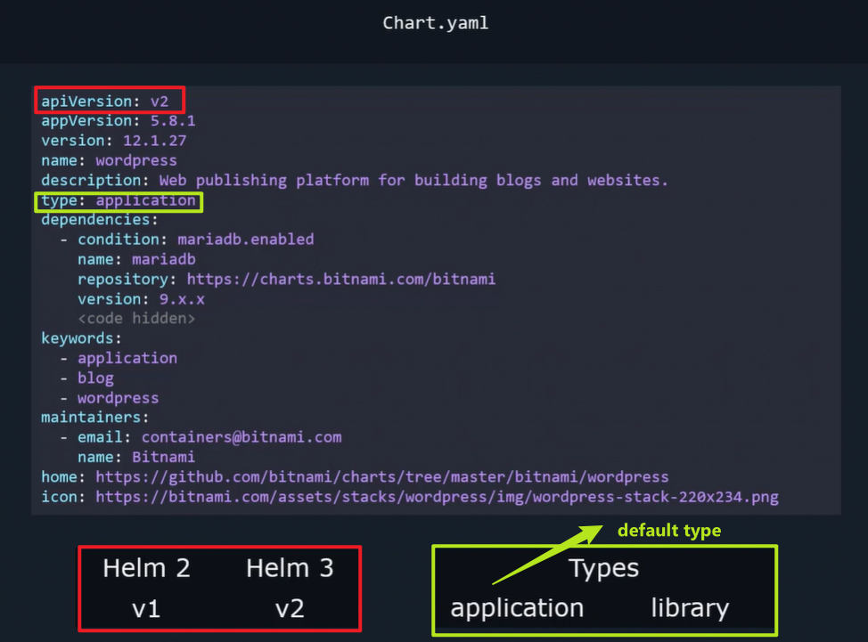
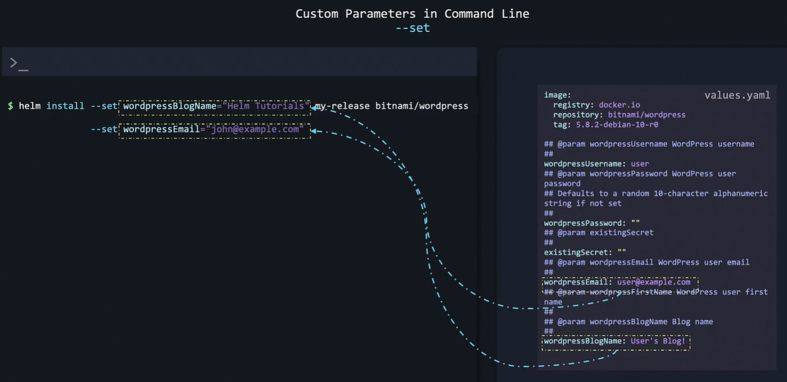
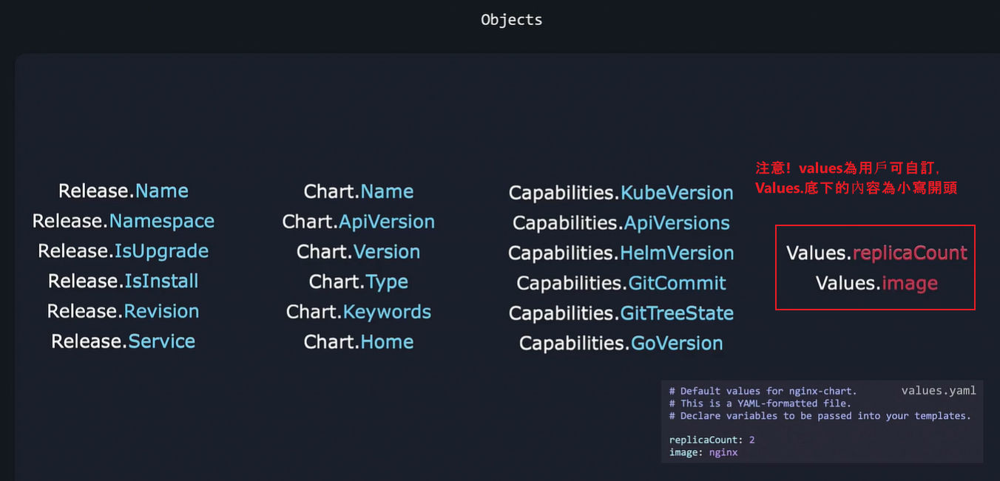

### Helm
1. Which command is used to search for a wordpress helm chart package from the Artifact Hub?
   option1: helm find hub wordpress
   option2: helm search hub wordpress

    controlplane ~ ➜  helm search hub wordpress
    URL                                                     CHART VERSION   APP VERSION              DESCRIPTION                                       
    https://artifacthub.io/packages/helm/wordpress-...      1.0.2           1.0.0                    A Helm chart for deploying Wordpress+Mariadb st...
    https://artifacthub.io/packages/helm/kube-wordp...      0.1.0           1.1                      this is my wordpress package                      
    https://artifacthub.io/packages/helm/bitnami/wo...      24.1.11         6.7.2                    WordPress is the world's most popular blogging ...
    https://artifacthub.io/packages/helm/bitnami-ak...      15.2.13         6.1.0                    WordPress is the world's most popular blogging ...
    ...

   Answer: option2

2.  Add a bitnami helm chart repository in the controlplane node.
    name - bitnami
    chart repo name - https://charts.bitnami.com/bitnami
    
    Hint: Run helm help and search for helm repo command to add chart repository.

    controlplane ~ ➜  helm repo -h
    ...
    Available Commands:
    add         add a chart repository
    index       generate an index file given a directory containing packaged charts
    list        list chart repositories
    remove      remove one or more chart repositories
    update      update information of available charts locally from chart repositories
    ...

    controlplane ~ ➜  helm repo add -h
    add a chart repository

    Usage:
    helm repo add [NAME] [URL] [flags]
    ...
    
    controlplane ~ ➜  helm repo add bitnami https://charts.bitnami.com/bitnami controlplane
    Error: "helm repo add" requires 2 arguments

    Usage:  helm repo add [NAME] [URL] [flags]

    controlplane ~ ✖ helm repo add bitnami https://charts.bitnami.com/bitnami
    "bitnami" has been added to your repositories

    Which command is used to search for the joomla package from the added repository?
        option1: helm search repo joomla
        option2: helm find joomla
        option3: helm get repo joomla

    controlplane ~ ➜  helm search repo joomla
    NAME            CHART VERSION   APP VERSION     DESCRIPTION                                       
    bitnami/joomla  20.0.4          5.1.2           DEPRECATED Joomla! is an award winning open sou...

    Answer: option1 

    What is the app version of joomla in the bitnami helm repository?
    Hint: Run : helm search repo joomla and look at the APP VERSION column.

    controlplane ~ ➜  helm search repo joomla
    NAME            CHART VERSION   APP VERSION     DESCRIPTION                                       
    bitnami/joomla  20.0.4          **5.1.2**       DEPRECATED Joomla! is an award winning open sou...

    Answer: 5.1.2

    Which chart version can you see for the joomla package in the bitnami helm repo?

    Carry On:

    CHART VERSION
    20.0.4

    Answer: 20.0.4

3.  How many helm repositories are added in the controlplane node?

    controlplane ~ ➜  helm repo list -h
    list chart repositories

    Usage:
    helm repo list [flags]
    ...

    controlplane ~ ➜  helm repo list
    NAME            URL                                                 
    bitnami         https://charts.bitnami.com/bitnami                  
    puppet          https://puppetlabs.github.io/puppetserver-helm-chart
    hashicorp       https://helm.releases.hashicorp.com                 

    Answer: 3 repos

4.  Install drupal helm chart from the bitnami repository.
    Release name should be bravo.
    Chart name should be bitnami/drupal.
    Note: Ignore the state of the application now.

    controlplane ~ ➜  helm install ~~drupal~~ bravo bitnami/drupal
    Error: INSTALLATION FAILED: expected at most two arguments, unexpected arguments: oci://us-central1-docker.pkg.dev/kk-lab-prod/helm-charts/bitnami/drupal

    controlplane ~ ✖ helm install bravo bitnami/drupal
    Pulled: us-central1-docker.pkg.dev/kk-lab-prod/helm-charts/bitnami/drupal:21.1.3
    Digest: sha256:1986543cf00e9b7ec2d03c97e5d11588efd6419767036b3555afd8b9c3203f79
    NAME: bravo
    LAST DEPLOYED: Tue Feb 18 21:59:13 2025
    NAMESPACE: default
    STATUS: deployed
    REVISION: 1
    TEST SUITE: None
    NOTES:
    CHART NAME: drupal
    CHART VERSION: 21.1.3
    APP VERSION: 11.1.2

    Verify: use helm list command to verify if installed

    controlplane ~ ➜  helm list
    NAME    NAMESPACE       REVISION        UPDATED                                 STATUS          CHART         APP VERSION
    bravo   default         1               2025-02-18 21:59:13.226818143 +0000 UTC deployed        drupal-21.1.3 11.1.2     

    
    Which command is used to list packages installed using helm?
        option1: helm package
        option2: helm list

    controlplane ~ ➜  helm list
    NAME    NAMESPACE       REVISION        UPDATED                                 STATUS          CHART           APP VERSION
    bravo   default         1               2025-02-18 21:59:13.226818143 +0000 UTC deployed        drupal-21.1.3   11.1.2     

    Answer: option2
    
    
    Uninstall the drupal helm package which we installed earlier.

    controlplane ~ ➜  helm uninstall -h
    ...
    Usage:
    helm uninstall RELEASE_NAME [...] [flags]
    ...

    controlplane ~ ➜  helm uninstall bravo
    release "bravo" uninstalled

5.  Download the bitnami apache package under the /root directory.
    Note: Do not install the package. Just download it.

    Hint: Run the command : helm pull --untar  bitnami/apache
    (--untar: if set to true, will untar the chart after downloading it)

    controlplane ~ ✖ helm pull --untar bitnami/apache
    Pulled: us-central1-docker.pkg.dev/kk-lab-prod/helm-charts/bitnami/apache:11.3.2
    Digest: sha256:1bd45c97bb7a0000534e3abc5797143661e34ea7165aa33068853c567e6df9f2

6.  Inspect the file values.yaml and make changes so that 2 replicas of the webserver are running and the http is exposed on nodeport 30080.
    Note: You can read the Bitnami documentation for more.
    https://github.com/bitnami/charts/tree/master/bitnami/apache/#installing-the-chart

    
    
    Install the apache from the downloaded helm package (承上一題第5題下載的apache).
    Release name: mywebapp-nginx

    Note: Do make changes accordingly so that 2 replicas of the webserver are running and the http is exposed on nodeport 30080.
    Make sure that the pods are in the running state.
    
    Hint: Edit the values.yaml file and change the parameters to replicaCount: 2 and http: 30080 under the nodePorts section. Then run helm install command to install the package.

    (目前只有一個pod)
    controlplane ~ ➜  k get pods
    NAME                              READY   STATUS    RESTARTS   AGE
    mywebapp-nginx-apache-67fdc655c-jljxd   1/1     Running   0          3m1s

    先修改values.yaml: (請先進入到apache資料夾下)
    controlplane ~ ➜  ls
    apache

    controlplane ~ ➜  cat apache/
    Chart.lock          files/              templates/          
    charts/             .helmignore         values.schema.json  
    Chart.yaml          README.md           values.yaml         

    controlplane ~ ✖ vim apache/values.yaml 
    ...
    replicaCount: 2 #1  修改replicaCount為2
    ...
    nodePorts:
    http: "30080" # 此欄設置為30080
    ...

    再install apache package:
    Once you have modified the values.yaml file , run the below command to install the apache package on the controlplane node:

    controlplane ~ ➜  helm install mywebapp-nginx ./apache
    NAME: mywebapp-nginx
    LAST DEPLOYED: Tue Feb 18 22:11:39 2025
    NAMESPACE: default
    STATUS: deployed
    REVISION: 1
    TEST SUITE: None
    NOTES:
    CHART NAME: apache
    CHART VERSION: 11.3.2
    APP VERSION: 2.4.63
    ....

    (看到有兩個pod運行中)
    controlplane ~ ➜  k get pods
    NAME                              READY   STATUS    RESTARTS   AGE
    mywebapp-nginx-apache-67fdc655c-9g6s6   0/1     Running   0          18s
    mywebapp-nginx-apache-67fdc655c-zlmn6   0/1     Running   0          18s

    Verfiy: helm list

    controlplane ~ ➜  helm list
    NAME            NAMESPACE       REVISION        UPDATED                                 STATUS          CHART            APP VERSION
    **mywebapp-nginx**     default         1             2025-02-18 22:11:39.284356127 +0000 UTC deployed        apache-11.3.2    2.4.63    

    You can access the Apache default page by clicking on mywebapp-nginx link from the top of the terminal.
    

### 認識Helm Chart 
Template中 Deployment.yaml 配置文件中value 及Values.yaml 之間的關係:

Chart.yaml中的properties:

Helm 的文件結構:

在command line中使用 helm --set 設置Template-Deployment.yaml中的value為自訂的值 (而非Values.yaml中預設的值):

Install Chart時使用 helm --value指定安裝chart的時候，讀取自訂的custome value file文件:

使用--untar參數來下載並解壓縮 Chart (而非下載Chart並儲存為一個 .tgz 的壓縮檔案) :

什麼是Chart??
The helm package that contains all of the resource definitions necessary to run an application, tool, or service inside of a Kubernetes cluster is known as a Chart.

We cannot install the same chart multiple times on the same Kubernetes Cluster.
False

Which command is used to search for a wordpress helm chart package from the Artifact Hub?
option1: helm search wordpress
option2: helm search hub wordpress
Answer: option2

Search for a consul helm chart package from the Artifact Hub and identify the APP VERSION for the Official HashiCorp Consul Chart.

controlplane ~ ➜  helm search hub consul |grep Official
https://artifacthub.io/packages/helm/warjiang/c...      1.3.0           1.17.0          Official HashiCorp Consul Chart                   
https://artifacthub.io/packages/helm/hashicorp/...      1.6.2           1.20.2          Official HashiCorp Consul Chart                   
https://artifacthub.io/packages/helm/wener/consul       1.6.2           1.20.2          Official HashiCorp Consul Chart                   
https://artifacthub.io/packages/helm/wenerme/co...      1.6.2           1.20.2          Official HashiCorp Consul Chart                   

controlplane ~ ➜  helm search hub consul |grep hashicorp
https://artifacthub.io/packages/helm/hashicorp/...      1.6.2           1.20.2          Official HashiCorp Consul Chart                   

Answer: 1.20.2

Add bitnami helm chart repository in the controlplane node.
The url for bitnami repository is https://charts.bitnami.com/bitnami

controlplane ~ ➜  helm repo add -h
add a chart repository

Usage:
  helm repo add [NAME] [URL] [flags]

...

controlplane ~ ➜  helm repo add bitnami https://charts.bitnami.com/bitnami
"bitnami" has been added to your repositories

controlplane ~ ➜  helm repo list
NAME    URL                               
bitnami https://charts.bitnami.com/bitnami

controlplane ~ ➜  helm search repo wordpress
NAME                    CHART VERSION   APP VERSION     DESCRIPTION                                       
bitnami/wordpress       24.1.18         6.7.2           WordPress is the world's most popular blogging ...
bitnami/wordpress-intel 2.1.31          6.1.1           DEPRECATED WordPress for Intel is the most popu...

How many helm chart repositories are there in the controlplane node now?
We have added a few helm chart repositories in the controlplane node now.

controlplane ~ ➜  helm repo list
NAME            URL                                                 
bitnami         https://charts.bitnami.com/bitnami                  
puppet          https://puppetlabs.github.io/puppetserver-helm-chart
hashicorp       https://helm.releases.hashicorp.com    

Answer: 3 Charts

Deploy the Apache application on the cluster using the apache from the bitnami repository.
Set the release Name to: amaze-surf

controlplane ~ ➜  helm install amaze-surf bitnami/apache
Pulled: us-central1-docker.pkg.dev/kk-lab-prod/helm-charts/bitnami/apache:11.3.2
Digest: sha256:1bd45c97bb7a0000534e3abc5797143661e34ea7165aa33068853c567e6df9f2
NAME: amaze-surf
LAST DEPLOYED: Fri Mar  7 19:20:08 2025
NAMESPACE: default
STATUS: deployed
REVISION: 1
TEST SUITE: None
NOTES:
CHART NAME: apache
CHART VERSION: 11.3.2
APP VERSION: 2.4.63
...

What version of apache did we just install on the cluster using the helm chart?

controlplane ~ ➜  helm list
NAME            NAMESPACE       REVISION        UPDATED                                 STATUS          CHART            APP VERSION
amaze-surf      default         1               2025-03-07 19:20:08.629425345 +0000 UTC deployed        apache-11.3.2    2.4.63     

Answer: 2.4.63

How many releases of nginx charts can you see installed in the cluster now?
Note: We just installed some charts

controlplane ~ ➜  helm list
NAME            NAMESPACE       REVISION        UPDATED                                 STATUS          CHART         APP VERSION
amaze-surf      default         1               2025-03-07 19:20:08.629425345 +0000 UTC deployed        apache-11.3.2 2.4.63     
crazy-web       default         1               2025-03-07 19:21:33.217962104 +0000 UTC deployed        nginx-19.0.0  1.27.4     
happy-browse    default         1               2025-03-07 19:21:31.886173725 +0000 UTC deployed        nginx-19.0.0  1.27.4     

Answer: 2 Charts

Uninstall the nginx chart release happy-browse from the cluster.

controlplane ~ ➜  helm list | grep nginx
crazy-web       default         1               2025-03-07 19:21:33.217962104 +0000 UTC deployed        nginx-19.0.0  1.27.4     
happy-browse    default         1               2025-03-07 19:21:31.886173725 +0000 UTC deployed        nginx-19.0.0  1.27.4     

...
Usage:
  helm uninstall RELEASE_NAME [...] [flags]

Aliases:
  uninstall, del, delete, un
...

controlplane ~ ➜  helm uninstall happy-browse
release "happy-browse" uninstalled

Remove the Hashicorp helm repository from the cluster.

controlplane ~ ➜  helm repo list
NAME            URL                                                 
bitnami         https://charts.bitnami.com/bitnami                  
puppet          https://puppetlabs.github.io/puppetserver-helm-chart
hashicorp       https://helm.releases.hashicorp.com                 

controlplane ~ ➜  helm repo -h
...
Usage:
  helm repo [command]

Available Commands:
  add         add a chart repository
  index       generate an index file given a directory containing packaged charts
  list        list chart repositories
  remove      remove one or more chart repositories
  update      update information of available charts locally from chart repositories

...

controlplane ~ ➜  helm repo remove hashicorp
"hashicorp" has been removed from your repositories

Add bitnami helm chart repository to the cluster.
Note: - Make sure to add the bitnami chart to the cluster before moving to the next questions.

controlplane ~ ➜  helm repo add bitnami
Error: "helm repo add" requires 2 arguments

Usage:  helm repo add [NAME] [URL] [flags]

controlplane ~ ✖ helm repo add bitnami https://charts.bitnami.com/bitnami
"bitnami" has been added to your repositories

controlplane ~ ➜  helm repo list
NAME    URL                               
bitnami https://charts.bitnami.com/bitnami

How many **releases** of nginx can you see in the cluster now?
controlplane ~ ➜  helm list
NAME            NAMESPACE       REVISION        UPDATED                                 STATUS       CHART           APP VERSION
dazzling-web    default         3               2025-03-07 19:37:09.981878212 +0000 UTC deployed     nginx-12.0.4    1.22.0     

Answer: 1 release

How many **revisions** of nginx exists in the cluster?
Hint: helm history <release-name>

controlplane ~ ➜  helm list
NAME              NAMESPACE       REVISION        UPDATED                                 STATUS       CHART           APP VERSION
**dazzling-web**    default         3               2025-03-07 19:37:09.981878212 +0000 UTC deployed     nginx-12.0.4    1.22.0     

controlplane ~ ✖ helm history **dazzling-web**
REVISION        UPDATED                         STATUS          CHART           APP VERSION     DESCRIPTION     
1               Fri Mar  7 19:37:07 2025        superseded      nginx-12.0.4    1.22.0          Install complete
2               Fri Mar  7 19:37:08 2025        superseded      nginx-12.0.5    1.22.0          Upgrade complete
3               Fri Mar  7 19:37:09 2025        deployed        nginx-12.0.4    1.22.0          Upgrade complete

Answer: 3 Revisions

Which version of nginx is currently running in the cluster?

(承上題)
controlplane ~ ➜  helm list
NAME            NAMESPACE       REVISION        UPDATED                                 STATUS       CHART           APP VERSION
dazzling-web    default         3               2025-03-07 19:37:09.981878212 +0000 UTC deployed     nginx-12.0.4    1.22.0     

Answer: 1.22.0

### Helm Upgrade & Rollback
The DevOps team has decided to upgrade the nginx version to 1.27.x and use the Helm chart version 18.3.6 from the Bitnami repository.

Ensure that the nginx version running in the cluster is 1.27.x.

Hint: You can use the helm upgrade command.

**先查看當前ningx pod的Image version**:
controlplane ~ ➜  k get pods
NAME                                  READY   STATUS    RESTARTS   AGE
dazzling-web-nginx-65fd75c87f-4vwc7   1/1     Running   0          4m45s

controlplane ~ ➜  k describe pod dazzling-web-nginx-65fd75c87f-4vwc7 |grep Image:
    Image:          docker.io/bitnami/nginx:1.22.0-debian-11-r3

**執行upgrade前，先helm search repo 檢查 bitnami/nginx 是否可用**:

controlplane ~ ➜  helm repo list
NAME    URL                               
bitnami https://charts.bitnami.com/bitnami

controlplane ~ ➜  helm search repo bitnami/nginx (這個如果搜不到，則使用grep nginx)
No results found

controlplane ~ ➜  helm search repo bitnami |grep nginx
bitnami/nginx                                   19.0.1          1.27.4          NGINX Open Source is a web server that can be a...
bitnami/nginx-ingress-controller                11.6.11         1.12.0          NGINX Ingress Controller is an Ingress controll...
bitnami/nginx-intel                             2.1.15          0.4.9           DEPRECATED NGINX Open Source for Intel is a lig...

bitnami repo 已經添加到本地的 Helm repo 列表中，則可執行upgrade

**執行upgrade**:
controlplane ~ ➜  helm upgrade -h
...
Usage:
  helm upgrade [RELEASE] [CHART] [flags]
...

controlplane ~ ➜  helm upgrade dazzling-web **bitnami/nginx** **--version 18.3.6**
Pulled: us-central1-docker.pkg.dev/kk-lab-prod/helm-charts/bitnami/nginx:18.3.6
Digest: sha256:19a3e4578765369a8c361efd98fe167cc4e4d7f8b4ee42da899ae86e5f2be263
Release "dazzling-web" has been upgraded. Happy Helming!
NAME: dazzling-web
LAST DEPLOYED: Fri Mar  7 19:48:20 2025
NAMESPACE: default
STATUS: deployed
REVISION: 4
TEST SUITE: None
NOTES:
CHART NAME: nginx
CHART VERSION: 18.3.6
APP VERSION: 1.27.4

**檢查nginx pod 是否已更新Image version**:

controlplane ~ ➜  helm list
NAME            NAMESPACE       REVISION        UPDATED                                 STATUS          CHART            APP VERSION
dazzling-web    default         4               2025-03-07 19:48:20.045990817 +0000 UTC deployed        nginx-18.3.6     1.27.4     

controlplane ~ ➜  k get pods
NAME                                 READY   STATUS    RESTARTS   AGE
dazzling-web-nginx-f759468b5-2hkzg   1/1     Running   0          8m27s

controlplane ~ ➜  k describe pod dazzling-web-nginx-f759468b5-2hkzg |grep Image:
    Image:           docker.io/bitnami/nginx:1.27.4-debian-12-r0
    Image:           docker.io/bitnami/nginx:1.27.4-debian-12-r0

To which version is the nginx currently upgraded?
(承上題)

controlplane ~ ➜  helm list
NAME            NAMESPACE       REVISION        UPDATED                                 STATUS          CHART            APP VERSION
dazzling-web    default         4               2025-03-07 19:48:20.045990817 +0000 UTC deployed        nginx-18.3.6     1.27.4     

Answer: 1.27.4

Oops!.. There seems to be a minor issue in the website and the DevOps Team is asked to rollback the nginx to previous version!

Please rollback the nginx to previous version.

controlplane ~ ➜  helm rollback -h
...

Usage:
  helm rollback <RELEASE> [REVISION] [flags]

...

controlplane ~ ✖ helm history dazzling-web
REVISION        UPDATED                         STATUS          CHART           APP VERSION     DESCRIPTION     
1               Fri Mar  7 19:37:07 2025        superseded      nginx-12.0.4    1.22.0          Install complete
2               Fri Mar  7 19:37:08 2025        superseded      nginx-12.0.5    1.22.0          Upgrade complete
3               Fri Mar  7 19:37:09 2025        superseded      nginx-12.0.4    1.22.0          Upgrade complete
4               Fri Mar  7 19:48:20 2025        deployed        nginx-18.3.6    1.27.4          Upgrade complete

controlplane ~ ➜  helm rollback dazzling-web 3
Rollback was a success! Happy Helming!

controlplane ~ ➜  helm history dazzling-web
REVISION        UPDATED                         STATUS          CHART           APP VERSION     DESCRIPTION     
1               Fri Mar  7 19:37:07 2025        superseded      nginx-12.0.4    1.22.0          Install complete
2               Fri Mar  7 19:37:08 2025        superseded      nginx-12.0.5    1.22.0          Upgrade complete
3               Fri Mar  7 19:37:09 2025        superseded      nginx-12.0.4    1.22.0          Upgrade complete
4               Fri Mar  7 19:48:20 2025        superseded      nginx-18.3.6    1.27.4          Upgrade complete
5               Fri Mar  7 20:00:43 2025        deployed        nginx-12.0.4    1.22.0          Rollback to 3   

### Manually Create Helm Template 

helm create 建立helm template:

helm install 設置自訂值，可使用--set 或是直接定義於values.yaml文件:

注意values.yaml 內的object大小寫區別! :

values.yaml 撰寫範例 :

使用helm lint指令檢查template是否設置正確:

倘若使用helm lint無法查看出問題(像是有些問題是kubernetes導致的問題而非Template設置錯誤)，則添加--dry-run指令來查看細部問題:

We have pulled a hello-world chart in the directory /root.
Please explore the chart and move to the next question.

controlplane ~ ➜  ls
hello-world

Inspect the apiVersion set on this chart and identify what Helm version this chart was built for.

controlplane ~ ➜  cat hello-world/
Chart.yaml   .helmignore  README.md    templates/   values.yaml  

controlplane ~ ➜  cat hello-world/Chart.yaml
apiVersion: v2
appVersion: 1.16.0
description: A Helm chart for Kubernetes
Name: hello-world
type: application
version: 0.1.0

Answer: helm v3

(注意! apiVersion: v2 -> 此為helm v3 ; apiVersion: v1 -> 此為helm v2!)

What would be the name of the container created by this helm chart called hello-world?
Answer the question by exploring the chart files. Do not deploy a release using the chart yet.

controlplane ~ ➜  cat hello-world/templates/deployment.yaml
apiVersion: apps/v1
kind: Deployment
metadata:
  name: {{ .Release.Name }}-hello-world
  labels:
    app: hello-world
spec:
  replicas: {{ .Values.replicaCount }}
  selector:
    matchLabels:
      app: hello-world
  template:
    metadata:
      labels:
        app: hello-world
    spec:
      containers:
        - **name: {{ .Chart.Name }}**
          image: "{{ .Values.image.repository }}:{{ .Values.image.tag }}"
          imagePullPolicy: {{ .Values.image.pullPolicy }}
          ports:
            - name: http
              containerPort: 80
              protocol: TCP
          livenessProbe:
            httpGet:
              path: /
              port: http
          readinessProbe:
            httpGet:
              path: /
              port: http

controlplane ~ ✖ cat hello-world/Chart.yaml
apiVersion: v2
appVersion: 1.16.0
description: A Helm chart for Kubernetes
Name: hello-world
type: application
version: 0.1.0

所以: {{ .Chart.Name }} -> 就是hello-world

Answer: hello-world

What would be the name of the image used by the container created by this helm chart called hello-world?
Answer the question by exploring the chart files. Do not deploy a release using the chart yet.

controlplane ~ ➜  cat hello-world/templates/deployment.yaml
apiVersion: apps/v1
kind: Deployment
metadata:
  name: {{ .Release.Name }}-hello-world
  labels:
    app: hello-world
spec:
  replicas: {{ .Values.replicaCount }}
  selector:
    matchLabels:
      app: hello-world
  template:
    metadata:
      labels:
        app: hello-world
    spec:
      containers:
        - name: {{ .Chart.Name }}
          **image: "{{ .Values.image.repository }}:{{ .Values.image.tag }}"**
          imagePullPolicy: {{ .Values.image.pullPolicy }}
          ports:
            - name: http
              containerPort: 80
              protocol: TCP
          livenessProbe:
            httpGet:
              path: /
              port: http
          readinessProbe:
            httpGet:
              path: /
              port: http

controlplane ~ ➜  cat hello-world/values.yaml 
/# Default values for hello-world.
/# This is a YAML-formatted file.
/# Declare variables to be passed into your templates.

replicaCount: 1

image:
  repository: nginx
  pullPolicy: IfNotPresent
  /# Overrides the image tag whose default is the chart appVersion.
  tag: "1.16.0"

nameOverride: ""
fullnameOverride: ""

service:
  type: ClusterIP
  port: 80

所以:
{{ .Values.image.repository }}: nginx
{{ .Values.image.tag }}: 1.16.0

Answer: nginx: 1.16.0

Navigate to the directory /root/webapp-nginx where we have a deployment and service definition files of an app.
Explore the files and move to the next question.

controlplane ~/webapp-nginx ➜  ls
deployment.yaml  service.yaml

What resources are created as part of this application?
Answer: Deployment & Service

What would be the name of the deployment if we were to deploy this application on the cluster now?
controlplane ~ ➜  cat webapp-nginx/deployment.yaml 
apiVersion: apps/v1
kind: Deployment
metadata:
  name: nginx
spec:
  selector:
    matchLabels:
      app: nginx
  template:
    metadata:
      labels:
        app: nginx
    spec:
      containers:
        - name: nginx
          image: "nginx:1.16.0"
          imagePullPolicy: IfNotPresent
          ports:
            - name: http
              containerPort: 80
              protocol: TCP

Answer: nginx

Create a helm chart at /root/webapp-nginx-nginx for this application by converting the deployment and service definition files into templates.
Create a chart first and then move the definition files into the templates directory.
The deployment and service objects should be named in the format RELEASE-NAME-nginx.
Set apiVersion for the chart to v2.
Name the chart webapp-nginx-nginx.
Set version number to 0.1.1.
Set appVersion to 1.16.0.
Values file has a variable image set by default so make changes for an image nginx:1.16.0.
Value of image variable to be used in deployment as the image name for the container.
Note: - Remove the unused YAML and text files from the templates directory.

controlplane ~ ➜  mv webapp/ webapp-nginx

controlplane ~ ➜  ls
hello-world  webapp-nginx

controlplane ~ ➜  cd webapp-nginx-nginx/

controlplane ~/webapp-nginx-nginx ➜  helm create .
Creating .

controlplane ~/webapp-nginx-nginx is 📦 v0.1.0 via ⎈ v3.17.1 ➜  ls
charts  Chart.yaml  deployment.yaml  service.yaml  templates  values.yaml

controlplane ~/webapp-nginx is 📦 v0.1.0 via ⎈ v3.17.1 ➜  rm templates/deployment.yaml

controlplane ~/webapp-nginx is 📦 v0.1.0 via ⎈ v3.17.1 ➜  rm templates/service.yaml 

執行: then move the definition files into the templates directory
controlplane ~/webapp-nginx is 📦 v0.1.0 via ⎈ v3.17.1 ➜  mv deployment.yaml templates/

controlplane ~/webapp-nginx is 📦 v0.1.0 via ⎈ v3.17.1 ➜  mv service.yaml templates/

controlplane ~/webapp-nginx is 📦 v0.1.0 via ⎈ v3.17.1 ➜  ls templates/
deployment.yaml  hpa.yaml      NOTES.txt            service.yaml
_helpers.tpl     ingress.yaml  serviceaccount.yaml  tests

執行: Note: - Remove the unused YAML and text files from the templates directory.

controlplane ~/webapp-nginx is 📦 v0.1.1 via ⎈ v3.17.1 ✖ rm templates/hpa.yaml 

controlplane ~/webapp-nginx is 📦 v0.1.1 via ⎈ v3.17.1 ➜  rm templates/ingress.yaml templates/_helpers.tpl  templates/ingress.yaml 

controlplane ~/webapp-nginx is 📦 v0.1.1 via ⎈ v3.17.1 ✖ ls templates/
deployment.yaml  NOTES.txt  serviceaccount.yaml  service.yaml  tests

controlplane ~/webapp-nginx is 📦 v0.1.1 via ⎈ v3.17.1 ➜  rm templates/NOTES.txt templates/serviceaccount.yaml 

controlplane ~/webapp-nginx is 📦 v0.1.1 via ⎈ v3.17.1 ➜  ls templates/
deployment.yaml  service.yaml  tests

controlplane ~/webapp-nginx is 📦 v0.1.1 via ⎈ v3.17.1 ➜  rm -rf templates/tests/

controlplane ~/webapp-nginx is 📦 v0.1.1 via ⎈ v3.17.1 ➜  ls templates/
deployment.yaml  service.yaml

修改Chart.yaml:
controlplane ~/webapp-nginx is 📦 v0.1.1 via ⎈ v3.17.1 ➜  vim Chart.yaml 
apiVersion: v2 # Checked
name: webapp-nginx-nginx # Changed
description: A Helm chart for Kubernetes

type: application

version: 0.1.1 # Changed

appVersion: "1.16.0" # Checked

修改values.yaml:

""Values file has a variable image set by default so make changes for an image nginx:1.16.0. -> 所以 repository為nginx, tag為1.16.0""

image:
  **repository: nginx:1.16.0** #nginx # Changed
  pullPolicy: IfNotPresent
  **tag: 1.16.0**  #"" # Changed

修改deployment.yaml:

controlplane ~/webapp-nginx is 📦 v0.1.1 via ⎈ v3.17.1 ➜  vim templates/deployment.yaml 
apiVersion: apps/v1
kind: Deployment
metadata:
  name: **{{ .Release.Name }}-nginx**  #nginx
spec:
  selector:
    matchLabels:
      app: nginx
  template:
    metadata:
      labels:
        app: nginx
    spec:
      containers:
        - name: **{{ .Values.image.repository }**} #nginx
          image: **{{ .Values.image.repository }}:{{ .Values.image.tag }}** #"nginx:1.16.0"
          imagePullPolicy: IfNotPresent
          ports:
            - name: http
              containerPort: 80
              protocol: TCP
                             

修改Service.yaml:

controlplane ~/webapp-nginx is 📦 v0.1.1 via ⎈ v3.17.1 ➜  vim templates/service.yaml 
apiVersion: v1
kind: Service
metadata:
  name: **{{ .Release.Name}}-nginx** #nginx
spec:
  type: NodePort
  ports:
    - port: 80
      targetPort: http
      protocol: TCP
      nodePort: 30080
      name: http
  selector:
    app: nginx

Deployment跟Service中metadata的name, 請至helm 官網搜尋: built-in Objects!
https://helm.sh/docs/chart_template_guide/builtin_objects/#helm
透過查詢便可得知要使用.Release.Name這個內建變數

透過lint 檢查Chart是否設置正確:
controlplane ~/webapp-nginx is 📦 v0.1.1 via ⎈ v3.17.1 ➜  cd ..

controlplane ~ ➜  helm lint webapp-nginx/
==> Linting webapp-nginx/
[INFO] Chart.yaml: icon is recommended

1 chart(s) linted, 0 chart(s) failed

What would be the nodePort at which the service exposes the application if we deploy a release with this helm chart - webapp?

controlplane ~ ➜  cat webapp-nginx/templates/service.yaml 
apiVersion: v1
kind: Service
metadata:
  name: {{ .Release.Name }}-nginx
spec:
  type: NodePort
  ports:
    - port: 80
      targetPort: http
      protocol: TCP
      nodePort: 30080
      name: http
  selector:
    app: nginx

Ansewer: 30080

There seems to be an issue with the service.yaml.
Identify the issue and fix it.
Note: We have made some changes.

(這是原本設置的)
controlplane ~ ➜  cat webapp-nginx/templates/service.yaml 
apiVersion: v1
kind: Service
metadata:
  name: {{ .Release.Name }}-nginx
spec:
  type: NodePort
  ports:
    - port: 80
      targetPort: http
      protocol: TCP
      nodePort: 30080
      name: http
  selector:
    app: nginx

(以下是題目變更的，需要修改)
controlplane ~ ➜  cat webapp-nginx/templates/service.yaml 
apiVersion: v1
kind: Service
metadata:
  name: {{ .Release.Name }}-nginx
spec:
  type: NodePort
  ports:
    - port: 80
      targetPort: http
      protocol: TCP
      nodePort: {{ .Values.service.NodePort }}
      name: http
  selector:
    app: nginx

(此處發現未修改前用lint檢查，並無報錯! 只能肉眼檢查)
controlplane ~/webapp-nginx is 📦 v0.1.1 via ⎈ v3.17.1 ➜  helm lint .
==> Linting .
[INFO] Chart.yaml: icon is recommended

1 chart(s) linted, 0 chart(s) failed

修改:
controlplane ~/webapp-nginx is 📦 v0.1.1 via ⎈ v3.17.1 ➜  vim templates/service.yaml
apiVersion: v1
kind: Service
metadata:
  name: {{ .Release.Name }}-nginx
spec:
  type: NodePort
  ports:
    - port: 80
      targetPort: http
      protocol: TCP
      nodePort: {{ .Values.service.nodePort }}
      #nodePort: {{ .Values.service.NodePort }}
      name: http
  selector:
    app: nginx

Now change the service type in the service.yaml so as to fetch value from the values.yaml.

controlplane ~/webapp-nginx is 📦 v0.1.1 via ⎈ v3.17.1 ➜  vim templates/service.yaml
apiVersion: v1
kind: Service
metadata:
  name: {{ .Release.Name }}-nginx
spec:
  type: {{ .Values.service.type }} # Add
  #type: NodePort
  ports:
    - port: 80
      targetPort: http
      protocol: TCP
      nodePort: {{ .Values.service.nodePort }}
        #nodePort: {{ .Values.service.NodePort }}
      name: http
  selector:
    app: nginx
              

Now install the webapp-nginx helm chart.
Release-Name:webapp

You will be able to view the application by accessing the webapp icon located at the top right corner of the terminal.

controlplane ~/webapp-nginx is 📦 v0.1.1 via ⎈ v3.17.1 ➜  cd ..

controlplane ~ ➜  helm install webapp ./webapp-nginx/
NAME: webapp
LAST DEPLOYED: Fri Mar  7 23:49:56 2025
NAMESPACE: default
STATUS: deployed
REVISION: 1
TEST SUITE: None

controlplane ~ ➜  helm list
NAME    NAMESPACE       REVISION        UPDATED                                 STATUS      CHART                    APP VERSION
webapp  default         1               2025-03-07 23:49:56.915586208 +0000 UTC deployed    webapp-nginx-0.1.1       1.16.0     

k get svc, deploy檢查

controlplane ~ ➜  k get deploy,svc
NAME                           READY   UP-TO-DATE   AVAILABLE   AGE
deployment.apps/webapp-nginx   1/1     1            1           64s # Added

NAME                   TYPE        CLUSTER-IP     EXTERNAL-IP   PORT(S)        AGE
service/kubernetes     ClusterIP   172.20.0.1     <none>        443/TCP        59m
service/webapp-nginx   NodePort    172.20.208.1   <none>        80:30080/TCP   64s  # Added

### Helm Upload Chart

Which command packages a chart into a versioned chart archive file?
option1: helm package
option2: helm template

Answer: option1

Which command packages a chart into a versioned chart archive file?
Answer: --sign

Which files provide cryptographic verification that a chart has not been
tampered with, and was packaged by a trusted provider?
option1: Provenance
option2: Chart
option3: Archive

Answer option1

Which command can be used to check that the given chart has a valid provenance file?
Answer: helm verify

We have added the webapp-color chart in the /root/ directory.
Package the chart in the /root/package directory.

controlplane ~ ➜  mkdir /root/package

controlplane ~ ➜  cd /root/package/

controlplane ~/package ➜  helm package /root/webapp-color
Successfully packaged chart and saved it to: /root/package/webapp-color-0.1.0.tgz

controlplane ~/package ➜  ls
webapp-color-0.1.0.tgz

