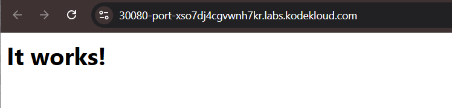

### Helm
1. Which command is used to search for a wordpress helm chart package from the Artifact Hub?
   option1: helm find hub wordpress
   option2: helm search hub wordpress

    controlplane ~ ➜  helm search hub wordpress
    URL                                                     CHART VERSION   APP VERSION              DESCRIPTION                                       
    https://artifacthub.io/packages/helm/wordpress-...      1.0.2           1.0.0                    A Helm chart for deploying Wordpress+Mariadb st...
    https://artifacthub.io/packages/helm/kube-wordp...      0.1.0           1.1                      this is my wordpress package                      
    https://artifacthub.io/packages/helm/bitnami/wo...      24.1.11         6.7.2                    WordPress is the world's most popular blogging ...
    https://artifacthub.io/packages/helm/bitnami-ak...      15.2.13         6.1.0                    WordPress is the world's most popular blogging ...
    ...

   Answer: option2

2.  Add a bitnami helm chart repository in the controlplane node.
    name - bitnami
    chart repo name - https://charts.bitnami.com/bitnami
    
    Hint: Run helm help and search for helm repo command to add chart repository.

    controlplane ~ ➜  helm repo -h
    ...
    Available Commands:
    add         add a chart repository
    index       generate an index file given a directory containing packaged charts
    list        list chart repositories
    remove      remove one or more chart repositories
    update      update information of available charts locally from chart repositories
    ...

    controlplane ~ ➜  helm repo add -h
    add a chart repository

    Usage:
    helm repo add [NAME] [URL] [flags]
    ...
    
    controlplane ~ ➜  helm repo add bitnami https://charts.bitnami.com/bitnami controlplane
    Error: "helm repo add" requires 2 arguments

    Usage:  helm repo add [NAME] [URL] [flags]

    controlplane ~ ✖ helm repo add bitnami https://charts.bitnami.com/bitnami
    "bitnami" has been added to your repositories

    Which command is used to search for the joomla package from the added repository?
        option1: helm search repo joomla
        option2: helm find joomla
        option3: helm get repo joomla

    controlplane ~ ➜  helm search repo joomla
    NAME            CHART VERSION   APP VERSION     DESCRIPTION                                       
    bitnami/joomla  20.0.4          5.1.2           DEPRECATED Joomla! is an award winning open sou...

    Answer: option1 

    What is the app version of joomla in the bitnami helm repository?
    Hint: Run : helm search repo joomla and look at the APP VERSION column.

    controlplane ~ ➜  helm search repo joomla
    NAME            CHART VERSION   APP VERSION     DESCRIPTION                                       
    bitnami/joomla  20.0.4          **5.1.2**       DEPRECATED Joomla! is an award winning open sou...

    Answer: 5.1.2

    Which chart version can you see for the joomla package in the bitnami helm repo?

    Carry On:

    CHART VERSION
    20.0.4

    Answer: 20.0.4

3.  How many helm repositories are added in the controlplane node?

    controlplane ~ ➜  helm repo list -h
    list chart repositories

    Usage:
    helm repo list [flags]
    ...

    controlplane ~ ➜  helm repo list
    NAME            URL                                                 
    bitnami         https://charts.bitnami.com/bitnami                  
    puppet          https://puppetlabs.github.io/puppetserver-helm-chart
    hashicorp       https://helm.releases.hashicorp.com                 

    Answer: 3 repos

4.  Install drupal helm chart from the bitnami repository.
    Release name should be bravo.
    Chart name should be bitnami/drupal.
    Note: Ignore the state of the application now.

    controlplane ~ ➜  helm install ~~drupal~~ bravo bitnami/drupal
    Error: INSTALLATION FAILED: expected at most two arguments, unexpected arguments: oci://us-central1-docker.pkg.dev/kk-lab-prod/helm-charts/bitnami/drupal

    controlplane ~ ✖ helm install bravo bitnami/drupal
    Pulled: us-central1-docker.pkg.dev/kk-lab-prod/helm-charts/bitnami/drupal:21.1.3
    Digest: sha256:1986543cf00e9b7ec2d03c97e5d11588efd6419767036b3555afd8b9c3203f79
    NAME: bravo
    LAST DEPLOYED: Tue Feb 18 21:59:13 2025
    NAMESPACE: default
    STATUS: deployed
    REVISION: 1
    TEST SUITE: None
    NOTES:
    CHART NAME: drupal
    CHART VERSION: 21.1.3
    APP VERSION: 11.1.2

    Verify: use helm list command to verify if installed

    controlplane ~ ➜  helm list
    NAME    NAMESPACE       REVISION        UPDATED                                 STATUS          CHART         APP VERSION
    bravo   default         1               2025-02-18 21:59:13.226818143 +0000 UTC deployed        drupal-21.1.3 11.1.2     

    
    Which command is used to list packages installed using helm?
        option1: helm package
        option2: helm list

    controlplane ~ ➜  helm list
    NAME    NAMESPACE       REVISION        UPDATED                                 STATUS          CHART           APP VERSION
    bravo   default         1               2025-02-18 21:59:13.226818143 +0000 UTC deployed        drupal-21.1.3   11.1.2     

    Answer: option2
    
    
    Uninstall the drupal helm package which we installed earlier.

    controlplane ~ ➜  helm uninstall -h
    ...
    Usage:
    helm uninstall RELEASE_NAME [...] [flags]
    ...

    controlplane ~ ➜  helm uninstall bravo
    release "bravo" uninstalled

5.  Download the bitnami apache package under the /root directory.
    Note: Do not install the package. Just download it.

    Hint: Run the command : helm pull --untar  bitnami/apache
    (--untar: if set to true, will untar the chart after downloading it)

    controlplane ~ ✖ helm pull --untar bitnami/apache
    Pulled: us-central1-docker.pkg.dev/kk-lab-prod/helm-charts/bitnami/apache:11.3.2
    Digest: sha256:1bd45c97bb7a0000534e3abc5797143661e34ea7165aa33068853c567e6df9f2

6.  Inspect the file values.yaml and make changes so that 2 replicas of the webserver are running and the http is exposed on nodeport 30080.
    Note: You can read the Bitnami documentation for more.
    https://github.com/bitnami/charts/tree/master/bitnami/apache/#installing-the-chart

    
    
    Install the apache from the downloaded helm package (承上一題第5題下載的apache).
    Release name: mywebapp

    Note: Do make changes accordingly so that 2 replicas of the webserver are running and the http is exposed on nodeport 30080.
    Make sure that the pods are in the running state.
    
    Hint: Edit the values.yaml file and change the parameters to replicaCount: 2 and http: 30080 under the nodePorts section. Then run helm install command to install the package.

    (目前只有一個pod)
    controlplane ~ ➜  k get pods
    NAME                              READY   STATUS    RESTARTS   AGE
    mywebapp-apache-67fdc655c-jljxd   1/1     Running   0          3m1s

    先修改values.yaml: (請先進入到apache資料夾下)
    controlplane ~ ➜  ls
    apache

    controlplane ~ ➜  cat apache/
    Chart.lock          files/              templates/          
    charts/             .helmignore         values.schema.json  
    Chart.yaml          README.md           values.yaml         

    controlplane ~ ✖ vim apache/values.yaml 
    ...
    replicaCount: 2 #1  修改replicaCount為2
    ...
    nodePorts:
    http: "30080" # 此欄設置為30080
    ...

    再install apache package:
    Once you have modified the values.yaml file , run the below command to install the apache package on the controlplane node:

    controlplane ~ ➜  helm install mywebapp ./apache
    NAME: mywebapp
    LAST DEPLOYED: Tue Feb 18 22:11:39 2025
    NAMESPACE: default
    STATUS: deployed
    REVISION: 1
    TEST SUITE: None
    NOTES:
    CHART NAME: apache
    CHART VERSION: 11.3.2
    APP VERSION: 2.4.63
    ....

    (看到有兩個pod運行中)
    controlplane ~ ➜  k get pods
    NAME                              READY   STATUS    RESTARTS   AGE
    mywebapp-apache-67fdc655c-9g6s6   0/1     Running   0          18s
    mywebapp-apache-67fdc655c-zlmn6   0/1     Running   0          18s

    Verfiy: helm list

    controlplane ~ ➜  helm list
    NAME            NAMESPACE       REVISION        UPDATED                                 STATUS          CHART            APP VERSION
    **mywebapp**     default         1             2025-02-18 22:11:39.284356127 +0000 UTC deployed        apache-11.3.2    2.4.63    

    You can access the Apache default page by clicking on mywebapp link from the top of the terminal.
    

### CRD