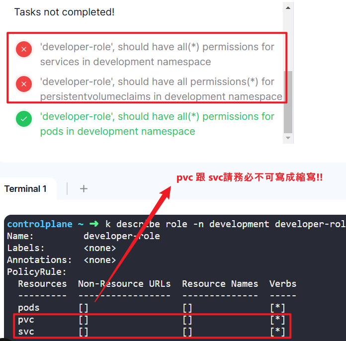
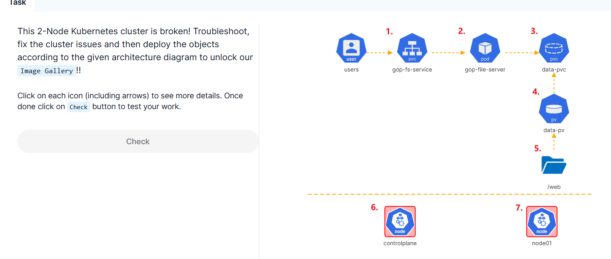
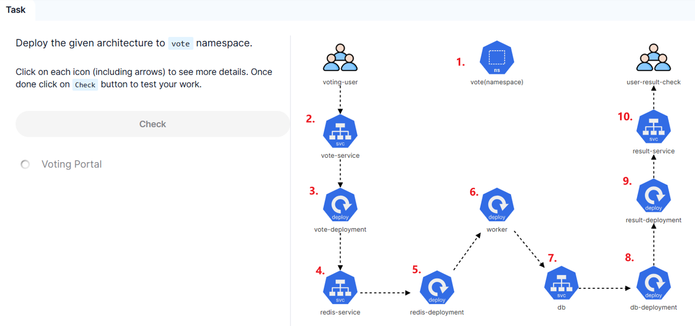
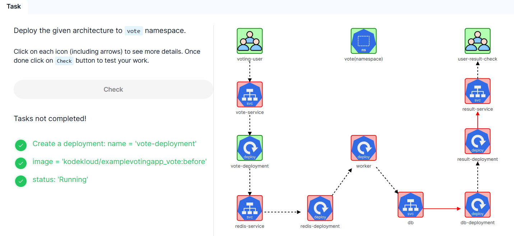
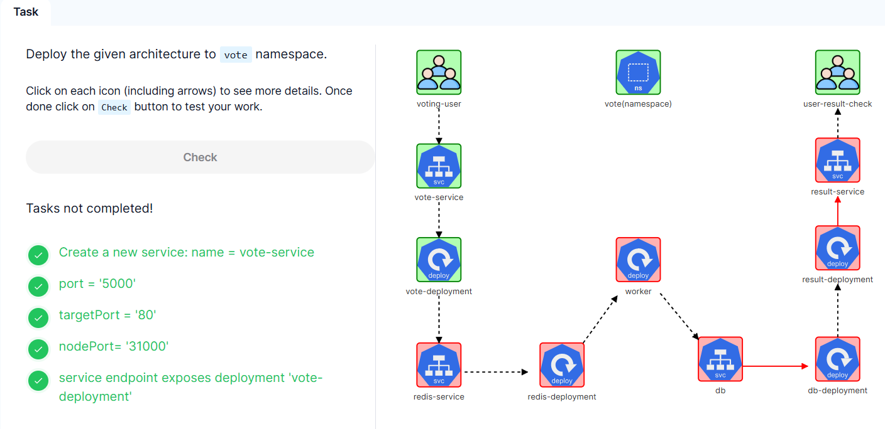
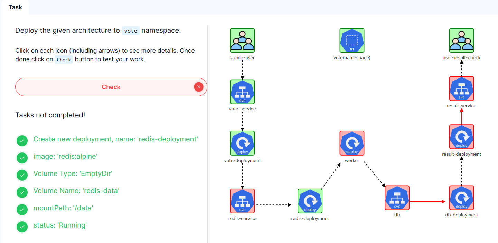
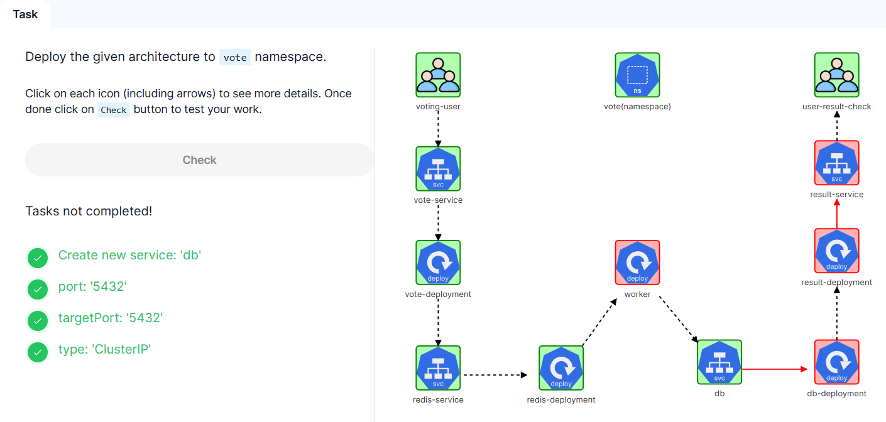
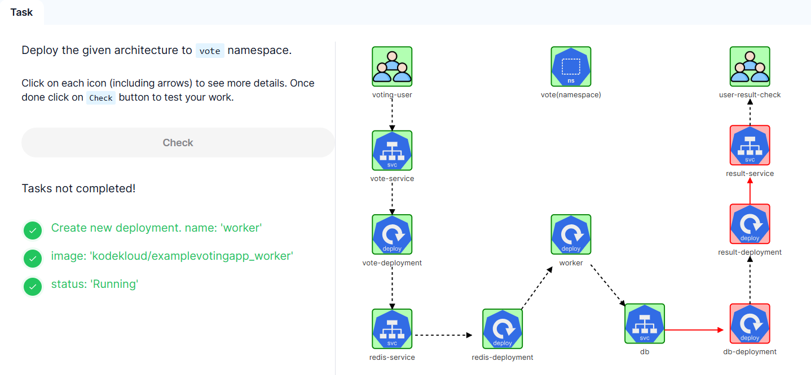
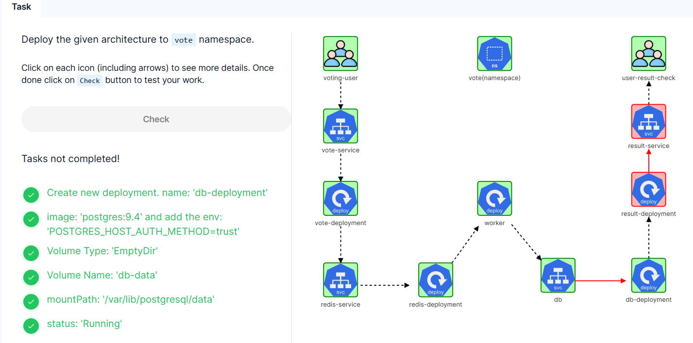
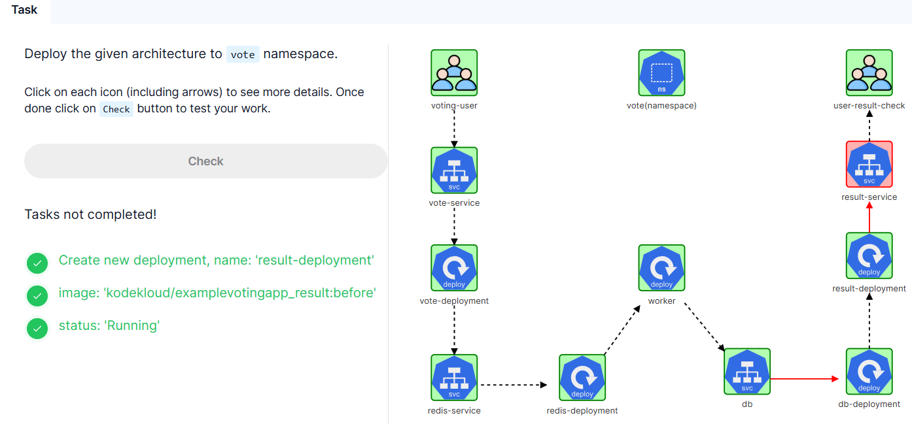

### Challenge 01

1.  Build user information for martin in the default kubeconfig file: User = martin , client-key = /root/martin.key and client-certificate = /root/martin.crt (Ensure don't embed within the kubeconfig file)
    Create a new context called 'developer' in the default kubeconfig file with 'user = martin' and 'cluster = kubernetes'

    controlplane ~ ✖ k config -h
    ...
    Available Commands:
    current-context   Display the current-context
    delete-cluster    Delete the specified cluster from the kubeconfig
    delete-context    Delete the specified context from the kubeconfig
    delete-user       Delete the specified user from the kubeconfig
    get-clusters      Display clusters defined in the kubeconfig
    get-contexts      Describe one or many contexts
    get-users         Display users defined in the kubeconfig
    rename-context    Rename a context from the kubeconfig file
    set               Set an individual value in a kubeconfig file
    set-cluster       Set a cluster entry in kubeconfig
    set-context       Set a context entry in kubeconfig
    set-credentials   Set a user entry in kubeconfig
    unset             Unset an individual value in a kubeconfig file
    use-context       Set the current-context in a kubeconfig file
    view              Display merged kubeconfig settings or a specified kubeconfig file

    Usage:
    kubectl config SUBCOMMAND [options]

    controlplane ~ ➜  k config set-credentials -h
    ...
    Usage:
    kubectl config set-credentials NAME [--client-certificate=path/to/certfile] [--client-key=path/to/keyfile]
    [--token=bearer_token] [--username=basic_user] [--password=basic_password] [--auth-provider=provider_name]
    [--auth-provider-arg=key=value] [--exec-command=exec_command] [--exec-api-version=exec_api_version] [--exec-arg=arg]
    [--exec-env=key=value] [options]

    controlplane ~ ➜  kubectl config set-credentials martin --client-certificate=/root/martin.crt  --client-key=/root/martin.key --embed-certs=false
    User "martin" set.

    controlplane ~ ➜  k config set-context -h    

    Usage:
    kubectl config set-context [NAME | --current] [--cluster=cluster_nickname] [--user=user_nickname]
    [--namespace=namespace] [options]

    Use "kubectl options" for a list of global command-line options (applies to all commands).

    controlplane ~ ➜  kubectl config set-context developer --cluster=kubernetes --user=martin
    Context "developer" created.

    **Verify**:
    controlplane ~ ➜  k config view
    apiVersion: v1
    clusters:
    - cluster:
        certificate-authority-data: DATA+OMITTED
        server: https://controlplane:6443
    name: kubernetes
    contexts:
    - context:
        cluster: kubernetes
        user: martin
    **name: developer**
    - context:
        cluster: kubernetes
        user: kubernetes-admin
    name: kubernetes-admin@kubernetes
    current-context: kubernetes-admin@kubernetes
    kind: Config
    preferences: {}
    users:
    - name: kubernetes-admin
    user:
        client-certificate-data: DATA+OMITTED
        client-key-data: DATA+OMITTED
    - **name: martin**
    user:
        client-certificate: /root/martin.crt
        client-key: /root/martin.key

    

2.  'developer-role', should have all(*) permissions for services in development namespace
    'developer-role', should have all permissions(*) for persistentvolumeclaims in development namespace
    'developer-role', should have all(*) permissions for pods in development namespace

    
    **IMPORTANT: 在 Kubernetes RBAC（Role-Based Access Control）中，resources 字段必须使用完整的资源名称，而不能使用缩写。 只有命令行支持縮寫!!!!**
    請務必使用api-resource中 查詢 NAME的字段名稱:
    controlplane ~ ➜  k api-resources |grep pvc
    persistentvolumeclaims              pvc          v1                                true         PersistentVolumeClaim

    controlplane ~ ➜  k api-resources |grep svc
    services                            svc          v1                                true         Service

    controlplane ~ ➜  vim role.yaml
    apiVersion: rbac.authorization.k8s.io/v1
    kind: Role
    metadata:
    namespace: development
    name: developer-role
    rules:
    - apiGroups: [""]
    resources: ["pods","persistentvolumeclaims","services"]
    verbs: ["*"]

    controlplane ~ ➜  k create -f role.yaml 
    role.rbac.authorization.k8s.io/developer-role created

    Verify: 
    controlplane ~ ➜  k describe role -n development developer-role 
    Name:         developer-role
    Labels:       <none>
    Annotations:  <none>
    PolicyRule:
    Resources               Non-Resource URLs  Resource Names  Verbs
    ---------               -----------------  --------------  -----
    persistentvolumeclaims  []                 []              [*]
    pods                    []                 []              [*]
    services                []                 []              [*]

    

3. create rolebinding = developer-rolebinding, role= 'developer-role', namespace = development
          rolebinding = developer-rolebinding associated with user = 'martin'
    
    controlplane ~ ➜  vim rolebinding.yaml
    apiVersion: rbac.authorization.k8s.io/v1
    kind: RoleBinding
    metadata:
    name: developer-rolebinding
    namespace: development
    subjects:
    - kind: User
    name: martin # "name" is case sensitive
    apiGroup: rbac.authorization.k8s.io
    roleRef:
    kind: Role #this must be Role or ClusterRole
    name: developer-role  # this must match the name of the Role or ClusterRole you wish to bind to
    apiGroup: rbac.authorization.k8s.io

    controlplane ~ ➜  k create -f  rolebinding.yaml
    rolebinding.rbac.authorization.k8s.io/developer-rolebinding created

    controlplane ~ ➜  k describe rolebinding -n development developer-rolebinding 
    Name:         developer-rolebinding
    Labels:       <none>
    Annotations:  <none>
    Role:
    Kind:  Role
    Name:  developer-role
    Subjects:
    Kind  Name    Namespace
    ----  ----    ---------
    User  martin 

    verify:
    controlplane ~ ➜  k auth can-i list pod -n development --as=martin
    yes

    controlplane ~ ➜  k auth can-i delete pvc -n development --as=martin
    yes

    controlplane ~ ➜  k auth can-i watch svc -n development --as=martin
    yes

    

4.  set context 'developer' with user = 'martin' and cluster = 'kubernetes' as the current context.

    controlplane ~ ➜  k config current-context 
    kubernetes-admin@kubernetes

    controlplane ~ ➜  k config use-context 
    developer                    kubernetes-admin@kubernetes  

    controlplane ~ ➜  **k config use-context developer** 
    Switched to context "developer".

    controlplane ~ ➜  k config get-clusters 
    NAME
    kubernetes

    

5.  Service 'jekyll' uses targetPort: '4000', namespace: 'development'
    Service 'jekyll' uses Port: '8080', namespace: 'development'
    Service 'jekyll' uses NodePort: '30097', namespace: 'development'

    controlplane ~ ✖ k get svc -n developement
    Error from server (Forbidden): services is forbidden: User "martin" cannot list resource "services" in API group "" in the namespace "developement"

    (切換回kubernetes-admin@kubernetes)
    controlplane ~ ✖ k config use-context kubernetes-admin@kubernetes 
    Switched to context "kubernetes-admin@kubernetes".

    controlplane ~ ➜  k get svc -n developement
    No resources found in developement namespace.

    controlplane ~ ➜  vim service.yaml
    apiVersion: v1
    kind: Service
    metadata:
    name: jekyll
    namespace: development
    spec:
        **type: NodePort**
        ports:
        - name: name-of-service-port
            protocol: TCP
            port: 8080
            nodePort: 30097
            targetPort: 4000

    controlplane ~ ➜  k create -f  service.yaml
    service/jekyll created

    controlplane ~ ➜  k get svc -n development 
    NAME     TYPE       CLUSTER-IP     EXTERNAL-IP   PORT(S)          AGE
    jekyll   NodePort   172.20.97.90   <none>        8080:30097/TCP   8s

    

6.  pod: 'jekyll' has an initContainer, name: 'copy-jekyll-site', image: 'gcr.io/kodekloud/customimage/jekyll'
    initContainer: 'copy-jekyll-site', command: [ "jekyll", "new", "/site" ] (command to run: jekyll new /site)
    pod: 'jekyll', initContainer: 'copy-jekyll-site', mountPath = '/site'
    pod: 'jekyll', initContainer: 'copy-jekyll-site', volume name = 'site'
    pod: 'jekyll', container: 'jekyll', volume name = 'site'
    pod: 'jekyll', container: 'jekyll', mountPath = '/site'
    pod: 'jekyll', container: 'jekyll', image = 'gcr.io/kodekloud/customimage/jekyll-serve'
    pod: 'jekyll', uses volume called 'site' with pvc = 'jekyll-site'
    pod: 'jekyll' uses label 'run=jekyll'

    controlplane ~ ➜  cat pod.yaml
    apiVersion: v1
    kind: Pod
    metadata:
    name: jekyll
    namespace: development
    labels:
        run: jekyll
    spec:
    containers:
    - name: jekyll
        image: gcr.io/kodekloud/customimage/jekyll-serve
        volumeMounts:
        - name: site
        mountPath: /site
    initContainers:
    - name: copy-jekyll-site
        image: gcr.io/kodekloud/customimage/jekyll
        **command: ["jekyll new /site"]**  # command: ["/bin/sh","-c","jekyll new /site"] 亦無法檢測成功
        (此處應為題目的bug, 設置: command: ["/bin/sh","-c","jekyll new /site"] 應為正確的)
        volumeMounts:
        - name: site
        mountPath: /site
    volumes:
    - name: site
        persistentVolumeClaim:
        claimName: jekyll-site

    controlplane ~ ➜  k create -f  jekyll.yaml
    pod/jekyll created

    controlplane ~ ➜  k get pod -n development
    NAME     READY   STATUS    RESTARTS   AGE
    jekyll   0/1     Pending   0          8s

    

7.  Storage Request: 1Gi
    Access modes: ReadWriteMany
    pvc name = jekyll-site, namespace = development
    'jekyll-site' PVC should be bound to the PersistentVolume called 'jekyll-site'.

    controlplane ~ ➜  k describe pv -n development
    Error from server (Forbidden): persistentvolumes is forbidden: User "martin" cannot list resource "persistentvolumes" in API group "" at the cluster scope

    (切回 kubernetes-admin 查看pv設置)
    controlplane ~ ✖ k config use-context 
    developer                    kubernetes-admin@kubernetes  

    controlplane ~ ✖ k config use-context kubernetes-admin@kubernetes 
    Switched to context "kubernetes-admin@kubernetes".

    controlplane ~ ➜  k describe pv -n development
    Name:              jekyll-site
    Labels:            <none>
    Annotations:       <none>
    Finalizers:        [kubernetes.io/pv-protection]
    **StorageClass:      local-storage**
    Status:            Available
    Claim:             
    Reclaim Policy:    Delete
    **Access Modes:      RWX**
    **VolumeMode:        Filesystem**
    Capacity:          1Gi
    Node Affinity:     
    Required Terms:  
        Term 0:        kubernetes.io/hostname in [node01]
    Message:           
    Source:
        Type:  LocalVolume (a persistent volume backed by local storage on a node)
        Path:  /site
    Events:    <none>

    (切回developer，developer是可以在development namespace下創建pvc的)
    controlplane ~ ➜  k config use-context developer 
    Switched to context "developer".

    controlplane ~ ➜  vim pvc.yaml 
    (倘若pvc的storageClass並未設置跟pv一樣，將導致pending。)
    controlplane ~ ➜  k get pvc -n development
    NAME          STATUS    VOLUME   CAPACITY   ACCESS MODES   STORAGECLASS   VOLUMEATTRIBUTESCLASS   AGE
    jekyll-site   Pending                                      slow           <unset>                 10s

    controlplane ~ ➜  k delete pvc -n development jekyll-site 
    persistentvolumeclaim "jekyll-site" deleted

    controlplane ~ ➜  vim pvc.yaml 
    apiVersion: v1
    kind: PersistentVolumeClaim
    metadata:
    name: jekyll-site
    namespace: development
    spec:
    accessModes:
        - ReadWriteMany
    volumeMode: Filesystem
    storageClassName: local-storage
    resources:
        requests:
        storage: 1Gi

    controlplane ~ ➜  k apply -f  pvc.yaml 
    persistentvolumeclaim/jekyll-site created

    controlplane ~ ➜  k get pvc -n development
    NAME          STATUS   VOLUME        CAPACITY   ACCESS MODES   STORAGECLASS    VOLUMEATTRIBUTESCLASS   AGE
    jekyll-site   **Bound**    jekyll-site   1Gi        RWX            local-storage   <unset>                 3s

    controlplane ~ ➜  k get pv -n development
    NAME          CAPACITY   ACCESS MODES   RECLAIM POLICY   STATUS   CLAIM                     STORAGECLASS    VOLUMEATTRIBUTESCLASS   REASON   AGE
    jekyll-site   1Gi        RWX            Delete           Bound    development/jekyll-site   local-storage   <unset>                          51m

    

### Challenge 02

1.  controlplane ~ ➜  k get svc
    (這類 kube-apiserver 相關的故障排查不會直接出現在 CKAD 考試，但理解kube-apiserver跟kubecofig的概念將有幫助)
    E0219 14:49:51.160962   13932 memcache.go:265] couldn't get current server API group list: Get "https://controlplane:6433/api?timeout=32s": dial tcp 192.168.50.43:6433: connect: connection refused
    E0219 14:49:51.161360   13932 memcache.go:265] couldn't get current server API group list: Get "https://controlplane:6433/api?timeout=32s": dial tcp 192.168.50.43:6433: connect: connection refused
    E0219 14:49:51.162589   13932 memcache.go:265] couldn't get current server API group list: Get "https://controlplane:6433/api?timeout=32s": dial tcp 192.168.50.43:6433: connect: connection refused
    E0219 14:49:51.162944   13932 memcache.go:265] couldn't get current server API group list: Get "https://controlplane:6433/api?timeout=32s": dial tcp 192.168.50.43:6433: connect: connection refused
    E0219 14:49:51.164333   13932 memcache.go:265] couldn't get current server API group list: Get "https://controlplane:6433/api?timeout=32s": dial tcp 192.168.50.43:6433: connect: connection refused

    (請跳至最底下，倘若發生不明原因導致kube-apiserver崩潰，執行: sudo crictl logs <kube-apiserver container ID> 查詢kube-apiserver日誌)

    The connection to the server controlplane:6433 was refused - did you specify the right host or port?
    Kubernetes 嘗試連線到 https://controlplane:6433/api?timeout=32s，但連線被拒絕 (connection refused)，這通常是因為 Kubernetes API Server 未啟動或無法訪問該 IP 地址與端口

    controlplane ~ ✖ sudo systemctl status kube-apiserver
    Unit kube-apiserver.service could not be found.

    kube-apiserver 由 kubelet 啟動，所以如果 kubelet 崩潰，kube-apiserver 也會無法運行。請檢查 kubelet 服務狀態

    controlplane ~ ✖ sudo systemctl status kubelet
    ● kubelet.service - kubelet: The Kubernetes Node Agent
        Loaded: loaded (/lib/systemd/system/kubelet.service; enabled; vendor preset: enabled)
        Drop-In: /usr/lib/systemd/system/kubelet.service.d
                └─10-kubeadm.conf
        Active: **active (running)** since Wed 2025-02-19 14:30:35 UTC; 23min ago
        Docs: https://kubernetes.io/docs/
    Main PID: 3676 (kubelet)
        Tasks: 24 (limit: 77143)
        Memory: 47.5M
        CGroup: /system.slice/kubelet.service
                └─3676 /usr/bin/kubelet --bootstrap-kubeconfig=/etc/kubernetes/bootstrap-kubelet.conf --kubeconfig=/etc/kubernetes/kubelet.conf --config=/var/lib/k>

    kubelet 是正常運行的，改檢查 kube-apiserver.yaml 文件是否存在或被意外刪除:
    controlplane ~ ✖ ls -l /etc/kubernetes/manifests/
    total 16
    -rw------- 1 root root 2412 Feb 19 14:29 etcd.yaml
    -rw------- 1 root root 3898 Feb 19 14:42 kube-apiserver.yaml
    -rw------- 1 root root 3394 Feb 19 14:29 kube-controller-manager.yaml
    -rw------- 1 root root 1463 Feb 19 14:29 kube-scheduler.yaml

    如果 kubelet 正常運行，但 kube-apiserver 仍然無法啟動，可以**檢查 kube-apiserver 的日誌**：

    controlplane ~ ➜  sudo journalctl -u kubelet -n 50 --no-pager
    Feb 19 14:56:20 controlplane kubelet[3676]: I0219 14:56:20.642281    3676 scope.go:117] "RemoveContainer" containerID="7c9ecc624b20e668564ce616f7afcac4cfa03ad2d8929ff782a17a673812745b"
    Feb 19 14:56:20 controlplane kubelet[3676]: E0219 14:56:20.643012    3676 pod_workers.go:1298] "Error syncing pod, skipping" err="failed to \"StartContainer\" for \"kube-apiserver\" with CrashLoopBackOff: \"back-off 5m0s restarting failed container=kube-apiserver pod=kube-apiserver-controlplane_kube-system(195c6eb0710264975dcc1fdb4bd52a20)\"" pod="kube-system/kube-apiserver-controlplane" podUID="195c6eb0710264975dcc1fdb4bd52a20"
    Feb 19 14:56:22 controlplane kubelet[3676]: E0219 14:56:22.233942    3676 event.go:368] "Unable to write event (may retry after sleeping)" err="Post \"https://controlplane:6443/api/v1/namespaces/kube-system/events\": dial tcp 192.168.50.43:6443: connect: connection refused" event="&Event{ObjectMeta:{kube-controller-manager-controlplane.1825a3131d470e40  kube-system    0 0001-01-01 00:00:00 +0000 UTC <nil> <nil> map[] map[] [] [] []},InvolvedObject:ObjectReference{Kind:Pod,Namespace:kube-system,Name:kube-controller-manager-controlplane,UID:fee18f86cdb106cbdc11565a5a3a13b0,APIVersion:v1,ResourceVersion:,FieldPath:spec.containers{kube-controller-manager},},Reason:Created,Message:Created container kube-controller-manager,Source:EventSource{Component:kubelet,Host:controlplane,},FirstTimestamp:2025-02-19 14:42:13.539466816 +0000 UTC m=+698.215934244,LastTimestamp:2025-02-19 14:42:13.539466816 +0000 UTC m=+698.215934244,Count:1,Type:Normal,EventTime:0001-01-01 00:00:00 +0000 UTC,Series:nil,Action:,Related:nil,ReportingController:kubelet,ReportingInstance:controlplane,}"
    Feb 19 14:56:23 controlplane kubelet[3676]: E0219 14:56:23.690662    3676 controller.go:145] "Failed to ensure lease exists, will retry" err="Get \"https://controlplane:6443/apis/coordination.k8s.io/v1/namespaces/kube-node-lease/leases/controlplane?timeout=10s\": dial tcp 192.168.50.43:6443: connect: connection refused" interval="7s"
    Feb 19 14:56:26 controlplane kubelet[3676]: E0219 14:56:26.211975    3676 kubelet_node_status.go:544] "Error updating node status, will retry" err="error getting node \"controlplane\": Get \"https://controlplane:6443/api/v1/nodes/controlplane?resourceVersion=0&timeout=10s\": dial tcp 192.168.50.43:6443: connect: connection refused"

    檢查kube-apiserver.yaml的設置:
    (發現etcd server, advertise-address 跟secrue port均有設置)
    controlplane ~ ➜  cat /etc/kubernetes/manifests/kube-apiserver.yaml
    apiVersion: v1
    kind: Pod
    metadata:
    annotations:
        kubeadm.kubernetes.io/kube-apiserver.advertise-address.endpoint: 192.168.50.43:6443
    creationTimestamp: null
    labels:
        component: kube-apiserver
        tier: control-plane
    name: kube-apiserver
    namespace: kube-system
    spec:
    containers:
    - command:
        - kube-apiserver
        - --**advertise-address=192.168.50.43**
        - --allow-privileged=true
        - --authorization-mode=Node,RBAC
        - --client-ca-file=/etc/kubernetes/pki/ca-authority.crt
        - --enable-admission-plugins=NodeRestriction
        - --enable-bootstrap-token-auth=true
        - --etcd-cafile=/etc/kubernetes/pki/etcd/ca.crt
        - --etcd-certfile=/etc/kubernetes/pki/apiserver-etcd-client.crt
        - --etcd-keyfile=/etc/kubernetes/pki/apiserver-etcd-client.key
        - --**etcd-servers=https://127.0.0.1:2379**
        - --kubelet-client-certificate=/etc/kubernetes/pki/apiserver-kubelet-client.crt
        - --kubelet-client-key=/etc/kubernetes/pki/apiserver-kubelet-client.key
        - --kubelet-preferred-address-types=InternalIP,ExternalIP,Hostname
        - --proxy-client-cert-file=/etc/kubernetes/pki/front-proxy-client.crt
        - --proxy-client-key-file=/etc/kubernetes/pki/front-proxy-client.key
        - --requestheader-allowed-names=front-proxy-client
        - --requestheader-client-ca-file=/etc/kubernetes/pki/front-proxy-ca.crt
        - --requestheader-extra-headers-prefix=X-Remote-Extra-
        - --requestheader-group-headers=X-Remote-Group
        - --requestheader-username-headers=X-Remote-User
        - --**secure-port=6443**
        - --service-account-issuer=https://kubernetes.default.svc.cluster.local
        - --service-account-key-file=/etc/kubernetes/pki/sa.pub
        - --service-account-signing-key-file=/etc/kubernetes/pki/sa.key
        - --service-cluster-ip-range=172.20.0.0/16
        - --tls-cert-file=/etc/kubernetes/pki/apiserver.crt
        - --tls-private-key-file=/etc/kubernetes/pki/apiserver.key
        image: registry.k8s.io/kube-apiserver:v1.30.0
        (以下省略)

    檢查 etcd & kube-api-server 是否狀態:
    controlplane ~ ➜  sudo crictl ps | grep etcd
    eceeb7bf6ef4f       3861cfcd7c04c       36 minutes ago      **Running**             etcd                      0                   538e76eafe39e       etcd-controlplane

    controlplane ~ ➜  sudo crictl ps -a | grep kube-apiserver
    45f621de0b296       c42f13656d0b2       3 minutes ago       **Exited**              kube-apiserver            9                   c430038b863ff       kube-apiserver-controlplane

    可以看到etcd正常運行，但kube-apiserver已經崩潰不斷重啟，故應進一步排查kube-apiserver

    controlplane ~ ✖ sudo crictl logs 45f621de0b296
    E0219 15:09:52.639919   20958 remote_runtime.go:432] "ContainerStatus from runtime service failed" err="rpc error: code = NotFound desc = an error occurred when try to find container \"45f621de0b296\": not found" containerID="45f621de0b296"
    FATA[0000] rpc error: code = NotFound desc = an error occurred when try to find container "45f621de0b296": **not found** 

    not found: 這表示 kube-apiserver 容器已經被刪除，可能是因為 kubelet 自動回收了崩潰的容器並嘗試重新啟動

    **強制刪除 kube-apiserver 並讓 kubelet 重啟**:

    controlplane ~ ➜  sudo crictl rm -f 77ae41c6de1eb
    77ae41c6de1eb

    controlplane ~ ➜  sudo crictl ps -a | grep kube-apiserver

    controlplane ~ ✖ sudo crictl ps -a | grep kube-apiserver
    efcacd9c2cb58       c42f13656d0b2       Less than a second ago   **Running**             kube-apiserver            0                   c430038b863ff       kube-apiserver-controlplane

    發現即使強制重啟kubelet 或是kube-apiserver, 隔幾秒仍有同樣的問題: 
    controlplane ~ ✖ sudo crictl ps -a | grep kube-apiserver
    9bd2f79c0cf47       c42f13656d0b2       31 seconds ago      Exited              kube-apiserver            3                   c430038b863ff       kube-apiserver-controlplane

    **查看kube-apiserver 日誌**:
    controlplane ~ ➜  **sudo crictl logs 9bd2**
    I0219 15:18:58.954248       1 options.go:221] external host was not specified, using 192.168.50.43
    I0219 15:18:58.955952       1 server.go:148] Version: v1.30.0
    I0219 15:18:58.955993       1 server.go:150] "Golang settings" GOGC="" GOMAXPROCS="" GOTRACEBACK=""
    E0219 15:18:59.855713       1 run.go:74] "command failed" err="open /etc/kubernetes/pki/ca-authority.crt: no such file or directory"

    檢查/etc/kubernetes/pki文件底下是否有 ca-authority.crt 文件:
    controlplane ~ ➜  ls -l /etc/kubernetes/pki/
    total 60
    -rw-r--r-- 1 root root 1289 Feb 19 14:29 apiserver.crt
    -rw-r--r-- 1 root root 1123 Feb 19 14:29 apiserver-etcd-client.crt
    -rw------- 1 root root 1675 Feb 19 14:29 apiserver-etcd-client.key
    -rw------- 1 root root 1679 Feb 19 14:29 apiserver.key
    -rw-r--r-- 1 root root 1176 Feb 19 14:29 apiserver-kubelet-client.crt
    -rw------- 1 root root 1679 Feb 19 14:29 apiserver-kubelet-client.key
    -rw-r--r-- 1 root root 1107 Feb 19 14:29 **ca.crt**
    -rw------- 1 root root 1679 Feb 19 14:29 **ca.key**
    drwxr-xr-x 2 root root 4096 Feb 19 14:29 etcd
    -rw-r--r-- 1 root root 1123 Feb 19 14:29 front-proxy-ca.crt
    -rw------- 1 root root 1679 Feb 19 14:29 front-proxy-ca.key
    -rw-r--r-- 1 root root 1119 Feb 19 14:29 front-proxy-client.crt
    -rw------- 1 root root 1679 Feb 19 14:29 front-proxy-client.key
    -rw------- 1 root root 1679 Feb 19 14:29 sa.key
    -rw------- 1 root root  451 Feb 19 14:29 sa.pub

    由此可知，kube-apiserver.yaml 文件配置錯誤，應設置ca.crt 文件而非ca-authority.crt
    controlplane ~ ➜  vim /etc/kubernetes/manifests/kube-apiserver.yaml
    - --client-ca-file=/etc/kubernetes/pki/ca.crt # 修改

    修改完文件之後，重啟kubelet: 
    controlplane ~ ✖ **sudo systemctl restart kubelet**

    controlplane ~ ➜  sudo **crictl ps -a | grep kube-apiserver**
    c58801a90ad94       c42f13656d0b2       Less than a second ago   **Created**             kube-apiserver            0                   4bc25fcf471d6       kube-apiserver-controlplane
    32b05ed75daa2       c42f13656d0b2       About a minute ago       Exited              kube-apiserver            6                   c430038b863ff       kube-apiserver-controlplane

    controlplane ~ ➜  sudo crictl ps -a | grep kube-apiserver
    c58801a90ad94       c42f13656d0b2       8 seconds ago        **Running**             kube-apiserver            0                   4bc25fcf471d6       kube-apiserver-controlplane
    32b05ed75daa2       c42f13656d0b2       About a minute ago   Exited              kube-apiserver            6                   c430038b863ff       kube-apiserver-controlplane

    已經修正kube-apiserver配置的問題，但使用k get svc指令仍出現以下:
    controlplane ~ ➜  k get svc
    E0219 15:27:31.149067   28359 memcache.go:265] couldn't get current server API group list: Get "https://controlplane:6433/api?timeout=32s": dial tcp 192.168.50.43:6433: connect: connection refused
    E0219 15:27:31.149580   28359 memcache.go:265] couldn't get current server API group list: Get "https://controlplane:6433/api?timeout=32s": dial tcp 192.168.50.43:6433: connect: connection refused

    01. 此處發現其設置的6433端口錯誤，檢查kube-apiserver是否正確監聽 6443端口:    

    controlplane ~ ➜  sudo netstat -tulnp | grep 6443
    tcp6       0      0 :::6443                 :::*                    LISTEN      27696/kube-apiserve 

    02. 檢查 kubectl 是否使用正確的 kubeconfig:

    controlplane ~ ➜  echo $KUBECONFIG (無)

    沒有輸出，設置正確的 kubeconfig:
    controlplane ~ ✖ ls /etc/kubernetes/
    **admin.con**f  controller-manager.conf  kubelet.conf  manifests  pki  scheduler.conf  super-admin.conf

    controlplane ~ ➜  export KUBECONFIG=/etc/kubernetes/admin.conf

    controlplane ~ ➜  echo $KUBECONFIG
    /etc/kubernetes/admin.conf

    設置正確的kubeconfig配置路徑之後，重新執行 k get svc:
    controlplane ~ ➜  kubectl get svc
    NAME         TYPE        CLUSTER-IP   EXTERNAL-IP   PORT(S)   AGE
    kubernetes   ClusterIP   172.20.0.1   <none>        443/TCP   63m

    成功!!!

    處理完kube-apiserver的問題之後，處理本題問題:
    New Service, name: 'gop-fs-service'
    Service name: gop-fs-service, port: '8080'
    Service name: gop-fs-service, targetPort: '8080'

    controlplane ~ ➜  vim gop-fs-service.yaml
    apiVersion: v1
    kind: Service
    metadata:
    name: gop-fs-service
    spec:
    ports:
        - name: http
        protocol: TCP
        port: 8080
        targetPort: 8080

    controlplane ~ ➜  k create -f  gop-fs-service.yaml
    service/gop-fs-service created

    controlplane ~ ➜  k get svc
    NAME             TYPE        CLUSTER-IP       EXTERNAL-IP   PORT(S)    AGE
    gop-fs-service   ClusterIP   172.20.144.241   <none>        8080/TCP   3s
    kubernetes       ClusterIP   172.20.0.1       <none>        443/TCP    68m

    

2.  Create a pod for file server, name: 'gop-file-server'
    pod: gop-file-server image: 'kodekloud/fileserver'
    pod: gop-file-server mountPath: '/web'
    pod: gop-file-server volumeMount name: 'data-store'
    pod: gop-file-server persistent volume name: data-store
    pod: gop-file-server persistent volume claim used: 'data-pvc'

    controlplane ~ ✖ vim gop-file-server.yaml 
    apiVersion: v1
    kind: Pod
    metadata:
    name: gop-file-server
    spec:
    containers:
    - image: kodekloud/fileserver
        name: gop-file-server
        resources: {}
        volumeMounts:
        - name: data-store
        mountPath: /web
    volumes:
        - name: data-store
        persistentVolumeClaim:
            claimName: data-pvc
    status: {}

    controlplane ~ ➜  k create -f  gop-file-server.yaml 
    pod/gop-file-server created

    

3.  Create new PersistentVolumeClaim = 'data-pvc'
    PersistentVolume = 'data-pvc', accessModes = 'ReadWriteMany'
    PersistentVolume = 'data-pvc', storage request = '1Gi'
    PersistentVolume = 'data-pvc', volumeName = 'data-pv'
    
    controlplane ~ ✖ vim data-pvc.yaml
    apiVersion: v1
    kind: PersistentVolumeClaim
    metadata:
    name: data-pvc
    spec:
    volumeName: data-pv
    volumeMode: Filesystem
    accessModes:
        - ReadWriteMany
    resources:
        requests:
        storage: 1Gi

    controlplane ~ ➜  kc data-pvc.yaml
    persistentvolumeclaim/data-pvc created

    

4.  Create new PersistentVolume = 'data-pv'
    PersistentVolume = data-pv, accessModes = 'ReadWriteMany'
    PersistentVolume = data-pv, hostPath = '/web'
    PersistentVolume = data-pv, storage = '1Gi'

    controlplane ~ ➜  vim data-pv.yaml
    apiVersion: v1
    kind: PersistentVolume
    metadata:
    name: data-pv
    spec:
    capacity:
        storage: 1Gi
    volumeMode: Filesystem
    accessModes:
        - ReadWriteMany
    hostPath:
        path: /web

    controlplane ~ ➜  kc data-pv.yaml
    persistentvolume/data-pv created

    

5.  Copy all images from the directory '/media' on the controlplane node to '/web' directory on node01
    Step1: 先確認 controlplane 是否可以ssh到node01

    controlplane ~ ➜  ssh node01
    node01 ~ ➜

    ssh到node01之後，使用scp 指令複製文件卻被要求輸入node01密碼: 

    node01 /media ➜  scp /media/*.{jpg,png,jpeg,gif} node01:/web/
    The authenticity of host 'node01 (192.168.207.244)' can't be established.
    ED25519 key fingerprint is SHA256:GimoZE1SoCGxJVTMrg2wPL/zxjmdSrDRM9qwrGTk0BI.
    This key is not known by any other names
    Are you sure you want to continue connecting (yes/no/[fingerprint])? yes
    Warning: Permanently added 'node01' (ED25519) to the list of known hosts.
    root@node01's password:  

    Step2: 退回controlplane:

    controlplane ~ ✖ scp -r /media/* root@node01:/web/
    kodekloud-ckad.png                                                                                                             100%   58KB  35.3MB/s   00:00    
    kodekloud-cka.png                                                                                                              100%   57KB  91.4MB/s   00:00    
    kodekloud-cks.png      

    

6.  Master node: coredns deployment has image: 'registry.k8s.io/coredns/coredns:v1.8.6' (這一題不會出現在CKAD考試中，但了解概念會有幫助)
    Fix kube-apiserver. Make sure its running and healthy.
    kubeconfig = /root/.kube/config, User = 'kubernetes-admin' Cluster: Server Port = '6443'

    在第1題中，我們已經修正kube-apiserver的問題，使其正常運行:
    controlplane ~ ➜  crictl ps|grep kube-apiserver
    7759e447feadd       c42f13656d0b2       25 minutes ago      Running             kube-apiserver            0                   383a678410f1a       kube-apiserver-controlplane

    來處理coredns deployment has image: 'registry.k8s.io/coredns/coredns:v1.8.6 
    跟kubeconfig = /root/.kube/config, User = 'kubernetes-admin' Cluster: Server Port = '6443':

    Master node: coredns deployment has image: 'registry.k8s.io/coredns/coredns:v1.8.6:
    在 Kubernetes 1.24+ 之後，官方文件通常已不再使用「Master」的稱呼，而是改為「Control plane」(控制平面) 節點；
    所以嚴格來說，你所看到的 **controlplane 這個 Node** 就已經是 Kubernetes Cluster 中的「控制平面」(**以前會叫 maste**r) 節點了

    CoreDNS 預設部署在 kube-system 這個 namespace:
    controlplane ~ ✖ k describe deploy coredns -n kube-system |grep -i image
    Image:       registry.k8s.io/kubedns:1.3.1 (當前的image)

    k set image 指令會出現在CKAD中
    controlplane ~ ✖ **kubectl set image** -n kube-system deployment/coredns coredns=registry.k8s.io/coredns/coredns:v1.8.6
    deployment.apps/coredns image updated

    controlplane ~ ➜  k describe deploy coredns -n kube-system |grep -i image
        Image:       registry.k8s.io/coredns/coredns:v1.8.6

    
    kubeconfig = /root/.kube/config, User = 'kubernetes-admin' Cluster: Server Port = '6443':
    
    controlplane ~ ➜  ls /root/.kube/c
    cache/  config 

    controlplane ~ ✖ echo $KUBECONFIG (這是當前的config file)
    /etc/kubernetes/admin.conf

    controlplane ~ ➜  export KUBECONFIG=/root/.kube/config (改設置config file為題目要求的: /root/.kube/config)

    controlplane ~ ➜  echo $KUBECONFIG
    /root/.kube/config

    重新set-context設置 
    controlplane ~ ➜  kubectl config set-context kubernetes-admin@kubernetes \
        --cluster=kubernetes \
        --user=kubernetes-admin \
        --kubeconfig=/root/.kube/config
    Context "kubernetes-admin@kubernetes" modified.

    controlplane ~ ➜  k config view
    apiVersion: v1
    clusters:
    - cluster:
        certificate-authority-data: DATA+OMITTED
        server: https://controlplane:6433
    name: kubernetes
    contexts:
    - context:
        cluster: server
        user: kubernetes-admin
    name: kubernetes-admin
    - context:
        cluster: kubernetes
        user: kubernetes-admin
    name: kubernetes-admin@kubernetes
    current-context: kubernetes-admin@kubernetes
    kind: Config
    preferences: {}
    users:
    - name: kubernetes-admin
    user:
        client-certificate-data: DATA+OMITTED
        client-key-data: DATA+OMITTED

    設置cluster:
    controlplane ~ ➜  kubectl get nodes --kubeconfig=/root/.kube/config
    E0219 18:28:37.011409   33534 memcache.go:265] couldn't get current server API group list: Get "https://controlplane:6433/api?timeout=32s": dial tcp 192.168.207.235:6433: connect: connection refused
    E0219 18:28:37.011806   33534 memcache.go:265] couldn't get current server API group list: Get "https://controlplane:6433/api?timeout=32s": dial tcp 192.168.207.235:6433: connect: connection refused
    E0219 18:28:37.013378   33534 memcache.go:265] couldn't get current server API group list: Get "https://controlplane:6433/api?timeout=32s": dial tcp 192.168.207.235:6433: connect: connection refused
    E0219 18:28:37.013719   33534 memcache.go:265] couldn't get current server API group list: Get "https://controlplane:6433/api?timeout=32s": dial tcp 192.168.207.235:6433: connect: connection refused
    E0219 18:28:37.015157   33534 memcache.go:265] couldn't get current server API group list: Get "https://controlplane:6433/api?timeout=32s": dial tcp 192.168.207.235:6433: connect: connection refused
    The connection to the server controlplane:6433 was refused - did you specify the right host or port?

    controlplane ~ ✖ kubectl config set-cluster kubernetes \
    --server=https://controlplane:6443 \
    --kubeconfig=/root/.kube/config
    Cluster "kubernetes" set.

    設置後便正常看到nodes:
    controlplane ~ ➜  kubectl get nodes --kubeconfig=/root/.kube/config
    NAME           STATUS                     ROLES           AGE   VERSION
    controlplane   Ready                      control-plane   74m   v1.30.0
    node01         Ready,SchedulingDisabled   <none>          73m   v1.30.0
 
    

7.  node01 is ready and can schedule pods? (不會出現在CKAD考試中)

    controlplane ~ ➜  kubectl get nodes --kubeconfig=/root/.kube/config
    NAME           STATUS                     ROLES           AGE   VERSION
    controlplane   Ready                      control-plane   74m   v1.30.0
    node01         Ready,SchedulingDisabled   <none>          73m   v1.30.0

    controlplane ~ ➜  kubectl uncordon node01
    node/node01 uncordoned

    controlplane ~ ➜  kubectl get nodes --kubeconfig=/root/.kube/config
    NAME           STATUS   ROLES           AGE   VERSION
    controlplane   Ready    control-plane   76m   v1.30.0
    node01         Ready    <none>          75m   v1.30.0

    (發現第1題前面要求設置:)
    Service name: gop-fs-service, NodePort: '31200'
    故編輯service:
    (新增NodePort)
    spec:
    clusterIP: 172.20.204.131
    clusterIPs:
    - 172.20.204.131
    externalTrafficPolicy: Cluster
    internalTrafficPolicy: Cluster
    ipFamilies:
    - IPv4
    ipFamilyPolicy: SingleStack
    ports:
    - **nodePort: 31200** # Add
        port: 8080
        protocol: TCP
        targetPort: 8080
    sessionAffinity: None
    **type: NodePort** # Add

    controlplane ~ ➜  k edit svc gop-fs-service 
    error: services "gop-fs-service" is invalid
    service/gop-fs-service edited

    

    最後檢查:
    

### Challenge 03

1.  Create a new namespace: name = 'vote'

    controlplane ~ ➜  k create ns vote
    namespace/vote created

    

2.  Create a new service: name = vote-service
    port = '5000'
    targetPort = '80'
    nodePort= '31000'
    service endpoint exposes deployment 'vote-deployment'

     ~~controlplane ~ ➜  k create svc nodeport vote-service --tcp=5000:80 --node-port=31000 -n vote~~
    service/vote-service created

    controlplane ~ ➜ k expose deploy -h
    
    //# **Create a service** for an nginx deployment, which serves on port 80 and connects to the containers on port 8000
    kubectl expose deployment nginx --port=80 --target-port=8000
    
    controlplane ~ ➜  kubectl expose deployment -n vote vote-deployment  --port=80 --target-port=8000
    Error from server (NotFound): deployments.apps "vote-deployment" not found
    (先完成 k create deploy vote-deployment)

3.  Create a deployment: name = 'vote-deployment'
    image = 'kodekloud/examplevotingapp_vote:before'
    status: 'Running'

    controlplane ~ ✖ k create deploy vote-deployment --image=kodekloud/examplevotingapp_vote:before -n vote 
    deployment.apps/vote-deployment created

    

    繼續完成2. 

    controlplane ~ ➜  kubectl expose deployment -n vote vote-deployment  --port=5000 --target-port=80 --nodePort=31000 --dry-run=client -o yaml > vote-svc.yaml

    controlplane ~ ✖ vim vote-svc.yaml 
    apiVersion: v1
    kind: Service
    metadata:
    creationTimestamp: "2025-02-21T01:15:18Z"
    labels:
        app: vote-deployment
    name: vote-service
    namespace: vote
    resourceVersion: "6266"
    uid: a314e15f-49ed-482a-8047-f850a6d87e24
    spec:
    clusterIP: 172.20.182.39
    clusterIPs:
    - 172.20.182.39
    internalTrafficPolicy: Cluster
    ipFamilies:
    - IPv4
    ipFamilyPolicy: SingleStack
    ports:
    - port: 5000
        protocol: TCP
        targetPort: 80
        nodePort: 31000
    selector:
        app: vote-deployment
    sessionAffinity: None
    type: NodePort
    status:
    loadBalancer: {}

    controlplane ~ ➜  k create -f  vote-svc.yaml 
    service/vote-service created

    controlplane ~ ➜  k get svc -n vote 
    NAME           TYPE       CLUSTER-IP      EXTERNAL-IP   PORT(S)        AGE
    vote-service   NodePort   172.20.182.39   <none>        80:31000/TCP   4s

    

4.  New Service, name = 'redis'
    port: '6379'
    targetPort: '6379'
    type: 'ClusterIP'
    service endpoint exposes deployment 'redis-deployment'

    controlplane ~ ➜  k get svc -n vote 
    NAME               TYPE        CLUSTER-IP      EXTERNAL-IP   PORT(S)          AGE

    vote-service       NodePort    172.20.182.39   <none>        5000:31000/TCP   15m

    沒有redis-depolyment, 先處理下一題

5.  Create new deployment, name: 'redis-deployment'
    image: 'redis:alpine'
    Volume Type: 'EmptyDir'
    Volume Name: 'redis-data'
    mountPath: '/data'
    status: 'Running'

    controlplane ~ ➜  k get deploy -n vote 
    NAME              READY   UP-TO-DATE   AVAILABLE   AGE
    vote-deployment   1/1     1            1           10m

    controlplane ~ ✖ k create deploy redis-deployment --image=redis:alpine --dry-run=client -o yaml > redis-deploy.yaml

    controlplane ~ ➜  vim redis-deploy.yaml 

    controlplane ~ ➜  k explain deployment.spec.template.spec.volumes.emptyDir
    GROUP:      apps
    KIND:       Deployment
    VERSION:    v1

    FIELD: emptyDir <EmptyDirVolumeSource>

    DESCRIPTION:
        emptyDir represents a temporary directory that shares a pod's lifetime. More
        info: https://kubernetes.io/docs/concepts/storage/volumes#emptydir
        Represents an empty directory for a pod. Empty directory volumes support
        ownership management and SELinux relabeling.
        
    FIELDS:
    medium        <string>
        medium represents what type of storage medium should back this directory.
        The default is "" which means to use the node's default medium. Must be an
        empty string (default) or Memory. More info:
        https://kubernetes.io/docs/concepts/storage/volumes#emptydir

    sizeLimit     <Quantity>
        sizeLimit is the total amount of local storage required for this EmptyDir
        volume. The size limit is also applicable for memory medium. The maximum
        usage on memory medium EmptyDir would be the minimum value between the
        SizeLimit specified here and the sum of memory limits of all containers in a
        pod. The default is nil which means that the limit is undefined. More info:
        https://kubernetes.io/docs/concepts/storage/volumes#emptydir

    (沒有要求emptyDir底下需配置那些參數)

    controlplane ~ ➜  vim redis-deploy.yaml 

    apiVersion: apps/v1
    kind: Deployment
    metadata:
    creationTimestamp: null
    labels:
        app: redis-deployment
    name: redis-deployment
    namespace: vote
    spec:
    replicas: 1
    selector:
        matchLabels:
        app: redis-deployment
    strategy: {}
    template:
        metadata:
        creationTimestamp: null
        labels:
            app: redis-deployment
        spec:
        containers:
        - image: redis:alpine
            name: redis
            resources: {}
            volumeMounts:
            - mountPath: /data
            name: redis-data
        volumes:
        - name: redis-data
            **emptyDir: {}**
    status: {}

    controlplane ~ ➜  k get deploy -n vote 
    NAME               READY   UP-TO-DATE   AVAILABLE   AGE
    redis-deployment   1/1     1            1           5s
    vote-deployment    1/1     1            1           20m

    

    回到4. 

    controlplane ~ ➜  k expose deploy -n vote redis-deployment --port=6379 --target-port=6379 --dry-run=client -o yaml > redis-svc.yaml (imperative指令默認生成clusterIP)

    controlplane ~ ➜  vim redis-svc.yaml
    apiVersion: v1
    kind: Service
    metadata:
    creationTimestamp: null
    labels:
        app: redis-deployment
    name: redis # 變更為redis
    namespace: vote
    spec:
    ports:
    - port: 6379
        protocol: TCP
        targetPort: 6379
    selector:
        app: redis-deployment
    status:
    loadBalancer: {}

    controlplane ~ ➜  k create -f  redis-svc.yaml 
    service/redis created

    controlplane ~ ➜  k get svc -n vote 
    NAME           TYPE        CLUSTER-IP       EXTERNAL-IP   PORT(S)          AGE
    redis          ClusterIP   172.20.156.164   <none>        6379/TCP         27s
    vote-service   NodePort    172.20.182.39    <none>        5000:31000/TCP   18m

    

6.  Create new deployment. name: 'worker'
    image: 'kodekloud/examplevotingapp_worker'
    status: 'Running'

    controlplane ~ ✖ k create deploy worker --image=kodekloud/examplevotingapp_worker -n vote
    deployment.apps/worker created

    controlplane ~ ➜  k get deploy -n vote 
    NAME               READY   UP-TO-DATE   AVAILABLE   AGE
    redis-deployment   1/1     1            1           2m1s
    vote-deployment    1/1     1            1           34m
    worker             0/1     1            0           8s 
    controlplane ~ ➜  k get pod -n vote 
    NAME                                READY   STATUS             RESTARTS      AGE
    redis-deployment-7b5d847967-tzlg7   1/1     Running            0             6m17s
    vote-deployment-5d4d9b6d88-sjnc4    1/1     Running            0             38m
    **worker-7567f4b597-z9qhn**             0/1     CrashLoopBackOff   5 (43s ago)   4m24s (發現status 不為running)

    controlplane ~ ➜  kubectl logs -f -n vote worker-7567f4b597-z9qhn 
    System.AggregateException: One or more errors occurred. (No such device or address) ---> System.Net.Internals.SocketExceptionFactory+ExtendedSocketException: No such device or address
    at System.Net.Dns.HostResolutionEndHelper(IAsyncResult asyncResult)
    at System.Net.Dns.EndGetHostAddresses(IAsyncResult asyncResult)
    at System.Net.Dns.<>c.<GetHostAddressesAsync>b__14_1(IAsyncResult asyncResult)
    at System.Threading.Tasks.TaskFactory`1.FromAsyncCoreLogic(IAsyncResult iar, Func`2 endFunction, Action`1 endAction, Task`1 promise, Boolean requiresSynchronization)
    --- End of inner exception stack trace ---
    at System.Threading.Tasks.Task`1.GetResultCore(Boolean waitCompletionNotification)
    at Npgsql.NpgsqlConnector.Connect(NpgsqlTimeout timeout)
    at Npgsql.NpgsqlConnector.RawOpen(NpgsqlTimeout timeout)
    at Npgsql.NpgsqlConnector.Open(NpgsqlTimeout timeout)
    at Npgsql.ConnectorPool.Allocate(NpgsqlConnection conn, NpgsqlTimeout timeout)
    at Npgsql.NpgsqlConnection.OpenInternal()
    at Worker.Program.OpenDbConnection(String connectionString) in /code/src/Worker/Program.cs:line 74
    at Worker.Program.Main(String[] args) in /code/src/Worker/Program.cs:line 19
    ---> (Inner Exception #0) System.Net.Internals.SocketExceptionFactory+ExtendedSocketException: No such device or address
    at System.Net.Dns.HostResolutionEndHelper(IAsyncResult asyncResult)
    at System.Net.Dns.EndGetHostAddresses(IAsyncResult asyncResult)
    at System.Net.Dns.<>c.<GetHostAddressesAsync>b__14_1(IAsyncResult asyncResult)
    at System.Threading.Tasks.TaskFactory`1.FromAsyncCoreLogic(IAsyncResult iar, Func`2 endFunction, Action`1 endAction, Task`1 promise, Boolean requiresSynchronization)<---

    Worker 需要透過環境變數指定：
    DB：資料庫（Postgres）的服務名稱／連線資訊
    REDIS：Redis 的服務名稱／連線資訊

    故需要添加env環境變量指定後端REDIS 跟DB
    controlplane ~ ➜  cat worker-deployment.yaml 
    apiVersion: apps/v1
    kind: Deployment
    metadata:
    creationTimestamp: null
    labels:
        app: worker
    name: worker
    namespace: vote
    spec:
    replicas: 1
    selector:
        matchLabels:
        app: worker
    strategy: {}
    template:
        metadata:
        creationTimestamp: null
        labels:
            app: worker
        spec:
        containers:
        - image: kodekloud/examplevotingapp_worker
            name: examplevotingapp-worker-ldmkz
            resources: {}
            env:
            - name: REDIS
            value: redis-service       # 連線的 Redis Service
            - name: DB
            value: postgres-service    # 連線的 Postgres Service
    status: {}

    由於還沒有創建postgres-service,故先完成下一個步驟

7.  Create new service: 'db'
    port: '5432'
    targetPort: '5432'
    type: 'ClusterIP'

    controlplane ~ ➜  kubectl create service clusterip db --tcp=5432:5432 -n vote 
    service/db created

    controlplane ~ ➜  k get svc -n vote 
    NAME           TYPE        CLUSTER-IP       EXTERNAL-IP   PORT(S)          AGE
    db             ClusterIP   172.20.107.122   <none>        5432/TCP         10s
    redis          ClusterIP   172.20.156.164   <none>        6379/TCP         21m
    vote-service   NodePort    172.20.182.39    <none>        5000:31000/TCP   39m

    

    回到上一個問題
    controlplane ~ ➜  vim worker-deployment.yaml  (再次檢查)

    controlplane ~ ➜  k replace -f  worker-deployment.yaml 
    deployment.apps/worker replaced (讓配置文件重新加載)

    controlplane ~ ➜  k get deploy -n vote 
    NAME               READY   UP-TO-DATE   AVAILABLE   AGE
    redis-deployment   1/1     1            1           16m
    vote-deployment    1/1     1            1           49m
    worker             1/1     1            1           5s

    controlplane ~ ➜  k get pod -n vote 
    NAME                                READY   STATUS        RESTARTS        AGE
    redis-deployment-7b5d847967-tzlg7   1/1     Running       0               17m
    vote-deployment-5d4d9b6d88-sjnc4    1/1     Running       0               49m
    worker-59476c8f48-b6lsz             1/1     Terminating   6 (4m11s ago)   7m1s
    worker-59476c8f48-jf69w             1/1     Running       0               20s

    controlplane ~ ➜  k get pod -n vote 
    NAME                                READY   STATUS    RESTARTS   AGE
    redis-deployment-7b5d847967-tzlg7   1/1     Running   0          17m
    vote-deployment-5d4d9b6d88-sjnc4    1/1     Running   0          50m
    worker-59476c8f48-jf69w             1/1     Running   0          41s

    

8.  Create new deployment. name: 'db-deployment'
    image: 'postgres:9.4' and add the env: 'POSTGRES_HOST_AUTH_METHOD=trust'
    Volume Type: 'EmptyDir'
    Volume Name: 'db-data'
    mountPath: '/var/lib/postgresql/data'
    status: 'Running'

    controlplane ~ ➜  k create deploy -n vote result-deployment --image=kodekloud/examplevotingapp_result:before --dry-run=client -o yaml > result-deploy.yaml
    apiVersion: apps/v1
    kind: Deployment
    metadata:
    creationTimestamp: null
    labels:
        app: db-deployment
    name: db-deployment
    namespace: vote
    spec:
    replicas: 1
    selector:
        matchLabels:
        app: db-deployment
    strategy: {}
    template:
        metadata:
        creationTimestamp: null
        labels:
            app: db-deployment
        spec:
        containers:
        - image: postgres:9.4
            name: postgres
            resources: {}
            volumeMounts:
            - mountPath: /var/lib/postgresql/data
            name: db-data
            env:
            - name: POSTGRES_HOST_AUTH_METHOD
                value: trust
        volumes:
        - name: db-data
            emptyDir:
    status: {}

    controlplane ~ ➜  kc db-deploy.yaml 
    deployment.apps/db-deployment created

    controlplane ~ ➜  k get deploy -n vote 
    NAME               READY   UP-TO-DATE   AVAILABLE   AGE
    db-deployment      0/1     1            0           6s
    redis-deployment   1/1     1            1           8m1s
    vote-deployment    1/1     1            1           16m
    worker             1/1     1            1           3m51s

    controlplane ~ ➜  k get pod -n vote 
    NAME                                READY   STATUS              RESTARTS   AGE
    db-deployment-97ff599b-pvmrq        0/1     ContainerCreating   0          10s
    redis-deployment-7b5d847967-vmdjm   1/1     Running             0          8m6s
    vote-deployment-5c69cf876d-h5m9v    1/1     Running             0          16m
    worker-56459679d5-hrvh2             1/1     Running             0          3m56s

    controlplane ~ ➜  k get pod -n vote 
    NAME                                READY   STATUS    RESTARTS   AGE
    db-deployment-97ff599b-pvmrq        1/1     Running   0          22s
    redis-deployment-7b5d847967-vmdjm   1/1     Running   0          8m18s
    vote-deployment-5c69cf876d-h5m9v    1/1     Running   0          16m
    worker-56459679d5-hrvh2             1/1     Running   0          4m8s

    

9.  Create new deployment, name: 'result-deployment'
    image: 'kodekloud/examplevotingapp_result:before'
    status: 'Running'

    controlplane ~ ➜  k create deploy -n vote result-deployment --image=kodekloud/examplevotingapp_result:before
    deployment.apps/result-deployment created

    controlplane ~ ➜  k get deploy -n vote 
    NAME                READY   UP-TO-DATE   AVAILABLE   AGE
    db-deployment       1/1     1            1           3m28s
    redis-deployment    1/1     1            1           11m
    result-deployment   0/1     1            0           5s
    vote-deployment     1/1     1            1           19m
    worker              1/1     1            1           7m13s

    controlplane ~ ➜  k get pod -n vote 
    NAME                                 READY   STATUS              RESTARTS   AGE
    db-deployment-97ff599b-pvmrq         1/1     Running             0          3m32s
    redis-deployment-7b5d847967-vmdjm    1/1     Running             0          11m
    result-deployment-5b48744bdc-47hhc   0/1     ContainerCreating   0          10s
    vote-deployment-5c69cf876d-h5m9v     1/1     Running             0          19m
    worker-56459679d5-hrvh2              1/1     Running             0          7m18s

    controlplane ~ ➜  k get pod -n vote 
    NAME                                 READY   STATUS    RESTARTS   AGE
    db-deployment-97ff599b-pvmrq         1/1     Running   0          3m41s
    redis-deployment-7b5d847967-vmdjm    1/1     Running   0          11m
    result-deployment-5b48744bdc-47hhc   1/1     Running   0          19s
    vote-deployment-5c69cf876d-h5m9v     1/1     Running   0          19m
    worker-56459679d5-hrvh2              1/1     Running   0          7m27s

    

10. port: '5001'
    targetPort: '80'
    NodePort: '31001'

    controlplane ~ ➜  k expose deployment -n vote result-deployment --port=5001 --target-port=80 --dry-run=client -o yaml > result-svc.yaml

    controlplane ~ ➜  vim result-svc.yaml 
    apiVersion: v1
    kind: Service
    metadata:
    creationTimestamp: null
    labels:
        app: result-deployment
    name: result-service
    namespace: vote
    spec:
    type: NodePort
    ports:
    - port: 5001
        protocol: TCP
        targetPort: 80
        nodePort: 31001
    selector:
        app: result-deployment
    status:
    loadBalancer: {}

    controlplane ~ ➜  kc result-svc.yaml 
    service/result-service created

    controlplane ~ ➜  k get svc -n vote 
    NAME             TYPE        CLUSTER-IP       EXTERNAL-IP   PORT(S)          AGE
    db               ClusterIP   172.20.247.111   <none>        5432/TCP         18m
    redis            ClusterIP   172.20.145.160   <none>        6379/TCP         22m
    result-service   NodePort    172.20.250.148   <none>        5001:31001/TCP   5s
    vote-service     NodePort    172.20.159.234   <none>        5000:31000/TCP   27m

    

    **IMPORTANT**:

    controlplane ~ ✖ kc result-svc.yaml 
    The Service "result-service" is invalid: spec.ports[0].nodePort: Invalid value: 31001: provided port is already allocated

    controlplane ~ ➜  netstat -nlpt|grep 31001

    controlplane ~ ✖ 
    
    Kubernetes 中的「provided port is already allocated」錯誤，**並不代表在該 Node 作業系統層面真的有個程式在 31001 埠口上「佔用」( netstat 也就查不到 )**。而是指 Kubernetes 集群內已經有其他 Service 使用了相同的 nodePort。同一個集群裡，nodePort 必須全域唯一，不可以重複。

    controlplane ~ ➜  kubectl get svc --all-namespaces -o wide
    NAMESPACE     NAME                TYPE        CLUSTER-IP       EXTERNAL-IP   PORT(S)                  AGE     SELECTOR
    default       kubernetes          ClusterIP   172.20.0.1       <none>        443/TCP                  74m     <none>
    kube-system   kube-dns            ClusterIP   172.20.0.10      <none>        53/UDP,53/TCP,9153/TCP   74m     k8s-app=kube-dns
    vote          db                  ClusterIP   172.20.247.111   <none>        5432/TCP                 16m     app=db
    vote          redis               ClusterIP   172.20.145.160   <none>        6379/TCP                 20m     app=redis-deployment
    vote          result-deployment   NodePort    172.20.129.196   <none>        5001:31001/TCP           3m55s   app=result-deployment
    vote          vote-service        NodePort    172.20.159.234   <none>        5000:31000/TCP           24m     app=vote-deployment

### Challenge 04