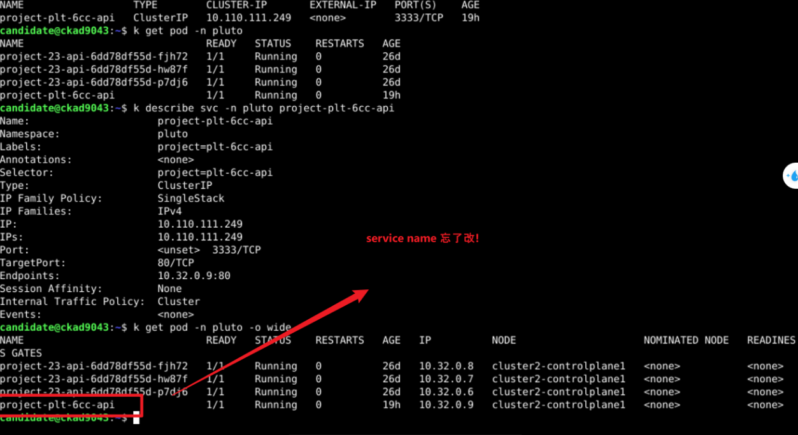
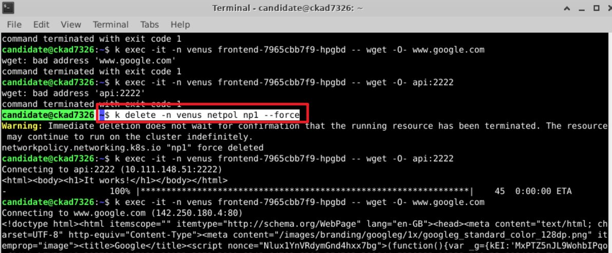

測試分數是 61/112， 約 54.46%，
CKAD 正式考試的 及格門檻是 66%（74/112）。這意味著你至少需要再多 13 分 才能達標

全對:  1,2,3,7,8,12,13,14,21
半對: 6,10,20
全錯: 9
空題: 11,15(偏難),16,17,18,19,22( 偏難: 結合labels & annotation)

---
### (以下為半對)

6. (半對 粗心: ReadinessProbe設為LivenessProve) Solve this question on instance: ssh ckad5601

Create a single Pod named pod6 in Namespace default of image busybox:1.31.0. The Pod should have a readiness-probe executing cat /tmp/ready. It should initially wait 5 and periodically wait 10 seconds. This will set the container ready only if the file /tmp/ready exists.

The Pod should run the command touch /tmp/ready && sleep 1d, which will create the necessary file to be ready and then idles. Create the Pod and confirm it starts.

從doc複製粘貼忘了改

Question 6  (3 of 5)
O Pod is running
O Pod has single container
O Container has correct image
X ReadinessProbe has correct initialDelaySeconds
X ReadinessProbe has correct periodSeconds

10. (半對 粗心: service name忘了修改) Solve this question on instance: ssh ckad9043

Team Pluto needs a new cluster internal Service. Create a ClusterIP Service named project-plt-6cc-svc in Namespace pluto. This Service should expose a single Pod named project-plt-6cc-api of image nginx:1.17.3-alpine, create that Pod as well. The Pod should be identified by label project: plt-6cc-api. The Service should use tcp port redirection of 3333:80.

Finally use for example curl from a temporary nginx:alpine Pod to get the response from the Service. Write the response into /opt/course/10/service_test.html on ckad9043. Also check if the logs of Pod project-plt-6cc-api show the request and write those into /opt/course/10/service_test.log on ckad9043.

Question 10 (4 of 9)

x Service type ClusterIP exists
X Service has correct selector
X Service has correct port
O Pod exists
O Pod is running
O Pod has correct container image
O Pod has correct label
X File /opt/course/10/service_test.html valid
X File /opt/course/10/service_test.log valid

如下圖，忘了變更service name: 
 
 

最後驗證: 
 
curl http://<svc-name>.<namespace>:<port>
不要忘了namespace!

並且輸出結果到題目指定的文件:
 

20.  (半對，NetowrkPolicy縮排錯誤!!!!) Solve this question on instance: ssh ckad7326

In Namespace venus you'll find two Deployments named api and frontend. Both Deployments are exposed inside the cluster using Services. Create a NetworkPolicy named np1 which restricts outgoing tcp connections from Deployment frontend and only allows those going to Deployment api. Make sure the NetworkPolicy still allows outgoing traffic on UDP/TCP ports 53 for DNS resolution.

Test using: **wget www.google.com** and **wget api:2222** from a Pod of Deployment frontend.

Question 20 (3 of 5)

O NetworkPolicy exists
O Deployments api and frontend exist with replicas ready
O Deployment frontend cannot reach internet
X Deployment frontend can resolve DNS
X Deployment frontend can reach deployment api

k get 所有resource:
 

題目已提供內外部測試地址: www.google.com 跟 wget api:2222

a. (optional) 在venus namespace中 run 一個temporary pod測試是否可訪問外部流量 (wget www.google.com) 以及 內部 api地址 (wget api:2222)
b. **先分別測試任一frontend pod 是否可訪問外部流量 (wget www.google.com) 以及 內部 api地址 (wget api:2222)** 

a. 測試如下 (在venus中的任一pod都可以訪問外部流量&內部api地址)

b. 測試如下
使用我配置的network policy, k exec 一個frontend pod 測試發現無法執行wget www.google.com 跟 wget api:2222(內外部都無法訪問)
(如下，發現不能wget，那就是netpol yaml 有誤)

檢查network policy 發現配置縮排有錯誤!!!:

Network Policy中的縮排將 影響設置了幾個rules!

(錯誤，也就是我的配置如下)
ports 與podSelector對齊

NetworkPolicy 的 ingress/egress 規則中，每個規則 (egress 陣列中的每個項目) 之間是 OR 的關係，但 同一個規則內的條件是 AND 的關係。
這個 NetworkPolicy 的 egress 規則 只有一個 egress 條件，但在 同一條規則 內同時定義了：

to: → 限制流量只允許發送到 id: api 的 Pod
ports: → 限制流量必須是發送到 UDP/TCP 53 端口
因為同一個規則內的條件是 AND 的關係，所以這個規則的含義變成：

"只有當目的地是 id: api 的 Pod，且流量發送到 53 端口時，才允許通過"
這樣的規則會導致：

frontend 無法解析 DNS，因為 DNS 查詢通常是發送到 kube-dns，而 kube-dns 沒有 id: api 這個標籤，所以所有的 DNS 流量都會被阻擋。
frontend 無法訪問 api，因為 api 服務運行在 2222 端口，但這條規則只允許 port 53，因此 port 2222 的請求也會被阻擋。

(正確的配置如下)
ports 應與- to 對齊 

定義了 兩條獨立的 egress 規則，這樣 這兩條規則之間是 OR 的關係：

第一條規則：**允許 frontend 連線到 id: api 的 Pod（不限制端口）**
第二條規則：**允許 frontend 發送 UDP/TCP 53 端口 的流量（用於 DNS 解析）**
這樣的規則變成：

"允許 outgoing 流量如果 (目的地是 id: api 的 Pod) OR (目的端口是 53 UDP/TCP)"

這樣 DNS 解析和 frontend 訪問 api:2222 都能正常工作，符合需求。

修改networkpolicy 縮排:

a. (Optional)測試如下 (在venus中的任一pod都可以訪問外部流量&內部api地址) -- 因為沒限制所以都可訪問

b. 重新檢查任一frontend pod 是否可訪問外部流量&內部api地址:

驗證frontend pod 已無法訪問外部地址，但仍可訪問內部api

---

---
### (以下為全錯)

9. (粗心 Deployment name沒有變更&namespace沒有設置)**Pod -> Deployment** Solve this question on instance: ssh ckad9043

In Namespace pluto there is single Pod named holy-api. It has been working okay for a while now but Team Pluto needs it to be more reliable.

Convert the Pod into a Deployment named holy-api with 3 replicas and delete the single Pod once done. The raw Pod template file is available at /opt/course/9/holy-api-pod.yaml.

In addition, the new Deployment should set allowPrivilegeEscalation: false and privileged: false for the security context on container level.

Please create the Deployment and save its yaml under /opt/course/9/holy-api-deployment.yaml on ckad9043.

 

16. (全錯 **誤以為sidecar container為initContainer!**) Logging sidecar Solve this question on instance: ssh ckad7326 

The Tech Lead of Mercury2D decided it's time for more logging, to finally fight all these missing data incidents. There is an existing container named cleaner-con in Deployment cleaner in Namespace mercury. This container mounts a volume and writes logs into a file called cleaner.log.

The yaml for the existing Deployment is available at /opt/course/16/cleaner.yaml. Persist your changes at /opt/course/16/cleaner-new.yaml on ckad7326 but also make sure the Deployment is running.

Create a sidecar container named logger-con, image busybox:1.31.0 , which mounts the same volume and writes the content of cleaner.log to stdout, you can use the tail -f command for this. This way it can be picked up by kubectl logs.

Check if the logs of the new container reveal something about the missing data incidents.

1️⃣ initContainer（初始化容器）
initContainer 主要用來做「初始化工作」，它不是長時間運行的容器，執行完後就會退出。

特點
initContainer 一定會先執行，並且 必須執行完成 後，Pod 內的主容器 (containers:) 才會啟動。
initContainer 是 同步執行的，如果有多個 initContainers，它們會依序執行（不像 sidecar container 是並行運行的）。
initContainer 完成後會被銷毀，它的生命週期 不會持續運行。

適用場景
初始化數據，比如從外部數據庫下載一些檔案。
設置權限，例如 chown 改變檔案權限。
等待某個服務可用，例如 sleep 等待一個 API 或 DB 啟動。

**Sidecar Container（輔助容器） ≠ initContaier!**
Sidecar container 會與主應用程序一起運行，通常用來提供輔助功能，例如日誌處理、代理、監控等。

特點
sidecar container 與主容器 一起執行，而且是 並行運行的。
sidecar container 不會先執行完畢後退出，而是會一直持續運行。
sidecar container 適合處理輔助性任務，例如 日誌管理、監控、數據同步。

適用場景
Log Aggregation（日誌收集）：監聽日誌文件並輸出到 stdout，這樣 kubectl logs 才能讀取日誌。
代理（Proxy）：像 Envoy、Istio 這類網絡代理，可以作為 Sidecar 來攔截流量。
監控（Monitoring）：像 Prometheus 這種監控 Agent，可以作為 Sidecar 收集 Pod 的監控數據

如下圖，由於勿將sidecar container認為是initContainer,導致直接把logging配置覆蓋在原本的initContainer中，導致錯誤
 

從 Kubernetes 1.29+ 開始，是否為 Sidecar 容器，取決於 restartPolicy 設定：
**restartPolicy: Always → Sidecar 容器** ✅
restartPolicy: Never → Init 容器 ❌（傳統 Init 容器）

以下為詳解的配置:
# /opt/course/16/cleaner-new.yaml
apiVersion: apps/v1
kind: Deployment
metadata:
  creationTimestamp: null
  name: cleaner
  namespace: mercury
spec:
  replicas: 2
  selector:
    matchLabels:
      id: cleaner
  template:
    metadata:
      labels:
        id: cleaner
    spec:
      volumes:
      - name: logs
        emptyDir: {}
      initContainers:
      - name: init
        image: bash:5.0.11
        command: ['bash', '-c', 'echo init > /var/log/cleaner/cleaner.log']
        volumeMounts:
        - name: logs
          mountPath: /var/log/cleaner
      - name: logger-con                                                # add
        image: busybox:1.31.0                                           # add
        restartPolicy: Always                                           # add
        command: ["sh", "-c", "tail -f /var/log/cleaner/cleaner.log"]   # add
        volumeMounts:                                                   # add
        - name: logs                                                    # add
          mountPath: /var/log/cleaner                                   # add
      containers:
      - name: cleaner-con
        image: bash:5.0.11
        args: ['bash', '-c', 'while true; do echo `date`: "remove random file" >> /var/log/cleaner/cleaner.log; sleep 1; done']
        volumeMounts:
        - name: logs
          mountPath: /var/log/cleaner

**如下，新增sidecar contaier，並設置restartPolicy: Always**
 

 

---

### (以下為空題)

11.  **Working with Containers** Solve this question on instance: ssh ckad9043

There are files to build a container image located at /opt/course/11/image on ckad9043. The container will run a Golang application which outputs information to stdout. You're asked to perform the following tasks:

ℹ️ Run all Docker and Podman commands as user root. Use sudo docker and sudo podman or become root with **sudo -i**

Change the Dockerfile: set ENV variable SUN_CIPHER_ID to hardcoded value 5b9c1065-e39d-4a43-a04a-e59bcea3e03f

Build the image using sudo docker, tag it registry.killer.sh:5000/sun-cipher:v1-docker and push it to the registry

Build the image using sudo podman, tag it registry.killer.sh:5000/sun-cipher:v1-podman and push it to the registry

Run a container using sudo podman, which keeps running detached in the background, named sun-cipher using image registry.killer.sh:5000/sun-cipher:v1-podman

Write the logs your container sun-cipher produces into /opt/course/11/logs on ckad9043

Step 1 & 2 如下:
Change the ENV:
 
Docker Build & Push:
 

Step3:
Podman Build & Push
 

Step4:
Podman Run
 

Step5:
Podman Logs
 

15. (空題) ConfigMap, Configmap-Volume Solve this question on instance: ssh ckad9043 (偏難)

Team Moonpie has a nginx server Deployment called web-moon in Namespace moon. Someone started configuring it but it was never completed. To complete please create a ConfigMap called configmap-web-moon-html containing the content of file /opt/course/15/web-moon.html under the data key-name index.html.

The Deployment web-moon is already configured to work with this ConfigMap and serve its content. Test the nginx configuration for example using curl from a temporary nginx:alpine Pod.

在 Kubernetes ConfigMap 中，data: 這個欄位的格式類似於 鍵值對 (key-value pair)，其中：

index.html 是 key (鍵)，這個 key 在 Pod 中 會作為文件名。
**| 是 YAML 語法中表示多行字串 (block scalar) 的標誌**。

當我們想要把這段 HTML 內容存入 Kubernetes ConfigMap，我們可以使用 YAML 的 | 語法來表示多行字串 (multi-line string)。

所以，在 ConfigMap 中，我們寫成：
data:
  index.html: |  # 這裡的 index.html 會成為 Pod 內的檔案名稱
    <!DOCTYPE html>
    <html lang="en">
    <head>
        <meta charset="UTF-8">
        <title>Web Moon Webpage</title>
    </head>
    <body>
    This is some great content.
    </body>
    </html>

為何 index.html 作為 key？
在 ConfigMap 中：

key 是文件名稱
value 是文件的內容

當我們將這個 ConfigMap 掛載到 Pod 的某個 Volume (/usr/share/nginx/html 之類的目錄) 時，它會變成：
/usr/share/nginx/html/index.html
而內容則是剛才的 HTML。

這樣，Kubernetes 會自動把 index.html 當作一個檔案來使用。

Step1:
Create configmap
 

Step2:
Deployment Volume已設置
 

Step3:
直接rollout restart 重啟deployment:
 

17. (空題) InitContainer Solve this question on instance: ssh ckad5601

Last lunch you told your coworker from department Mars Inc how amazing InitContainers are. Now he would like to see one in action. There is a Deployment yaml at /opt/course/17/test-init-container.yaml. This Deployment spins up a single Pod of image nginx:1.17.3-alpine and serves files from a mounted volume, which is empty right now.

Create an InitContainer named init-con which also mounts that volume and creates a file index.html with content check this out! in the root of the mounted volume. For this test we ignore that it doesn't contain valid html.

The InitContainer should be using image busybox:1.31.0. Test your implementation for example using curl from a temporary nginx:alpine Pod.

設置以下，由於題目"ignore that it doesn't contain valid html" 故建立initContainr產生的報錯不用理會
 
 

(設置為解答的配置同樣不須理會報錯)
 

18. (空題) Service misconfiguration Solve this question on instance: ssh ckad5601

There seems to be an issue in Namespace mars where the ClusterIP service manager-api-svc should make the Pods of Deployment manager-api-deployment available inside the cluster.

You can test this with curl manager-api-svc.mars:4444 from a temporary nginx:alpine Pod. Check for the misconfiguration and apply a fix.

在 Kubernetes 中，Service 透過 selector 來選擇要管理的 Pod，而 Deployment 只是用來管理 Pod 的機制，並不直接參與流量轉發。因此，**Service 的 selector 必須與 Pod 的 labels 匹配**，這樣 Service 才能發現並負責流量的分發。

Service 負責流量分發
Service 透過 selector 尋找符合條件的 Pod，並將請求轉發給這些 Pod。
Deployment 只是管理 Pod
Deployment 負責 創建、更新、擴展 Pod，但 Deployment 本身不是一個運行的實體，所以 Service 不能直接選擇 Deployment。

(「expose Deployment」，其實是透過 Service 將流量導向 Deployment 所管理的 Pod。
Service 不能直接選擇 Deployment，而是要透過 selector 選擇 Pod 的 label，這樣才能讓流量成功轉發。
最終，**所有流量還是會導向 Pod**，因為 Deployment 本身只是管理 Pod，它不處理網路流量 => service label 必與pod label一致。)

(在 Kubernetes 中，Service 的 selector 只需要匹配 Pod 的一個 label，不必包含 Pod 的所有 labels。這是因為 selector 只要能唯一識別一組 Pod，就可以正確轉發流量。)

如下，發現service 跟 pod label, 不匹配， 修改service:
 
 

(雖然pod具有兩個labels, 但只需要選擇其中一個在service裡面配置即可)
修改service後即可

19. (空題) Service ClusterIP->NodePort Solve this question on instance: ssh ckad5601

In Namespace jupiter you'll find an apache Deployment (with one replica) named jupiter-crew-deploy and a ClusterIP Service called jupiter-crew-svc which exposes it. Change this service to a NodePort one to make it available on all nodes on port 30100.

Test the NodePort Service using the internal IP of all available nodes and the port 30100 using curl, you can reach the internal node IPs directly from your main terminal. On which nodes is the Service reachable? On which node is the Pod running?

如下，變更service的ClusterIP 為NodePort之後，在jupiter ns中建立一個temporary pod測試可以訪問Service:8080
 
  
 

接著題目要求透過任一node來訪問30100端口，如下:
 
NodePort Service 本質上是 ClusterIP Service 的擴展，當我們訪問 <Node-IP>:<NodePort> 時，請求會先被 Kubernetes 內部的 kube-proxy 接收並轉發到 ClusterIP，最終抵達後端的 Pod

NodePort 在所有 Node 上都開放一個固定端口（此處為 30100）。
透過 kube-proxy，即使 Pod 只運行在某些 Node，流量仍然可以從任何 Node 進入，並被轉發到可用的 Pod。
這樣，我們可以從 Cluster 外部訪問 Service，就像 Cluster 內部的 Pod 訪問 ClusterIP Service 一樣！

**NodePort vs ClusterIP vs LoadBalancer**
| 類型         | 訪問方式                      | 適用場景 |
|-------------|-----------------------------|---------|
| **ClusterIP**  | `curl myapp-service:80` | **只允許 Cluster 內部訪問**，用於 `Pod` 之間的通信 |
| **NodePort**   | `curl <Node-IP>:30100`  | **允許外部訪問**，開放一個 `NodePort` 在所有 Node 上 |
| **LoadBalancer** | `curl <External-IP>:80` | **適用於雲端環境**，分配一個 `LoadBalancer` IP |

22. (空題) **Labels, Annotations** Solve this question on instance: ssh ckad9043

Team Sunny needs to identify some of their Pods in namespace sun. They ask you to add a new label protected: true to all Pods with an existing label type: worker or type: runner. Also add an annotation protected: do not delete this pod to all Pods having the new label protected: true.

k labels pod (-n) -l <current-labels> <new-labels>
k labels 指令: 用-l 篩選出當前具有type: worker 或 type: runner的pod, 添加新的labels

 

 

k annotate -l <current-labels> <annotaion-key>="<annotation-value>"
k annotate 指令: 用-l 篩選出當前具有protected: true的pod並添加annotation

 

---

