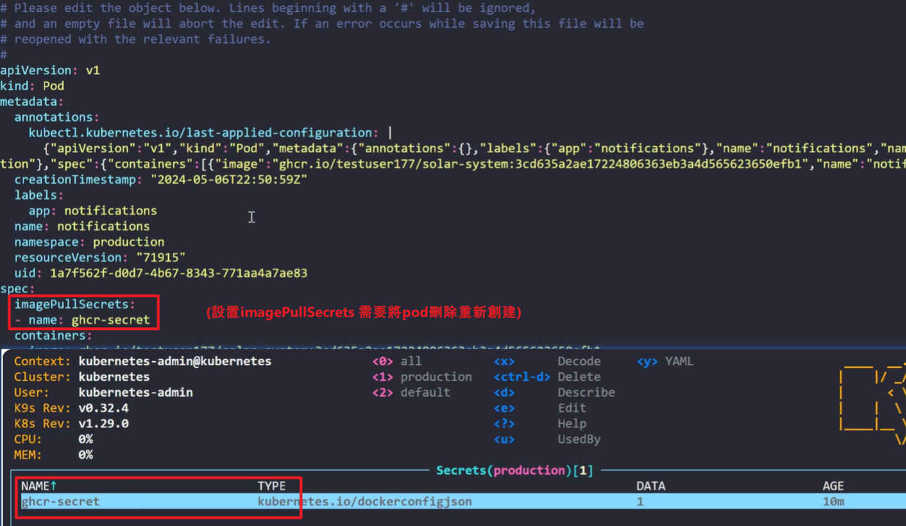
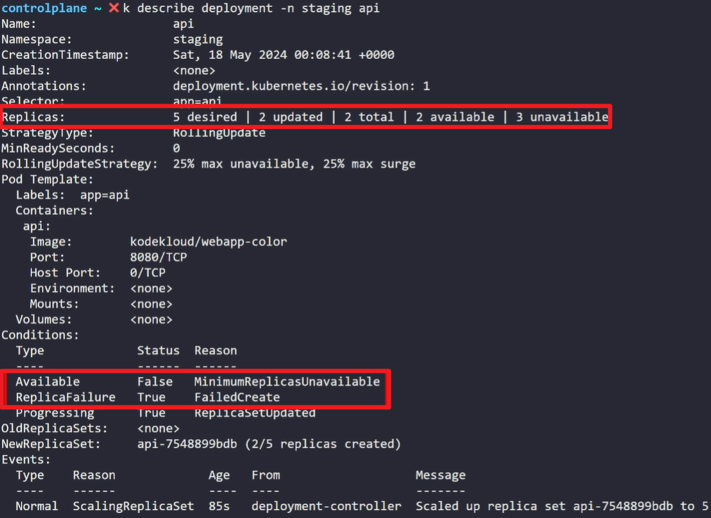
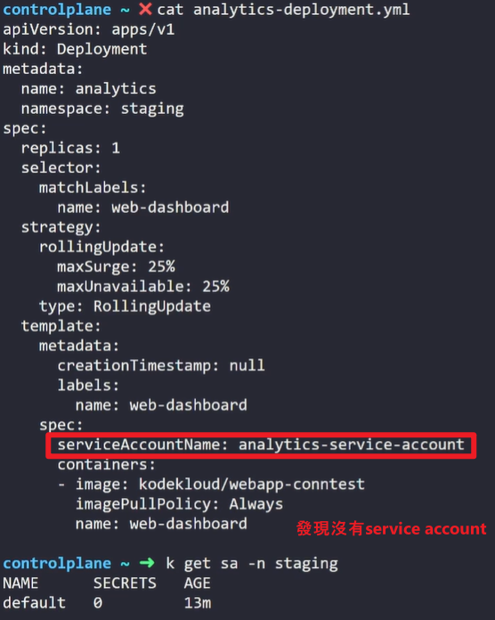

### Prerequisites
1. k get events
    
    借由k get events指令檢查是否有Warning的events, 並且查看warning reason

    Q: You received reports of recent issues in the cluster. Investigate by using the appropriate command to view the events happening in the cluster. What is the most recent event?

    option1: RegisterdNode
    option2: Failed
    option3: NodeAllocatebleEnforced
    option4: InvalidDiskCapacity

    controlplane ~ ➜  k get events
    LAST SEEN   TYPE      REASON                    OBJECT              MESSAGE
    56m         Normal    NodeHasSufficientMemory   node/controlplane   Node controlplane status is now: NodeHasSufficientMemory
    56m         Normal    NodeHasNoDiskPressure     node/controlplane   Node controlplane status is now: NodeHasNoDiskPressure
    56m         Normal    NodeHasSufficientPID      node/controlplane   Node controlplane status is now: NodeHasSufficientPID
    56m         Normal    NodeAllocatableEnforced   node/controlplane   Updated Node Allocatable limit across pods
    56m         Normal    Starting                  node/controlplane   Starting kubelet.
    ...
    33s (x4 over 114s)   Warning   Failed                    Pod/webserver       Error: ErrImagePull
    8s (x6 over 113s)    Normal    BackOff                   Pod/webserver       Back-off pulling image "busybox1"
    8s (x6 over 113s)    Warning   Failed                    Pod/webserver       Error: ImagePullBackOff
    ...

    OR:
    controlplane ~ ➜  k get events --sort-by=.metadata.creationTimestamp| tail -n 1
    2m22s       Warning   Failed      pod/webserver   Error: ImagePullBackOff

    OR:
    controlplane ~ ➜  **k get events | tail -n 1**
    2m31s       Warning   Failed      pod/webserver   Error: ImagePullBackOff

    Answer: option2 Failed

2. k port-forward


3. k auth can-i
    

    由於未指定當前的user為何，使用auth can-i 卻顯示yes, 則透過k auth whoami指令查看當下測試的user

    
    --as 指定serviceaccount
    k auth can-i get pods **--as=system:serviceaccount:default:default**


4. k top: (僅限於用在pods跟nodes)
   

5. k expain --recursive: 加上recursive參數，直接展開所有字段(這就不用k explain一路查找至最底層字段)
    

    You just learned there’s a lifecycle spec defined in one of the pod manifests. Use the right command to learn more about that lifecycle spec. Write the output out to a file lifecycle.txt
    
    Hint: lifecycle spec is under containers

    controlplane ~ ➜  kubectl explain pod.spec.containers.lifecycle > lifecycle.txt

    controlplane ~ ➜  cat lifecycle.txt 
    KIND:       Pod
    VERSION:    v1

    FIELD: lifecycle <Lifecycle>


    DESCRIPTION:
    ...

    controlplane ~ ➜  kubectl explain pod.spec.containers.lifecycle > lifecycle.txt

6. k diff: 檢查本地現有的yaml配置文件與已建立的Resource之間的差異
    此命令會比較 my-deployment.yaml 文件中的資源和集群中的現有資源，並輸出差異
    

    You've made changes to the deployment configuration in the nginx-deployment.yml file, but you want to review the differences before applying them. Use the command to show the difference between local and cluster configurations. What has changed?

    option1: replicas
    option2: labels

    controlplane ~ ➜  k diff -f nginx-deployment.yml 
    diff -u -N /tmp/LIVE-1547354458/apps.v1.Deployment.app.nginx-deployment /tmp/MERGED-679631904/apps.v1.Deployment.app.nginx-deployment
    --- /tmp/LIVE-1547354458/apps.v1.Deployment.app.nginx-deployment        2025-03-08 05:22:15.080460346 +0000
    +++ /tmp/MERGED-679631904/apps.v1.Deployment.app.nginx-deployment       2025-03-08 05:22:15.080460346 +0000
    @@ -6,7 +6,7 @@
        kubectl.kubernetes.io/last-applied-configuration: |
        {"apiVersion":"apps/v1","kind":"Deployment","metadata":{"annotations":{},"labels":{"app":"nginx"},"name":"nginx-deployment","namespace":"app"},"spec":{"replicas":3,"selector":{"matchLabels":{"app":"nginx"}},"template":{"metadata":{"labels":{"app":"nginx"}},"spec":{"containers":[{"image":"nginx:1.14.2","name":"nginx","ports":[{"containerPort":80}]}]}}}}
    creationTimestamp: "2025-03-08T05:21:24Z"
    -  generation: 1
    +  generation: 2
    labels:
        app: nginx
    name: nginx-deployment
    @@ -15,7 +15,7 @@
    uid: e17ef8e6-3d54-476d-a15f-cb7de79a4ce3
    spec:
    progressDeadlineSeconds: 600
    -  replicas: 3
    +  replicas: 2
    revisionHistoryLimit: 10
    selector:
        matchLabels:

    Answer: option1

7. How many pods are one the node01?

    controlplane ~ ➜  k get nodes
    NAME           STATUS   ROLES           AGE   VERSION
    controlplane   Ready    control-plane   69m   v1.32.0
    node01         Ready    <none>          68m   v1.32.0

    controlplane ~ ➜  ssh node01
    Welcome to Ubuntu 22.04.4 LTS (GNU/Linux 5.4.0-1106-gcp x86_64)

    * Documentation:  https://help.ubuntu.com
    * Management:     https://landscape.canonical.com
    * Support:        https://ubuntu.com/pro

    This system has been minimized by removing packages and content that are
    not required on a system that users do not log into.

    To restore this content, you can run the 'unminimize' command.

    node01 ~ ➜  k get pods -A
    E0308 05:24:04.427912   19038 memcache.go:265] "Unhandled Error" err="couldn't get current server API group list: the server could not find the requested resource"
    E0308 05:24:04.430511   19038 memcache.go:265] "Unhandled Error" err="couldn't get current server API group list: the server could not find the requested resource"
    E0308 05:24:04.432887   19038 memcache.go:265] "Unhandled Error" err="couldn't get current server API group list: the server could not find the requested resource"
    E0308 05:24:04.435062   19038 memcache.go:265] "Unhandled Error" err="couldn't get current server API group list: the server could not find the requested resource"
    E0308 05:24:04.438207   19038 memcache.go:265] "Unhandled Error" err="couldn't get current server API group list: the server could not find the requested resource"
    Error from server (NotFound): the server could not find the requested resource

    改執行:
    node01 ~ ✖ exit
    logout
    Connection to node01 closed.

    controlplane ~ ➜  k get pod -A **-o wide --field-selector spec.nodeName=node01**
    NAMESPACE     NAME                                READY   STATUS             RESTARTS   AGE     IP             NODE     NOMINATED NODE   READINESS GATES
    app           myapp                               0/1     Completed          0          9m40s   10.244.192.4   node01   <none>           <none>
    app           nginx-deployment-647677fc66-4mxzz   1/1     Running            0          5m41s   10.244.192.4   node01   <none>           <none>
    app           nginx-deployment-647677fc66-k4dwd   1/1     Running            0          5m41s   10.244.192.5   node01   <none>           <none>
    app           nginx-deployment-647677fc66-zgtt9   1/1     Running            0          5m41s   10.244.192.6   node01   <none>           <none>
    app           python-app                          1/1     Running            0          9m41s   10.244.192.3   node01   <none>           <none>
    default       backend                             1/1     Running            0          9m41s   10.244.192.2   node01   <none>           <none>
    default       webserver                           0/1     ImagePullBackOff   0          18m     10.244.192.1   node01   <none>           <none>
    kube-system   kube-proxy-vkdxd                    1/1     Running            0          71m     192.2.122.3    node01   <none>           <none>
    kube-system   weave-net-hbjxz                     2/2     Running            0          71m     192.2.122.3    node01   <none>           <none>

8. You are investigating an incident that happened on the pod called myapp and need to ensure logs display timestamps for accurate analysis. Write the logs to a file timestamps.txt


    Deployment can be in any of the namespaces

    controlplane ~ ➜  k logs -n app myapp --timestamps > timestamps.txt

    controlplane ~ ➜  cat timestamps.txt 
    2025-03-08T05:17:32.679262501Z map[id:2 message:message 2]
    2025-03-08T05:17:32.779410834Z map[id:1 message:message 1]
    2025-03-08T05:17:32.879673388Z map[id:2 message:message 2]
    2025-03-08T05:17:32.979954690Z map[id:1 message:message 1]
    2025-03-08T05:17:33.079151695Z map[id:3 message:message 3]
    2025-03-08T05:17:33.179393468Z map[id:1 message:message 1]
    2025-03-08T05:17:33.279638912Z map[id:3 message:message 3]
    2025-03-08T05:17:33.379843720Z map[id:2 message:message 2]
    2025-03-08T05:17:33.479028037Z map[id:2 message:message 2]
    2025-03-08T05:17:33.579274593Z map[id:1 message:message 1]
    2025-03-08T05:17:33.679566556Z map[id:2 message:message 2]
    2025-03-08T05:17:33.779797509Z map[id:3 message:message 3]
    2025-03-08T05:17:33.880039911Z map[id:3 message:message 3]
    2025-03-08T05:17:33.979322062Z map[id:1 message:message 1]
    2025-03-08T05:17:34.079547541Z map[id:3 message:message 3]

9. 使用k debug替代 k exec，原因為:   (**k exec 適用於已運行的 Pod; k debug 主要用於問題排查**)
    A. 減少 Pod 中斷 (minimize pod disruptions)
    kubectl exec 直接在現有的 Pod 內執行命令，當你進行調試時，如果操作不慎（例如刪除文件、修改設定或影響運行的進程），可能會導致 Pod 崩潰，影響業務運行。
    kubectl debug 則可以創建一個新的臨時 Debug 容器，不影響原本的應用。例如：
        
        kubectl debug pod/my-pod -it --image=busybox --target=my-container
    
    這樣會在原有的 Pod 內部新增一個 busybox 容器，但不會影響 my-container 的運行，確保應用不中斷。
    調試完畢後，可以刪除 Debug 容器，而不影響原本的 Pod。
    ✅ 適用場景

    需要深入分析但不想影響應用運行的情境，如調試異常流量、記錄分析、測試指令等。

    B. Distroless 映像 (distroless images)
    什麼是 Distroless?

    **Distroless 是一種極簡化的容器映像**，它不包含 bash、sh、apt 或其他常見的工具，僅包含應用所需的最少組件，這有助於提高安全性和減少攻擊面。
    例如，官方的 gcr.io/distroless/base 或 gcr.io/distroless/static 映像沒有 shell，不能直接 kubectl exec -it my-pod -- sh 進入容器。
    為何 kubectl debug 更好？

    kubectl exec 失效： 在 Distroless 容器中，由於沒有 shell，執行以下指令可能會失敗：
    
        kubectl exec -it my-pod -- sh
    
    會返回類似 exec /bin/sh: no such file or directory 的錯誤。
    kubectl debug 提供完整工具： 你可以用 kubectl debug 添加一個帶有 bash 或 sh 的調試容器，例如：
        
        kubectl debug pod/my-pod -it --image=ubuntu
    
    這樣即使原本的 Pod 是 Distroless，調試容器仍然有完整的 Linux 環境，可用來診斷問題。
    ✅ 適用場景

    當 Pod 使用 Distroless 或極簡化映像時，kubectl exec 可能無法執行，但 kubectl debug 可幫助你添加一個完整的調試環境。


    
    


    1️⃣ kubectl exec 適用於已運行的 Pod
    kubectl exec 用於執行命令到 正在運行中的容器，這適用於：

    需要在容器內執行某個指令，如 /bin/bash、sh、ls、cat /var/log/...。
    需要存取應用程式內部的日誌或環境，而不需要額外新增 Debug 容器。
    
    範例：
    kubectl exec -it webapp -- /bin/bash
    這行指令的目的是嘗試進入 webapp Pod 內的容器，執行 /bin/bash 指令。

    2️⃣ kubectl debug 主要用於問題排查
    kubectl debug 的用途：

    用於當 kubectl exec 不能解決問題時，例如：
    容器缺少 shell（這題的錯誤就是 /bin/bash 找不到）。
    **容器崩潰 (CrashLoopBackOff)，導致 kubectl exec 無法使用**。
    容器影像是 distroless，缺少 debug 工具，如 curl、ps、netstat。
    想要使用 Ephemeral Container 來附加額外的偵錯工具。
    
    如果這題允許使用 kubectl debug，可以用：
    kubectl debug -it webapp --image=busybox --target=webapp
    
    這會附加一個新的 ephemeral debug container，並且包含 shell，讓我們能夠進行進一步的偵錯。


    Which of the following actions can be performed using kubectl debug? Choose all valid answers:

    A. Running a new pod in the node’s host namespaces with access to its filesystem.
    B. Attaching a container to a running pod without restarting the pod.
    C. Copy files from a local machine to a pod.
    D. Create a new pod with a modified container image for debugging.

    正確答案是 **A、B 和 D**，以下是各選項的解釋，以及為什麼 **C 選項不正確**：


    /### **A) 在節點的主機命名空間 (host namespaces) 中運行一個新的 Pod，並能訪問其文件系統。✅**
    - **kubectl debug** 可用來在 **節點的主機命名空間** 中啟動一個新的偵錯 Pod，這對於排查節點級別的問題非常有用。
    - 可以使用 `--hostpid`、`--hostnetwork` 和 `--hostipc` 來讓偵錯容器運行於主機命名空間。
    - **示例**：
    ```sh
    kubectl debug node/<node-name> -it --image=busybox --hostpid --hostnetwork
    ```


    /### **B) 在不重啟 Pod 的情況下，附加一個容器到正在運行的 Pod。✅**
    - **kubectl debug** 允許在 **不重新啟動 Pod** 的情況下，**新增一個臨時的偵錯容器**。
    - 這在原本的容器中缺少一些偵錯工具時特別有用。
    - **示例**：
    ```sh
    kubectl debug -it <pod-name> --image=busybox --target=<container-name>
    ```
    - `--target=<container-name>` 參數讓偵錯容器運行於相同的網路與命名空間。

    /### **C) 從本地機器複製文件到 Pod。❌（錯誤）**
    - **kubectl debug 無法用來在本地機器與 Pod 之間傳輸文件**。
    - 這項操作應該使用 **kubectl cp** 命令來完成。
    - **正確的文件複製方式**：
    ```sh
    kubectl cp /local/path my-pod:/container/path
    ```
    - `kubectl debug` 的用途是 **偵錯與診斷 Pod**，而不是文件傳輸，因此 `kubectl cp` 才是正確的選擇。


    /### **D) 創建一個帶有修改後容器映像 (image) 的新 Pod 來進行偵錯。✅**
    - **kubectl debug** 允許基於原本的 Pod **創建一個新 Pod，並使用不同的鏡像來偵錯**。
    - 這對於需要使用帶有診斷工具的映像來排查問題時特別有用。
    - **示例**：
    ```sh
    kubectl debug --image=busybox --copy-to=my-debug-pod my-existing-pod
    ```
    - `--copy-to` 參數讓新的 Pod 基於原 Pod 創建，但允許修改，例如更換容器映像。


    Answer: A,D


10. Pod 必須處於 Running 狀態，才能使用 Ephemeral containers!
    
    When are ephemeral(短暫的) containers useful?

    A) Container is starting up
    B) When using distroless images
    C) Debugging a pending pod
    D) Images doesn’t contain debugging utilities
    E) Debugging container in a crashloop

    什麼是 Ephemeral Containers（短暫容器）？
    Ephemeral containers 是 Kubernetes 允許用來 暫時 附加到一個已經運行的 Pod 內的特殊類型容器，主要用於 偵錯。
    特點：
    **不能 定義 resources（CPU、內存限制）**。
    **不能 參與 PodSpec，即不會影響 Pod 正常運行的容器配置**。
    **不會自動重啟，當它結束時就會被刪除**。

    A) Container is starting up（容器正在啟動）❌
    錯誤，因為 Ephemeral containers **只能附加到已運行的 Pod**，無法影響啟動過程。
    如果容器尚未啟動完成，Ephemeral containers 也無法插入。

    B) When using distroless images（使用 Distroless 映像）✅
    正確，因為 distroless 映像通常不包含 shell 或調試工具，無法直接執行 bash 或 sh 來偵錯。
    使用 ephemeral containers，可以 **動態附加 一個帶有 sh 或 bash 的調試容器，如 busybox 或 debug-tools，來進行診斷**。
    
    示例：
    kubectl debug -it mypod --image=busybox --target=mycontainer

    C) Debugging a pending pod（偵錯處於 pending 狀態的 Pod）❌
    錯誤，**因為 Pod 必須處於 Running 狀態，才能使用 Ephemeral containers**。
    Pending 狀態的 Pod 可能還沒有被指派 (scheduled) 到節點，甚至還沒有拉取映像，這時候無法附加任何容器。
    
    正確的方法：
    使用 kubectl describe pod <pod-name> 檢查為何 Pod 處於 Pending 狀態（如資源不足、調度失敗）。
    使用 kubectl get events 來查看相關事件。

    D) Images doesn’t contain debugging utilities（映像不包含偵錯工具）✅
    正確，這與 B 選項相似，許多生產環境的 Docker 映像 為了安全性，不會包含 curl、vi、ps 等工具。
    **Ephemeral containers 允許動態加入一個包含這些工具的容器，以便進行診斷和偵錯**。
    
    示例：
    kubectl debug -it mypod --image=busybox --target=mycontainer


    E) Debugging container in a crashloop（偵錯陷入 CrashLoop 的容器）✅
    正確，**因為 CrashLoopBackOff 狀態的容器會不斷崩潰並重啟，導致難以進行標準偵錯**。
    **Ephemeral containers 允許附加到 Pod 而不影響原本的容器重啟行為，提供一個獨立的診斷環境**。

    示例：
    kubectl debug -it mypod --image=busybox --target=mycontainer
    這樣可以在容器崩潰時，使用 ps, top, cat /var/log/... 來進一步調查問題。
    
    Answer: B,~~C~~,E 是 **B,D,E**!


    Which of the following are **incorrect statements**? Choose all valid answers

    A) The ephemeral container is guaranteed to not eat up the pod’s resources. (X)
    B) Ephemeral containers can be restarted after exiting. (X)
    C) The --copy-to flag creates a pod that is not owned by the original workload
    D) The pid namespace of all containers in a pod is shared with the ephemeral container by default. (X 除非設置--target!)

    C) 為何 C 是正確的？
    --copy-to 旗標 (kubectl debug --copy-to) 確實會創建一個新的 Pod，且**這個 Pod 不屬於原本的 workload**（例如 Deployment、StatefulSet）。
    這個新的 Pod 不會受原始控制器（如 Deployment 或 ReplicaSet）管理，它只是基於原本的 Pod 創建一個複製版本，並允許修改鏡像、環境變數等設定。
    
    示例：
    kubectl debug mypod --copy-to=mypod-debug --image=busybox
    這樣會創建一個 mypod-debug，但它 不會 屬於原本的 Deployment，因此 Kubernetes 不會自動縮放或調整這個新的 Pod。

    D) The pid namespace of all containers in a pod is shared with the ephemeral container by default. ❌（錯誤 ✅）
    錯誤原因：

    預設情況下，Ephemeral Containers 並不會與 Pod 內的其他容器共享 PID namespace。
    如果要讓 Ephemeral Container 存取其他容器的進程（process），需要手動指定 --target。
    
    示例：
    kubectl debug -it mypod --image=busybox --target=mycontainer
    --target=mycontainer 會讓 Ephemeral Container 共享 mycontainer 的 PID namespace，否則它會有自己的獨立 namespace。
    
    為何這是錯誤的敘述？
    **Kubernetes 設計上不會讓所有容器自動共享 PID namespace，避免影響安全性**。
    **預設情況下，Ephemeral Containers 只能存取自己的進程，如果沒有 --target，則看不到 Pod 內其他容器的進程**。


    Answer: A,B,D 


    Your application webapp is running in the default namespace. It seems to be encountering some issues. WITHOUT the use of a debug container, attempt to find the cause of the issue. What error are you running into?

    option1: Error: command not found: kubectl exec 
    option2: Pod is not running or ready
    option3: OCI runtime exec failed: exec failed: unable to start container process: exec: "/bin/bash" : stat /bin/bash: no such file or directory

    Hint: run k exec command

    controlplane ~ ✖ k exec -it webapp -- /bin/bash
    error: Internal error occurred: Internal error occurred: error executing command in container: failed to exec in container: failed to start exec "6aed24fc83383c463df4fe462c4400050bc95731b1305b4a305c2023adc935a3": OCI runtime exec failed: exec failed: unable to start container process: exec: "/bin/bash": stat /bin/bash: no such file or directory: unknown


    Answer: option3

    

    見第9. **k exec 適用於已運行的 Pod; k debug 主要用於問題排查**

    1️⃣ kubectl exec 適用於已運行的 Pod
    kubectl exec 用於執行命令到 正在運行中的容器，這適用於：
    **需要在容器內執行某個指令，如 /bin/bash**、sh、ls、cat /var/log/...。
    需要存取應用程式內部的日誌或環境，而不需要額外新增 Debug 容器。
    
    範例：
    kubectl exec -it webapp -- /bin/bash
    這行指令的目的是嘗試進入 webapp Pod 內的容器，執行 /bin/bash 指令。

    2️⃣ kubectl debug 主要用於問題排查
    kubectl debug 的用途：

    用於當 kubectl exec 不能解決問題時，例如：
    容器缺少 shell（這題的錯誤就是 /bin/bash 找不到）。
    **容器崩潰 (CrashLoopBackOff)，導致 kubectl exec 無法使用**。
    容器影像是 distroless，缺少 debug 工具，如 curl、ps、netstat。
    想要使用 Ephemeral Container 來附加額外的偵錯工具。
    
    如果這題允許使用 kubectl debug，可以用：
    kubectl debug -it webapp --image=busybox --target=webapp
    
    這會附加一個新的 ephemeral debug container，並且包含 shell，讓我們能夠進行進一步的偵錯。


    Add a debugging container to the ephemeral pod, use the busybox image. What’s the first message you see ?

    option1: failed to generate container "5f7b9313beae753..."
    optpion2: Targeting container "ephermeral". If you don't see process from this conatiner it may be because the conainer runtime doesn't support this feature

    controlplane ~ ➜  k debug ephermeral --image=busybox --target ephermeral
    Targeting container "ephermeral". If you don't see processes from this container it may be because the container runtime doesn't support this feature.
    --profile=legacy is deprecated and will be removed in the future. It is recommended to explicitly specify a profile, for example "--profile=general".
    Error from server (NotFound): pods "ephermeral" not found

    為何 kubectl debug 指令需要 --target？
    kubectl debug 預設會創建一個新的 ephemeral container，但如果我們希望這個容器附加到特定的目標容器，就必須使用 --target 參數。

    主要原因
    確保 Ephemeral Container 能夠共享目標容器的 Namespace

    這樣可以存取該容器的 processes、network、filesystem。
    若沒有 --target，則 Kubernetes 不會知道要附加到哪個容器，尤其是 Pod 內部有多個容器時。
    解決 ps, top, netstat 等指令看不到其他進程的問題

    如果 --target 未指定，Ephemeral Container 可能無法看到原本容器的進程，因為它會啟動一個獨立的 PID 命名空間。
    有 --target 時，Ephemeral Container 會共享 目標容器的 PID namespace，讓 ps aux、top 可以顯示原本的進程。
    使用 --target 可以避免誤附加到錯誤的容器

    在某些情況下，Pod 內部可能包含多個應用程式容器，不指定 --target 可能會附加到錯誤的容器。
    --target ephermeral 確保我們的 busybox Debug 容器附加到 名為 "ephermeral" 的容器，而不是其他不相關的容器。

    Targeting container "ephermeral". If you don't see processes from this container it may be because the container runtime doesn't support this feature.
    
    這個訊息的意思是：
    Ephemeral Container 會嘗試共享 "ephermeral" 容器的 PID Namespace。
    但是，有些容器運行時（Container Runtime，例如 Docker 或 containerd）可能不支援此功能。
    如果 ps aux 或 top 指令執行後 看不到原本容器的進程，可能是因為：
    Runtime 不支援 PID Namespace 共享。
    --target 容器內沒有運行中的進程。

    Answer: option2

    
    Use a debug container to inspect backend, what is the linux version used?

    controlplane ~ ✖ k get pod
    NAME                       READY   STATUS    RESTARTS      AGE
    backend-7ddfdc4fdc-vxvkc   2/2     Running   1 (15m ago)   32m
    ephemeral                  1/1     Running   0             10m
    webapp                     1/1     Running   0             32m


    First Try:
    controlplane ~ ➜  k debug pod/backend --target backend
    error: you must specify --image when not using --copy-to.
    (kubectl debug 預設不會自動選擇 debug 容器的映像，所以我們必須手動指定 --image，否則 Kubernetes 無法創建 Ephemeral Container。)


    Second Try:
    controlplane ~ ✖ k debug pod/backend --target backend --image=busybox
    Targeting container "backend". If you don't see processes from this container it may be because the container runtime doesn't support this feature.
    --profile=legacy is deprecated and will be removed in the future. It is recommended to explicitly specify a profile, for example "--profile=general".
    Error from server (NotFound): pods "backend" not found

    --target backend 指定的 backend 容器不存在。
    可能的原因：
    backend-7ddfdc4fdc-vxvkc Pod 內的容器名稱可能不是 backend，而是其他名稱（如 app 或 main）。
    
    可以用以下指令檢查 Pod 內的容器名稱：
    kubectl get pod backend-7ddfdc4fdc-vxvkc -o jsonpath='{.spec.containers[*].name}'

    若 backend 容器名稱錯誤，應該使用正確的容器名稱：
    k debug backend-7ddfdc4fdc-vxvkc --target <正確的容器名稱> --image=busybox


    Thrid Try:
    controlplane ~ ✖ k debug pod/backend-7ddfdc4fdc-vxvkc --target backend --image=busybox
    Targeting container "backend". If you don't see processes from this container it may be because the container runtime doesn't support this feature.
    --profile=legacy is deprecated and will be removed in the future. It is recommended to explicitly specify a profile, for example "--profile=general".
    Defaulting debug container name to debugger-4q7kw.
    The Pod "backend-7ddfdc4fdc-vxvkc" is invalid: spec.ephemeralContainers[0].targetContainerName: Not found: "backend"

    (此處的target要跟pod name一樣，應為: backend-7ddfdc4fdc-vxvkc )

    Forth Try: 成功
    controlplane ~ ✖ k debug backend-7ddfdc4fdc-vxvkc -it -c debugger --image=busybox
    --profile=legacy is deprecated and will be removed in the future. It is recommended to explicitly specify a profile, for example "--profile=general".
    If you don't see a command prompt, try pressing enter.
    / # **uname -a**
    Linux backend-7ddfdc4fdc-vxvkc 5.4.0-1106-gcp #115~18.04.1-Ubuntu SMP Mon May 22 20:46:39 UTC 2023 x86_64 GNU/Linux
    / # 


    Answer: Linux verion 5.4.0-1106-gcp

    <補充>: 為何我重新進入到debugg container 他直接退出了?? 
    controlplane ~ ➜  kubectl debug -it -c debugger --image=busybox backend-7ddfdc4fdc-vxvkc
    --profile=legacy is deprecated and will be removed in the future. It is recommended to explicitly specify a profile, for example "--profile=general".
    / # uname -a
    Linux backend-7ddfdc4fdc-vxvkc 5.4.0-1106-gcp #115~18.04.1-Ubuntu SMP Mon May 22 20:46:39 UTC 2023 x86_64 GNU/Linux
    / # exit

    controlplane ~ ➜ 

    **為何重新進入 Debug 容器後，它直接退出？**

    當你使用 `kubectl debug` 來啟動一個 **Ephemeral Container**，它的 **行為與普通的容器不同**。以下是導致容器退出的原因：

    **🔍 原因 1: Ephemeral Container 在退出後不會自動重啟**
    - **Ephemeral Containers 是一次性的 (one-time use)**，當你執行 `exit` 時，它會直接終止並且 **不會重新啟動**。
    - Kubernetes **不會管理 Ephemeral Container 的生命週期**，它不像普通的 Pod 內部的容器可以自動重啟。

    - **證據：**
    ```
    Session ended, the ephemeral container will not be restarted but may be reattached using 'kubectl attach backend-7ddfdc4fdc-vxvkc -c debugger -i -t' if it is still running
    ```
    - **關鍵字**: `the ephemeral container will not be restarted`
    - 這明確表示 **Ephemeral 容器不會自動重新啟動**，但如果它仍然在運行，則可以用 `kubectl attach` 重新連接。

    
    **🔍 原因 2: `kubectl debug` 會每次都創建一個新的 Ephemeral Container**
    - **你執行 `kubectl debug` 時，Kubernetes 會重新創建一個新的 Ephemeral Container**。
    - **但如果上次的 Debug 容器已經退出，它不會被重新啟動**，新的 Ephemeral Container 也會立即終止，因為它 **沒有任何進程在運行**。

    **🔹 如何證明 Kubernetes 創建了一個新 Debug 容器？**
    你可以使用以下命令查看 Ephemeral Containers：
    ```sh
    kubectl get pod backend-7ddfdc4fdc-vxvkc -o jsonpath='{.spec.ephemeralContainers[*].name}'
    ```
    如果每次執行 `kubectl debug`，這個列表會不斷新增不同的 `debugger-*` 容器名稱。

    **🔍 為何新的 Debug 容器立即退出？**
    - 當 Kubernetes 創建一個新的 **Ephemeral Debug 容器**，如果沒有給定持續執行的命令，它會**立即退出**。
    - 預設情況下，`busybox` 容器的 `ENTRYPOINT` 是 `sh`，但如果沒有 `-it` 或 `sleep`，它會**直接結束**。

    **🔹 如何測試？**
    執行：
    ```sh
    kubectl debug backend-7ddfdc4fdc-vxvkc -it -c debugger --image=busybox -- sh
    ```
    如果 `sh` 被關閉，Ephemeral 容器就會退出。

    **✅ 解決方案**
    /### **方法 1: 使用 `kubectl attach` 重新連接已運行的 Debug 容器**
    如果 Debug 容器仍然運行，你可以使用：
    ```sh
    kubectl attach backend-7ddfdc4fdc-vxvkc -c debugger -i -t
    ```
    這樣就可以重新進入之前的 Ephemeral 容器，而不會創建新的。

    
    /### **方法 2: 讓 Debug 容器保持存活**
    如果你想讓 Debug 容器 **不會立即退出**，你可以讓它執行 `sleep`：
    ```sh
    kubectl debug backend-7ddfdc4fdc-vxvkc -it -c debugger --image=busybox -- sh -c "sleep 3600"
    ```
    這樣，它會運行 `sleep 3600`，並且持續存活 1 小時，你可以多次用 `kubectl attach` 進入它。

    /### **方法 3: 使用 `kubectl run` 來啟動獨立的 Debug Pod**
    如果你需要一個長時間運行的 Debug 容器，而不是 Ephemeral Container，你可以這樣做：
    ```sh
    kubectl run debug-container --rm -it --image=busybox -- /bin/sh
    ```
    這樣，它會創建一個新的 **獨立 Pod**，但當你 `exit` 時，它會被刪除。


    注意!! Kubernetes 不允許修改已經創建的 Ephemeral Container，所以 kubectl debug 不能變更 debugger 容器的 Command 或 Args。
    
    你之前已經創建了 debugger 容器，現在嘗試修改它，因此被拒絕。
    如何解決？
    ✅ 方案 1：刪除 Pod 並重新創建 Debug 容器（如果可以刪除）
    ✅ 方案 2：使用不同名稱的 Ephemeral 容器，例如 debugger2
    ✅ 方案 3：如果 Debug 容器還在運行，使用 kubectl attach 或 kubectl exec 進入它

    倘若不能刪除pod的話，則採用方案2，新建立一個debugger2容器，然後設置sleep 使其能運行久一點，接著k exec進入該容器

    controlplane ~ ✖ kubectl debug backend-7ddfdc4fdc-vxvkc -it -c debugger2 --image=busybox -- s
    h -c "sleep 3600"
    --profile=legacy is deprecated and will be removed in the future. It is recommended to explicitly specify a profile, for example "--profile=general".
    If you don't see a command prompt, try pressing enter.

    ^C


    ^C^C^C^C

    (新開視窗，使用k exec 便可進入新建立的容器)

    controlplane ~ ➜  kubectl exec -it backend-7ddfdc4fdc-vxvkc -c debugger2 -- sh
    / # 


    What happens when you exit the shell from the debug container?
    option1: The debug container is terminated
    option2: The pod restarts

    Answer: option1

11. k9s CLI 
    
    command line 輸入: k9s進入k9s介面
    

    k9s visulization:
    

### Troubleshooting Scenario
!! 倘若k describe deploy/pods 下的events 沒有輸出任何有用提示，則善用k get events指令 來獲取相關的events!!

1. Imageg Pull Errors

    image pull 的幾種情況:
    i. image name typo
    ii. Pod Events 內顯示: 401 Unauthorized， 可能有secrets 但是pod沒有定義imagePullSecret參數

    

    

    iii. Pod Events 內顯示: no such host，則使用nslookup 指令檢查host是否存在(此題CKAD應不會考)

    

    


    What does the ErrImagePull error indicate in a Kubernetes environment?
    Answer: Kubernetes is unable to pull the container image from the registry.


    What is the primary purpose of using imagePullSecrets in a pod definition file?
    Answer: To provide Kubernets with the credentials to pull a private container image.


    You’re in a production environment investigating an issue with the app pod. What seems to be the problem?
    Pods can be in any of the namespaces

    controlplane ~ ➜  k get pod -A| grep app
    production    app                                    0/1     ErrImagePull   0             34s
    production    webapp-75f4b589fd-95sgk                1/1     Running        0             80s

    controlplane ~ ➜  k describe pod -n production app 
    ...
    Events:
    Type     Reason     Age                From               Message
    ----     ------     ----               ----               -------
    Normal   Scheduled  59s                default-scheduler  Successfully assigned production/app to node01
    Normal   BackOff    27s (x2 over 57s)  kubelet            Back-off pulling image "docker.io/nicholasaaronbrady/testnode:latest"
    Warning  Failed     27s (x2 over 57s)  kubelet            Error: ImagePullBackOff
    Normal   Pulling    16s (x3 over 58s)  kubelet            Pulling image "docker.io/nicholasaaronbrady/testnode:latest"
    Warning  Failed     16s (x3 over 57s)  kubelet            Failed to pull image "docker.io/nicholasaaronbrady/testnode:latest": failed to pull and unpack image "docker.io/nicholasaaronbrady/testnode:latest": failed to resolve reference "docker.io/nicholasaaronbrady/testnode:latest": pull access denied, repository does not exist or may require authorization: server message: insufficient_scope: authorization failed
    Warning  Failed     16s (x3 over 57s)  kubelet            Error: ErrImagePull


    Answer: Pulling a private image without credentials


    We have just identified a pod misconfigured-pod attempting to pull an image nginx:latest . Identify and fix the problem.
    Pods can be in any of the namespaces

    controlplane ~ ➜  k get pod 
    NAME                READY   STATUS         RESTARTS   AGE
    misconfigured-pod   0/1     ErrImagePull   0          13s

    controlplane ~ ➜  k describe pod misconfigured-pod
    ...
    Events:
    Type     Reason     Age                From               Message
    ----     ------     ----               ----               -------
    Normal   Scheduled  25s                default-scheduler  Successfully assigned default/misconfigured-pod to node01
    Normal   BackOff    23s                kubelet            Back-off pulling image "ngninx:latest"
    Warning  Failed     23s                kubelet            Error: ImagePullBackOff
    Normal   Pulling    10s (x2 over 24s)  kubelet            Pulling image "ngninx:latest"
    Warning  Failed     10s (x2 over 24s)  kubelet            Failed to pull image "ngninx:latest": failed to pull and unpack image "docker.io/library/ngninx:latest": failed to resolve reference "docker.io/library/ngninx:latest": pull access denied, repository does not exist or may require authorization: server message: insufficient_scope: authorization failed
    
    controlplane ~ ➜  vim misconfigured-pod.yaml 
    (更改image typo)

    controlplane ~ ✖ k replace -f misconfigured-pod.yaml --force
    pod "misconfigured-pod" deleted
    pod/misconfigured-pod replaced

    controlplane ~ ➜  k get pod
    NAME                READY   STATUS              RESTARTS   AGE
    misconfigured-pod   0/1     ContainerCreating   0          3s

    controlplane ~ ➜  k get pod
    NAME                READY   STATUS    RESTARTS   AGE
    misconfigured-pod   1/1     Running   0          10s


    In a production environment, you have an existing application deployment webapp with kodekloud/webapp-color:v1 pod running smoothly in your cluster. However, during a routine update to kodekloud/webapp-color:v2, you encounter an ErrImagePull error when trying to deploy the updated version. Investigate and resolve the issue.

    Manifest file for webapp deployment is present at /root/webapp-deployment.yaml
    Deployment can be in any of the namespaces

    controlplane ~ ➜  k get pod -n production 
    NAME                      READY   STATUS             RESTARTS   AGE
    webapp-75f4b589fd-95sgk   1/1     Running            0          8m3s
    webapp-79cc5d9d98-6b9bt   0/1     ImagePullBackOff   0          22s

    controlplane ~ ➜  k get deploy -n production 
    NAME     READY   UP-TO-DATE   AVAILABLE   AGE
    webapp   1/1     1            1           8m15s

    controlplane ~ ➜  k describe pod -n production webapp-79cc5d9d98-6b9bt 
    ...
    Events:
    Type     Reason     Age                 From               Message
    ----     ------     ----                ----               -------
    Normal   Scheduled  117s                default-scheduler  Successfully assigned production/webapp-79cc5d9d98-6b9bt to node01
    Normal   Pulling    28s (x4 over 116s)  kubelet            Pulling image "docker.io/kodekloud/webapp-color:vv2"
    Warning  Failed     28s (x4 over 116s)  kubelet            Failed to pull image "docker.io/kodekloud/webapp-color:vv2": rpc error: code = NotFound desc = failed to pull and unpack image "docker.io/kodekloud/webapp-color:vv2": failed to resolve reference "docker.io/kodekloud/webapp-color:vv2": docker.io/kodekloud/webapp-color:vv2: not found
    Warning  Failed     28s (x4 over 116s)  kubelet            Error: ErrImagePull
    Normal   BackOff    5s (x7 over 115s)   kubelet            Back-off pulling image "docker.io/kodekloud/webapp-color:vv2"
    Warning  Failed     5s (x7 over 115s)   kubelet            Error: ImagePullBackOff


    controlplane ~ ➜  vim webapp-deployment.yaml  (修改vv2 為v2)

    controlplane ~ ➜  k replace -f webapp-deployment.yaml --force
    deployment.apps "webapp" deleted
    deployment.apps/webapp replaced

    controlplane ~ ➜  k get deploy -n production 
    NAME     READY   UP-TO-DATE   AVAILABLE   AGE
    webapp   0/1     1            0           2s


    Once again, you’re in a production environment investigating an issue with the api pod. What seems to be the problem this time?
    Pods can be in any of the namespaces

    option1: Image Repository does not exist
    option2: Pod cannot reach container registry

    controlplane ~ ➜  k get pod -n production 
    ...
    Events:
    Type     Reason     Age                From               Message
    ----     ------     ----               ----               -------
    Normal   Scheduled  35s                default-scheduler  Successfully assigned production/api to node01
    Normal   Pulling    16s (x2 over 30s)  kubelet            Pulling image "gitlab.kodekloud.com:5050/root/webapp:v4"
    Warning  Failed     16s (x2 over 30s)  kubelet            Failed to pull image "gitlab.kodekloud.com:5050/root/webapp:v4": **failed to pull and unpack image** "gitlab.kodekloud.com:5050/root/webapp:v4": failed to resolve reference "gitlab.kodekloud.com:5050/root/webapp:v4": **failed to do request**: Head "https://gitlab.kodekloud.com:5050/v2/root/webapp/manifests/v4": dial tcp: lookup gitlab.kodekloud.com on 172.25.0.1:53: **no such host**
    Warning  Failed     16s (x2 over 30s)  kubelet            Error: ErrImagePull
    Normal   BackOff    2s (x2 over 29s)   kubelet            Back-off pulling image "gitlab.kodekloud.com:5050/root/webapp:v4"
    Warning  Failed     2s (x2 over 29s)   kubelet            Error: ImagePullBackOff

    Answer: option2


    failed to resolve reference：無法解析 Image Repository 位址。
    failed to do request: Head：嘗試從 gitlab.kodekloud.com:5050 下載 image，但發生錯誤。
    dial tcp: lookup gitlab.kodekloud.com on 172.25.0.1:53: no such host：
    **這代表 Kubernetes 嘗試解析 gitlab.kodekloud.com 這個網域時，DNS 無法找到這個位址**。
    
    這通常意味著網路問題，例如：
    Pod 無法連線到外部的 container registry (gitlab.kodekloud.com:5050)。
    DNS 伺服器無法解析該網址。
    
    為何不是 option1 (Image Repository does not exist)?
    如果 image repository 不存在，通常會出現錯誤類似：

    "manifest unknown" 或 "repository not found"
    404 Not Found
    failed to pull and unpack image ... manifest unknown
    這些錯誤表明 該 repository 沒有該 image，但 DNS 解析應該仍然成功，不會出現 "lookup ... no such host" 這類錯誤。

    但在這次的錯誤訊息中，關鍵問題是 **Pod 無法解析 Container Registry 的 DNS 位址**，這更符合 option2 (Pod cannot reach container registry)。


2. Crashing Pods (**重要!!! 常考!!**) (與Container內部配置如:Probe, Volumes, env varaibles 有關)

    導致CrashLoopBackOff 的幾種情況:
    i. **查找不到env variables，將使pod崩潰並不斷嘗試重啟**
    

    ii. pod無法exec進入容器，導致pod崩潰
    如: unable to start container process : exec: "/script.sh" : permission denied: unknown
    

    使用docker images檢查該鏡像，docker run -it --image=<鏡像> sh，手動建立一個具有該鏡像的pod並進入到容器內，檢查文件
    

    發現該script.sh文件不具有執行的權限，chmod修改
    

    修改並重啟pod之後，便可看到狀態為running

    iii. no such file or directory
    

    檢查deployment 是否有定義configmap，發現沒有，發現container內沒有定義volumeMount
    

    k edit deployment後，檢查pod已重啟成功並running

    iv. **OOMKilled: Pod 的Memory使用量超過了 limit**，導致容器被系統強制終止 (Killed by the Out-Of-Memory Killer)
    

    將pod limit設置高於request後重啟pod,便可重啟成功

    v. Probe 有問題
    
    

    vi. connection refused: 表示應用程序還沒reday， 有可能是 **LivenessProbe探測時間太短**! 
    connection refused 表示 應用程式還沒準備好，但 livenessProbe 已經開始探測。
    這通常發生在：
    應用程式啟動時間較長（如需載入大量資料、連接資料庫等）。
    探測時間設定過短，導致應用程式還沒準備好就被誤殺。
    
    Pod 的 Liveness Probe 在應用程式還沒完全啟動時就開始檢查，導致應用程式不斷被 Kubernetes 殺死並重新啟動 (Back-off restarting failed container)
    
    
    initialDelaySeconds: 1
    Pod 啟動 1秒後 就開始進行健康檢查 (livenessProbe)。
    但大部分應用程式需要 較長時間來啟動 (特別是 Spring Boot、Node.js、Python Flask 等後端應用)。
    如果應用程式尚未準備好，Kubernetes 會錯誤地認為它當機，進而 殺掉並重啟容器。
    (修改為20秒)

    periodSeconds: 1
    每 1 秒 進行一次健康檢查，這對於許多應用程式來說過於頻繁，容易導致不必要的重啟。
    (修改為10秒)
    

    也可以多設置: **failureThreshold**: 3
    若探測失敗 3 次 才判定 Pod 當機，而不是立刻重啟，避免誤殺。


    What does exit code 1 indicate?
    Exit code 1 generally indicates that the application inside the container has encountered an error.

    option1: Abnormal Termination (SIGABRT)
    option2: Application Error
    option3: Purposely Stopped

    Answer：option3

    
    Which exit code indicates the application tried to access a non-existent file?

    livenessProbe:
          exec:
            command:
            - /bin/sh
            - -c
            - |
              pg_isready -d mydatabase -h localhost -U myuser -t 1
          failureThreshold: 3
          initialDelaySeconds: 30
          periodSeconds: 10
          successThreshold: 1
          timeoutSeconds: 1
        name: postgres
        ports:
        - containerPort: 5432
          protocol: TCP
        readinessProbe:
          exec:
            command:
            - /bin/sh
            - -c
            - |
              pg_isready -d mydatabase -h localhostt -U myuser -t 1 |# 有錯字
          failureThreshold: 3
          initialDelaySeconds: 20
          periodSeconds: 10


    Answer: readinessProbe is falling

    Fix the previous issue with the cart-api deployment.

    controlplane ~ ➜  k edit deploy cart-api 
    deployment.apps/cart-api edited

    controlplane ~ ➜  k get deploy
    NAME             READY   UP-TO-DATE   AVAILABLE   AGE
    cart-api         1/1     1            1           9m30s
    data-processor   0/1     1            0           10m


    You are a seasoned Kubernetes application developer overseeing a critical production environment. You observe a web-server pod encountering a serious issue after a junior developer deployed a quick fix. What seems to be the problem?

    controlplane ~ ➜  k get pod
    NAME                              READY   STATUS             RESTARTS        AGE
    cart-api-6df899869b-zcb2w         1/1     Running            0               2m14s
    data-processor-55d57797b8-fxxds   0/1     CrashLoopBackOff   7 (3m51s ago)   11m
    web-server                        1/1     Running            2 (38s ago)     45s

    controlplane ~ ➜  k logs web-server 
    /docker-entrypoint.sh: /docker-entrypoint.d/ is not empty, will attempt to perform configuration
    /docker-entrypoint.sh: Looking for shell scripts in /docker-entrypoint.d/
    /docker-entrypoint.sh: Launching /docker-entrypoint.d/10-listen-on-ipv6-by-default.sh
    10-listen-on-ipv6-by-default.sh: info: Getting the checksum of /etc/nginx/conf.d/default.conf
    10-listen-on-ipv6-by-default.sh: info: Enabled listen on IPv6 in /etc/nginx/conf.d/default.conf
    /docker-entrypoint.sh: Sourcing /docker-entrypoint.d/15-local-resolvers.envsh
    /docker-entrypoint.sh: Launching /docker-entrypoint.d/20-envsubst-on-templates.sh
    /docker-entrypoint.sh: Launching /docker-entrypoint.d/30-tune-worker-processes.sh
    /docker-entrypoint.sh: Configuration complete; ready for start up
    2025/03/09 01:47:46 [emerg] 1#1: open() "/etc/nginx/nginx.conf" failed (2: No such file or directory)
    nginx: [emerg] open() "/etc/nginx/nginx.conf" failed (2: No such file or directory)

    spec:
        containers:
        - image: rakshithraka/custom-nginx:latest
            imagePullPolicy: Always
            name: nginx
            ports:
            - containerPort: 80
            name: http-server
            protocol: TCP
            resources: {}
            terminationMessagePath: /dev/termination-log
            terminationMessagePolicy: File
            volumeMounts:
              - mountPath: /var/run/secrets/kubernetes.io/serviceaccount
              name: kube-api-access-vgz6x
              readOnly: true

    Answer: Volume needed by app not mounted


    Your company sales are booming and the developers are rolling out new releases every day to production. One day, you notice a problem with api-alpha deployments. What seems to be the problem here?

    controlplane ~ ➜  k get pod
    NAME                              READY   STATUS             RESTARTS        AGE
    cart-api-6df899869b-zcb2w         1/1     Running            0               16m
    data-processor-55d57797b8-fxxds   0/1     CrashLoopBackOff   12 (11s ago)    26m

    controlplane ~ ➜  k describe pod api-alpha-cf697c9fc-74j68 
    ...
    Containers:
    memory-demo-2-ctr:
        Container ID:  containerd://23128db7bfad7ac5e153e43162e6463ade5a72ea901068ad797845eb303fc1e4
        Image:         polinux/stress
        Image ID:      docker.io/polinux/stress@sha256:b6144f84f9c15dac80deb48d3a646b55c7043ab1d83ea0a697c09097aaad21aa
        Port:          <none>
        Host Port:     <none>
        Command:
        stress
        Args:
        --vm
        1
        --vm-bytes
        250M
        --vm-hang
        1
        State:          Waiting
        Reason:       CrashLoopBackOff
        Last State:     Terminated
        Reason:       **OOMKilled**
        Exit Code:    1
        Started:      Sun, 09 Mar 2025 01:57:21 +0000
        Finished:     Sun, 09 Mar 2025 01:57:21 +0000
        Ready:          False
        Restart Count:  6
        Limits:
        memory:  100Mi
        Requests:
        memory:     50Mi
        Environment:  <none>
        Mounts:
        /var/run/secrets/kubernetes.io/serviceaccount from kube-api-access-k2lfb (ro)
    Conditions:
    Type                        Status
    PodReadyToStartContainers   True 
    Initialized                 True 
    Ready                       False 
    ContainersReady             False 
    PodScheduled                True 
    Volumes:
    kube-api-access-k2lfb:
        Type:                    Projected (a volume that contains injected data from multiple sources)
        TokenExpirationSeconds:  3607
        ConfigMapName:           kube-root-ca.crt
        ConfigMapOptional:       <nil>
        DownwardAPI:             true
    QoS Class:                   Burstable
    Node-Selectors:              <none>
    Tolerations:                 node.kubernetes.io/not-ready:NoExecute op=Exists for 300s
                                node.kubernetes.io/unreachable:NoExecute op=Exists for 300s
    Events:
    Type     Reason     Age                  From               Message
    ----     ------     ----                 ----               -------
    Normal   Scheduled  10m                  default-scheduler  Successfully assigned default/api-alpha-cf697c9fc-74j68 to node01
    Normal   Pulled     10m                  kubelet            Successfully pulled image "polinux/stress" in 677ms (677ms including waiting). Image size: 4041495 bytes.
    Normal   Pulled     10m                  kubelet            Successfully pulled image "polinux/stress" in 158ms (158ms including waiting). Image size: 4041495 bytes.
    Normal   Pulled     10m                  kubelet            Successfully pulled image "polinux/stress" in 159ms (159ms including waiting). Image size: 4041495 bytes.
    Normal   Pulled     9m32s                kubelet            Successfully pulled image "polinux/stress" in 150ms (150ms including waiting). Image size: 4041495 bytes.
    Normal   Pulled     8m51s                kubelet            Successfully pulled image "polinux/stress" in 161ms (161ms including waiting). Image size: 4041495 bytes.
    Normal   Created    7m22s (x6 over 10m)  kubelet            Created container: memory-demo-2-ctr
    Normal   Pulled     7m22s                kubelet            Successfully pulled image "polinux/stress" in 138ms (138ms including waiting). Image size: 4041495 bytes.
    Normal   Started    7m21s (x6 over 10m)  kubelet            Started container memory-demo-2-ctr
    Normal   Pulling    4m37s (x7 over 10m)  kubelet            Pulling image "polinux/stress"
    Normal   Pulled     4m37s                kubelet            Successfully pulled image "polinux/stress" in 200ms (200ms including waiting). Image size: 4041495 bytes.
    Warning  BackOff    13s (x48 over 10m)   kubelet            Back-off restarting failed container memory-demo-2-ctr in pod api-alpha-cf697c9fc-74j68_default(d07632b6-7b2c-49ce-8e1a-7acff00947c1)

    **雖然yaml file設置request 是50Mi 小於 limits是100Mi，但是注意command設置了**:
    --vm 1：啟動 1 個記憶體分配實例（thread）。
    --vm-bytes 250M：每個執行緒會分配 250MiB 記憶體。
    🚨 問題：容器的 limits.memory 設定為 100Mi，但應用程式嘗試分配 250Mi，這大幅超過限制，因此被 OOMKilled！

    所以
    Answer: The new version takes more moemory than the previous version and gets OOM killed


    Identify and fix the problem with the data-processordeployment
    controlplane ~ ➜  k get pod
    NAME                              READY   STATUS             RESTARTS       AGE
    api-alpha-cf697c9fc-74j68         0/1     CrashLoopBackOff   8 (14s ago)    16m
    cart-api-6df899869b-zcb2w         1/1     Running            0              22m
    data-processor-55d57797b8-fxxds   0/1     CrashLoopBackOff   14 (15s ago)   32m
    web-server                        0/1     CrashLoopBackOff   6 (14s ago)    6m34s

    controlplane ~ ➜  k logs data-processor-55d57797b8-fxxds 

    controlplane ~ ➜  k describe pod data-processor-55d57797b8-fxxds 
    ...
    Events:
    Type     Reason     Age                    From               Message
    ----     ------     ----                   ----               -------
    Normal   Scheduled  32m                    default-scheduler  Successfully assigned default/data-processor-55d57797b8-fxxds to node01
    Normal   Pulled     32m                    kubelet            Successfully pulled image "registry.k8s.io/busybox" in 398ms (398ms including waiting). Image size: 1144547 bytes.
    Normal   Pulled     32m                    kubelet            Successfully pulled image "registry.k8s.io/busybox" in 153ms (153ms including waiting). Image size: 1144547 bytes.
    Normal   Pulled     31m (x2 over 31m)      kubelet            Successfully pulled image "registry.k8s.io/busybox" in 158ms (158ms including waiting). Image size: 1144547 bytes.
    Normal   Created    30m (x5 over 32m)      kubelet            Created container: liveness
    Normal   Started    30m (x5 over 32m)      kubelet            Started container liveness
    Normal   Pulled     30m                    kubelet            Successfully pulled image "registry.k8s.io/busybox" in 143ms (143ms including waiting). Image size: 1144547 bytes.
    Normal   Killing    7m45s (x12 over 32m)   kubelet            Container liveness failed liveness probe, will be restarted
    Warning  Unhealthy  7m13s (x13 over 32m)   kubelet            **Liveness probe failed: cat: can't open '/tmp/healthy': No such file or directory**
    Warning  BackOff    2m33s (x108 over 30m)  kubelet            **Back-off restarting failed container liveness in pod** data-processor-55d57797b8-fxxds_default(53ca4e0c-5fb6-4517-ab83-5a8a757664b0)
    Normal   Pulling    100s (x15 over 32m)    kubelet            Pulling image "registry.k8s.io/busybox"
    

    controlplane ~ ➜  k edit deploy data-processor 
    ...
    spec:
    containers:
    - args:
        - /bin/sh
        - -c    
        - **sleep 30**; touch /tmp/healthy; sleep 3600
        image: registry.k8s.io/busybox
        imagePullPolicy: Always
        livenessProbe:
        exec:
            command:
            - cat
            - /tmp/healthy
        **failureThreshold: 3 #1  # 多嘗試2次!**
        **initialDelaySeconds: ~~10~~ #2  # Container 預設先sleep 30秒之後才運行，所以建議initialDelaySeconds要設置大於等於30秒!**
        **periodSeconds: 10 #1**
        successThreshold: 1
        timeoutSeconds: 1
        name: liveness
        resources: {}

    deployment.apps/data-processor edited

    controlplane ~ ➜  k get pod
    NAME                              READY   STATUS             RESTARTS        AGE
    cart-api-6df899869b-zcb2w         1/1     Running            0               25m
    data-processor-55d57797b8-4cg78   1/1     Running            0               18s
    

3. Pending Pods (跟Pod調度有關)
    i. 當cluster 上已經沒有充足的資源可以分配給pod時，將會使pod狀態為pending
    
    
    查看當前nodes資源:
    

    從圖片中我們可以看到 Kubernetes 叢集中兩個 Node (`controlplane` 和 `node01`) 的 **CPU 使用狀況**，進而計算可供新 Pod 調度的 CPU 資源。

    /### **🔍 1️⃣ 解析 `CPU` 資訊**
    | Node         | 總 CPU | 已使用 CPU | %CPU | 剩餘可用 CPU |
    |-------------|--------|-----------|------|------------|
    | controlplane | **8**  | **5%** (0.05 * 8 = 0.4) | 5% | **7.6** |
    | node01      | **3**  | **1%** (0.01 * 3 = 0.03) | 1% | **2.97** |

    /### **🔢 2️⃣ 計算可用 CPU**
    可用 CPU = `總 CPU - 已使用 CPU`
    - **`controlplane`**: `8 - 0.4 = 7.6`
    - **`node01`**: `3 - 0.03 = 2.97`


    /### **✅ 3️⃣ 結論**
    - `controlplane` **還有** **7.6 CPU** 可供新 Pod 使用。
    - `node01` **還有** **2.97 CPU** 可供新 Pod 調度。

    這意味著：
    - `controlplane` **能調度更多需要高 CPU 資源的 Pod**。
    - `node01` 由於 CPU 只有 **3 顆**，但當前使用率很低，**仍然可以調度一些小型 Pod**。

    如果要確保新 Pod 能順利被調度到適合的 Node，可以使用：
    ```sh
    kubectl describe node controlplane
    kubectl describe node node01
    ```
    來查看更詳細的 `Allocatable CPU` 和 `Requests`。

    node01的剩餘可用CPU數量為2.97，倘若要將data-processor podpending被調度到node01上，
    **在有限的node01資源上想調度pod, 只能降低pod的request cpu量!!**

    檢查deployment配置:
    
    
    變更後檢查pod已經被調度
    


    ii. 1 node didtn't match Pod's node affinity or selecctor (pod跟node上的labels不一致)
    pod上的labels沒有在node上的labels中
    

    檢查node01 的labels: 發現沒有設置type=gpu
    

    由於pod 設置了node上沒有的labels, 為了能使mlapi pod被調度到node01上，則應在node01上添加type=gpu labels!

    

    iii. 1 node has untolerated taint (pod沒有設置toleration)
    

    檢查node01上的taints:
    

    在deployment設置pod toleration:
    

    設置後便可看到pod被成功調度


4. Missing Pods (**CKAD1.32新觀念!! 會考!!**) (跟ResourceQuota, serviceaccount有關)
    i. MinimumReplicasUnavailable:  node上可能定義了resource quota導致pod無法全部配置在node上
    deployment定義replicas應為5個pod,最終卻只生成2個pod
    

    透過k describe deploy 指令查看events並無異樣:
    

    改使用: k get events -n staging 查看所有歷史events
    

    查看node01: 發現設置了Used跟Hard Pod數量
    Used = 5：目前 staging Namespace 中已經有 5 個 Pod。
    Hard = 5：staging 最多允許 5 個 Pod，這表示 新的 Pod 不能被調度。
    此時，如果再創建新的 Pod，Kubernetes 會返回：
    Error from server (Forbidden): exceeded quota: pod-quota, requested: pods=1, used: 5, limited: 5
    這是因為 Hard 限制為 5，Kubernetes 無法再調度新的 Pod。
    

    修改resource quota的hard值 (k edit resourcequota) 並且重啟deployment (k rollout restart deploy -n staging api):
    staging Namespace 現在允許的 最大 Pod 數量從 5 增加到 10。
    這一步完成後，新的 Pod 就可以被調度，但 Kubernetes 需要一個觸發機制來實際執行 Pod 擴展
    

    修改後k get pod --watch 發現pod數量追加至滿5個:
    kubectl rollout restart deployment -n staging api
    這個指令的作用：
    強制 Deployment 滾動更新 (rollout restart)，讓所有 Pod 重新創建。
    因為 ResourceQuota 現在允許最多 10 個 Pod，新的 Pod 可以成功啟動。
    Kubernetes 會根據 replicas 設定來啟動新 Pod。
    

    
    ❓ 為何 Pod 數量變為 5 而不是 10？
    **修改 ResourceQuota 只決定 Namespace 允許的最大 Pod 數量，但實際運行多少 Pod 取決於 Deployment 的 replicas 設定**。

    你可以檢查 Deployment：
    kubectl get deployment -n staging api -o yaml
    **如果 replicas: 5，即使 ResourceQuota 允許 10 個 Pod，也只會啟動 5 個 Pod。**


    ii. 沒有設置service account:
    

    k describe pod 下的events並無任何提示，則使用k get events -n staging 指令來查看:

    

    創建serviceaccount之後，k rollout restart deploy api便可看到pod成功創建:
        

        


5. Schrödinger's Deployment 薛丁格部署: 無法確定一個應用程式是否真正成功部署並運行，除非你親自檢查。 (善用k get endpoints指令)
    情境如: 你執行了部署，但不確定它是否成功, 部署過程沒有報錯，但應用程式可能無法正常運行, 在測試環境中一切正常，但部署到正式環境後可能壞掉,沒有適當的日誌記錄、監控或警報系統，讓團隊無法確定部署的狀態...etc
    
    **查看 endpoint 可以用來排查 Schrödinger's Deployment**
    在 Kubernetes 內，Service 透過 selector 找到相應的 Pod，並生成 endpoints。如果 Service 的 selector 錯誤或不匹配，可能會導致流量沒有導向正確的 Pod，造成應用部署後無法使用的情況（即 Schrödinger's Deployment，既可能運行，也可能不運行）。

        a. 檢查 Service 是否將流量導向正確的 Pod
        kubectl get endpoints 可以顯示 Service 綁定的 Pod IP。
        若 endpoints 列表為空，表示 Service 沒有匹配到任何 Pod，這可能是因為 label selector 錯誤。
        
        b. 排查 Service selector 問題
        kubectl describe svc <service-name> 可檢查 selector 設定。
        kubectl get pods --show-labels 檢查 Pod 的 labels，確保與 Service 的 selector 相匹配。
        
        c. 確保應用程序的 Pod 正在運行
    
    kubectl get pods 確保 Pod 狀態為 Running，且 Ready=1/1。
    透過 kubectl get endpoints，你可以快速檢查：
    Service 是否有綁定 Pod？
    Pod 是否有被錯誤的 Service 代理？
    是否有 label 配置錯誤導致的 Service 路由錯誤？

    
    blue-service 最初的 selector 過於寬鬆(只有 {version: v1})，包含了 green 的 Pod，導致 服務流量錯誤導向。
    修正 blue-service 的 selector 後(變更為: {version: v1, app: blue} )，green-service 的 endpoints 也隨之正確更新，解決了流量錯誤分發的問題。
    
    這是一個經典的 Kubernetes Service selector 配置錯誤導致 流量混亂 的案例，經過 kubectl get endpoints 排查，成功解決了 Schrödinger's Deployment 問題！ 


6. Create Container Errors (CreateContainerError & RunContaimerError -> sleep指令解決以延長pod壽命並且利於執行k exec進一步排查)
    
        

    i. Pull Image (見上方1. Image Pull Errors)


    ii. Generate Container Configuration - CreateContainerConfigError: **配置錯誤，導致容器無法生成**
    (錯誤發生於 Pod.spec 底下配置錯誤如: Volume中ConfigMap / Secret 不存在, 或是找不到環境變數)

    範例1: 見上方2.i範例
    (錯誤發生於找不到環境變數)
    | **錯誤編號** | **錯誤類型** | **原因分析** | **對應錯誤分類** |
    |------------|------------|------------|----------------|
    | **2-i. 查找不到環境變數 (`env variables` 不存在，導致 Pod 崩潰並重啟)** | **環境變數問題** | Pod 需要的環境變數（`env`）未設置，可能因為 `ConfigMap` 或 `Secret` 缺失，導致應用程式啟動失敗。 | **CreateContainerConfigError** |

    範例2: 
    (錯誤發生於找不到secrets)
    k get events 顯示找不到secrets
      
    檢查pod文件，發現該secrets不存在，手動建立secrets:
      
    建立secrets後，重啟pod，使pod成功running:
      


    iii. Create Container - CreateContainerError: **容器已創建，但運行環境有問題**

    範例1: 見上方2.iii範例
    (錯誤發生於找不到volume掛載錯誤，像是找不到volumeMonut)
    | **錯誤編號** | **錯誤類型** | **原因分析** | **對應錯誤分類** |
    |------------|------------|------------|----------------|
    | **2-iii. `no such file or directory`** | **ConfigMap / Volume 掛載錯誤** | `Deployment` 未掛載 `ConfigMap` 或 `VolumeMount`，導致應用程式找不到必要的文件 | **CreateContainerError** |

    範例2: 添加sleep 3600來解決pod因為「沒有執行的指令」而立即退出，導致錯誤
    (錯誤發生於 Kubelet 嘗試創建容器但發現沒有可執行的命令)
      
    添加指令後始pod具有一個有效的命令 (entry command)
     
    修改完deployment配置後便可看到pod狀態為running
     

    見下方[說明]。


    iv. Start Container - RunContainerError: **容器成功創建，但運行時發生錯誤**

    
    範例1: 見上方2.ii範例
    | **錯誤編號** | **錯誤類型** | **原因分析** | **對應錯誤分類** |
    |------------|------------|------------|----------------|
    | **2-ii. Pod 無法執行 `exec` 進入容器 (`permission denied`)** | **權限問題** | 容器內的 `script.sh` 沒有執行權限 (`chmod +x` 未設置)，導致無法啟動應用程式 | **RunContainerError** |

    
    範例2: 見上方2.iv範例
    | **錯誤編號** | **錯誤類型** | **原因分析** | **對應錯誤分類** |
    |------------|------------|------------|----------------|
    | **2-iv. `OOMKilled`: 記憶體超限 (Out-Of-Memory, OOM Killer)** | **資源不足 (Memory 限制超出)** | 容器使用的 `Memory` 超過 `limit`，導致系統強制終止 | **RunContainerError** |
    
    範例3: 見上方2.v範例
    | **錯誤編號** | **錯誤類型** | **原因分析** | **對應錯誤分類** |
    | **2-v. `Probe` 探針錯誤，導致 Pod 反覆重啟** | **Liveness / Readiness 探測失敗** | `LivenessProbe` 或 `ReadinessProbe` 設置錯誤，導致容器啟動後立即被判斷為不健康並重新啟動 | **RunContainerError** |


    範例4: 見上方2.vi範例
    | **錯誤編號** | **錯誤類型** | **原因分析** | **對應錯誤分類** |
    | **2-vi. `connection refused`: LivenessProbe 探測時間太短** | **應用啟動時間較長，探測時間過短** | `LivenessProbe` 探測間隔過短，應用還沒準備好 | **RunContainerError** |


    範例5:
    (錯誤發生於 容器成功創建但執行時找不到指定的命令)
      

    

      
    修改完deployment配置後便可看到pod狀態為running    

    見下方說明。

    [說明]
    為何 CreateContainerError（iii. 範例3）與 RunContainerError（iv. 範例5）的處理方法都是添加 command: ["sleep", "3600"]？
    在 iii. CreateContainerError 和 iv. RunContainerError 的錯誤場景中，Pod 都無法順利啟動，而解決方案都是添加 command: ["sleep", "3600"]。這是因為：

    根本問題：容器沒有預設的啟動指令

    在 iii. CreateContainerError 中，錯誤發生於 Kubelet 嘗試創建容器但發現沒有可執行的命令。
    在 iv. RunContainerError 中，錯誤發生於 容器成功創建但執行時找不到指定的命令。
    **Kubernetes 需要有「可執行的命令」，否則容器會失敗**

    如果**容器映像本身沒有 ENTRYPOINT 或 CMD，或者指定的 command 無法執行，則容器會因為「沒有執行的指令」而立即退出，導致錯誤**。
    sleep 3600 是最簡單的佔位命令，能夠保持容器運行

    sleep 3600 會讓容器執行 sleep 命令，使其保持運行 3600 秒（1 小時）。
    這樣，Pod 會進入 Running 狀態，而不會 CrashLoopBackOff 或 Exit 1。
    **這對於 測試、除錯（kubectl exec 進入容器）很有幫助**。


    /### **總結**
    | Kubernetes 步驟 | 錯誤類型 | 可能的錯誤原因 | 排查方式 |
    |----------------|------------------------|-----------------|---------------------|
    | **Generate Container Configuration** | `CreateContainerConfigError` | - PodSpec 配置錯誤<br>- ConfigMap / Secret 不存在<br>- Volume 配置錯誤 | `kubectl describe pod`<br>`kubectl get configmap` |
    | **Create Container** | `CreateContainerError` | - 資源不足<br>- 權限問題<br>- Storage 掛載失敗<br>- Image 不存在 | `kubectl describe pod`<br>`kubectl get pvc` |
    | **Start Container** | `RunContainerError` | - 程式崩潰 (Exit Code ≠ 0)<br>- 啟動命令錯誤<br>- Liveness / Readiness 探針失敗<br>- 無法存取外部資源 | `kubectl logs`<br>`kubectl describe pod` |

    透過這些方法，你可以有效排查 Kubernetes 的容器啟動問題，確保應用部署順利！ 🚀


7. Config Out of Date

    範例1: 變更ConfigMap 的data 但Pod沒有更新獲取新的env值值
    在 Kubernetes 中，當你修改了 ConfigMap 裡的 data，但發現進入 pod 後環境變數 (env) 沒有變更，這是因為 ConfigMap 的變更不會自動更新已經運行中的 Pod。這與 ConfigMap 的掛載方式有關。
    

    為什麼修改了 ConfigMap，Pod 裡的環境變數沒有變更？
  
    ConfigMap 可以被掛載到 Pod 中有兩種方式：
    作為環境變數 (envFrom or env)
    作為 Volume 掛載 (volumeMounts)

    如果 ConfigMap 是通過環境變數傳遞 (env) 到 Pod 裡：
    環境變數的值只會在 Pod 啟動時初始化，之後即使 ConfigMap 更新了，已運行的 Pod 內部環境變數不會變更。
   
    解決方式：必須重啟 Pod，讓新的 ConfigMap 值生效。
    
    如果 ConfigMap 是作為 Volume 掛載：
    Kubernetes 會自動檢測 ConfigMap 變更，並更新 Volume 內容（通常會有幾秒鐘的延遲）。
    但這只適用於文件類型的 ConfigMap 掛載，而非環境變數。

    rollout restart deployment -n production web-app 會執行 Deployment 滾動重啟：
    Kubernetes 會逐步終止舊的 Pod，並創建新的 Pod。
    新的 Pod 會獲取更新後的 ConfigMap 值作為環境變數。

    OR:
    倘若使用k reload -f deployment.yaml:
    **僅會替換 Deployment 物件，不會影響正在運行的 Pod，除非 .spec.template 有變更!!**。
    Pod 內的環境變數不會被刷新，仍然是舊的 ConfigMap 值
    除非先 手動刪除所有pod之後，再執行reload

    結論
    ConfigMap 變更後不會自動更新環境變數，因為環境變數是 Pod 啟動時設定的。

    解決方式
    推薦方法：kubectl rollout restart deployment -n production web-app
    替代方法：手動刪除 Pod (kubectl delete pod ...)，讓 Deployment 自動創建新 Pod。
    最佳實踐：使用 ConfigMap Volume 掛載，而非環境變數，讓變更自動生效（但前提是應用要能讀取文件變更）。
    如果你的應用程式能夠監聽 ConfigMap 變更，可以用 Volume 掛載，避免每次改 ConfigMap 都要重啟 Pod！


    範例2: Secrets值 decode後正確但pod獲取了錯誤的環境變數，則重啟該pod使pod讀取正確的secrets值

    readinessProbe找不到主機名稱:
    
    檢查發現host配置於secrets，檢查secrets配置
    
    檢查secrets裡面的MYSQL_HOST，decode之後的值為mysql, 並無錯誤:
    MYSQL_HOST: bXlzcWw= 
    echo "bxLzcWw=" |base -d (-d: decode)
    
    執行rollout restart deploy之後，可看到POD狀態跟evnets均正常:
    

8. Endlessly Terminating Pods (搭配--force使用)
    
    如下，嘗試終止pod時卻無法完全刪除該pod
    
    當執行 kubectl delete pod shipping-api-57cdd984bc-grq7g 時，Pod 進入 Terminating 狀態，但 持續停留在 Terminating，沒有真正刪除，這通常是 Pod 卡在終止狀態 (endlessly terminating)，可能有以下幾種原因：
    應用沒有正確處理 SIGTERM，導致無法優雅關閉。
    Pod 有 Finalizer，阻止刪除。
    Pod 仍然持有 PVC，無法刪除。
    網絡 (CNI) 問題導致 Pod 卡住

    遇到以上問題時，使用: k delete pod <pod-name> --force 跳過正常優雅關閉流程，強制移除pod

    以下展示較常見的"Finalizer"問題:
    https://kubernetes.io/docs/concepts/overview/working-with-objects/finalizers/

    檢查pod是否具有Finalizer:
    
    
    移除Finalizer後，便可成功刪除該pod:
    

    檢查namespace是否具有Finalizer:
    
    同樣移除之後，可成功刪除該ns:
    


9. Field Immutability

    deployment的spec.labels在deployment建立之後便不可修改，若嘗試修改或新增該欄位將會出現如下提示:
    
    只能刪除該deployment重新建立:
    


10. Enable Service Links (這CKAD不會考)

    
    
    
    如圖，為什麼 app-frontend 變成 CrashLoopBackOff？
    a. **環境變數過多導致 `Argument List Too Long`**
       - **解法**：在 `Deployment` 設定 `enableServiceLinks: false`，避免 Kubernetes 自動加入 `ServiceLinks` 環境變數。

    b. **ConfigMap 或 Secret 缺失**
       - **解法**：確認它們是否存在於新 namespace，並手動複製。

    c. **無法連接後端服務**
       - **解法**：使用 `nslookup` 測試 DNS，確保正確連接 `backend`，並修改 `BACKEND_URL` 設定完整 FQDN。

    解決完這些問題後，執行：
    ```bash
    kubectl delete pod app-frontend-5d55d67ccc-2dwdd -n <new-namespace>
    ```
    讓 Kubernetes 重新啟動 Pod，檢查是否恢復正常運行


    以下展示a. 環境變數過多導致 Argument List Too Long:

    | 方案 | 優點 | 缺點 |
    ||||
    | **Primary Approach - DNS Plugin** | 不會產生過多環境變數，適合大規模系統 | 需要應用程式支援 DNS 解析 |
    | **Secondary Approach - Environment Variables** | 簡單易用 | Service 過多時，可能導致 `Argument List Too Long` 問題 |

    解決方案：設置 `enableServiceLinks: false`
    - 在 Deployment 中 **顯式關閉** `enableServiceLinks`，避免 Kubernetes 自動注入 Service 環境變數：
      ```yaml
      spec:
        enableServiceLinks: false
      ```
    - 這樣 Kubernetes 就不會將 `SERVICE_<NAME>_HOST` 和 `SERVICE_<NAME>_PORT` 這些變數注入到 Pod，從而**減少環境變數數量，避免 `Argument List Too Long` 問題**。

    預設為enable,除非**手動設置為false**: enableSerivceLink: false
     

     


11. Troubleshooting  Combo Pratcice:
    
    A node no longer has capacity for a pod to be scheduled, what will be the state of the pod?
    Answer: Pending

    
    In which of the following scenarios would you have to delete the object and apply it again for changes to take effect?
    option1: Adding a new value in a configmap
    option2: Decreasing container resource requests of deployment
    option3: Modifying the value of an existing label selector
    option4: Adding a new value in a secret

    Answer: option3 (因為有些spec.properties是immutable)


    Which of the following will cause a CreateContainerError?
    option1: Incorrect start command -> RunContainerError
    option2: Missing Configmap -> CreateContainerConfigError
    option3: Insufficient resources -> 如果 Pod 請求的 CPU 或記憶體超過節點上可用的數量，則 Kubernetes 將無法建立容器。

    Answer: option3


    How does setting enableServiceLinks: false impact pod networking in Kubernetes?
    Answer: It disables the automatic injection of environment variables related to services in the pod.


    You’re trying to deploy a pod v2-release-testing in the devnamespace, but because the cluster admins know developers tend to abuse the development cluster, they created a resource quota restricting the number of pods on this namespace.
    Without modifying the resource quota, deploy the pod alpha-release
    Manifest file for v2-release-testing is present at /root/v2-release-testing.yml

    Hint: You can delete pods of old release testing v1-release-testing
    The pod may take a long time to terminate, use what you learned in the previous lessons to force delete the pod

    controlplane ~ ➜  k get pod -n dev
    NAME                 READY   STATUS    RESTARTS        AGE
    analytics            1/1     Running   0               9m50s
    api                  1/1     Running   0               9m51s
    cart-api             1/1     Running   0               9m50s
    data-processor       1/1     Running   0               9m51s
    database-pod         1/1     Running   0               9m51s
    feedback-api         1/1     Running   0               9m50s
    ml-api               1/1     Running   1 (9m36s ago)   9m51s
    search               1/1     Running   0               9m50s
    user-api             1/1     Running   0               9m50s
    v1-release-testing   1/1     Running   0               9m51s

    controlplane ~ ➜  k get resourcequotas -n dev
    NAME        AGE   REQUEST       LIMIT
    pod-quota   10m   pods: 10/10   

    controlplane ~ ➜  k describe resourcequotas -n dev pod-quota 
    Name:       pod-quota
    Namespace:  dev
    Resource    Used  Hard
    --------    ----  ----
    pods        10    10

    controlplane ~ ➜  cat v2-release-testing.yml 
    apiVersion: v1
    kind: Pod
    metadata:
        name: v2-release-testing
        namespace: dev
    spec:
        containers:
        - name: nginx-container
            image: nginx:latest
            ports:
            - containerPort: 80

    在 Kubernetes 叢集中，由於 namespace dev 設有 資源配額 (ResourceQuota)，限制該命名空間內最多只能有 10 個 pods。在這個情境下，當我們想要部署 v2-release-testing pod 時，發現 dev 命名空間已經達到 10/10 的 pod 限制，導致無法再新增新的 pod。

    為何要刪除 v1-release-testing pod？
    因為 資源配額已滿 (10/10)，所以若不刪除舊的 v1-release-testing pod，就無法再新增 v2-release-testing pod。這是一種 資源回收 的策略，在不變更資源配額的前提下，透過刪除舊的 pod，釋放出一個可用的 pod 配額。

    controlplane ~ ➜  k delete pod -n dev v1-release-testing --force
    Warning: Immediate deletion does not wait for confirmation that the running resource has been terminated. The resource may continue to run on the cluster indefinitely.
    pod "v1-release-testing" force deleted

    controlplane ~ ➜  k get pod -n dev
    NAME             READY   STATUS    RESTARTS      AGE
    analytics        1/1     Running   0             15m
    api              1/1     Running   0             15m
    cart-api         1/1     Running   0             15m
    data-processor   1/1     Running   0             15m
    database-pod     1/1     Running   0             15m
    feedback-api     1/1     Running   0             15m
    ml-api           1/1     Running   1 (15m ago)   15m
    search           1/1     Running   0             15m
    user-api         1/1     Running   0             15m

    controlplane ~ ➜  k apply -f v2-release-testing.yml 
    pod/v2-release-testing created

    controlplane ~ ➜  k get pod -n dev
    NAME                 READY   STATUS    RESTARTS      AGE
    analytics            1/1     Running   0             15m
    api                  1/1     Running   0             15m
    cart-api             1/1     Running   0             15m
    data-processor       1/1     Running   0             15m
    database-pod         1/1     Running   0             15m
    feedback-api         1/1     Running   0             15m
    ml-api               1/1     Running   1 (15m ago)   15m
    search               1/1     Running   0             15m
    user-api             1/1     Running   0             15m
    v2-release-testing   1/1     Running   0             2s
    
    
    Your team has to deploy web-a and web-b, which are 2 web services. You’re reviewing the manifests and notice that the apps contain the same label values and that label is used as a selector in the service. Why is this a problem?

    option1: The shared label selectors will result in indiscriminate traffic routing, leading to potential misrouting of requests between the two services.
    option2: This is not a problem at all, the apps will be deployed normally.

    Answer: option1


    You’ll find webapp-color-v1 and webapp-color-v2 deployed in the default namespace. Fix the issue mentioned in the previous task.
    Adjust the label on webapp-color-v1 to be app: webapp-color-v1 and on webapp-color-v2 to be app: webapp-color-v2

    controlplane ~ ➜  k get deploy
    NAME              READY   UP-TO-DATE   AVAILABLE   AGE
    feedback          0/1     1            0           20m
    webapp            0/1     1            0           20m
    webapp-color-v1   1/1     1            1           20m
    webapp-color-v2   1/1     1            1           20m


    controlplane ~ ➜  k get svc
    NAME                      TYPE        CLUSTER-IP       EXTERNAL-IP   PORT(S)        AGE
    kubernetes                ClusterIP   10.96.0.1        <none>        443/TCP        71m
    webapp-color-v1-service   NodePort    10.102.121.149   <none>        80:30080/TCP   24m
    webapp-color-v2-service   NodePort    10.107.20.61     <none>        80:30081/TCP   24m

    controlplane ~ ➜  k describe svc webapp-color-v1-service 
    Name:                     webapp-color-v1-service
    Namespace:                default
    Labels:                   <none>
    Annotations:              <none>
    Selector:                 app=web
    Type:                     NodePort
    IP Family Policy:         SingleStack
    IP Families:              IPv4
    IP:                       10.102.121.149
    IPs:                      10.102.121.149
    Port:                     <unset>  80/TCP
    TargetPort:               8080/TCP
    NodePort:                 <unset>  30080/TCP
    Endpoints:                10.244.192.10:8080,10.244.192.12:8080
    Session Affinity:         None
    External Traffic Policy:  Cluster
    Internal Traffic Policy:  Cluster
    Events:                   <none>

    controlplane ~ ➜  k describe svc webapp-color-v2-service 
    Name:                     webapp-color-v2-service
    Namespace:                default
    Labels:                   <none>
    Annotations:              <none>
    Selector:                 app=web
    Type:                     NodePort
    IP Family Policy:         SingleStack
    IP Families:              IPv4
    IP:                       10.107.20.61
    IPs:                      10.107.20.61
    Port:                     <unset>  80/TCP
    TargetPort:               8080/TCP
    NodePort:                 <unset>  30081/TCP
    Endpoints:                10.244.192.10:8080,10.244.192.12:8080
    Session Affinity:         None
    External Traffic Policy:  Cluster
    Internal Traffic Policy:  Cluster
    Events:                   <none>

    
    controlplane ~ ➜  k get deploy webapp-color-v1 -o yaml > webapp-color-v1.yaml
    controlplane ~ ➜  k get deploy webapp-color-v2 -o yaml > webapp-color-v2.yaml

    controlplane ~ ➜  vim webapp-color-v1.yaml 
    controlplane ~ ➜  vim webapp-color-v2.yaml 

    controlplane ~ ➜  k replace -f webapp-color-v2.yaml --force
    deployment.apps "webapp-color-v2" deleted
    deployment.apps/webapp-color-v2 replaced

    controlplane ~ ➜  k get deploy
    NAME              READY   UP-TO-DATE   AVAILABLE   AGE
    feedback          0/1     1            0           26m
    webapp            0/1     1            0           26m
    webapp-color-v1   1/1     1            1           13s
    webapp-color-v2   1/1     1            1           6s


    controlplane ~ ➜  k get  svc webapp-color-v1-service -o yaml > webapp-color-v1-service.yaml

    controlplane ~ ➜  k get  svc webapp-color-v2-service -o yaml > webapp-color-v2-service.yaml

    controlplane ~ ➜  vim webapp-color-v1-service.yaml 

    controlplane ~ ➜  vim webapp-color-v2-service.yaml 

    controlplane ~ ➜  k replace -f  webapp-color-v1-service.yaml --force
    service "webapp-color-v1-service" deleted
    service/webapp-color-v1-service replaced

    controlplane ~ ➜  k replace -f  webapp-color-v2-service.yaml --force
    service "webapp-color-v2-service" deleted
    service/webapp-color-v2-service replaced

    controlplane ~ ➜  k get svc
    NAME                      TYPE        CLUSTER-IP       EXTERNAL-IP   PORT(S)        AGE
    kubernetes                ClusterIP   10.96.0.1        <none>        443/TCP        76m
    webapp-color-v1-service   NodePort    10.102.121.149   <none>        80:30080/TCP   9s
    webapp-color-v2-service   NodePort    10.107.20.61     <none>        80:30081/TCP   4s

    controlplane ~ ➜  k describe svc webapp-color-v1-service 
    Name:                     webapp-color-v1-service
    Namespace:                default
    Labels:                   <none>
    Annotations:              <none>
    Selector:                 app=webapp-color-v1
    Type:                     NodePort
    IP Family Policy:         SingleStack
    IP Families:              IPv4
    IP:                       10.102.121.149
    IPs:                      10.102.121.149
    Port:                     <unset>  80/TCP
    TargetPort:               8080/TCP
    NodePort:                 <unset>  30080/TCP
    Endpoints:                10.244.192.20:8080
    Session Affinity:         None
    External Traffic Policy:  Cluster
    Internal Traffic Policy:  Cluster
    Events:                   <none>

    controlplane ~ ➜  k describe svc webapp-color-v2-service 
    Name:                     webapp-color-v2-service
    Namespace:                default
    Labels:                   <none>
    Annotations:              <none>
    Selector:                 app=webapp-color-v2
    Type:                     NodePort
    IP Family Policy:         SingleStack
    IP Families:              IPv4
    IP:                       10.107.20.61
    IPs:                      10.107.20.61
    Port:                     <unset>  80/TCP
    TargetPort:               8080/TCP
    NodePort:                 <unset>  30081/TCP
    Endpoints:                10.244.192.21:8080
    Session Affinity:         None
    External Traffic Policy:  Cluster
    Internal Traffic Policy:  Cluster
    Events:                   <none>


    What cause the webapp pod not running?

    controlplane ~ ➜  k get events|grep webapp
    31m         Normal    Scheduled           pod/webapp-76455b47bf-2x6gf             Successfully assigned default/webapp-76455b47bf-2x6gf to node01
    100s        Normal    Pulling             pod/webapp-76455b47bf-2x6gf             Pulling image "redis"
    31m         Normal    Pulled              pod/webapp-76455b47bf-2x6gf             Successfully pulled image "redis" in 171ms (32.922s including waiting). Image size: 45013665 bytes.
    73s         Warning   Failed              pod/webapp-76455b47bf-2x6gf             Error: configmap "myconfigmap" not found
    30m         Normal    Pulled              pod/webapp-76455b47bf-2x6gf             Successfully pulled image "redis" in 286ms (17.36s including waiting). Image size: 45013665 bytes.
    30m         Normal    Pulled              pod/webapp-76455b47bf-2x6gf             Successfully pulled image "redis" in 165ms (165ms including waiting). Image size: 45013665 bytes.


      template:
        metadata:
        creationTimestamp: null
        labels:
            app: webapp
        spec:
        containers:
            #- envFrom:
            #- configMapRef:
            #    name: myconfigmap
        - image: redis
            imagePullPolicy: Always
            name: webapp
            resources: {}
            terminationMessagePath: /dev/termination-log
            terminationMessagePolicy: File

    controlplane ~ ✖ vim webapp.yaml 

    controlplane ~ ➜  k replace -f webapp.yaml --force 
    deployment.apps/webapp replaced

    controlplane ~ ➜  k get deploy
    NAME              READY   UP-TO-DATE   AVAILABLE   AGE
    feedback          0/1     1            0           40m
    webapp            1/1     1            1           3s
    webapp-color-v1   1/1     1            1           14m
    webapp-color-v2   1/1     1            1           14m

    controlplane ~ ➜  k get pod
    NAME                               READY   STATUS                 RESTARTS   AGE
    feedback-7b4c575c64-xtxgj          0/1     CreateContainerError   0          40m
    webapp-667c99746b-gskmb            1/1     Running                0          6s
    webapp-color-v1-667df85f7f-9j9f9   1/1     Running                0          14m
    webapp-color-v2-6c7ddbd6b9-hsmfl   1/1     Running                0          14m

    Answer: Missing ConfigMap


    Deployment feedback is facing errors in creation. Investigate the cause. What seems to be the problem this time?

    controlplane ~ ➜  k get pod
    NAME                               READY   STATUS                 RESTARTS   AGE
    feedback-7b4c575c64-xtxgj          0/1     CreateContainerError   0          40m
    webapp-667c99746b-gskmb            1/1     Running                0          6s
    webapp-color-v1-667df85f7f-9j9f9   1/1     Running                0          14m
    webapp-color-v2-6c7ddbd6b9-hsmfl   1/1     Running                0          14m

    controlplane ~ ➜  k get events |grep feedback
    43m         Normal    Scheduled           pod/feedback-7b4c575c64-xtxgj           Successfully assigned default/feedback-7b4c575c64-xtxgj to node01
    2m57s       Normal    Pulling             pod/feedback-7b4c575c64-xtxgj           Pulling image "rakshithraka/entrypoint:latest"
    42m         Normal    Pulled              pod/feedback-7b4c575c64-xtxgj           Successfully pulled image "rakshithraka/entrypoint:latest" in 17.985s (32.845s including waiting). Image size: 349284039 bytes.
    42m         Warning   Failed              pod/feedback-7b4c575c64-xtxgj           Error: failed to generate container "63d1dddf8813defeb26ea79e4458c5b42ab5e328fa2c6d182684b8de40b91c8f" spec: failed to generate spec: no command specified

    Answer: Start command not specified


    One of the application requirements is high availability, so you increase the number of replicas of the api deployment to 10. You first try this out on the testing namespace, but notice the number of replicas is not 10. Identify the cause.
    optiob1: Insufficient resources
    option2: Replicas exceed number of pods set for namespace

    controlplane ~ ➜  k get deploy -n testing 
    NAME   READY   UP-TO-DATE   AVAILABLE   AGE
    api    5/10    5            5           43m

    controlplane ~ ➜  k get resourcequotas -n testing 
    NAME        AGE   REQUEST     LIMIT
    pod-quota   44m   pods: 5/5   

    controlplane ~ ➜  k describe resourcequotas -n testing 
    Name:       pod-quota
    Namespace:  testing
    Resource    Used  Hard
    --------    ----  ----
    pods        5     5

    Answer: option2

12. RBAC Troubleshooting


13. Netowrk Troubleshooting


14. Ingress Troubleshooting


15. Storage Troubleshoting
