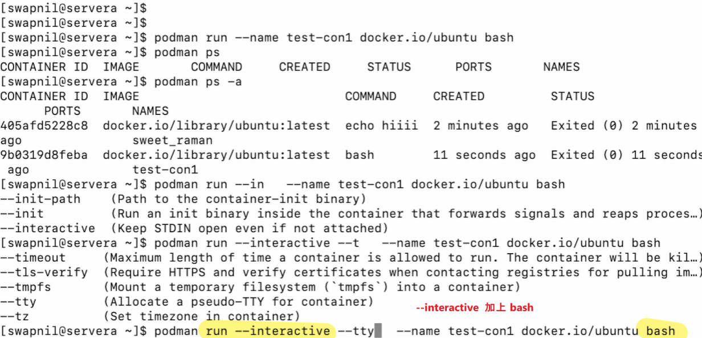
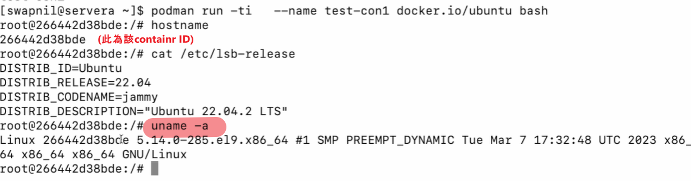
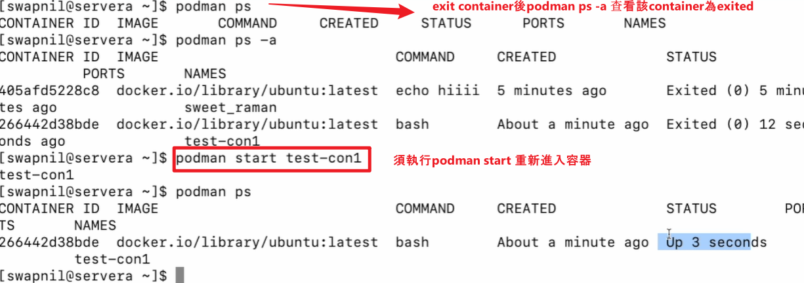
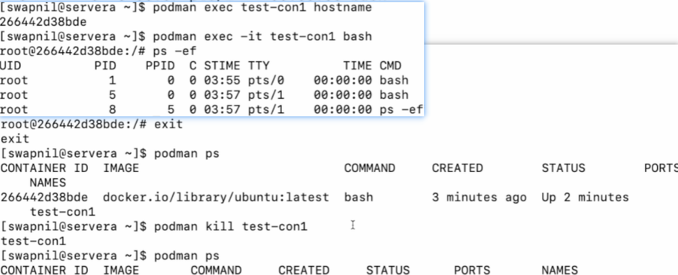

### Podman command & concepts

podman search <image> **--limit** 3
--limit: 限制輸出image數量，避免顯示幾百行

podman pull <index>/<registry>/<image>
eg. podman pull docker.io/library/alpine:latest

podman images

podman run **--name** <container-name> <index>/<registry>/<image> bash
--name: 指定container name
bash: 嘗試interact container 卻發現沒有成功建立container
podman run --name **-interactive** <container-name> <index>/<registry>/<image> **bash**
印為執行process應加上 interactive 參數:

OR 寫成:
podman run **-it** -name <container-name> <index>/<registry>/<image> **bash**
-i: interactive
-t: tty


podman run & podman exec 進入container後執行exit，如何再進入container:

podman run -> 
使用podman start  or podman start **-ai**
**只執行podman start**: 只啟動容器，不附加終端，若要進入容器，則需要額外執行 attach 或 exec
**執行 podman start -ai**: 直接進入容器（如果原本執行的是交互式 shell）
-ai:
-a（attach）→ 讓終端重新附加到該容器
-i（interactive）→ 讓你能夠與容器內的 bash 交互


podman exec -> 再次執行podman exec

| 操作 | `podman run -it <container-name> bash` | `podman exec -it <container-name> bash` |
|------|--------------------------------|--------------------------------|
| 作用 | 創建並啟動一個新容器 | 在已運行的容器內部開啟新進程 |
| `exit` 後容器狀態 | 停止（Exited） | 仍然運行（Running） |
| 重新進入容器的方法 | `podman start -ai <container-name>` | `podman exec -it <container-name> bash` |
| `podman start` 是否可用？ | ✅ 是，因為容器停止了 | ❌ 不是，因為容器本來就在運行 |

如下，podman exec 後執行exit，發現容器並沒有被刪除exit 僅是離開bash進程:


如要停止該容器，則使用podman kill <container-name>
(將容器停止後才可刪除)
欲刪除該容器，則podman rm <container-name>

podman run -it **-d** <index>/<registry>/<image>
--detach (-d) 參數的作用
讓容器在後台運行（不佔用當前終端）。
不會自動附加到容器的輸出（如果沒有 -d，Podman 預設會顯示容器的輸出）。
適用於需要長期運行的服務型應用，如 Web 伺服器、資料庫等。

📌 什麼時候應該用 --detach？
✅ 當你要運行 長時間運行的應用程式（如 Web 伺服器、後端服務、資料庫）。
✅ 當你不需要立即與容器互動，但希望它在後台運行。
✅ 當你想使用 podman logs 來查看輸出，而不是直接在終端顯示。


podman **inspect** <index>/<registry>/<image>
使用inspect指令查看image細節
podman inspec <container-name> |more 

podman run -d **-p 8080:80** <index>/<registry>/<image> 
-p: expose該container


podman cp <current-container-name>:/<path> <source-container-name>:/<path>
podman cp file <source-container-name>:/<path>
podman cp <source-container-name>:/<path> file
cp: 將來源容器內的資料複製到目標容器

**cp指令可以用於修改目標容器內的文件!!**
例如結合docker run -d expose 以及上方指令: 
[controlplane]$ podman run -d -p 8080:80 docker.io/library/httpd:latest --name nostalgic_tool
先curl測試是否可返回nginx歡迎畫面:
curl http://localhost:8080
[controlplane]$ podman exec -it nostalgic_tool bash
root@9235064bb0d1: /usr/local/apache2/# cd htdocs
root@9235064bb0d1: /usr/local/apache2/htdocs# ls
index.html
[controlplane]$ root@9235064bb0d1: /usr/local/apache2/htdocs# cat index.html (複製此index.html路徑)
<html><body><h1>It works ! </h1></body></html>
root@9235064bb0d1: /usr/local/apache2/htdocs# exit

回到本地，複製 nostalgic_tool容器中的index.html到本地

[controlplane]$ podman cp nostalgic_tool:/usr/local/apache2/htdocs/index.html index.html
將來源容器內的index.html拷貝下來之後，對index.html內容進行修改:
[controlplane]$ vim index.html
修改完畢後，再將當前index.html拷貝回來源容器:
[controlplane]$ podman cp index.html nostalgic_tool:/usr/local/apache2/htdocs/index.html
curl測試index.html是否已被更改:
[controlplane]$ curl http://localhost:8080

podman logs <container-name> 建立container後，可使用podman logs檢查是否有報錯
podman run --name=friends-db -p 3306:3306 -e MYSQL_USER=user1 -e MYSQL_PASSWORD=pass1234 -e MYSQL_DATABASE=friends -e MYSQL_ROOT_PASSWORD=rootpass -d registry.access.redhat.com/rhscl/mysql-57-rehl7
podman logs friends-db

podman run --name=friends-app -p 8080:80 -e MYSQL_USER=user1 -e MYSQL_PASSWORD=pass1234 -e MYSQL_DATABASE=friends -e DBHOST=mysql --add-host=mysql:10.88.0.3 -d docker.io/swapnillinux/apache-php
podman logs friends-db
podman logs friends-app


podman diff <container-name-or-ID>  – 查看容器的變更
用來顯示容器與其原始映像之間的變更，也就是在運行容器後，哪些文件或目錄被新增（A）、修改（C）、刪除（D）
假設我們啟動了一個 alpine 容器，並且在 /root 目錄下創建了一個新文件：
podman run -it --name mycontainer alpine sh
touch /root/newfile
exit

現在，我們使用 podman diff 來檢查變更：
podman diff mycontainer

可能的輸出：
A /root/newfile
C /etc/passwd
D /var/log/bootstrap.log


Podman Images and Layers:
eg.

| 層 | 指令 | 作用 | 說明 | 
|----|------|------|------|
| **Layer1** | `FROM docker.io/ubuntu:20.02` | **基礎映像**：使用 Ubuntu 20.02 作為基礎映像。 | 先指定基礎映象 |
| **Layer2** | `COPY ./app/` | **複製應用程式**：將 `app` 目錄從本機複製到映像內部。 | 複製文件 (如應用程式代碼) |
| **Layer3** | `RUN make /app` | **執行指令**：在 `/app` 目錄中執行 `make` 命令（可能是編譯或安裝步驟）。 | 執行安裝或設定步驟 |
| **Layer4** | `CMD ["/python","/app/app.py"]` | **設置默認執行的指令**：當容器啟動時，會執行 `python /app/app.py`。 | 設定容器啟動時要執行的命令 |

FROM, COPY, RUN, CMD 這四個指令的位置可以對調嗎？
❌ 不建議隨意對調！
雖然在技術上部分指令可以變動順序，但錯誤的順序可能導致：
映像構建失敗
影響構建效率
影響容器執行行為

(運行順序: FROM -> COPY -> ADD -> RUN -> CMD)

什麼情況下可以調整順序？
✅ COPY 和 RUN 之間有時可以調換，但要確保 RUN 需要的檔案已經 COPY 進去。
✅ 可以有多個 RUN，但應該合併以優化層數（e.g. RUN apt update && apt install -y nginx）

ADD 指令與 COPY 類似，都用於將檔案或目錄從主機複製到容器映像，但 ADD 提供額外的功能：

✅ ADD 的主要功能：
可以處理壓縮檔案（自動解壓 .tar）
ADD my_archive.tar /app/
🔹 my_archive.tar 會自動解壓到 /app/ 內。
（但 .zip 不會被解壓！）

最佳實踐：
ADD 應該放在 RUN 之前，這樣 RUN 才能使用 ADD 過來的檔案。
ADD 不應該放在 CMD 之後，因為 CMD 是容器啟動時才執行的指令，而 ADD 是在映像構建時執行。

📌 `podman image tree` 輸出範例
假設我們有一個名為 `my-app` 的映像：
```bash
podman image tree my-app
```
可能的輸出：
```
Image ID: a1b2c3d4e5f6
Tags:     my-app:latest
Size:     500MB
Image Layers:
  ├── ID: sha256:111aaa  Size: 70MB  (FROM docker.io/ubuntu:20.02)
  ├── ID: sha256:222bbb  Size: 10MB  (COPY ./app/)
  ├── ID: sha256:333ccc  Size: 150MB (RUN make /app)
  ├── ID: sha256:444ddd  Size: 5MB   (CMD ["/python","/app/app.py"])
```
這樣你可以直觀地看到**每一層的大小與來源**，並決定是否可以進行優化。


podman system – 管理 Podman 整體狀態
用來管理 Podman 的整體資源，包括清理未使用的映像、容器、卷（volumes）、以及監控 Podman 的狀態
常見用法
🔹 1. 清理未使用的資源
podman system prune
作用： 刪除所有未使用的映像、容器、網絡等，以釋放磁碟空間。
適用場景： 當磁碟空間不足，或者想要清除無用資源時。
🔹 2. 檢視 Podman 系統資訊
podman system info
作用： 顯示 Podman 的系統資訊，例如儲存驅動、容器數量、執行環境等。
適用場景： 確保 Podman 正常運行，或調試時查看環境。
🔹 3. 重置 Podman
podman system reset
作用： 清除所有 Podman 的數據與設定（包含映像、容器、設定等）。
適用場景： 需要完全清除 Podman 並重置為初始狀態時。


podman commit 
用來將現有容器的狀態保存為新的映像（image），通常在以下情境下使用：
|---------|---------------------------------|
| ✅ **在容器內做了修改**，但沒有 `Dockerfile` 或 `Containerfile` | 將當前修改保存成映像，方便下次使用 |
| ✅ **手動安裝軟體**（例如 `apt install`、`yum install`） | 讓安裝後的環境變成新映像，避免重複安裝 |
| ✅ **修改配置文件（如 `/etc/hosts`、環境變數）** | 避免在每次啟動容器時都要手動修改 |
| ✅ **基於現有容器創建新映像** | 將當前狀態儲存為新映像，供其他環境使用 |
| ✅ **容器內 Debug/測試完成，想保存狀態** | 方便重現測試環境 |
| ❌ **不適用於大規模部署** | `commit` **不建議用於生產環境**，應該使用 `Dockerfile` / `Containerfile` 來管理版本控制 |

🔹 基本用法
```bash
podman commit <container-id> <new-image-name>
```
這會將指定的**容器**轉換為新的**映像**。

#### **🔹 範例：基於現有容器創建新映像**
1️⃣ 啟動一個 Ubuntu 容器，並安裝 `nginx`：
```bash
podman run -it --name mycontainer ubuntu bash
apt update && apt install -y nginx
exit  # 離開容器
```
2️⃣ 使用 `podman commit` 將該容器保存為新映像：
```bash
podman commit mycontainer my-nginx-image
```
3️⃣ 使用 `podman images` 確認映像已建立：
```bash
podman images
```
可能的輸出：
```
REPOSITORY        TAG      IMAGE ID       CREATED         SIZE
localhost/my-nginx-image  latest   abc123def456   5 seconds ago   120MB
```
4️⃣ 使用該映像創建新容器：
```bash
podman run -d --name my-nginx-container my-nginx-image
```

📌 podman commit vs. Containerfile / Dockerfile
雖然 podman commit 很方便，但它不適合用於正式環境，因為：

不可復現：你無法輕易知道映像是如何產生的，容易失去版本控制。
不利於 CI/CD：正式環境應該用 Containerfile 來自動化建置，而不是手動 commit。
✅ 開發環境：podman commit 可快速保存當前狀態，方便測試
❌ 正式環境：應該使用 Containerfile 來建構映像


撰寫Dockerfile:
[controlplane ~] # mkdri httpd ; cd httpd (建立目錄)
[controlplane httpd ~] # vim Dockerfile (建立Dockerfile)
FROM docker.io/centos:8
RUN yum update -y
[controlplane httpd ~] # podman build . -t --name=httpd (build)
[controlplane httpd ~] # podman images (檢查images是否成功創建)
[controlplane httpd ~] # podman history (檢查操作過程)
(修改Dockerfile)
[controlplane httpd ~] # vim Dockerfile (建立Dockerfile)
FROM docker.io/centos:8
RUN yum update -y
RUN yum clean all -y #Add
RUN yum install httpd php -y # Add
RUN yum clean all -y  #Add
[controlplane httpd ~] # podman build . -t --name=httpd (Rebuild)
[controlplane httpd ~] # podman images (檢查images是否成功創建)
[controlplane httpd ~] # podman history
改寫為以下
[controlplane httpd ~] # vim Dockerfile
FROM docker.io/centos:8
RUN yum update -y && yum clean all -y && yum install httpd php -y 
#RUN yum clean all -y #Add
#RUN yum install httpd php -y # Add
#RUN yum clean all -y 

**改寫後的優點**:
優化 Dockerfile，減少映像層數，提高構建效率！

在最初的 Dockerfile 中：
RUN yum update -y
RUN yum clean all -y  # Add
RUN yum install httpd php -y  # Add
RUN yum clean all -y  # Add
這樣的寫法，**每一個 RUN 指令都會創建一個新的映像層（Layer），這會導致**：
映像檔案體積變大 → 因為每一層都包含了一部分變更，增加了不必要的存儲開銷。
構建時間增加 → 每次執行 podman build，Podman 需要處理多個層，影響速度。
清理不徹底 → yum clean all -y 只有作用在當前層，原來的 yum install 仍然可能殘留檔案

(新增label)
LABEL author Frenda Chu
LABEL depscription This is Apache PHP Image based on CentOs8
[controlplane httpd ~] # podman build . -t --name=httpd (Rebuild)
[controlplane httpd ~] # podman inspect httpd
(建立完images後，create container)
[controlplane httpd ~] # podman run -it --rm httpd bash
[root@829eb1c1bf1f /] # ls /sbin/httpd
/sbin/httpd
[root@829eb1c1bf1f /] # /sbin/httpd -DFOREGROUND
[root@829eb1c1bf1f /] # exit
[controlplane httpd ~] # podman ps -a

(如果有多個CMD指令，只有最後一行CMD會被套用)
(新增/sbin/httpd -DFOREGROUND指令到Dockerfile)
[controlplane httpd ~] # vim Dockerfile
FROM docker.io/centos:8
RUN yum update -y && yum clean all -y && yum install httpd php -y 
LABEL author Frenda Chu
LABEL depscription This is Apache PHP Image based on CentOs8
CMD /sbin/httpd -DFOREGROUND # 此命令的作用是讓 Apache HTTP Server（httpd）以前景模式運行
[controlplane httpd ~] # podman build . -t --name=httpd (Rebuild)
[controlplane httpd ~] # podman inspect httpd (檢查CMD是否已新增) 
(繼續改寫Dockerfile)
FROM docker.io/centos:8
RUN yum update -y && yum clean all -y && yum install httpd php -y 
LABEL author Frenda Chu
LABEL depscription This is Apache PHP Image based on CentOs8
#CMD /sbin/httpd -DFOREGROUND
CMD ["/sbin/httpd","-DFOREGROUND"]

**改寫後的優點**:
原本的寫法 CMD /sbin/httpd -DFOREGROUND，這樣的寫法其實等同於：
sh -c "/sbin/httpd -DFOREGROUND"
它會先啟動 Shell（sh），然後再執行 httpd。
這樣可能**導致不必要的 shell 進程，而且 httpd 並不是真正的主進程（PID 1），可能會影響信號處理**。

而Exec Form（最佳實踐，改寫後:
**CMD ["/sbin/httpd", "-DFOREGROUND"]**
這樣的寫法直接執行 httpd，**不會啟動 sh**。
進程 httpd 會成為 PID 1，可以正確接收 SIGTERM、SIGKILL 訊號，讓容器能夠優雅地停止。
這是容器最佳實踐，符合 OCI（Open Container Initiative）標準。

[controlplane httpd ~] # podman build . -t --name=httpd (Rebuild)
[controlplane httpd ~] # podman inspect httpd 
(Dockerfile都修改成功後，create container並expose8080端口)
[controlplane httpd ~] # poman run -p 8080:80 httpd
[controlplane httpd ~] # podman ps
[controlplane httpd ~] # curl http://localhost:8080 (檢查是否可以看到http歡迎畫面)

(繼續改寫Dockerfile)
在httpd內新增index.html:
FROM docker.io/centos:8
RUN yum update -y && yum clean all -y && yum install httpd php -y 
LABEL author Frenda Chu
LABEL depscription This is Apache PHP Image based on CentOs8
/# COPY index.html /var/www/html

**COPY index.html /var/www/html/**
**注意!!**
為什麼 COPY index.html /var/www/html/ **需要多一個 /**？
✅ 原因：確保 index.html 被正確地複製到目標目錄中，而不是誤認為是檔案名稱！
COPY index.html /var/www/html/
CMD ["/sbin/httpd","-DFOREGROUND"]


📌 總結
| **命令** | **正確嗎？** | **結果** |
|----------|------------|----------|
| `COPY index.html /var/www/html/` | ✅ 正確 | `index.html` 會複製到 `/var/www/html/index.html` |
| `COPY index.html /var/www/html/index.html` | ✅ 正確 | `index.html` 會複製並**改名為 `/var/www/html/index.html`** |
| `COPY index.html /var/www/html/index.html/` | ❌ **錯誤！** | 會變成 `/var/www/html/index.html/index.html` |

🚀 **最佳做法：**
```dockerfile
COPY index.html /var/www/html/
```
這樣 `index.html` **一定會出現在 `/var/www/html/index.html`**，不會有歧義！

(繼續改寫Dockerfile)
FROM docker.io/centos:8
RUN yum update -y && yum clean all -y && yum install httpd php -y 
LABEL author Frenda Chu
LABEL depscription This is Apache PHP Image based on CentOs8
#COPY index.html /var/www/html/
ADD src.tar.gz /var/www/html/
EXPOSE 80
EXPOSE 443
CMD ["/sbin/httpd","-DFOREGROUND"]
[controlplane httpd ~] # podman build . -t --name=httpd (Rebuild)
[controlplane httpd ~] # podman ps
[controlplane httpd ~] # podman run **-P** -d httpd

-P: 用於自動映射容器的暴露端口（EXPOSE）到主機的隨機可用端口
如果 Dockerfile 或 Containerfile 內有：
EXPOSE 80 443

當你執行：
podman run -P -d httpd
Podman 會：
自動分配主機上的隨機可用端口
將容器內的 80 和 443 端口映射到主機端口
不需要手動指定 -p（--publish）
📌 如何確認映射的端口？
執行：
podman ps

可能的輸出：
CONTAINER ID  IMAGE   COMMAND  CREATED         STATUS         PORTS                   NAMES
123456789abc  httpd   ...      10 seconds ago  Up 5 seconds  0.0.0.0:32768->80/tcp, 0.0.0.0:32769->443/tcp  my-httpd
0.0.0.0:32768->80/tcp → 表示 主機的 32768 端口 映射到 容器的 80 端口
0.0.0.0:32769->443/tcp → 表示 主機的 32769 端口 映射到 容器的 443 端口
你可以透過 curl 測試：
curl http://localhost:32768


📌 -P vs. -p
參數	作用	例子
-P	自動映射所有 EXPOSE 的端口	podman run -P -d httpd
-p	手動指定映射的端口	podman run -p 8080:80 -p 8443:443 -d httpd
🚀 何時用 -P？

當你不想手動指定端口，只要 Podman 自動處理端口映射即可。
適用於測試環境，讓 Podman 自動分配可用端口。
🚀 何時用 -p？

當你要確保固定端口號，例如 -p 8080:80，這樣你總是可以用 http://localhost:8080 訪問。

[controlplane httpd ~] # podman run -P -d httpd
[controlplane httpd ~] # podman port -l
80/tcp -> 0.0.0.0:34603
443/tc/ -> 0.0.0.0:34057
[controlplane httpd ~] # curl http://localhost:34603
<h1>Welcom to Podman</h1>
[controlplane httpd ~] # curl http://localhost:34057
<h1>Welcom to Podman</h1>

(其他指令如: VOLUME,ENV,USER)

### Exercise
1. Exercise01:

    Step 1: Create a container using an alpine image and run a process to print Hello World

    $ podman run docker.io/alpine echo "Hello World"
    Trying to pull docker.io/library/alpine:latest...
    Getting image source signatures
    Copying blob 63b65145d645 done  
    Copying config b2aa39c304 done  
    Writing manifest to image destination
    Storing signatures
    Hello World

    Step 2: Create another container using RHEL7 based Universal Base Image (UBI), run it in interactive (i) mode to keep **STDIN open and allocate a pseudo-TTY** (t)

    $ podman run -it registry.access.redhat.com/ubi8/ubi bash
    Trying to pull registry.access.redhat.com/ubi8/ubi:latest...
    Getting image source signatures
    Checking if image destination supports signatures
    Copying blob b92727ef7443 done  
    Copying config 270f760d3d done  
    Writing manifest to image destination
    Storing signatures
    [root@865a806e8bea /]# 
    [root@865a806e8bea /]# cat /etc/redhat-release 
    Red Hat Enterprise Linux release 8.7 (Ootpa)


    Step 3: open another terminal and get the list of running containers

    $ podman ps
    CONTAINER ID  IMAGE                                       COMMAND     CREATED         STATUS         PORTS       NAMES
    865a806e8bea  registry.access.redhat.com/ubi8/ubi:latest  bash        46 seconds ago  Up 47 seconds              flamboyant_hypatia

    Step 4: exit the shell of the running container and get the list of running containers and all containers

    [root@865a806e8bea /]# exit
    exit
    [swapnil@servera ~]$ 
    [swapnil@servera ~]$ 
    [swapnil@servera ~]$ podman ps
    CONTAINER ID  IMAGE       COMMAND     CREATED     STATUS      PORTS       NAMES
    [swapnil@servera ~]$ 
    [swapnil@servera ~]$ podman ps -a
    CONTAINER ID  IMAGE                                       COMMAND           CREATED             STATUS                     PORTS       NAMES
    ce06f974f700  docker.io/library/alpine:latest             echo Hello World  2 minutes ago       Exited (0) 2 minutes ago               zen_wiles
    865a806e8bea  registry.access.redhat.com/ubi8/ubi:latest  bash              About a minute ago  Exited (0) 11 seconds ago              flamboyant_hypatia


    Step 5: start the container again and get the list of running containers

    [swapnil@servera ~]$ podman start flamboyant_hypatia
    flamboyant_hypatia
    [swapnil@servera ~]$ 
    [swapnil@servera ~]$ 
    [swapnil@servera ~]$ podman ps
    CONTAINER ID  IMAGE                                       COMMAND     CREATED        STATUS        PORTS       NAMES
    865a806e8bea  registry.access.redhat.com/ubi8/ubi:latest  bash        2 minutes ago  Up 8 seconds              flamboyant_hypatia

    Step 6: get the list of images

    $ podman images
    REPOSITORY                           TAG         IMAGE ID      CREATED      SIZE
    registry.access.redhat.com/ubi8/ubi  latest      270f760d3d04  4 weeks ago  214 MB
    docker.io/library/alpine             latest      b2aa39c304c2  5 weeks ago  7.34 MB


    Step 7: stop all running containers and remove them

    [swapnil@servera ~]$ podman ps
    CONTAINER ID  IMAGE                                       COMMAND     CREATED        STATUS         PORTS       NAMES
    865a806e8bea  registry.access.redhat.com/ubi8/ubi:latest  bash        2 minutes ago  Up 57 seconds              flamboyant_hypatia
    [swapnil@servera ~]$ 
    [swapnil@servera ~]$ podman stop flamboyant_hypatia
    flamboyant_hypatia
    [swapnil@servera ~]$ 
    [swapnil@servera ~]$ podman ps -a
    CONTAINER ID  IMAGE                                       COMMAND           CREATED        STATUS                    PORTS       NAMES
    ce06f974f700  docker.io/library/alpine:latest             echo Hello World  4 minutes ago  Exited (0) 4 minutes ago              zen_wiles
    865a806e8bea  registry.access.redhat.com/ubi8/ubi:latest  bash              3 minutes ago  Exited (0) 9 seconds ago              flamboyant_hypatia
    [swapnil@servera ~]$ 
    [swapnil@servera ~]$ 
    [swapnil@servera ~]$ podman rm flamboyant_hypatia zen_wiles
    flamboyant_hypatia
    zen_wiles
    [swapnil@servera ~]$ podman ps -a
    CONTAINER ID  IMAGE       COMMAND     CREATED     STATUS      PORTS       NAMES
    [swapnil@servera ~]$ 
    Congratulations! you successfully managed a complete lifecycle of a container.

    Questions for the exercice
    What is the command to see the list of all containers (running and exited)? podman ps -a
    What is the command to remove a stopped container? podman rm <container-name>
    Can an Image be deleted if a container for that image already exists? No
        No, an image cannot be deleted if a container based on that image still exists (even if the container is stopped).
        No, an image **cannot** be deleted if a container based on that image still exists (even if the container is stopped). 
        **First, remove the container(s) associated with the image:**
        ```bash
        podman rm <container-id-or-name>
        ```
        Or remove **all** stopped containers:
        ```bash
        podman rm -a
        ```
        **Then, remove the image:**
        ```bash
        podman rmi <image-id-or-name>
        ```
        **If you want to forcefully remove the image (including its associated containers), use:**
        ```bash
        podman rmi -f <image-id-or-name>
        ```
        This ensures that the image is removed only when no containers are using it. 🚀

2. Exercise 02:
    Use podman pull to pull mysql image

    [root@servera ~]# podman pull registry.access.redhat.com/rhscl/mysql-57-rhel7
    Trying to pull registry.access.redhat.com/rhscl/mysql-57-rhel7:latest...
    Getting image source signatures
    Checking if image destination supports signatures
    Copying blob 9f1840c3b3bd done  
    Copying blob 1c9f515fc6ab done  
    Copying blob 1d2c4ce43b78 done  
    Copying blob f1e961fe4c51 done  
    Copying config 60726b33a0 done  
    Writing manifest to image destination
    Storing signatures
    60726b33a00a2c3be60e25c3270a34a9b147db86602f05a71988a1c92a70cebc
    ​
    2. create a MySQL container using a few environment variables

    [root@servera ~]# podman run --name=friends-db -p 3306:3306 -e MYSQL_USER=user1 -e MYSQL_PASSWORD=pass1234 -e MYSQL_DATABASE=friends -e MYSQL_ROOT_PASSWORD=rootpass -d registry.access.redhat.com/rhscl/mysql-57-rhel7
    [root@servera ~]# podman ps
    CONTAINER ID  IMAGE                                                   COMMAND     CREATED        STATUS        PORTS                   NAMES
    c545c6e7797f  registry.access.redhat.com/rhscl/mysql-57-rhel7:latest  run-mysqld  5 seconds ago  Up 5 seconds  0.0.0.0:3306->3306/tcp  friends-db
    [root@servera ~]# podman logs friends-db
    => sourcing 20-validate-variables.sh ...
    => sourcing 25-validate-replication-variables.sh ...
    => sourcing 30-base-config.sh ...
    ---> 08:11:40     Processing basic MySQL configuration files ...
    => sourcing 60-replication-config.sh ..
    ...
    ...
    ...
    2023-03-19T08:11:50.462918Z 0 [Note] Event Scheduler: Loaded 0 events
    2023-03-19T08:11:50.463246Z 0 [Note] /opt/rh/rh-mysql57/root/usr/libexec/mysqld: ready for connections.
    Version: '5.7.24'  socket: '/var/lib/mysql/mysql.sock'  port: 3306  MySQL Community Server (GPL)
    3. Find the IP Address of mysql container, we will need this in next step

    [root@servera ~]# podman inspect friends-db |grep IPAddress
                "SecondaryIPAddresses": null,
                "IPAddress": "10.88.0.3",
    ​
    4. create a php container with similar environment variables as mysql containers, and also create a hosts entry for mysql using --add-host option

    [root@servera ~]# podman run --name=friends-app -p 8080:80 -e MYSQL_USER=user1 -e MYSQL_PASSWORD=pass1234 -e MYSQL_DATABASE=friends -e DBHOST=mysql --add-host=mysql:10.88.0.3 -d docker.io/swapnillinux/apache-php
    [root@servera ~]# podman ps
    CONTAINER ID  IMAGE                                                   COMMAND      CREATED        STATUS        PORTS                   NAMES
    c545c6e7797f  registry.access.redhat.com/rhscl/mysql-57-rhel7:latest  run-mysqld   6 minutes ago  Up 6 minutes  0.0.0.0:3306->3306/tcp  friends-db
    c4563820b7f4  docker.io/swapnillinux/apache-php:latest                /startup.sh  3 seconds ago  Up 3 seconds  0.0.0.0:8080->80/tcp    friends-app
    5. Clone the php-app app using git and copy the index.php in the php container

    if git is not installed, install using

    yum install git -y

    or

    apt install git -y

    [root@servera ~]# git clone https://github.com/swapnil-linux/php-app
    Cloning into 'php-app'...
    remote: Enumerating objects: 129, done.
    remote: Counting objects: 100% (84/84), done.
    remote: Compressing objects: 100% (71/71), done.
    remote: Total 129 (delta 31), reused 23 (delta 6), pack-reused 45
    Receiving objects: 100% (129/129), 206.50 KiB | 8.26 MiB/s, done.
    Resolving deltas: 100% (36/36), done.
    [root@servera php-app]# podman cp index.php friends-app:/var/www/html/index.php
    6. access the application using browser and pointing to http://yoursystemip:38080

    7. create a table in mysql and insert few records.

    [root@servera ~]# podman exec -it friends-db bash
    ​
    bash-4.2$ mysql -u user1 -ppass1234 friends
    mysql: [Warning] Using a password on the command line interface can be insecure.
    Welcome to the MySQL monitor.  Commands end with ; or \g.
    Your MySQL connection id is 3
    Server version: 5.7.24 MySQL Community Server (GPL)
    
    Copyright (c) 2000, 2018, Oracle and/or its affiliates. All rights reserved.
    
    Oracle is a registered trademark of Oracle Corporation and/or its
    affiliates. Other names may be trademarks of their respective
    owners.
    
    Type 'help;' or '\h' for help. Type '\c' to clear the current input statement.
    ​
    mysql>
    CREATE TABLE IF NOT EXISTS MyGuests (id INT AUTO_INCREMENT PRIMARY KEY, firstname VARCHAR(255) NOT NULL, lastname VARCHAR(255) NOT NULL )  ENGINE=INNODB;
    insert into MyGuests (firstname,lastname) VALUES ("Chandler","Bing");
    insert into MyGuests (firstname,lastname) VALUES ("Rachel","Green");
    insert into MyGuests (firstname,lastname) VALUES ("Monica","Geller");
    insert into MyGuests (firstname,lastname) VALUES ("Dr. Ross","Geller");
    insert into MyGuests (firstname,lastname) VALUES ("Joey","Tribbiani Jr.");
    insert into MyGuests (firstname,lastname) VALUES ("Phoebe","Buffay");
    8. refresh the page on the browser to see the changes.

    9. final cleanup

    [root@servera ~]# podman kill friends-db friends-app 
    11f2fd489bb90ed60888693998d25b57b101d7ccb072583f1071d3ededf05e63
    335d3413b18911e5a1f717065be6d2055fab95d2195aecdcb01bee43af8e824e
    ​
    ​
    [root@servera ~]# podman rm friends-db friends-app 
    335d3413b18911e5a1f717065be6d2055fab95d2195aecdcb01bee43af8e824e
    11f2fd489bb90ed60888693998d25b57b101d7ccb072583f1071d3ededf05e63
    ​
    ​
    [root@servera ~]# podman rmi docker.io/mysql:5.7 docker.io/swapnillinux/apache-php
    Untagged: docker.io/library/mysql:5.7
    Deleted: ae0658fdbad5fb1c9413c998d8a573eeb5d16713463992005029c591e6400d02
    Untagged: docker.io/swapnillinux/apache-php:latest
    Deleted: 26d33e5b4a9188118a1cdea4cfd4dba73453a20304b099e8dc4fe548aa0ef3a7
    [root@servera ~]# 
    View the index.php to understand how the PHP application is able to connect to the database


    Questions pour cet exercice
    What does -e options do in the podman run command?
    The -e (or --env) option in the podman run command is used to set environment variables inside the container.
    What is the purpose of --add-host option in podman run command?
    The --add-host option allows you to manually add an entry to the container's /etc/hosts file, which is useful for defining custom hostnames.

3. Exercise 03:
   1. Search for nginx image and limit the results to only 3

   [swapnil@servera ~]$ podman search nginx --limit 3
   NAME                                              DESCRIPTION
   registry.access.redhat.com/ubi8/nginx-120         Platform for running nginx 1.20 or building...
   registry.access.redhat.com/rhscl/nginx-18-rhel7   Nginx 1.8 server and a reverse proxy server
   registry.access.redhat.com/rhscl/nginx-112-rhel7  Nginx is a web server and a reverse proxy se...
   registry.redhat.io/rhel8/nginx-114                Nginx is a web server and a reverse proxy se...
   registry.redhat.io/rhel8/nginx-118                Platform for running nginx 1.18 or building...
   registry.redhat.io/ubi8/nginx-120                 Platform for running nginx 1.20 or building...
   docker.io/library/nginx                           Official build of Nginx.
   docker.io/bitnami/nginx                           Bitnami nginx Docker Image
   docker.io/bitnami/nginx-ingress-controller        Bitnami Docker Image for NGINX Ingress Contr...
   
   2. add quay.io to the registries in /etc/containers/registries.conf and do the search again

   [swapnil@servera ~]$ grep unqualified-search-registries /etc/containers/registries.conf
   unqualified-search-registries = ["quay.io", "registry.access.redhat.com", "registry.redhat.io", "docker.io"]
   [swapnil@servera ~]$ podman search nginx --limit 3
   NAME                                                            DESCRIPTION
   quay.io/kubernetes-ingress-controller/nginx-ingress-controller  NGINX Ingress controller built around the [K...
   quay.io/openshift-scale/nginx                                   
   quay.io/ukhomeofficedigital/nginx-proxy                         # OpenResty Docker Container  [![Build Statu...
   registry.access.redhat.com/ubi8/nginx-120                       Platform for running nginx 1.20 or building...
   registry.access.redhat.com/rhscl/nginx-18-rhel7                 Nginx 1.8 server and a reverse proxy server
   registry.access.redhat.com/rhscl/nginx-112-rhel7                Nginx is a web server and a reverse proxy se...
   registry.redhat.io/rhel8/nginx-114                              Nginx is a web server and a reverse proxy se...
   registry.redhat.io/rhel8/nginx-118                              Platform for running nginx 1.18 or building...
   registry.redhat.io/ubi8/nginx-120                               Platform for running nginx 1.20 or building...
   docker.io/library/nginx                                         Official build of Nginx.
   docker.io/bitnami/nginx                                         Bitnami nginx Docker Image
   docker.io/bitnami/nginx-ingress-controller                      Bitnami Docker Image for NGINX Ingress Contr...
   
   3. Change the search order in registries.conf giving docker.io first priority. And, do the search again.

   [swapnil@servera ~]$ grep unqualified-search-registries /etc/containers/registries.conf
   unqualified-search-registries = ["docker.io", "quay.io", "registry.access.redhat.com", "registry.redhat.io"]
   [swapnil@servera ~]$ podman search nginx --limit 3
   NAME                                                            DESCRIPTION
   docker.io/library/nginx                                         Official build of Nginx.
   docker.io/bitnami/nginx                                         Bitnami nginx Docker Image
   docker.io/bitnami/nginx-ingress-controller                      Bitnami Docker Image for NGINX Ingress Contr...
   quay.io/kubernetes-ingress-controller/nginx-ingress-controller  NGINX Ingress controller built around the [K...
   quay.io/openshift-scale/nginx                                   
   quay.io/ukhomeofficedigital/nginx-proxy                         # OpenResty Docker Container  [![Build Statu...
   registry.access.redhat.com/ubi8/nginx-120                       Platform for running nginx 1.20 or building...
   registry.access.redhat.com/rhscl/nginx-18-rhel7                 Nginx 1.8 server and a reverse proxy server
   registry.access.redhat.com/rhscl/nginx-112-rhel7                Nginx is a web server and a reverse proxy se...
   registry.redhat.io/rhel8/nginx-114                              Nginx is a web server and a reverse proxy se...
   registry.redhat.io/rhel8/nginx-118                              Platform for running nginx 1.18 or building...
   registry.redhat.io/ubi8/nginx-120                               Platform for running nginx 1.20 or building...
   
   4. Pull the nginx image without specifying the index, and select the one from docker.io

   [swapnil@servera ~]$ podman pull nginx
   ? Please select an image: 
     ▸ docker.io/library/nginx:latest
       quay.io/nginx:latest
       registry.access.redhat.com/nginx:latest
       registry.redhat.io/nginx:latest
    
   [swapnil@servera ~]$ podman pull nginx
   ✔ docker.io/library/nginx:latest
   Trying to pull docker.io/library/nginx:latest...
   Getting image source signatures
   Copying blob 3a1b8f201356 done  
   Copying blob 3f9582a2cbe7 done  
   Copying blob 9a8c6f286718 done  
   Copying blob e81b85700bc2 done  
   Copying blob 73ae4d451120 done  
   Copying blob 6058e3569a68 done  
   Copying config 904b8cb13b done  
   Writing manifest to image destination
   Storing signatures
   904b8cb13b932e23230836850610fa45dce9eb0650d5618c2b1487c2a4f577b8
   [swapnil@servera ~]$ 
    
   5. Pull another ngnix image with stable-alpine tag. (have a look at the file `/home/swapnil/.cache/containers/short-name-aliases.conf` )

   [swapnil@servera ~]$ podman pull nginx:stable-alpine
   Resolved "nginx" as an alias (/home/swapnil/.cache/containers/short-name-aliases.conf)
   Trying to pull docker.io/library/nginx:stable-alpine...
   Getting image source signatures
   Copying blob 0c63f9db0dba done  
   Copying blob ef5531b6e74e done  
   Copying blob a58af6dacd0d done  
   Copying blob 973e47049cf2 done  
   Copying blob d0264186e749 done  
   Copying blob 90ac7e527cb7 done  
   Copying config 652309d091 done  
   Writing manifest to image destination
   Storing signatures
   652309d091315e4f9f5d9d9270b69838b8a4021d9a0fc2860ad37a8c22274ffc
   [swapnil@servera ~]$ 
   
   6. List all images from nginx repository and create a container using the nginx image with stable-alpine tag

   [swapnil@servera ~]$ podman images docker.io/library/nginx
   REPOSITORY               TAG            IMAGE ID      CREATED      SIZE
   docker.io/library/nginx  latest         904b8cb13b93  2 weeks ago  146 MB
   docker.io/library/nginx  stable-alpine  652309d09131  5 weeks ago  25.1 MB
   [swapnil@servera ~]$ 
   [swapnil@servera ~]$ podman run --name web-con -d docker.io/library/nginx:stable-alpine
   f7e2da273b05a2552022e3854a15daf014de3f2e881c2bc163a1b9756873db9a
    
    
   [swapnil@servera ~]$ podman ps
   CONTAINER ID  IMAGE                                  COMMAND               CREATED        STATUS        PORTS       NAMES
   f7e2da273b05  docker.io/library/nginx:stable-alpine  nginx -g daemon o...  6 seconds ago  Up 7 seconds              web-con
   [swapnil@servera ~]$ 
   7. Try deleting all images

   [swapnil@servera ~]$ podman rmi docker.io/library/nginx:latest docker.io/library/nginx:stable-alpine 
   Untagged: docker.io/library/nginx:latest
   Deleted: 904b8cb13b932e23230836850610fa45dce9eb0650d5618c2b1487c2a4f577b8
   Error: image used by f7e2da273b05a2552022e3854a15daf014de3f2e881c2bc163a1b9756873db9a: image is in use by a container: consider listing external containers and force-removing image
    
    
   [swapnil@servera ~]$ podman images docker.io/library/nginx
   REPOSITORY               TAG            IMAGE ID      CREATED      SIZE
   docker.io/library/nginx  stable-alpine  652309d09131  5 weeks ago  25.1 MB
   [swapnil@servera ~]$ 
   8. Stop and remove the web-con container, and try deleting image again.

   [swapnil@servera ~]$ podman stop web-con
   web-con
    
    
   [swapnil@servera ~]$ podman rm web-con
   web-con
    
    
   [swapnil@servera ~]$ podman rmi docker.io/library/nginx:stable-alpine
   Untagged: docker.io/library/nginx:stable-alpine
   Deleted: 652309d091315e4f9f5d9d9270b69838b8a4021d9a0fc2860ad37a8c22274ffc
    
    
   [swapnil@servera ~]$ podman images
   REPOSITORY  TAG         IMAGE ID    CREATED     SIZE
   [swapnil@servera ~]$ 
   Congratulations! this concludes the exercise.


   Questions pour cet exercice
   What is the command to show podman disk usage?
    
    podman system df

    顯示 Podman 佔用的磁碟空間，包括：
    容器（Containers）
    映像（Images）
    卷（Volumes）
    總計（Total）
    幫助分析磁碟空間使用情況，找出哪些資源佔用過多空間。
    🔹 範例輸出：
    TYPE            TOTAL   ACTIVE   SIZE     RECLAIMABLE
    Images          10      5        2.5GB    1.2GB
    Containers      6       2        800MB    500MB
    Local Volumes   3       1        1GB      500MB
    TOTAL：總數量
    ACTIVE：正在使用的數量
    SIZE：總大小
    RECLAIMABLE：可以清除的空間
   
   What is the command to remove unused data (stopped containers, stopped pods and dangling images)?
    要清理未使用的資料（已停止的容器、Pod、懸空映像），使用：
    podman system prune
    📌 作用：

    移除 已停止的容器
    移除 已停止的 Pods
    移除 懸空（dangling）映像（即沒有標籤的映像）
    不會刪除有標籤的映像，也不會刪除正在運行的容器
    🔹 範例輸出：
    Deleted Containers:
    abc123
    def456

    Deleted Images:
    sha256:789ghi
    sha256:jkl012

    Total reclaimed space: 1.5GB
    📌 如果還要刪除未使用的 volume（卷），可以加上 --volumes：
    podman system prune --volumes


   What is the location of system registry configuration file?
   Podman 的系統登錄（registry）配置文件位置：
    /etc/containers/registries.conf
    📌 作用：

    設定預設的容器映像 Registry（例如 docker.io, quay.io, registry.redhat.io）
    控制映像來源與搜尋順序
    🔹 查看當前 Registry 設定：
    cat /etc/containers/registries.conf
    🔹 範例內容：
    [registries.search]
    registries = ["docker.io", "quay.io", "registry.fedoraproject.org"]

    [registries.insecure]
    registries = []

    [registries.block]
    registries = []
    📌 可以手動編輯該文件來增加或修改預設 Registry。

4. Exercise04:
    1.  Create a working directory as myhttpd

    [swapnil@servera ~]$ mkdir myhttpd
    [swapnil@servera ~]$ cd myhttpd
    [swapnil@servera myhttpd]$ 
    2. create a file named Containerfile with the below content

    FROM docker.io/redhat/ubi8:latest
    RUN yum update -y && yum install httpd -y && yum clean all
    LABEL Description My First Dockerfile
    CMD ["/sbin/httpd","-DFOREGROUND"]
    3. build the image using podman build command

    [swapnil@servera myhttpd]$ podman build -t myhttpd .
    STEP 1/4: FROM docker.io/redhat/ubi8
    Trying to pull docker.io/redhat/ubi8:latest...
    Getting image source signatures
    Copying blob b92727ef7443 done  
    Copying config 270f760d3d done  
    Writing manifest to image destination
    Storing signatures
    STEP 2/4: RUN yum update -y && yum install httpd -y && yum clean all
    Updating Subscription Management repositories.
    ...
    ...
    ...
    ...
    STEP 4/4: CMD ["/sbin/httpd","-DFOREGROUND"]
    COMMIT myhttpd
    --> 9d5d4fc3a8a
    Successfully tagged localhost/myhttpd:latest
    a23dd0ce7c9f06fb6146e576da0276f4dacf44928f4702c7460efeae9e544399
    [swapnil@servera myhttpd]$ podman images
    REPOSITORY             TAG         IMAGE ID      CREATED         SIZE
    localhost/myhttpd      latest      a23dd0ce7c9f  12 seconds ago  238 MB
    docker.io/redhat/ubi8  latest      270f760d3d04  4 weeks ago     214 MB
    4. Test the image using podman run

    [swapnil@servera myhttpd]$ podman run --name=web1 -p 38080:80 -d myhttpd
    5912c1875239ac13d9820ca4a374aa518bbd8ddadd2dd6c92bbbda1508cb66fe
    
    
    [swapnil@servera myhttpd]$ podman ps
    CONTAINER ID  IMAGE                     COMMAND               CREATED        STATUS        PORTS                  NAMES
    5912c1875239  localhost/myhttpd:latest  /sbin/httpd -DFOR...  9 seconds ago  Up 9 seconds  0.0.0.0:38080->80/tcp  web1
    check if you are able to connect to the webserver on port 38080

    5. Clean up

    podman kill web1
    
    
    podman rm web1
    Congratulations! this concludes the exercise.


    Questions pour cet exercice
    
    What is the command to build image from Dockerfile?
    podman build -t <image-name> .
    -t <image-name> → Assigns a tag (name) to the built image.
    . → Specifies the current directory as the build context (must contain the Dockerfile).
    
    what is the option used to not use existing cached images/layers for the container build?
    podman build --no-cache -t <image-name> .
    --no-cache → Forces Podman to rebuild all layers, ignoring previously cached layers.